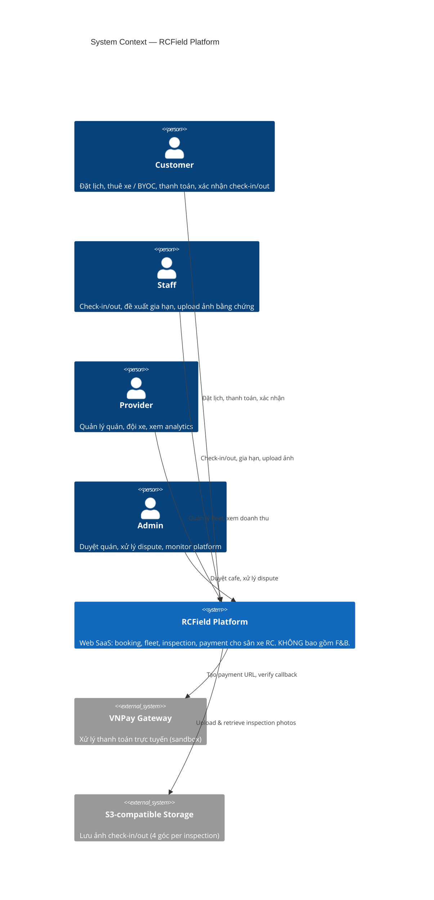
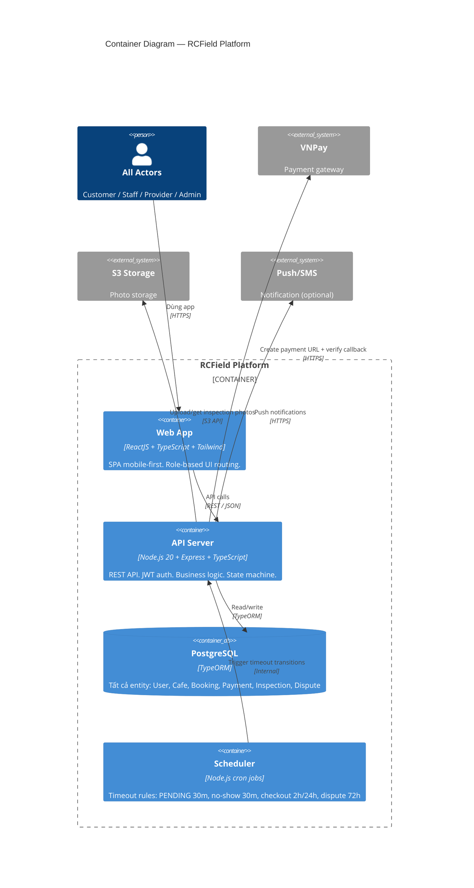
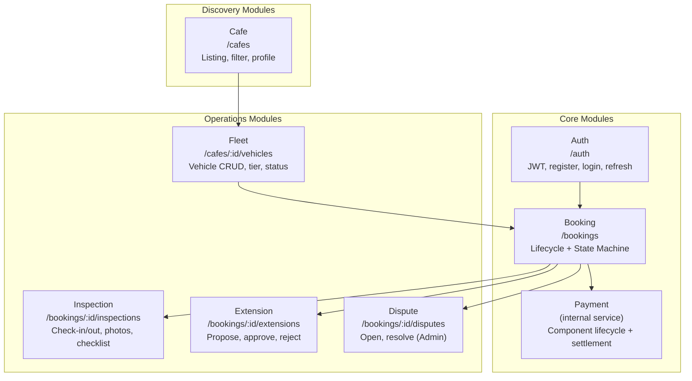
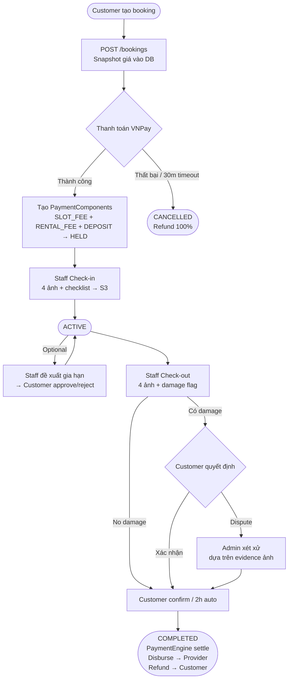

# Architecture: System Overview

**Last updated**: 2026-05-11
**Status**: Draft — đang hoàn thiện dần

> Tài liệu này mô tả kiến trúc tổng thể của RCField ở mức system level.
> Đọc `docs/spec/00-overview.md` để hiểu business context trước.

> **Scope reminder**: RCField chỉ quản lý vận hành xe RC — đặt lịch, fleet, bàn giao tài sản, thanh toán.
> F&B / đồ uống tại sân **nằm ngoài app** — khách tự thanh toán trực tiếp tại quán.

---

## 1. System Context (C4 Level 1)

Toàn bộ hệ thống RCField gồm 1 platform phục vụ 4 nhóm actor, tương tác qua Web App duy nhất,
tích hợp với 2 external system (VNPay, S3).



---

## 2. Actor & App Matrix

| Actor | Role | App | Device target | Permissions |
|-------|------|-----|--------------|-------------|
| Customer | Đặt lịch / thanh toán | Web (mobile-first) | Mobile browser | CUSTOMER role |
| Staff | Check-in/out, gia hạn | Web (mobile-first) | Mobile browser | STAFF role |
| Provider | Quản lý quán + fleet | Web | Desktop/tablet | PROVIDER role |
| Admin | Platform oversight | Web (admin portal) | Desktop | ADMIN role |

> Tất cả 4 actor dùng chung 1 React web app — routing và UI render dựa trên `UserRole` từ JWT.

---

## 3. Container Diagram (C4 Level 2)



---

## 4. Domain Modules

Hệ thống chia thành 7 module theo domain, mỗi module có router + controller + service riêng.



---

## 5. Tech Stack

### Backend (`rcfield-app/apps/api`)

| Layer | Technology | Ghi chú |
|-------|-----------|---------|
| Runtime | Node.js 20+ | LTS |
| Language | TypeScript strict mode | `noImplicitAny`, strict null checks |
| Framework | Express.js | Router-per-domain architecture |
| ORM | TypeORM | Entity-based, migration-first |
| Database | PostgreSQL | Tất cả data — không dùng NoSQL |
| Auth | JWT + RBAC | 5 roles: CUSTOMER, PROVIDER, STAFF, ADMIN, PLATFORM |
| Validation | zod hoặc express-validator | Bắt buộc trên mọi request body |
| Payment | VNPay sandbox | Verify server-side signature |
| Storage | S3-compatible | 4 ảnh per inspection record |
| Jobs | node-cron | Timeout rules (PENDING 30m, no-show, dispute 72h) |

### Frontend (`rcfield-app/apps/web`)

| Layer | Technology | Ghi chú |
|-------|-----------|---------|
| Framework | ReactJS | Vite build |
| Language | TypeScript strict mode | |
| Styling | Tailwind CSS | Mobile-first |
| Server state | React Query | Fetch, cache, invalidate API data |
| Client state | Zustand | Auth session, UI state |
| HTTP client | Axios | Centralized API client |
| Language | Vietnamese | Toàn bộ UI tiếng Việt |

---

## 6. Data Flow — Booking Lifecycle (tóm tắt)



---

## 7. Security & Auth

```
Request → JWT Middleware → RBAC Guard → Controller → Service
              │                │
              │                └─ Kiểm tra role (CUSTOMER/PROVIDER/STAFF/ADMIN)
              └─ Verify token, extract userId + role
```

- **JWT**: access token (short-lived) + refresh token
- **RBAC**: mỗi endpoint khai báo role được phép, guard reject 403 nếu không đủ quyền
- **Trust score**: Customer có `trust_score` (0–100, default 100) — ảnh hưởng eligibility thuê xe RESTRICTED tier
- **Snapshot**: giá được lock vào `booking.snapshot` lúc tạo — không thể thay đổi sau đó

---

## 8. External Integrations

### VNPay

```
Customer                Web App             API Server            VNPay
   │──── chọn thanh toán ──>│                   │                   │
   │                        │── POST /bookings ─>│                   │
   │                        │<── paymentUrl ─────│── tạo URL ────────│
   │<─── redirect to URL ───│                   │                   │
   │──────────────────────────────────────────────────────────────── thanh toán
   │                        │<── redirect + params ─────────────────│
   │                        │── POST /payment/confirm ──>│          │
   │                        │                   │── verify signature ─>│
   │                        │                   │<── valid ──────────│
   │                        │<─── CONFIRMED ────│                   │
```

> ⚠️ Cần xem xét thêm VNPay IPN (server-to-server callback) để handle trường hợp Customer
> đóng browser giữa chừng sau khi thanh toán thành công. Xem Open Questions trong sequence diagram.

### S3 Storage

- Path convention: `inspections/{booking_id}/{check_in|check_out}/{angle}.jpg`
- 4 angles bắt buộc: `front`, `back`, `left`, `right`
- Upload trước khi ghi DB — nếu upload thất bại, reject toàn bộ inspection request

---

## 9. Key Architectural Decisions

| Quyết định | Lý do | Tham khảo |
|-----------|-------|-----------|
| Snapshot-first payment | Giá xe/slot có thể thay đổi — dùng snapshot đảm bảo tính toán đúng | `03-payment-engine.md` |
| Component-based payment | Mỗi khoản tiền có vòng đời độc lập → dễ audit, refund từng phần | `03-payment-engine.md` |
| Immutable ledger | Không edit amount component đã tạo — tạo component mới | `03-payment-engine.md` |
| Single state machine | Mọi booking state change đều qua `BookingService.transition()` | `02-state-machine.md` |
| Evidence-based handover | 4 ảnh + checklist tại mỗi điểm bàn giao → dispute có bằng chứng số | `04-inspection-flow.md` |
| Express.js thay NestJS | Lightweight, phù hợp team size và timeline SEP490 | `docs/adr/001-why-nestjs.md` |
| Role-based routing (FE) | 1 app cho 4 actor — đơn giản hóa deployment | — |

---

## 10. Open Questions (Architecture level)

1. **Notification service**: Hiện chưa chọn provider cụ thể (Firebase FCM? Twilio SMS?).
   Spec chỉ note "Push/SMS" — cần quyết định trước TP-2.

2. **VNPay IPN**: Có cần server-to-server callback không? (xem Block 2 trong sequence diagram)

3. **Hosting / Deployment**: Chưa xác định — cloud provider, containerization (Docker?),
   CI/CD pipeline. Cần quyết định trong TP-3.

4. **Platform fee disbursement mechanism**: Spec nêu 15% nhưng chưa rõ cơ chế thực thu
   (trừ từ Provider disbursement hay tạo component riêng).

---

## Reference

- `docs/spec/00-overview.md` — Business context, actors, scope
- `docs/spec/01-domain-model.md` — Entities, enums, ERD
- `docs/spec/02-state-machine.md` — Booking state machine
- `docs/spec/03-payment-engine.md` — Payment component lifecycle
- `docs/spec/04-inspection-flow.md` — Check-in/out protocol
- `docs/spec/05-api-contracts.md` — REST API endpoints
- `docs/diagrams/sequence/sequence-flow-booking-lifecycle.md` — End-to-end sequence diagram
- `docs/adr/001-why-nestjs.md` — Framework decision record

---

*Last updated: 2026-05-11 · Status: Draft*
