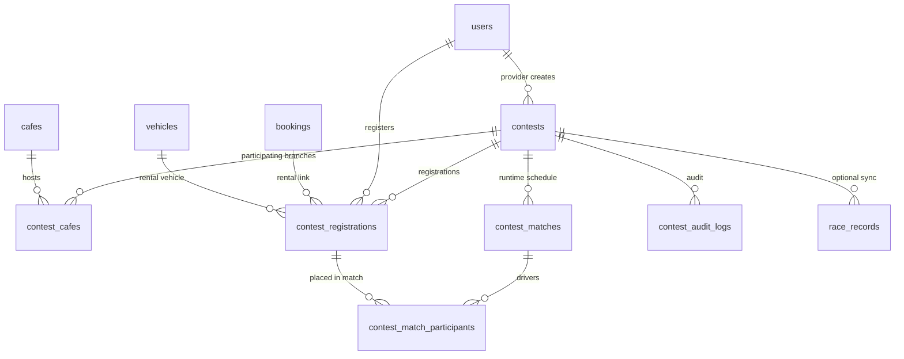
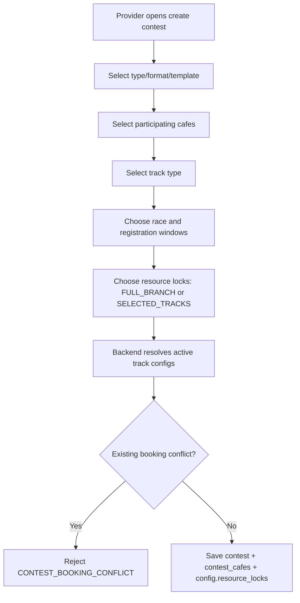
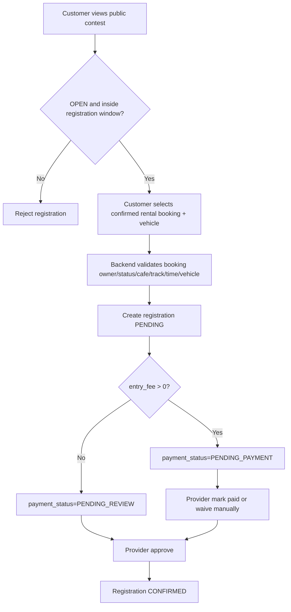
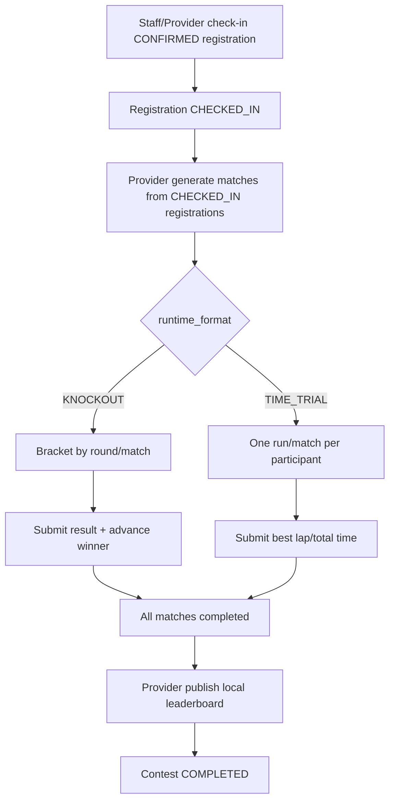
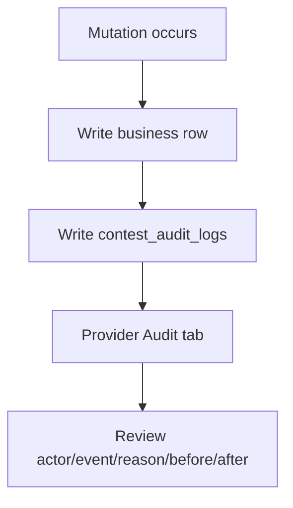

# Architecture: Contest & Race Event

**Last Updated:** 2026-07-14  
**Spec refs:** `docs/spec/03-contest.md`, `docs/spec/business-rules/BR-contest.md`, `docs/developer/contest-delivery/05-contest-current-backend-vs-requested-flow.md`, `docs/spec/09-universal-racing-network.md`

---

## 1. Intent

Contest là bounded context cho event/tournament operations của Provider. Nó không thay booking/session, nhưng có thể link tới booking rental khi người chơi đăng ký giải bằng xe thuê.

Architecture hiện tại có 4 lớp rõ:

```text
Setup        = tạo giải, chọn cafe/track/time/fee/prize/locks
Registration = customer đăng ký, Provider duyệt, fee manual
Runtime      = check-in, generate matches, nhập/correct/advance result
Publishing   = local leaderboard, metrics, audit, optional race record sync
```

---

## 2. Current Module Boundary

```mermaid
graph TD
    subgraph PublicCustomer[Public / Customer]
        LIST[Contest listing]
        DETAIL[Contest detail]
        REGISTER[Rental-linked registration]
        MYREG[My contest registrations]
        PUBLICLB[Published leaderboard]
    end

    subgraph ProviderUI[Provider Dashboard]
        SETUP[Setup: time/cafe/track/locks/fee/prize]
        REGDASH[Registrations + manual fee]
        CHECKINP[Check-in management]
        RUNTIMEP[Runtime by format]
        METRICS[Metrics]
        AUDITUI[Audit logs]
    end

    subgraph StaffUI[Staff Event Day]
        LOOKUP[Lookup by check-in code]
        CHECKIN[Check-in at assigned cafe]
        RUNTIMES[Submit/correct result]
    end

    subgraph Backend[Backend Services]
        CONTEST[contest.service]
        LOCK[contest-lock.service]
        RUNTIME[contest-runtime.service]
        RN[racing-network.service]
    end

    subgraph Data[Database]
        C[contests]
        CC[contest_cafes]
        CR[contest_registrations]
        CM[contest_matches]
        CMP[contest_match_participants]
        CAL[contest_audit_logs]
        RR[race_records]
    end

    LIST --> CONTEST
    DETAIL --> CONTEST
    REGISTER --> CONTEST
    MYREG --> CONTEST
    PUBLICLB --> CONTEST

    SETUP --> CONTEST
    SETUP --> LOCK
    REGDASH --> CONTEST
    CHECKINP --> CONTEST
    RUNTIMEP --> RUNTIME
    METRICS --> RUNTIME
    AUDITUI --> RUNTIME

    LOOKUP --> CONTEST
    CHECKIN --> CONTEST
    RUNTIMES --> RUNTIME

    CONTEST --> C
    CONTEST --> CC
    CONTEST --> CR
    LOCK --> C
    RUNTIME --> CM
    RUNTIME --> CMP
    RUNTIME --> CAL
    RN --> RR
```



---

## 3. Entity Map



`contests.config` current keys used by contest:

```json
{
  "format": "KNOCKOUT",
  "runtime_format": "KNOCKOUT",
  "drivers_per_match": 2,
  "seeding_mode": "CHECK_IN_ORDER",
  "leaderboard_mode": "KNOCKOUT_WINS",
  "resource_locks": [
    {
      "cafe_id": "uuid",
      "scope": "FULL_BRANCH",
      "track_config_ids": []
    }
  ],
  "prizes": [],
  "published_leaderboard": null,
  "global_sync": null
}
```

---

## 4. Critical Flows

### 4.1 Setup + Resource Lock



Key point: schedule block is current backend behavior, not future scope.

### 4.2 Registration + Fee



VNPay contest entry is not implemented yet.

### 4.3 Runtime



### 4.4 Audit And Review



---

## 5. API Surface

Catalog:

```text
GET /api/v1/contest-catalog/types
GET /api/v1/contest-catalog/formats
GET /api/v1/contest-catalog/templates
```

Contest:

```text
GET   /api/v1/contests
GET   /api/v1/cafes/:cafeId/contests
GET   /api/v1/contests/:contestId
POST  /api/v1/contests
PATCH /api/v1/contests/:contestId
POST  /api/v1/contests/:contestId/open
POST  /api/v1/contests/:contestId/close
POST  /api/v1/contests/:contestId/cancel
```

Registration:

```text
POST /api/v1/contests/:contestId/register
GET  /api/v1/me/contest-registrations
GET  /api/v1/contests/:contestId/registrations
GET  /api/v1/contests/:contestId/registrations/lookup?check_in_code=...
POST /api/v1/contest-registrations/:registrationId/mark-entry-fee-paid
POST /api/v1/contest-registrations/:registrationId/waive-entry-fee
POST /api/v1/contest-registrations/:registrationId/approve
POST /api/v1/contest-registrations/:registrationId/reject
POST /api/v1/contest-registrations/:registrationId/cancel
POST /api/v1/contest-registrations/:registrationId/check-in
```

Runtime:

```text
GET   /api/v1/contests/:contestId/matches
POST  /api/v1/contests/:contestId/matches/generate
PATCH /api/v1/contest-matches/:matchId/participants
POST  /api/v1/contest-matches/:matchId/results
POST  /api/v1/contest-matches/:matchId/results/correct
POST  /api/v1/contest-matches/:matchId/advance
POST  /api/v1/contests/:contestId/leaderboard/publish
```

Monitoring and racing network:

```text
GET  /api/v1/contests/:contestId/audit-logs
GET  /api/v1/contests/:contestId/metrics
POST /api/v1/contests/:contestId/sync-race-records
```

---

## 6. FE Expectations

Provider dashboard should be split into tabs:

| Tab | Purpose | Backend source |
|---|---|---|
| Setup | Contest info, windows, cafe, track, resource locks, fee, prize | contest create/update/detail |
| Registrations | Participant list, fee status, approve/reject/cancel | registration endpoints |
| Check-in | Lookup code and check in at cafe | lookup/check-in |
| Runtime | Format-specific management | matches/results/advance |
| Leaderboard | Preview and publish local standings | publish/detail |
| Metrics | Operational counts now; revenue after backend adds it | metrics |
| Audit | Anti-fraud history | audit-logs |

Runtime UI must branch by `runtime_format`:

- `KNOCKOUT`: bracket, match panel, winner advance.
- `TIME_TRIAL`: run list, time entry, ranking table.

Customer UI must hide technical states and show journey states:

```text
PENDING_APPROVAL
APPROVED_WAITING_CHECKIN
CHECKED_IN_WAITING_BRACKET
IN_BRACKET
ADVANCED
ELIMINATED
FINISHED
CANCELLED
```

---

## 7. Deferred / Gap Architecture

| Concern | Current | Needed if product wants full flow |
|---|---|---|
| VNPay contest entry | Manual mark/waive only | `CONTEST_ENTRY` payment subject + IPN |
| Revenue report | Operational metrics only | gross/paid/pending/waived/refund/conversion |
| BYOC contest | Product intent, service rental-only | `customer_vehicle_id` registration + review |
| Prize payout | Display config only | reward claim/payout/voucher engine |
| Ban participant | Cancel/reject/DQ only | `contest_bans` or contest incident subject |
| Auto close registration | Time guard in register | scheduler status sync |
| Protest/appeal | Not present | disciplinary/appeal workflow |

---

## Reference

- [Contest spec](../spec/03-contest.md)
- [BR-contest](../spec/business-rules/BR-contest.md)
- [Current backend vs requested flow](../developer/contest-delivery/05-contest-current-backend-vs-requested-flow.md)
- [API contracts](../spec/05-api-contracts.md)
- [Database spec](../spec/06-database.md)
