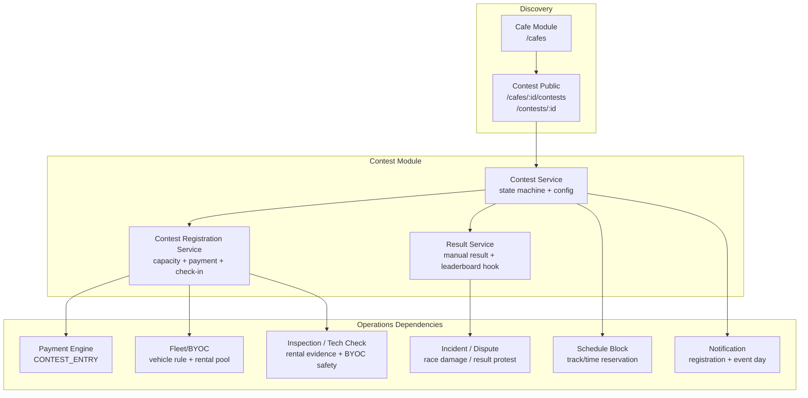
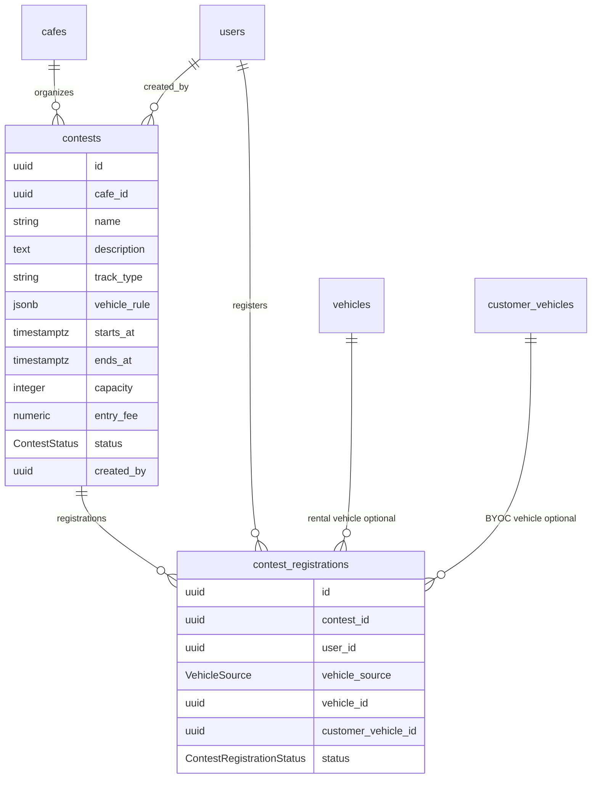
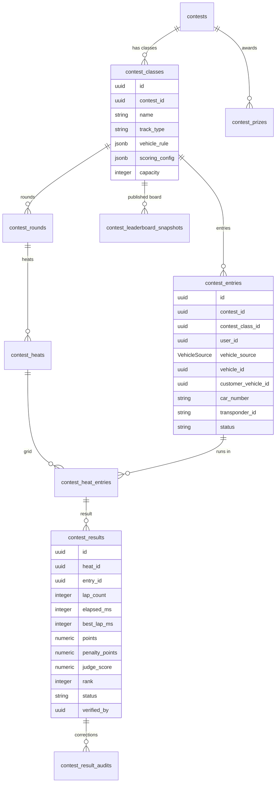
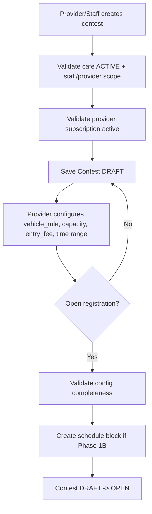
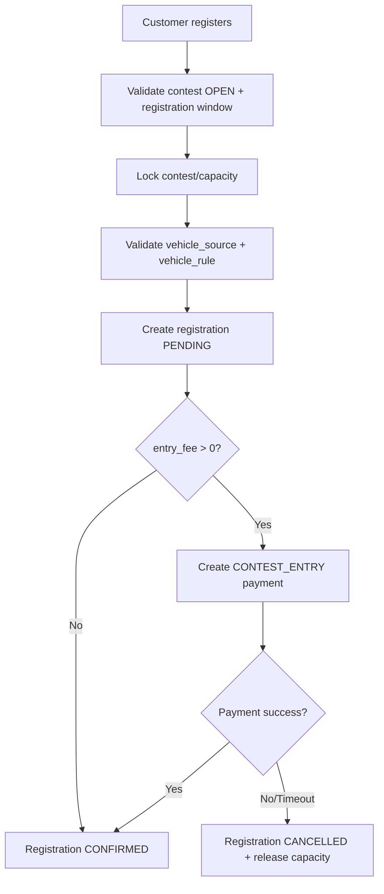
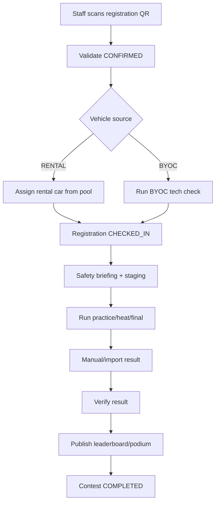

# Architecture: Contest & Race Event

**Last Updated:** 2026-06-08  
**Spec refs:** `docs/spec/business-rules/BR-contest.md`, `docs/spec/01-domain-model.md`, `docs/spec/06-database.md`

---

## 1. Intent

Contest là module tổ chức sự kiện đua RC tại từng chi nhánh. Nó phục vụ mục tiêu
"kết nối mọi người lại với nhau" bằng cách biến RCField từ nền tảng đặt lịch cá
nhân thành nơi cafe có thể tạo hoạt động cộng đồng: giải đua, time attack,
rental spec cup, BYOC race, party race và sau này là leaderboard/series.

Nguyên tắc kiến trúc:

```
CONTEST = event operations
BOOKING = planned play slot
SESSION = actual play session
```

Contest không nên bị ép thành một booking thường. Booking/session đang tối ưu cho
khách đặt giờ chơi, còn Contest cần quản lý đăng ký, rule, schedule, participant
check-in, kết quả, leaderboard và giải thưởng.

---

## 2. Phase Boundary

| Phase | Tên | Mục tiêu | Có thể dùng schema hiện tại? |
|---|---|---|---|
| Phase 1A | Registration MVP | Tạo contest, public listing, customer đăng ký, staff check-in | Có |
| Phase 1B | Operational Contest Core | Chạy contest thật mà không trùng booking/fleet/payment | Cần bổ sung nhẹ |
| Phase 2 | Race Management Core | Class, entry, round, heat, result, leaderboard | Cần bảng mới |
| Phase 3 | Community Expansion | Series, season points, multi-branch leaderboard, racer profile | Cần domain mới |
| Phase 4 | Timing Automation | Import/integrate transponder, live leaderboard, auto heat generation | Cần integration |

**Scope khuyến nghị cho capstone demo:** Phase 1A + một phần Phase 1B, format
`RENTAL_SPEC_CUP` hoặc `TIME_ATTACK` manual result.

---

## 3. Module Boundary



**Responsibilities:**

| Module | Sở hữu |
|---|---|
| Contest Service | `ContestStatus`, config validation, open/close/run/complete/cancel |
| Registration Service | Capacity lock, one user per contest in Phase 1A, payment status, check-in |
| Result Service | Manual result in Phase 1B, calculated leaderboard in Phase 2 |
| Schedule Block | Reserve track/time so contest does not collide with normal booking |
| Fleet/BYOC | Rental pool, assigned rental vehicle, BYOC eligibility/tech-check |
| Payment Engine | `CONTEST_ENTRY`, refund when contest/register cancelled |
| Incident/Dispute | Damage during race, BYOC/facility incident, result protest |

---

## 4. Current Entity Map

Current Phase 1 schema:



This supports:

- Public contest listing.
- Create contest per cafe.
- Customer registration.
- Basic registration status.
- Rental/BYOC selection.

This does not support:

- Multiple classes/categories inside one contest.
- Heat/round/final schedule.
- Result/leaderboard.
- Contest payment without payment schema adjustment.
- Waitlist.
- Track/time schedule block.

---

## 5. Target Entity Map

Phase 2 target:



**Migration principle:** keep Phase 1 `contest_registrations` as the simple entry
table. Introduce `contest_entries` only when multi-class/multi-round is actually
implemented.

---

## 6. State Machines

### ContestStatus

```text
DRAFT
  -> OPEN       [open registration]
  -> CANCELLED

OPEN
  -> CLOSED     [registration closes]
  -> CANCELLED

CLOSED
  -> RUNNING    [event starts]
  -> CANCELLED

RUNNING
  -> COMPLETED  [results verified / event finalized]
  -> CANCELLED  [event aborted]
```

Rules:

- All transitions go through `ContestService.transition(contestId, event)`.
- `OPEN` requires valid config, capacity, time range and vehicle rule.
- `RUNNING` locks critical fields: `track_type`, `entry_fee`, capacity, scoring
  config, prize config and vehicle rule.
- `COMPLETED` is terminal unless a dedicated correction workflow exists.

### ContestRegistrationStatus

```text
PENDING
  -> CONFIRMED  [payment success / free contest / manual confirm]
  -> CANCELLED  [payment timeout / customer cancel]

CONFIRMED
  -> CHECKED_IN [event day check-in]
  -> CANCELLED  [cancel before cutoff]

CHECKED_IN is terminal in Phase 1A.
```

Recommended later statuses:

- `WAITLIST`: contest full, waiting for capacity.
- `NO_SHOW`: confirmed but not checked in.
- `DISQUALIFIED`: failed tech-check or rule violation.

---

## 7. Critical Flows

### 7.1 Create and Open Contest



### 7.2 Register



### 7.3 Event Day



---

## 8. Payment Integration

Contest uses `PaymentComponentType.CONTEST_ENTRY`, but the current payment schema
requires `booking_id`. Do not create fake bookings for contest payments.

Recommended architecture:

```text
payment_components
  booking_id nullable
  session_id nullable
  contest_registration_id nullable
  type = CONTEST_ENTRY
```

Alternative generic model:

```text
payment_components
  subject_type = BOOKING | SESSION | CONTEST_REGISTRATION | PACKAGE_PURCHASE
  subject_id
```

Phase 1B decision:

- `CONTEST_ENTRY` is paid before registration becomes `CONFIRMED`.
- Provider cancels contest -> refund 100%.
- Customer cancels -> refund by `contest.refund_policy`.
- Platform fee policy must be explicit. Recommended: treat contest entry as
  Provider event revenue, platform fee configurable or same commission as booking
  if the business wants consistency.

---

## 9. Schedule and Capacity

Contest must reserve track/time before it can run. Without this, a cafe can open a
contest at 15:00-17:00 while normal bookings still take the same track.

Recommended Phase 1B table:

```text
cafe_schedule_blocks
  id
  cafe_id
  track_type
  starts_at
  ends_at
  source_type = CONTEST | MAINTENANCE | CLOSURE | MANUAL
  source_id
  created_by
  created_at
```

Booking availability must check:

- Existing bookings.
- Cafe closures.
- Schedule blocks.
- Rental vehicle reserved pool if contest uses rental cars.
- BYOC capacity.

---

## 10. Fleet, BYOC and Inspection

### Rental

For `RENTAL_SPEC_CUP`, assignment should happen at check-in, not registration.
This keeps the race fair and avoids locking a specific car too early.

Required decisions:

- Rental pool: which vehicles are available for contest.
- Damage policy: normal racing wear included or deposit/inspection required.
- Replacement policy: what happens if one rental car fails before a heat.

### BYOC

BYOC registration should not trust self-declared vehicle data blindly. Event-day
tech check must verify the minimum safety/class rule.

Recommended Phase 1B:

- Tech check checklist stored in contest registration metadata or a dedicated table.
- Fail tech check -> registration cancelled/no-show/disqualified depending policy.
- BYOC damage to own car is usually not charged by platform.
- BYOC damage to facility/other cars becomes Incident/Dispute.

---

## 11. Result and Leaderboard

Phase 1B can use manual result:

```text
contest_result_summary
  registration_id
  rank
  best_lap_ms
  lap_count
  elapsed_ms
  note
```

Phase 2 should compute leaderboard from verified `contest_results`.

Scoring formats:

| Format | Sort |
|---|---|
| Time attack | `best_lap_ms ASC`, then second-best lap |
| Race heat/final | `lap_count DESC`, then `elapsed_ms ASC` |
| Points rounds | points by config, explicit tie-breakers |
| Drift judged | `judge_score DESC`, then penalty |
| Crawler trial | `penalty_points ASC`, then elapsed time |

All public results must be traceable to a result row and verifier.

---

## 12. API Surface

Phase 1A:

```text
GET  /cafes/:cafeId/contests
GET  /contests/:id
POST /cafes/:cafeId/contests
PATCH /contests/:id
POST /contests/:id/open
POST /contests/:id/register
GET  /contests/:id/registrations
POST /contest-registrations/:id/check-in
POST /contest-registrations/:id/cancel
POST /contests/:id/cancel
```

Phase 1B/2:

```text
POST /contests/:id/close
POST /contests/:id/start
POST /contests/:id/results
POST /contests/:id/complete
GET  /contests/:id/leaderboard

POST /contests/:id/classes
POST /contests/:id/generate-heats
GET  /contests/:id/schedule
POST /contest-heats/:id/results
POST /contest-results/:id/verify
```

---

## 13. Architecture Decisions

| Decision | Recommendation |
|---|---|
| Contest vs Booking | Contest is separate event domain; do not fake booking for entry fee |
| Phase 1 scope | Single-branch registration/check-in MVP |
| First demo format | `RENTAL_SPEC_CUP` or `TIME_ATTACK` |
| Schedule protection | Add schedule block before running real contests |
| Payment | Extend ledger subject to support contest registration |
| Result | Manual result in Phase 1B, calculated leaderboard in Phase 2 |
| Multi-branch | Phase 3, not Phase 1 |
| Transponder/live timing | Phase 4 integration/import |

---

## Reference

- [`docs/spec/business-rules/BR-contest.md`](../spec/business-rules/BR-contest.md) — Full business rules and phase roadmap
- [`docs/spec/06-database.md`](../spec/06-database.md) — Current `contests` and `contest_registrations` schema
- [`docs/spec/03-payment-engine.md`](../spec/03-payment-engine.md) — Payment component rules
- [`docs/spec/business-rules/BR-fleet.md`](../spec/business-rules/BR-fleet.md) — Vehicle status and track compatibility
- [`docs/diagrams/sequence/sequence-flow-contest-lifecycle.md`](../diagrams/sequence/sequence-flow-contest-lifecycle.md) — End-to-end sequence
- [`docs/architecture/diagrams/contest-lifecycle-flow.md`](./diagrams/contest-lifecycle-flow.md) — Flowchart view

