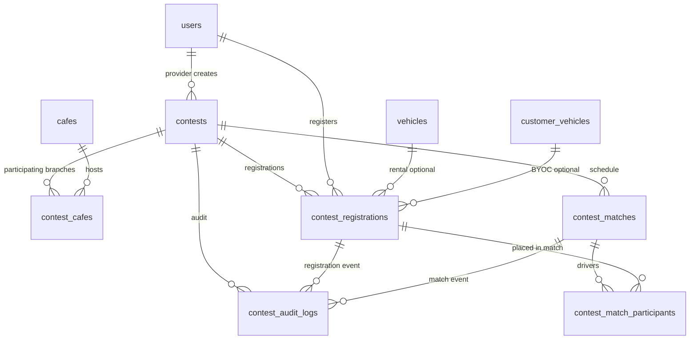
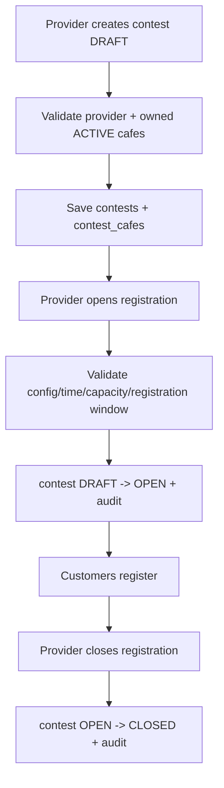
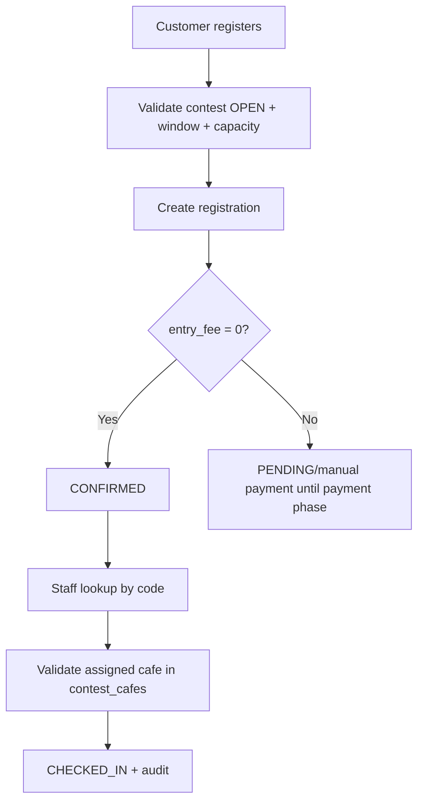
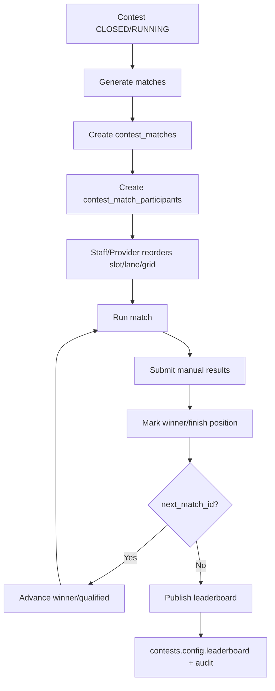

# Architecture: Contest & Race Event

**Last Updated:** 2026-06-23  
**Spec refs:** `docs/spec/business-rules/BR-contest.md`, `docs/spec/01-domain-model.md`, `docs/spec/05-api-contracts.md`, `docs/spec/06-database.md`

---

## 1. Intent

Contest là module event operations riêng của RCField. Nó không phải booking thường và không tạo booking giả để thu phí hay giữ slot. Phase hiện tại tập trung vào luồng khả thi cho đồ án:

1. Provider tạo/sửa/open/close/cancel contest.
2. Customer xem thông tin, luật, giải thưởng, địa điểm và đăng ký.
3. Provider/Staff monitoring người tham gia và check-in.
4. Sau khi đóng đăng ký, Provider/Staff tạo lịch thi đấu bằng match linh hoạt.
5. Staff nhập kết quả, advance người thắng/qualified và publish leaderboard.
6. Mọi mutation quan trọng ghi audit log DB + logger.

```text
CONTEST = event operations
BOOKING = planned play slot
SESSION = actual play session
```

---

## 2. Phase Boundary

| Scope | Quyết định |
|---|---|
| Current phase | Compact tournament flow với 5 bảng chính + audit log |
| Next phase | Schedule block, CONTEST_ENTRY payment, BYOC tech-check, rental assignment đầy đủ |
| Backlog | Multi-class, live timing, transponder, protest, auto bracket nâng cao, series/championship, reward claim lifecycle |

Schema hiện tại:

```text
contests
contest_cafes
contest_registrations
contest_matches
contest_match_participants
contest_audit_logs
```

Không dùng trong phase hiện tại:

```text
contest_classes
contest_rounds
contest_heats
contest_heat_entries
contest_results
contest_result_audits
contest_leaderboard_snapshots
contest_rewards
contest_reward_claims
contest_bracket_matches
```

---

## 3. Module Boundary

```mermaid
graph TD
    subgraph PublicUI[Public / Customer]
        LIST[Contest listing]
        DETAIL[Contest detail]
        REGISTER[Registration]
        MYREG[My registrations]
    end

    subgraph ProviderUI[Provider Dashboard]
        CRUD[Create/Edit/Open/Close/Cancel]
        REGDASH[Participant dashboard]
        MATCHUI[Match schedule + drag/drop]
        RESULTUI[Result entry + leaderboard]
        AUDITUI[Audit log]
    end

    subgraph StaffUI[Staff Event Day]
        LOOKUP[Lookup by check-in code]
        CHECKIN[Check-in]
        RESULT[Result update if assigned]
    end

    subgraph Backend[Contest Backend]
        CONTEST[contest.service]
        REG[contest-registration.service]
        TOUR[contest-tournament.service]
        AUDIT[contest-audit helper]
    end

    subgraph Data[Database]
        C[contests]
        CC[contest_cafes]
        CR[contest_registrations]
        CM[contest_matches]
        CMP[contest_match_participants]
        CAL[contest_audit_logs]
    end

    LIST --> CONTEST
    DETAIL --> CONTEST
    REGISTER --> REG
    MYREG --> REG
    CRUD --> CONTEST
    REGDASH --> REG
    MATCHUI --> TOUR
    RESULTUI --> TOUR
    AUDITUI --> AUDIT
    LOOKUP --> REG
    CHECKIN --> REG
    RESULT --> TOUR

    CONTEST --> C
    CONTEST --> CC
    REG --> CR
    TOUR --> CM
    TOUR --> CMP
    AUDIT --> CAL
```



---

## 4. Entity Map



### contests.config

```json
{
  "format": "KNOCKOUT | MULTI_DRIVER_HEAT | TIME_ATTACK",
  "drivers_per_match": 2,
  "seeding_mode": "MANUAL | CHECK_IN_ORDER",
  "rules_text": "The le giai...",
  "prizes": [
    { "rank": 1, "title": "Champion", "description": "Voucher 500k" }
  ],
  "leaderboard": []
}
```

---

## 5. State Machines

### ContestStatus

```text
DRAFT -> OPEN -> CLOSED -> RUNNING -> COMPLETED
   \       \        \          \
    \       \        \          -> CANCELLED
     \       \        -> CANCELLED
      \       -> CANCELLED
       -> CANCELLED
```

### ContestRegistrationStatus

```text
PENDING -> CONFIRMED -> CHECKED_IN
    \          \
     -> CANCELLED
```

### ContestMatchStatus

```text
DRAFT -> READY -> RUNNING -> COMPLETED
   \       \        \
    \       \        -> CANCELLED
     \       -> CANCELLED
      -> CANCELLED
```

---

## 6. Critical Flows

### 6.1 Create/Open/Close



### 6.2 Register/Check-in



### 6.3 Tournament schedule/result



---

## 7. API Surface

```text
GET  /contests
GET  /cafes/:cafeId/contests
GET  /contests/:id
POST /contests
PATCH /contests/:id
POST /contests/:id/open
POST /contests/:id/close
POST /contests/:id/cancel

POST /contests/:id/register
GET  /contests/:id/registrations
GET  /contests/:id/registrations/lookup?check_in_code=...
GET  /me/contest-registrations
POST /contest-registrations/:id/check-in
POST /contest-registrations/:id/cancel

GET  /contests/:id/matches
POST /contests/:id/matches/generate
PATCH /contest-matches/:id/participants
POST /contest-matches/:id/results
POST /contest-matches/:id/advance
POST /contests/:id/leaderboard/publish
GET  /contests/:id/audit-logs
```

---

## 8. Monitoring

Business mutations write `contest_audit_logs` and logger events.

Required event types:

```text
contest.created
contest.updated
contest.opened
contest.closed
contest.cancelled
registration.created
registration.cancelled
registration.checked_in
match.schedule_generated
match.participants_updated
match.result_submitted
match.advanced
leaderboard.published
```

Rules:

- Audit writes run in the same transaction as the business mutation.
- Store small before/after snapshots, not huge request payloads.
- Provider can read audit logs for their contest.

---

## 9. Deferred Integrations

| Concern | Current decision | Future |
|---|---|---|
| Payment | No fake booking; free/manual contest allowed | `CONTEST_ENTRY` payment subject |
| Schedule block | Documented gap | Block normal booking during contest |
| BYOC tech check | Manual note in metadata | Structured checklist/evidence |
| Rental assignment | Optional registration field | Assignment pool at check-in |
| Reward | Config-only prizes | Reward claim lifecycle |
| Live timing | Manual result | Transponder/import/live board |

---

## Reference

- [BR-contest](../spec/business-rules/BR-contest.md)
- [Database spec](../spec/06-database.md)
- [API contracts](../spec/05-api-contracts.md)
- [Contest sequence](../diagrams/sequence/sequence-flow-contest-lifecycle.md)
- [Contest lifecycle flow](./diagrams/contest-lifecycle-flow.md)
