# Contest Lifecycle Flow — Case A (Rental Spec Cup)

> Happy path đi thẳng xuống. Nhánh rẽ phải là edge case hoặc phần cần Phase 1B/2.
>
> Case này dùng cho MVP hợp lý nhất: một chi nhánh tổ chức giải rental/spec,
> xe do cafe chuẩn bị, người chơi đăng ký online, staff check-in và nhập kết quả thủ công.

```mermaid
flowchart TD
    START([Provider muốn tổ chức Rental Spec Cup]) --> PH0_START

    subgraph PH0 ["Phase 0 — Config"]
        PH0_START[Chọn cafe + track_type + thời gian] --> PH0A{Cafe ACTIVE\nProvider subscription active?}
        PH0A -->|No| PH0_BLOCK([Không cho tạo/open contest])
        PH0A -->|Yes| PH0B[Nhập name, description, capacity, entry_fee]
        PH0B --> PH0C[Cấu hình vehicle_rule\nRENTAL_ONLY / SPEC_RENTAL]
        PH0C --> PH0D[Save contests.status = DRAFT]
    end

    PH0D --> PH1_START

    subgraph PH1 ["Phase 1 — Open Registration"]
        PH1_START[Validate config đầy đủ] --> PH1A{Track/time conflict?}
        PH1A -->|Yes| PH1_CONFLICT([Yêu cầu đổi lịch\nhoặc staff override])
        PH1A -->|No| PH1B["Create schedule block\nPhase 1B"]
        PH1B --> PH1C[contests DRAFT -> OPEN]
    end

    PH1C --> PH2_START

    subgraph PH2 ["Phase 2 — Customer Register"]
        PH2_START[Customer xem contest public] --> PH2A[POST /contests/:id/register]
        PH2A --> PH2B{Capacity còn chỗ?}
        PH2B -->|No| PH2_FULL([Reject hoặc WAITLIST\nPhase 1B])
        PH2B -->|Yes| PH2C[contest_registrations.status = PENDING]
        PH2C --> PH2D{entry_fee > 0?}
        PH2D -->|No| PH2_OK[registration -> CONFIRMED]
        PH2D -->|Yes| PH2PAY["Create payment_component\nCONTEST_ENTRY"]
        PH2PAY --> PH2PAYQ{Payment success?}
        PH2PAYQ -->|No / timeout| PH2_FAIL([registration -> CANCELLED\nrelease capacity])
        PH2PAYQ -->|Yes| PH2_OK
    end

    PH2_OK --> PH3_CHECK

    subgraph PH3 ["Phase 3 — Close and Prepare"]
        PH3_CHECK{registration_closes_at\nhoặc Provider close?} -->|Not yet| PH2_START
        PH3_CHECK -->|Closed| PH3A[contest OPEN -> CLOSED]
        PH3A --> PH3B[Chốt danh sách CONFIRMED]
        PH3B --> PH3C["Generate race schedule\nManual in Phase 1B\nround/heat tables in Phase 2"]
    end

    PH3C --> PH4_SCAN

    subgraph PH4 ["Phase 4 — Event Day"]
        PH4_SCAN[Staff scan QR] --> PH4A{registration CONFIRMED?}
        PH4A -->|No| PH4_REJECT([Reject / resolve payment])
        PH4A -->|Yes| PH4B[Assign rental car from pool]
        PH4B --> PH4C{Need handover evidence?}
        PH4C -->|Yes| PH4D[Inspection / photos / checklist]
        PH4C -->|No| PH4E[Safety briefing]
        PH4D --> PH4E
        PH4E --> PH4F[registration -> CHECKED_IN]
        PH4F --> PH4G[contest CLOSED -> RUNNING]
    end

    PH4G --> PH5_RUN

    subgraph PH5 ["Phase 5 — Race and Result"]
        PH5_RUN[Practice / qualifying / final] --> PH5A[Staff records manual result]
        PH5A --> PH5B{Result verified?}
        PH5B -->|No| PH5_EDIT[Edit with audit note]
        PH5_EDIT --> PH5B
        PH5B -->|Yes| PH5C[Publish leaderboard / podium]
    end

    PH5C --> DONE

    subgraph PH6 ["Phase 6 — Complete / Cancel"]
        DONE[contest RUNNING -> COMPLETED] --> PH6A[Award voucher/package/trophy]
        PH6A --> PH6B[Public result page]
    end

    PH1C --> CANCELQ{Provider cancels?}
    CANCELQ -->|Yes| CANCEL["contest -> CANCELLED\nrefund CONTEST_ENTRY 100%\nnotify participants"]
    CANCELQ -->|No| PH2_START

    style PH0_BLOCK fill:#fee2e2,stroke:#ef4444
    style PH1_CONFLICT fill:#fee2e2,stroke:#ef4444
    style PH2_FULL fill:#fef9c3,stroke:#eab308
    style PH2_FAIL fill:#fee2e2,stroke:#ef4444
    style PH4_REJECT fill:#fee2e2,stroke:#ef4444
    style DONE fill:#dcfce7,stroke:#22c55e
    style CANCEL fill:#fee2e2,stroke:#ef4444
```

---

## Data touched by phase

| Phase | Tables / services |
|---|---|
| Config | `contests`, provider subscription guard, staff/cafe scope |
| Open | `contests.status`, proposed `cafe_schedule_blocks` |
| Register | `contest_registrations`, `payment_components(CONTEST_ENTRY)`, payment transactions |
| Prepare | `contest_registrations`, proposed heat/schedule tables |
| Event day | `contest_registrations.status`, rental pool, optional inspection/tech-check |
| Result | proposed `contest_results`, `contest_leaderboard_snapshots` |
| Complete | `contests.status`, prize/voucher/package reward records |

---

## Related files

- [`../03-contest.md`](../03-contest.md) — architecture narrative
- [`../../spec/business-rules/BR-contest.md`](../../spec/business-rules/BR-contest.md) — full business rules
- [`../../diagrams/sequence/sequence-flow-contest-lifecycle.md`](../../diagrams/sequence/sequence-flow-contest-lifecycle.md) — sequence diagrams
