# Contest Lifecycle Flow — Provider Multi-Branch MVP

> Happy path đi thẳng xuống. Nhánh rẽ phải là edge case hoặc phần cần Phase 1B/1C/2.
>
> Case MVP: Provider tạo một contest ở cấp provider, chọn nhiều chi nhánh tham gia,
> người chơi đăng ký vào contest chung, staff/provider check-in tại một chi nhánh
> thuộc contest.

```mermaid
flowchart TD
    START([Provider muốn tổ chức contest]) --> PH0_START

    subgraph PH0 ["Phase 0 — Config"]
        PH0_START[Nhập name, description, banner] --> PH0A[Chọn participating_cafe_ids]
        PH0A --> PH0B{Tất cả cafe ACTIVE\nvà thuộc Provider?}
        PH0B -->|No| PH0_BLOCK([Không cho tạo contest])
        PH0B -->|Yes| PH0C[Chọn track_type_id + starts_at/ends_at]
        PH0C --> PH0D[Cấu hình capacity, entry_fee, registration window]
        PH0D --> PH0E[Cấu hình vehicle_rule/config]
        PH0E --> PH0F["Save contests.status = DRAFT\n+ contest_cafes"]
    end

    PH0F --> PH1_START

    subgraph PH1 ["Phase 1 — Open Registration"]
        PH1_START[Validate config đầy đủ] --> PH1A{Có ít nhất 1 cafe tham gia?}
        PH1A -->|No| PH1_BLOCK([Không cho open])
        PH1A -->|Yes| PH1B{Track/time conflict?\nPhase 1B}
        PH1B -->|Yes| PH1_CONFLICT([Yêu cầu đổi lịch])
        PH1B -->|No| PH1C["Create schedule blocks per cafe\nPhase 1B"]
        PH1C --> PH1D[contest DRAFT -> OPEN]
    end

    PH1D --> PH2_START

    subgraph PH2 ["Phase 2 — Participant Register"]
        PH2_START[Customer xem contest public] --> PH2A[POST /contests/:id/register]
        PH2A --> PH2B{Capacity tổng còn chỗ?}
        PH2B -->|No| PH2_FULL([Reject hoặc WAITLIST\nPhase 1B])
        PH2B -->|Yes| PH2C[contest_registrations.status = PENDING]
        PH2C --> PH2D{entry_fee > 0?}
        PH2D -->|No| PH2_OK[registration -> CONFIRMED]
        PH2D -->|Yes| PH2PAY["Manual payment MVP\nCONTEST_ENTRY online Phase 1B"]
        PH2PAY --> PH2PAYQ{Payment success/manual confirm?}
        PH2PAYQ -->|No / timeout| PH2_FAIL([registration -> CANCELLED\nrelease capacity])
        PH2PAYQ -->|Yes| PH2_OK
    end

    PH2_START --> PH2_PROVIDER
    PH2_PROVIDER{Phase 1C:\nProvider registers?} -->|Contest owner| PH2_SELF_BLOCK([Reject self-registration])
    PH2_PROVIDER -->|Other Provider contest| PH2A

    PH2_OK --> PH3_CHECK

    subgraph PH3 ["Phase 3 — Close and Prepare"]
        PH3_CHECK{registration_closes_at\nhoặc Provider close?} -->|Not yet| PH2_START
        PH3_CHECK -->|Closed| PH3A[contest OPEN -> CLOSED]
        PH3A --> PH3B[Chốt danh sách CONFIRMED]
        PH3B --> PH3C["Prepare check-in list\nHeat/schedule Phase 2"]
    end

    PH3C --> PH4_SCAN

    subgraph PH4 ["Phase 4 — Event Day"]
        PH4_SCAN[Staff/Provider scan QR] --> PH4A{registration CONFIRMED?}
        PH4A -->|No| PH4_REJECT([Reject / resolve payment])
        PH4A -->|Yes| PH4B{checked_in_cafe_id\nthuộc contest_cafes?}
        PH4B -->|No| PH4_BRANCH_REJECT([Reject wrong branch])
        PH4B -->|Yes| PH4C{Vehicle source}
        PH4C -->|RENTAL| PH4D[Assign rental car from pool]
        PH4C -->|BYOC| PH4E[Run BYOC tech check]
        PH4D --> PH4F[registration -> CHECKED_IN]
        PH4E --> PH4F
        PH4F --> PH4G[Safety briefing + staging]
        PH4G --> PH4H[contest CLOSED -> RUNNING]
    end

    PH4H --> PH5_RUN

    subgraph PH5 ["Phase 5 — Race and Result"]
        PH5_RUN[Practice / qualifying / final] --> PH5A[Staff records manual result\nPhase 1B/2]
        PH5A --> PH5B{Result verified?}
        PH5B -->|No| PH5_EDIT[Edit with audit note]
        PH5_EDIT --> PH5B
        PH5B -->|Yes| PH5C[Publish leaderboard / podium]
    end

    PH5C --> DONE

    subgraph PH6 ["Phase 6 — Complete / Cancel"]
        DONE[contest RUNNING -> COMPLETED] --> PH6A[Award voucher/package/trophy]
        PH6A --> PH6B[Public result page]
    end

    PH1D --> CANCELQ{Provider cancels?}
    CANCELQ -->|Yes| CANCEL["contest -> CANCELLED\nrefund/manual payment policy\nnotify participants"]
    CANCELQ -->|No| PH2_START

    style PH0_BLOCK fill:#fee2e2,stroke:#ef4444
    style PH1_BLOCK fill:#fee2e2,stroke:#ef4444
    style PH1_CONFLICT fill:#fee2e2,stroke:#ef4444
    style PH2_FULL fill:#fef9c3,stroke:#eab308
    style PH2_FAIL fill:#fee2e2,stroke:#ef4444
    style PH2_SELF_BLOCK fill:#fee2e2,stroke:#ef4444
    style PH4_REJECT fill:#fee2e2,stroke:#ef4444
    style PH4_BRANCH_REJECT fill:#fee2e2,stroke:#ef4444
    style DONE fill:#dcfce7,stroke:#22c55e
    style CANCEL fill:#fee2e2,stroke:#ef4444
```

---

## Data touched by phase

| Phase | Tables / services |
|---|---|
| Config | `contests`, `contest_cafes`, provider subscription guard |
| Open | `contests.status`, proposed per-cafe schedule blocks |
| Register | `contest_registrations`, later `payment_components(CONTEST_ENTRY)` |
| Prepare | `contest_registrations`, proposed heat/schedule tables |
| Event day | `contest_registrations.status`, `checked_in_cafe_id`, rental pool, optional inspection/tech-check |
| Result | proposed `contest_results`, `contest_leaderboard_snapshots` |
| Complete | `contests.status`, prize/voucher/package reward records |

---

## Related files

- [`../03-contest.md`](../03-contest.md) — architecture narrative
- [`../../spec/business-rules/BR-contest.md`](../../spec/business-rules/BR-contest.md) — full business rules
- [`../../diagrams/sequence/sequence-flow-contest-lifecycle.md`](../../diagrams/sequence/sequence-flow-contest-lifecycle.md) — sequence diagrams
