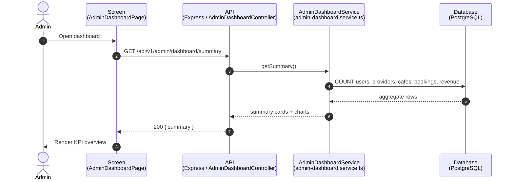
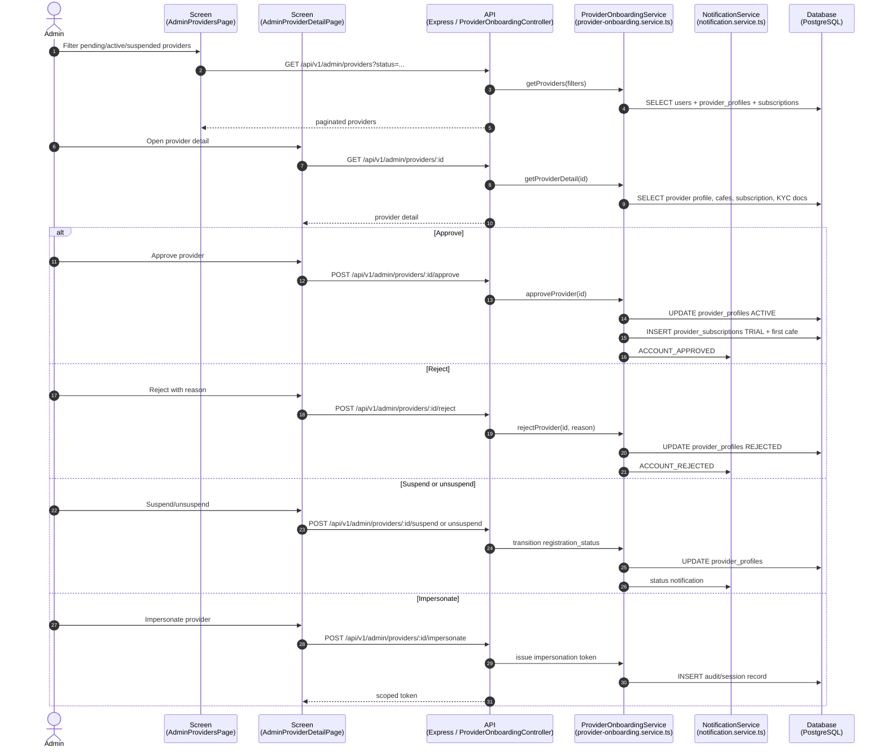
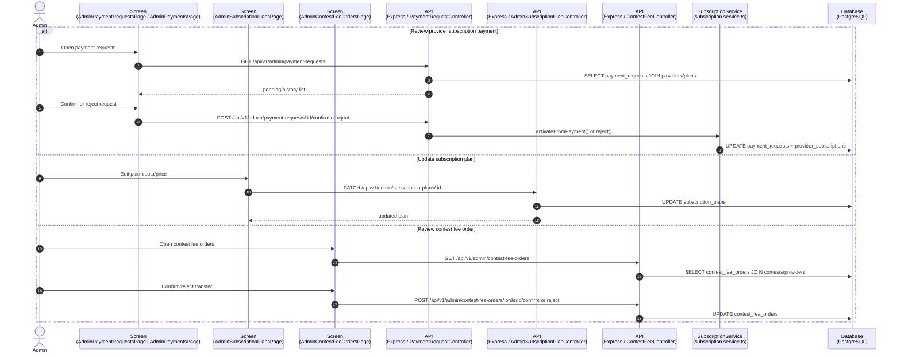
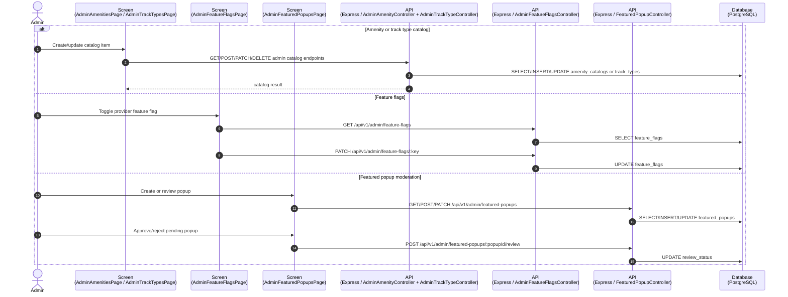
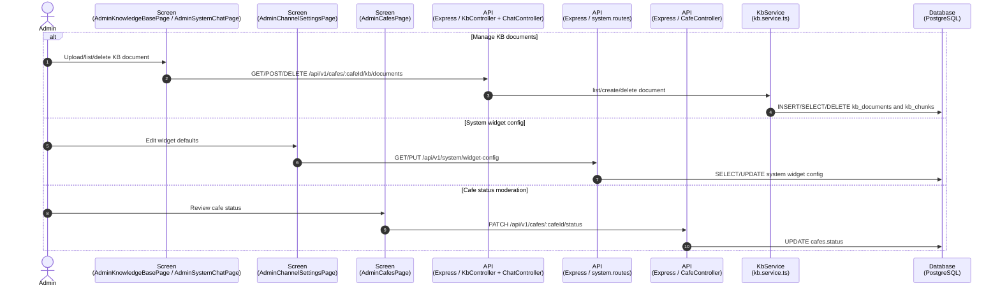

# Sequence Flow: Admin Operations

**Last updated:** 2026-08-06

Coverage theo controller: `admin-dashboard`, `provider-onboarding` qua admin routes, `payment-request`, `admin-subscription-plan`, `admin-amenity`, `admin-track-type`, `admin-feature-flags`, `featured-popup`, `contest-fee`, mot phan `cafe`, `chat/kb`, `notification`.

---

## 1. Admin Dashboard and System Summary

---

## 2. Provider Review, Detail, Suspension and Impersonation

---

## 3. Payment Requests, Subscription Plans and Contest Fee Orders

---

## 4. Admin Catalogs, Feature Flags and Featured Popups

---

## 5. Admin Knowledge Base, Channels and Cafe Moderation

---

## 6. Class Diagram: Admin Operations

```mermaid
classDiagram
    class AdminDashboardPage
    class AdminProvidersPage
    class AdminProviderDetailPage
    class AdminPaymentRequestsPage
    class AdminSubscriptionPlansPage
    class AdminContestFeeOrdersPage
    class AdminAmenitiesPage
    class AdminTrackTypesPage
    class AdminFeatureFlagsPage
    class AdminFeaturedPopupsPage
    class AdminKnowledgeBasePage
    class AdminDashboardController
    class ProviderOnboardingController
    class PaymentRequestController
    class AdminSubscriptionPlanController
    class AdminAmenityController
    class AdminTrackTypeController
    class AdminFeatureFlagsController
    class FeaturedPopupController
    class ContestFeeController
    class KbController
    class User
    class ProviderProfile
    class ProviderSubscription
    class PaymentRequest
    class SubscriptionPlan
    class ContestFeeOrder
    class AmenityCatalog
    class TrackType
    class FeatureFlag
    class FeaturedPopup
    class KbDocument

    AdminDashboardPage --> AdminDashboardController
    AdminProvidersPage --> ProviderOnboardingController
    AdminProviderDetailPage --> ProviderOnboardingController
    AdminPaymentRequestsPage --> PaymentRequestController
    AdminSubscriptionPlansPage --> AdminSubscriptionPlanController
    AdminContestFeeOrdersPage --> ContestFeeController
    AdminAmenitiesPage --> AdminAmenityController
    AdminTrackTypesPage --> AdminTrackTypeController
    AdminFeatureFlagsPage --> AdminFeatureFlagsController
    AdminFeaturedPopupsPage --> FeaturedPopupController
    AdminKnowledgeBasePage --> KbController
    User "1" --> "0..1" ProviderProfile
    ProviderProfile "1" --> "*" ProviderSubscription
    ProviderProfile "1" --> "*" PaymentRequest
```

