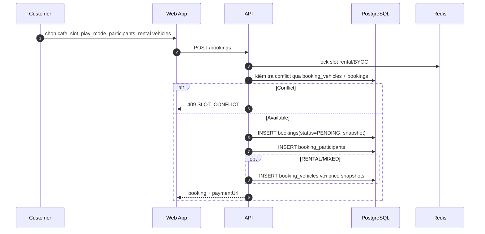
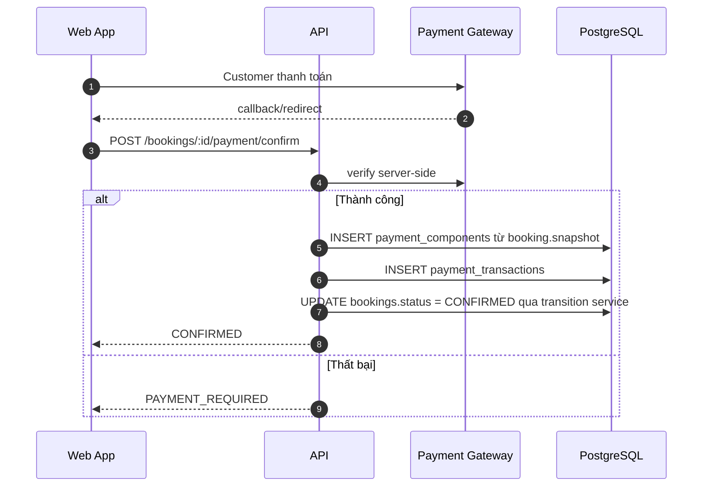
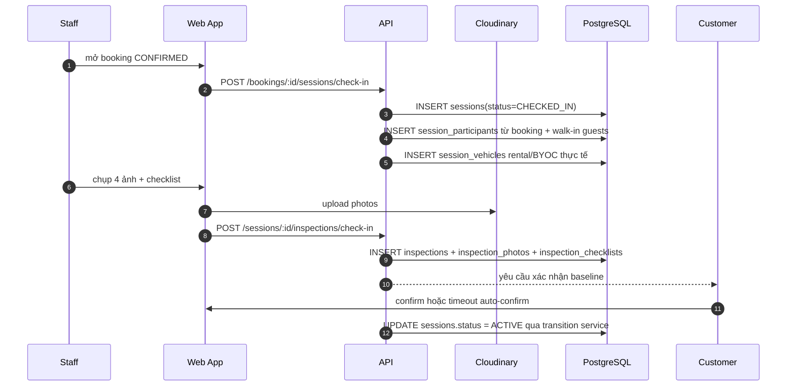
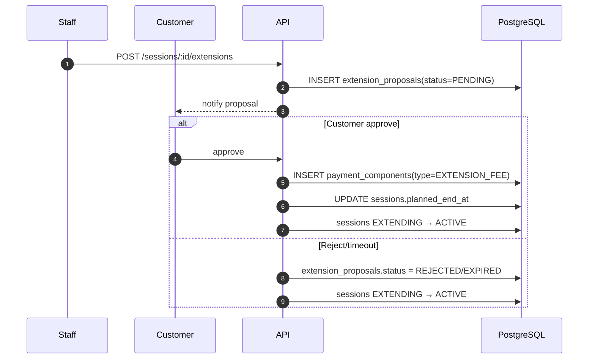
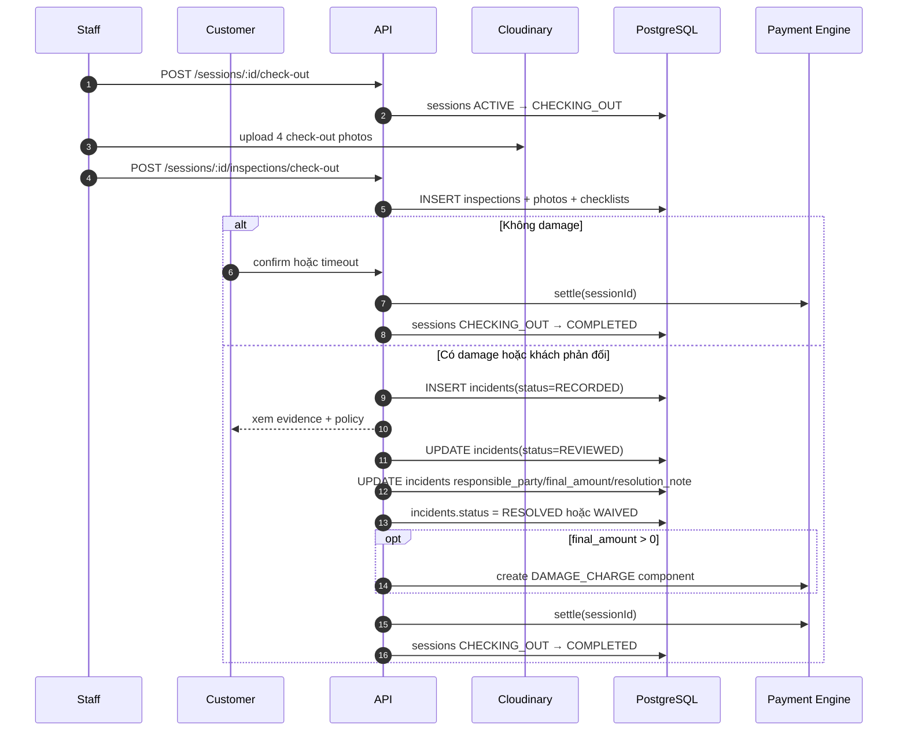
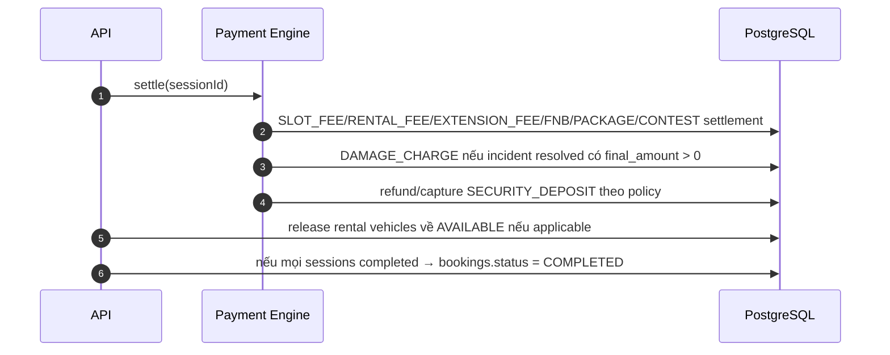

# Sequence Flow: Booking Lifecycle

**Last updated**: 2026-05-16  
**Status**: Reference — đồng bộ với Operational Core Phase 1

End-to-end flow từ khi Customer tạo booking đến khi booking/session hoàn tất hoặc bị huỷ.
Phase 1 dùng `sessions` cho phiên chơi thực tế và dùng `incidents` để log sự cố + kết quả
xử lý theo policy. Workflow dispute nhiều bên là Phase 2.

---

## 0. Identifiers

| Field | Value | Notes |
|-------|-------|-------|
| Play mode | `RENTAL` \| `BYOC` \| `MIXED` | Quyết định rental fee, deposit và BYOC capacity |
| Booking mode | `SINGLE` \| `PACKAGE` \| `SUBSCRIPTION` | Package/subscription là Phase 1 core |
| Booking path | `PENDING → CONFIRMED → COMPLETED` | Booking là kế hoạch đặt lịch |
| Session path | `CHECKED_IN → ACTIVE → EXTENDING → ACTIVE → CHECKING_OUT → COMPLETED` | Session là phiên chơi thực tế |
| Cancel path | `PENDING/CONFIRMED → CANCELLED`; `CONFIRMED → NO_SHOW` | Không huỷ booking đã có session active |
| Incident path | `RECORDED → REVIEWED → RESOLVED/WAIVED` | Không có trạng thái session tranh chấp riêng trong Phase 1 |
| Create booking | `POST /bookings` | Không gửi/lưu xe trực tiếp trên bảng `bookings` |
| Check-in | `POST /bookings/:id/sessions/check-in` | Tạo `sessions`, participants, vehicles thực tế |
| Check-out | `POST /sessions/:id/check-out` | Tạo inspection check-out |
| Raise incident | `POST /sessions/:id/incidents` | Khi có damage hoặc khách phản đối |
| Resolve incident | `POST /incidents/:id/resolve` | Staff/Admin ghi kết quả policy |

---

## 1. Tạo Booking

Rule chính:

- Không lưu `vehicle_id` trực tiếp trong `bookings`.
- Xe rental dự kiến nằm ở `booking_vehicles`.
- Xe BYOC chỉ chốt khi check-in qua `session_vehicles.customer_vehicle_id`.
- Giá/policy phải snapshot tại thời điểm booking.

---

## 2. Thanh Toán

---

## 3. Check-in: Booking → Session

---

## 4. Extension

---

## 5. Check-out + Incident Policy

Incident được xem là done khi có `status`, `responsible_party`, `final_amount`,
`resolution_note`, `resolved_by`, `resolved_at`. Evidence dùng lại inspection photos/checklists.
Nếu cần dispute nhiều bên, upload evidence riêng hoặc arbitration nhiều bước, chuyển sang Phase 2.

---

## 6. Completion

---

## Reference

- `docs/spec/00-overview.md` — Scope và roadmap
- `docs/spec/01-domain-model.md` — Entity model và enums
- `docs/spec/02-state-machine.md` — Booking/session transitions
- `docs/spec/03-payment-engine.md` — Payment components
- `docs/spec/04-inspection-flow.md` — Inspection protocol
- `docs/spec/05-api-contracts.md` — API surface
