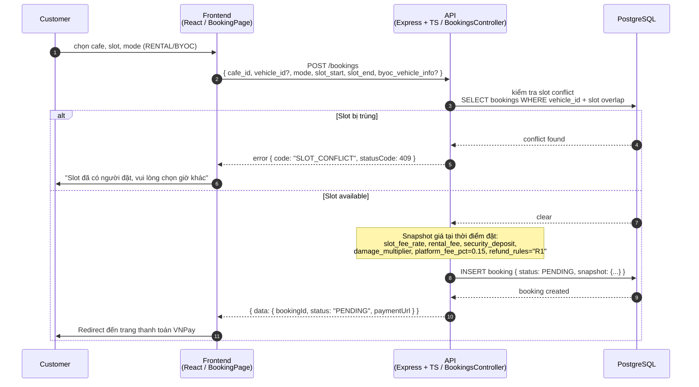
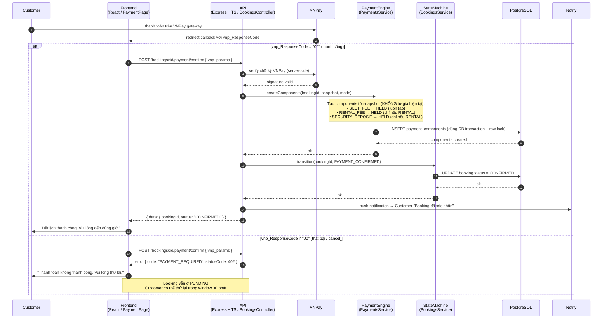
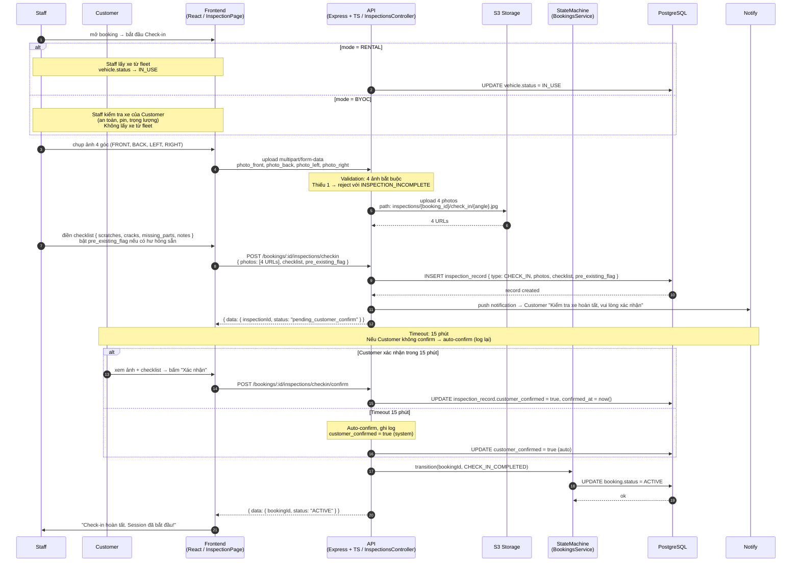
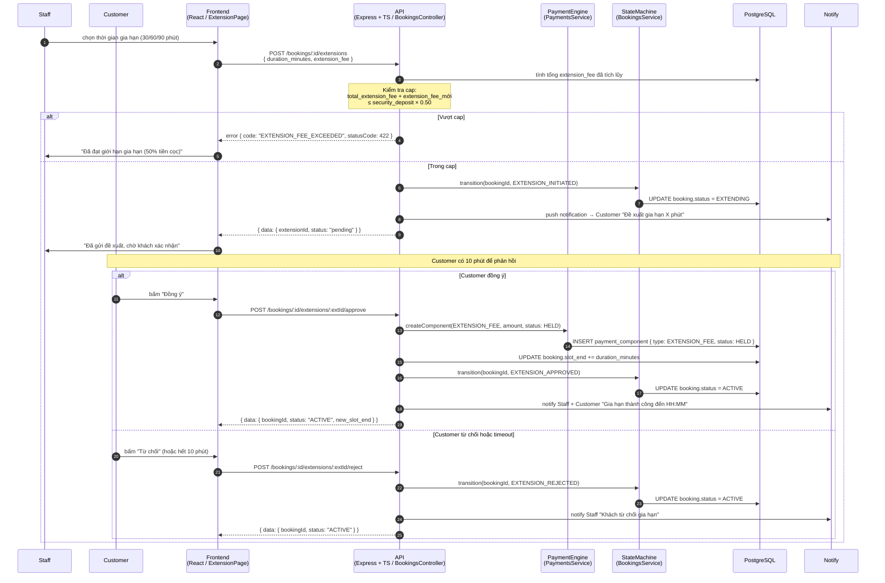
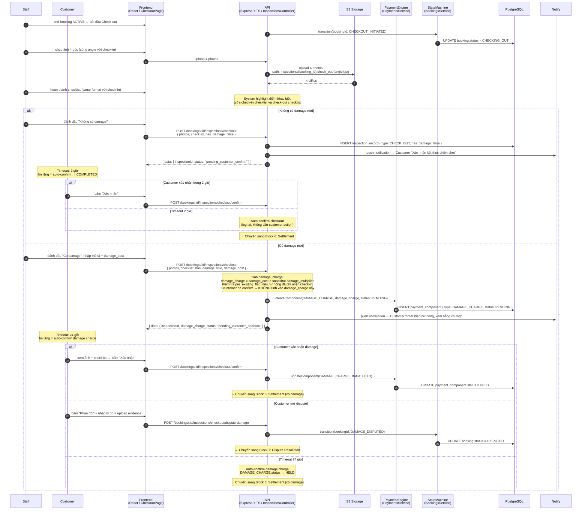
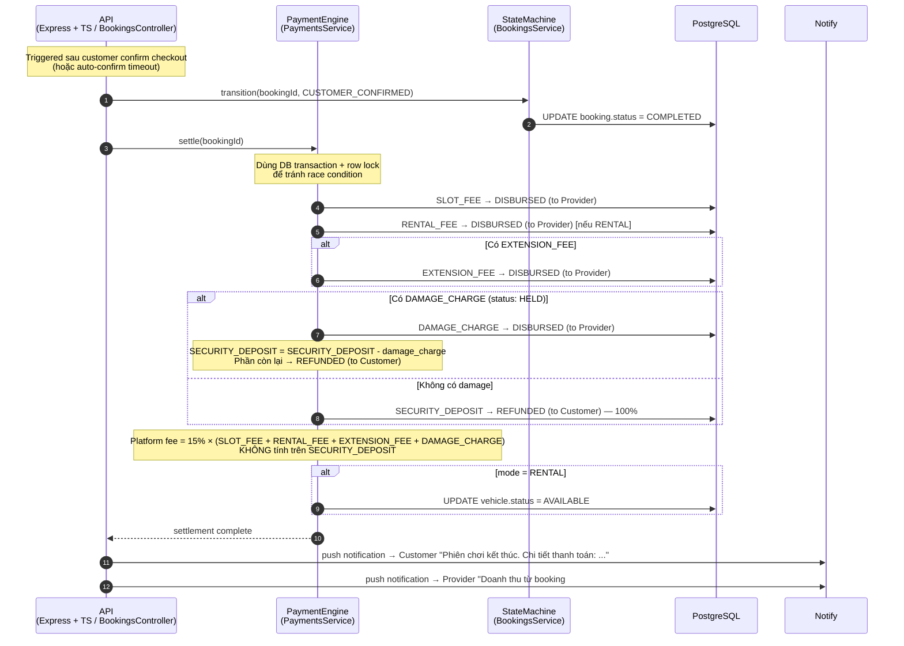
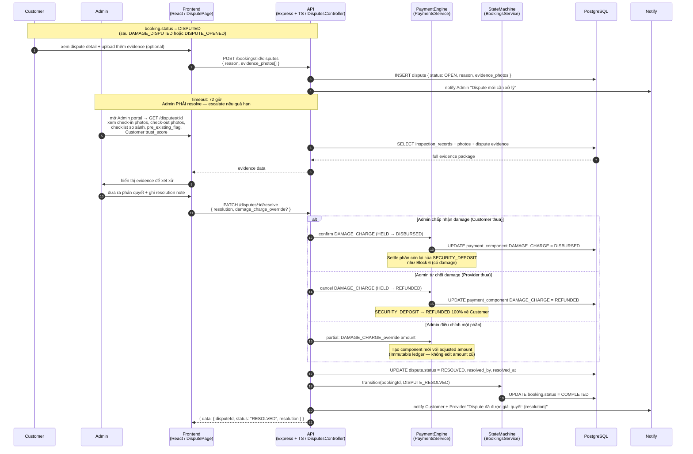
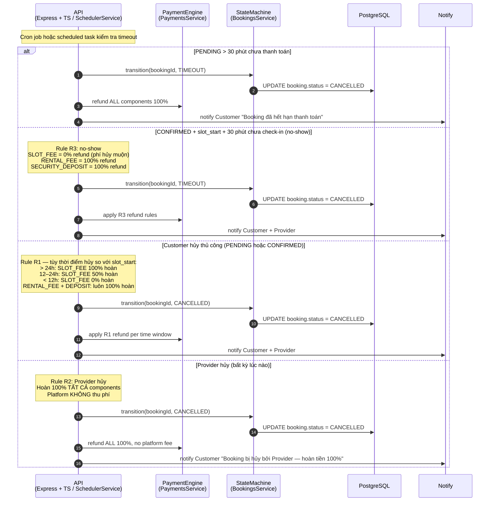
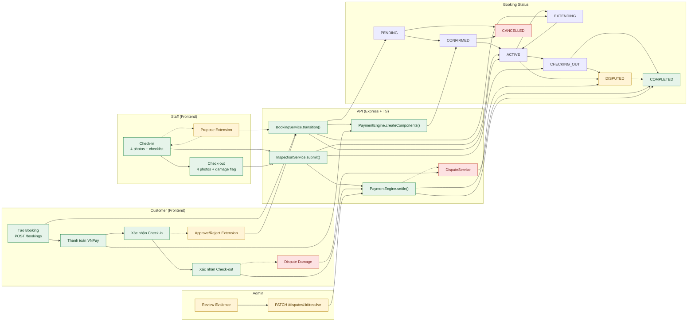

# Sequence Flow: Booking Lifecycle

End-to-end flow từ khi Customer tạo booking đến khi COMPLETED hoặc CANCELLED, bao gồm
payment, check-in/check-out, slot extension (optional), và dispute (optional).
Dựa trên `docs/spec/02-state-machine.md`, `03-payment-engine.md`, `04-inspection-flow.md`,
`05-api-contracts.md`, và `docs/docs/RCField_Overview-V1.0.0.docx`.

> ⚠️ **Lưu ý**: Tài liệu này chỉ mang tính **tham khảo** để hiểu tổng thể flow trước khi
> implement. Chưa được review và chưa áp dụng vào codebase. Cần chạy `/speckit-specify`
> và `/speckit-plan` trước khi bắt đầu implement bất kỳ block nào.

> See **Reference** at the bottom for related docs and legend.

---

## 0. Identifiers

| Field | Value | Notes |
|-------|-------|-------|
| Booking mode | `BookingMode.RENTAL` \| `BookingMode.BYOC` | Quyết định có tạo RENTAL_FEE + SECURITY_DEPOSIT không |
| Asset tier | `AssetTier.STANDARD` \| `PREMIUM` \| `RESTRICTED` | Ảnh hưởng deposit và damage_multiplier |
| State path (happy) | `PENDING → CONFIRMED → ACTIVE → CHECKING_OUT → COMPLETED` | |
| State path (cancel) | `PENDING → CANCELLED` \| `CONFIRMED → CANCELLED` | |
| State path (dispute) | `ACTIVE → DISPUTED → COMPLETED` \| `CHECKING_OUT → DISPUTED → COMPLETED` | |
| State path (extension) | `ACTIVE → EXTENDING → ACTIVE` | |
| Events | `PAYMENT_CONFIRMED`, `CHECK_IN_COMPLETED`, `CHECKOUT_INITIATED`, `CUSTOMER_CONFIRMED`, `DAMAGE_DISPUTED`, `DISPUTE_RESOLVED`, `CANCELLED`, `TIMEOUT` | `BookingEvent` enum |
| Create booking | `POST /bookings` | `BookingsController` |
| Cancel booking | `POST /bookings/:id/cancel` | Customer hoặc Provider |
| Confirm payment | `POST /bookings/:id/payment/confirm` | Customer sau VNPay callback |
| Check-in | `POST /bookings/:id/inspections/checkin` | Staff only |
| Check-in confirm | `POST /bookings/:id/inspections/checkin/confirm` | Customer |
| Check-out | `POST /bookings/:id/inspections/checkout` | Staff only |
| Check-out confirm | `POST /bookings/:id/inspections/checkout/confirm` | Customer |
| Dispute damage | `POST /bookings/:id/inspections/checkout/dispute-damage` | Customer |
| Extension propose | `POST /bookings/:id/extensions` | Staff |
| Extension approve | `POST /bookings/:id/extensions/:extId/approve` | Customer |
| Extension reject | `POST /bookings/:id/extensions/:extId/reject` | Customer |
| Open dispute | `POST /bookings/:id/disputes` | Customer hoặc Provider |
| Resolve dispute | `PATCH /disputes/:id/resolve` | Admin only |

---

## 1. Tạo Booking

Customer chọn cafe, slot, chế độ (RENTAL/BYOC), và gửi booking request. API snapshot giá
tại thời điểm này — mọi tính toán tiền sau đó dùng snapshot, không dùng giá hiện tại.

> **Timeout PENDING**: Nếu Customer không hoàn tất thanh toán trong **30 phút**, hệ thống
> tự động cancel booking và hoàn tiền 100% (nếu đã thu). Xem Block 7b.

---

## 2. Thanh Toán VNPay (PENDING → CONFIRMED)

Customer thanh toán qua VNPay. Sau khi VNPay callback thành công, API tạo các
PaymentComponent và trigger state transition.

---

## 3. Check-in (CONFIRMED → ACTIVE)

Staff thực hiện kiểm tra xe, chụp ảnh 4 góc, hoàn thành checklist. Customer xác nhận
để tạo digital evidence baseline — bảo vệ cả 2 bên khi có tranh chấp sau này.

> **Timeout CONFIRMED → no check-in**: Nếu Staff không check-in trong vòng **30 phút sau
> `slot_start`**, hệ thống auto-cancel, hoàn tiền theo **R3** (no-show): SLOT_FEE = 0%,
> RENTAL_FEE = 100%, DEPOSIT = 100%.

---

## 4. Gia Hạn Giờ Chơi — Slot Extension (ACTIVE → EXTENDING → ACTIVE)

Staff gửi đề xuất gia hạn khi khách muốn chơi thêm. Customer phê duyệt hoặc từ chối.
Extension fee bị cap ở mức 50% security_deposit (cộng dồn qua nhiều lần gia hạn).

---

## 5. Check-out (ACTIVE → CHECKING_OUT)

Staff kết thúc phiên chơi: chụp ảnh 4 góc, so sánh với check-in, đánh dấu damage hay
không. Đây là bước tạo evidence cho settlement và dispute (nếu có).

---

## 6. Settlement & Completion (CHECKING_OUT → COMPLETED)

Sau khi Customer confirm (hoặc auto-confirm), PaymentEngine settle toàn bộ components.
Đây là bước cuối của happy path.

**Settlement outcomes theo scenario:**

| Scenario | SLOT_FEE | RENTAL_FEE | DEPOSIT | DAMAGE_CHARGE | Platform fee |
|----------|----------|------------|---------|---------------|-------------|
| Hoàn thành, no damage | Disburse → Provider | Disburse → Provider | Refund → Customer 100% | — | 15% × (slot + rental) |
| Hoàn thành, có damage ≤ deposit | Disburse → Provider | Disburse → Provider | Refund phần còn lại | Disburse → Provider | 15% × (slot + rental + damage) |
| Early checkout, no damage | Pro-rata → Provider | Không hoàn | Refund 100% | — | 15% × phần đã disburse |

---

## 7. Dispute Resolution (DISPUTED → COMPLETED)

Khi Customer phản đối damage charge, Admin xét xử dựa trên digital evidence (ảnh
check-in/out, checklist, trust_score). Đây là nhánh ngoài happy path.

---

## 7b. Timeout & Cancellation Paths

---

## 8. Decision Logic Summary

| Trạng thái booking | Điều kiện | Hành động / Routing |
|-------------------|-----------|---------------------|
| `PENDING` | Vừa tạo xong | Chờ Customer thanh toán VNPay |
| `PENDING` | > 30 phút không thanh toán | Auto-cancel, refund 100% (TIMEOUT) |
| `CONFIRMED` | Payment thành công | Chờ Staff check-in đúng slot |
| `CONFIRMED` | slot_start + 30 phút, Staff chưa check-in | Auto-cancel, apply R3 (no-show) |
| `CONFIRMED` | Customer hủy > 24h trước slot | Cancel, SLOT_FEE hoàn 100% (R1) |
| `CONFIRMED` | Customer hủy 12–24h trước slot | Cancel, SLOT_FEE hoàn 50% (R1) |
| `CONFIRMED` | Customer hủy < 12h trước slot | Cancel, SLOT_FEE hoàn 0% (R1) |
| `ACTIVE` | Đang chơi bình thường | Staff có thể propose extension |
| `ACTIVE` | Staff propose extension | → `EXTENDING`, chờ Customer approve |
| `EXTENDING` | Customer approve | → `ACTIVE`, EXTENSION_FEE HELD, slot_end tăng |
| `EXTENDING` | Customer reject / timeout | → `ACTIVE`, không tạo component |
| `ACTIVE` | Staff initiate checkout | → `CHECKING_OUT` |
| `CHECKING_OUT` | No damage, Customer confirm / 2h timeout | → `COMPLETED`, settle |
| `CHECKING_OUT` | Có damage, Customer confirm / 24h timeout | → `COMPLETED`, settle với DAMAGE_CHARGE |
| `CHECKING_OUT` | Có damage, Customer dispute | → `DISPUTED` |
| `DISPUTED` | Admin resolve | → `COMPLETED`, settle theo phán quyết |
| `DISPUTED` | > 72h chưa resolve | Escalate Admin |
| `COMPLETED` | Settlement done | Không thể mở dispute |

---

## 9. Key Files

### Backend (`rcfield-app/apps/api`) — TypeScript + Express

| Area | Path | Note |
|------|------|------|
| Booking router | `src/routes/booking.routes.ts` | CRUD + cancel + payment confirm |
| Inspection router | `src/routes/inspection.routes.ts` | check-in, check-out, confirm, dispute-damage |
| Dispute router | `src/routes/dispute.routes.ts` | open dispute, resolve (Admin) |
| Extension router | `src/routes/extension.routes.ts` | propose, approve, reject |
| Booking service | `src/services/booking.service.ts` | `transition()` — cổng duy nhất vào state machine |
| State machine | `src/services/booking.state-machine.ts` | `canTransition()`, valid transition map |
| Inspection service | `src/services/inspection.service.ts` | photo upload, checklist validation, S3 |
| Payment service | `src/services/payment.service.ts` | createComponents, settle, refund |
| Dispute service | `src/services/dispute.service.ts` | open, resolve, evidence |
| Booking model | `src/models/booking.model.ts` | TypeORM entity: snapshot, status, slot times |
| Payment component model | `src/models/payment-component.model.ts` | type, status, amount, disbursed_to |
| Scheduler | `src/jobs/booking-timeout.job.ts` | cron jobs cho timeout rules |

### Frontend (`rcfield-app/apps/web`) — ReactJS

| Area | Path | Note |
|------|------|------|
| Booking page | `src/pages/BookingPage.tsx` | Create booking form |
| Payment page | `src/pages/PaymentPage.tsx` | VNPay redirect + confirm |
| Check-in page | `src/pages/CheckinPage.tsx` | Staff: upload ảnh + checklist |
| Check-out page | `src/pages/CheckoutPage.tsx` | Staff: upload ảnh + damage flag |
| Dispute page | `src/pages/DisputePage.tsx` | Customer: open dispute |
| Admin disputes | `src/pages/admin/DisputeDetailPage.tsx` | Admin: review + resolve |
| Booking hook | `src/hooks/useBooking.ts` | fetch/mutate booking state |
| Inspection hook | `src/hooks/useInspection.ts` | upload photos, confirm |
| Payment hook | `src/hooks/usePayment.ts` | VNPay confirm flow |
| API client | `src/api/booking.api.ts` | axios calls đến Express backend |

---

## 10. Open Questions

1. **VNPay IPN vs redirect**: Hiện spec dùng `POST /bookings/:id/payment/confirm` sau khi
   Customer redirect về — cần xác nhận có cần thêm VNPay IPN (server-to-server) callback
   để đảm bảo an toàn khi Customer đóng browser giữa chừng không.

2. **Extension timeout**: Spec chưa nêu rõ Customer có bao nhiêu phút để phản hồi đề xuất
   gia hạn. Tạm dùng 10 phút — cần confirm với Product.

3. **Dispute sau ACTIVE (không phải damage)**: `DISPUTE_OPENED` event (ACTIVE → DISPUTED)
   được trigger như thế nào? Spec đề cập nhưng chưa có endpoint rõ ràng cho case này
   (khác với `dispute-damage` ở check-out).

4. **Platform fee disbursement**: Spec nêu platform fee = 15% nhưng chưa rõ cơ chế
   thực thu — trừ trực tiếp từ Provider disbursement hay tạo thêm component riêng?

5. **partial refund cho damage > deposit**: Spec note "tạo thêm charge request (manual,
   ngoài scope MVP)" — cần xác nhận API/UI cho Admin để handle trường hợp này.

---

## 11. Application Flow Overview

---

## Reference

### Related docs
- `docs/spec/00-overview.md` — Actors, scope, timeline
- `docs/spec/01-domain-model.md` — Entities, enums, BookingSnapshot structure
- `docs/spec/02-state-machine.md` — State transitions, timeout rules, BookingEvent enum
- `docs/spec/03-payment-engine.md` — Payment components, R1/R2/R3 refund rules, platform fee
- `docs/spec/04-inspection-flow.md` — Check-in/out protocol, photo validation, S3 paths
- `docs/spec/05-api-contracts.md` — Endpoint paths, request/response formats, error codes
- `docs/docs/RCField_Overview-V1.0.0.docx` — Project overview document (analyzed via Python extraction)

### Legend
- **Frontend** = `rcfield-app/apps/web` (ReactJS)
- **API** = `rcfield-app/apps/api` (TypeScript + Express)
- **SM** = `BookingsService.transition(bookingId, event)` — mọi state change đều đi qua đây
- **PE** = `PaymentsService` — mọi payment component operation đều đi qua đây
- `-->>` = response / async return
- `->>` = request / sync call
- `opt` = bước optional (có thể xảy ra hoặc không)
- `alt/else` = nhánh điều kiện
- `loop` = polling hoặc retry
- `par` = parallel fan-out

---

*Last updated: 2026-05-11 · Based on: docs/spec/00→05, RCField_Overview-V1.0.0.docx*
