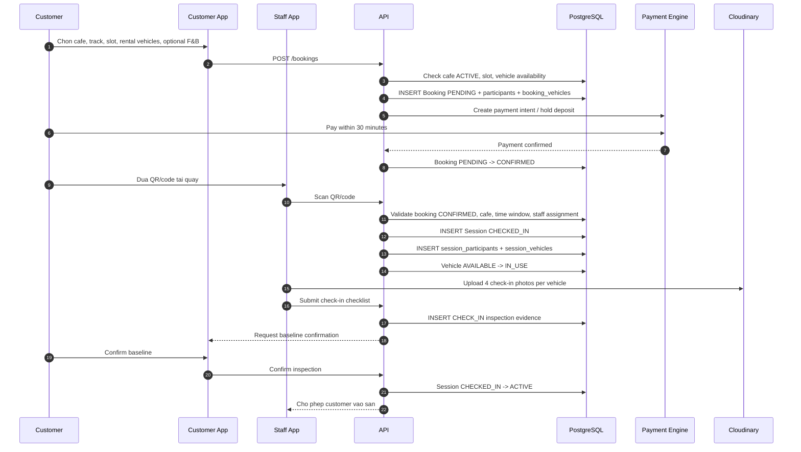
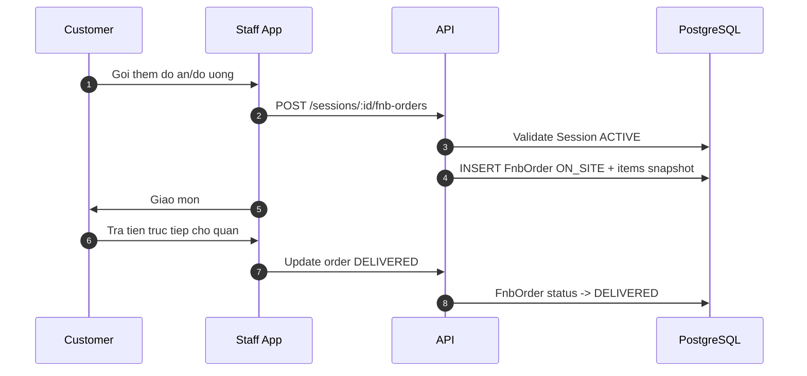
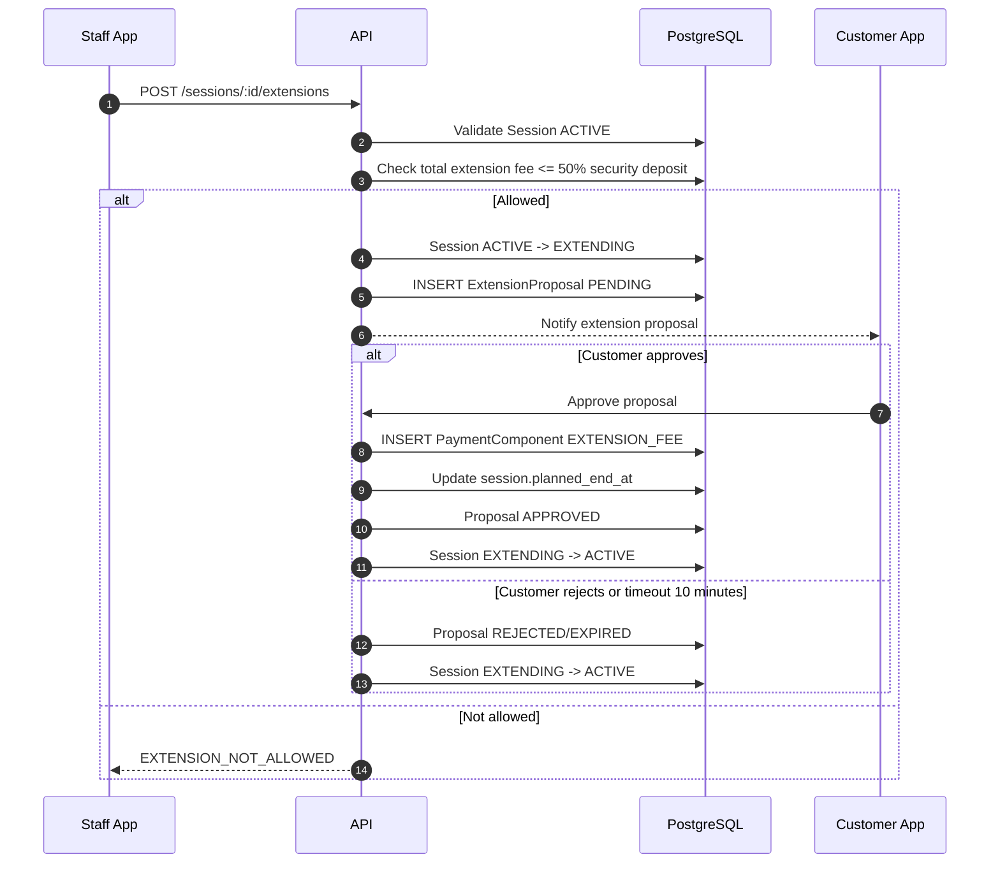
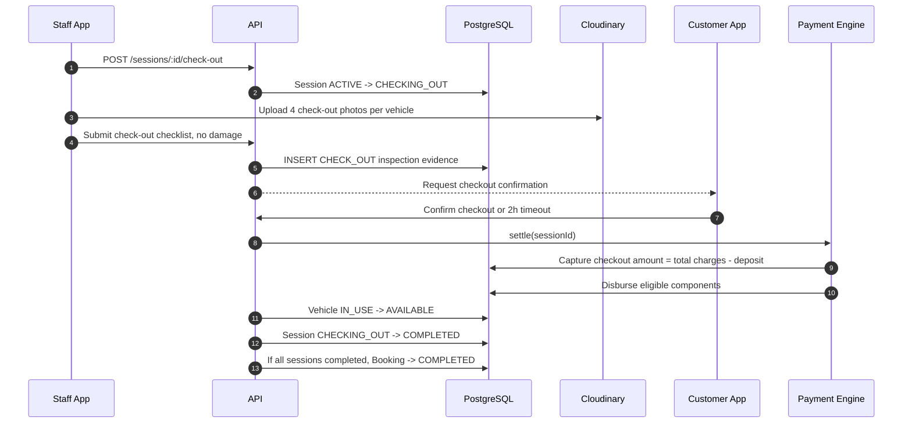
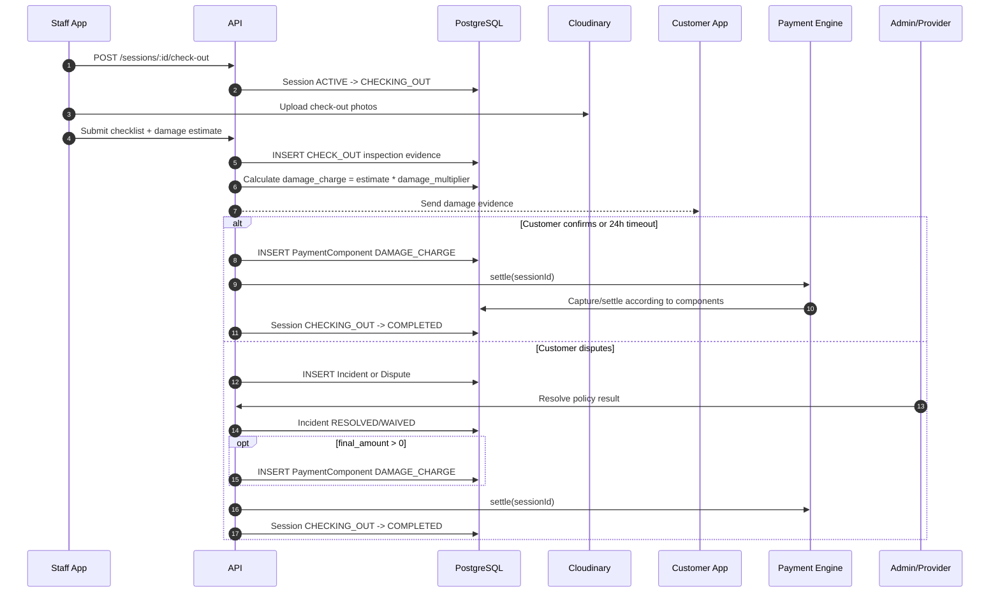
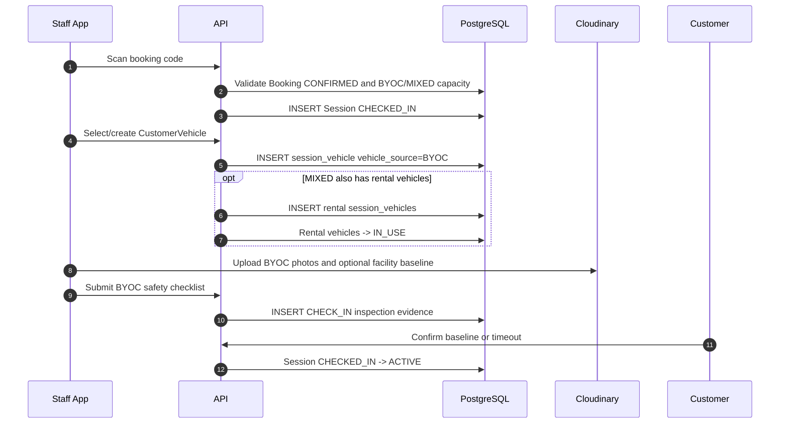

# Sequence Flow: Booking Operations

**Last updated**: 2026-06-04  
**Status**: Draft for business review  
**Related rules**: `docs/spec/business-rules/BR-booking-lifecycle.md`

Tai lieu nay tap trung vao luong van hanh tai quan sau khi booking da duoc tao:
quet ma check-in, vao san, order tai quan, gia han, check-out va settlement.

---

## 1. Happy path: Dat truoc + thue xe + check-in bang QR/code

---

## 2. Trong session: order F&B tai quan

Note: F&B on-site khong di qua platform payment gateway va khong tinh platform fee.

---

## 3. Trong session: gia han gio choi

---

## 4. Check-out: khong damage

---

## 5. Check-out: co damage hoac customer phan doi

---

## 6. BYOC/MIXED check-in difference

