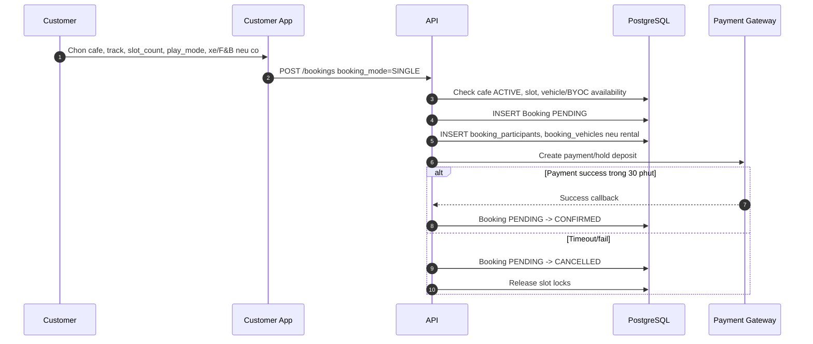
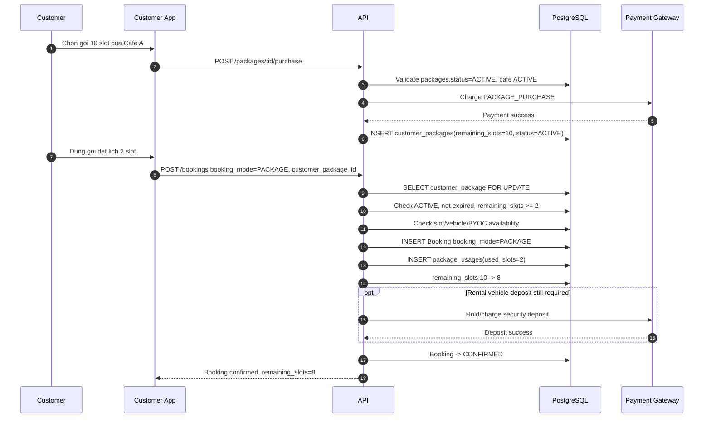
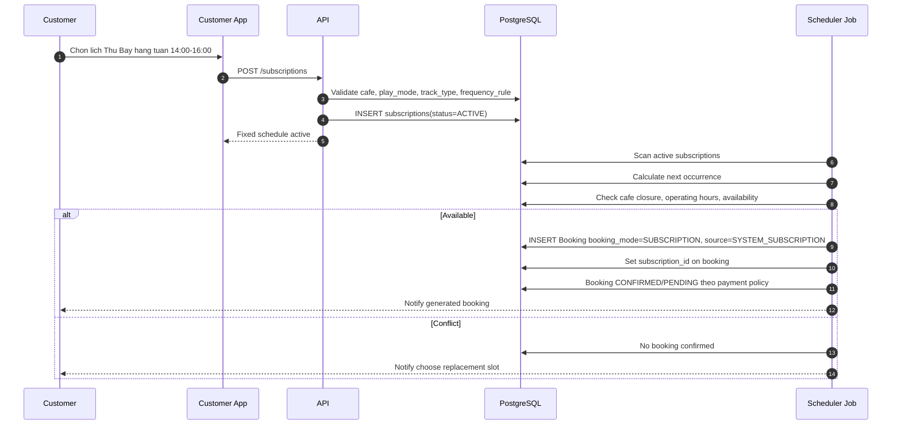
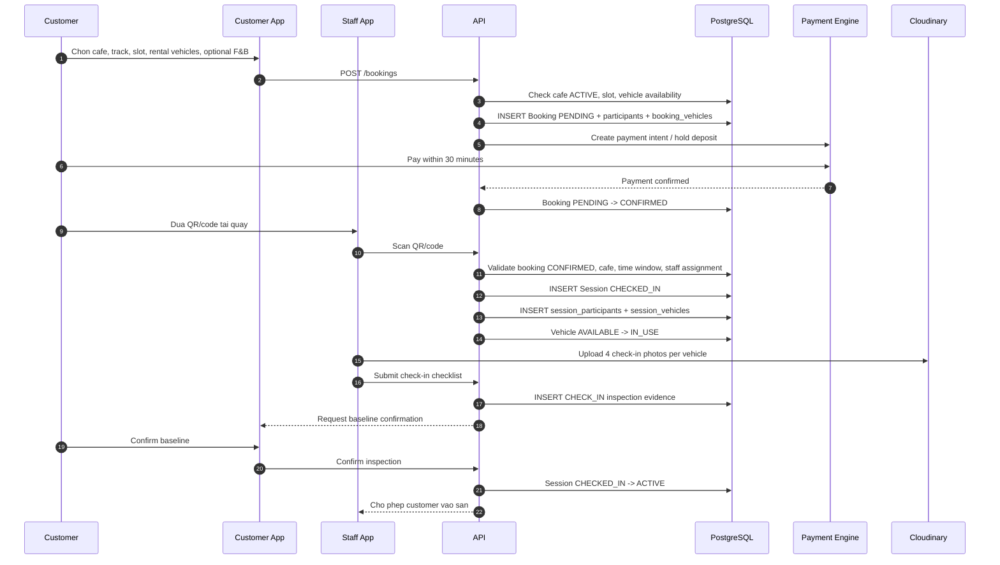
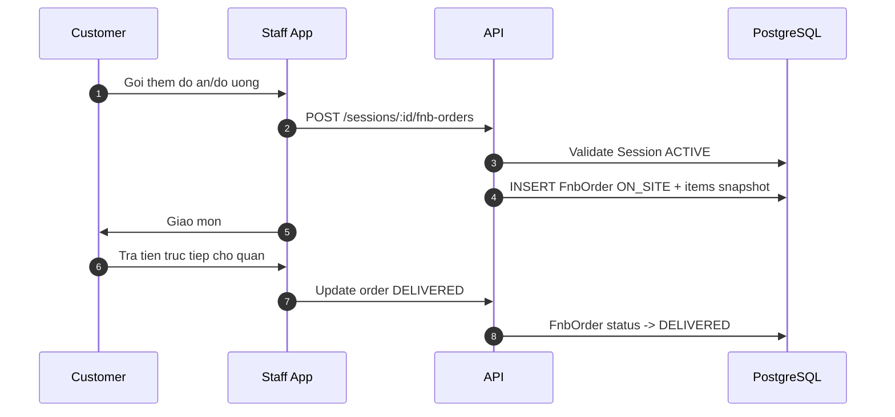
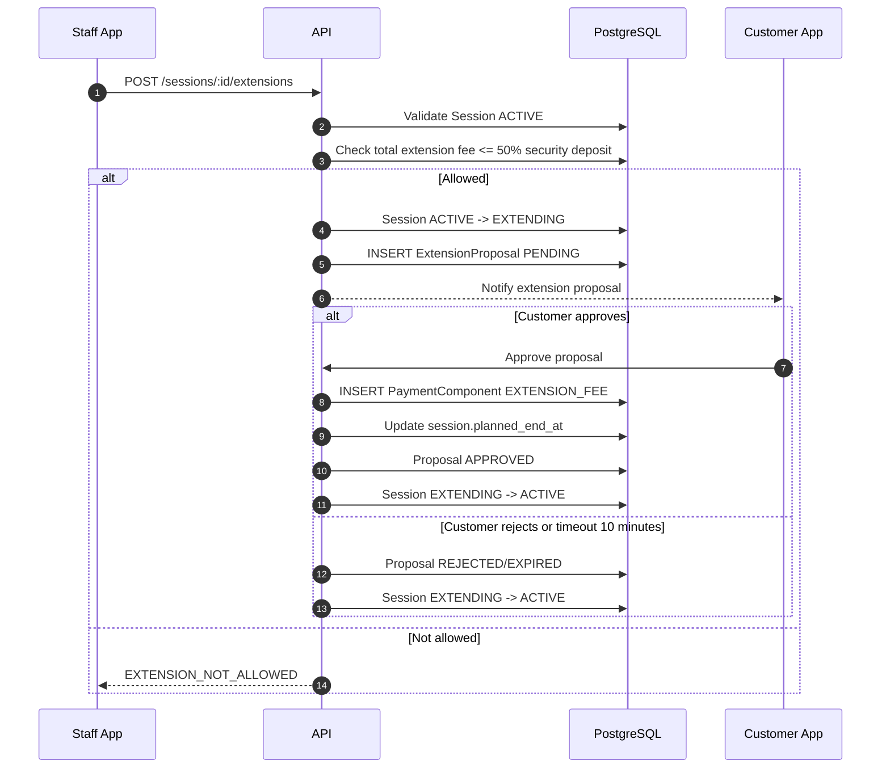
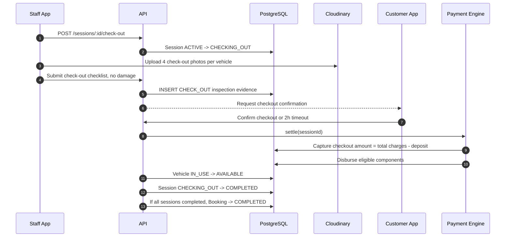
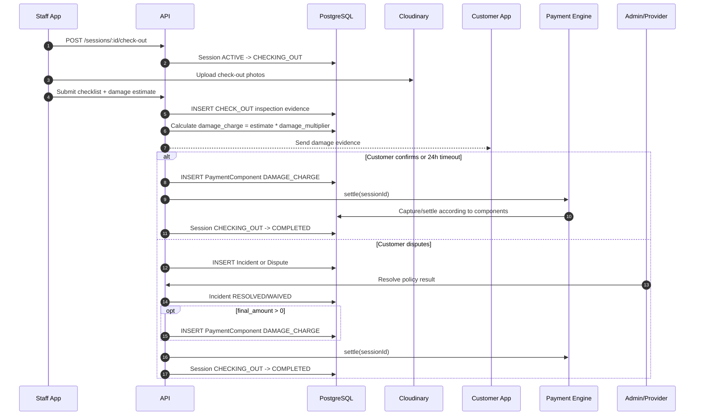
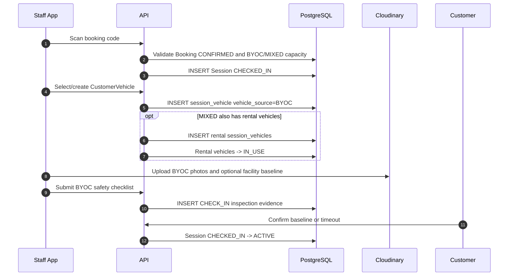

# Sequence Flow: Booking Operations

**Last updated**: 2026-06-04  
**Status**: Draft for business review  
**Related rules**: `docs/spec/business-rules/BR-booking-lifecycle.md`

Tai lieu nay tap trung vao luong van hanh tai quan sau khi booking da duoc tao:
quet ma check-in, vao san, order tai quan, gia han, check-out va settlement.

---

## 0. Booking modes truoc khi vao luong van hanh

RCField co 3 booking modes:

| Mode | Nghiep vu | Ket qua truoc check-in |
|---|---|---|
| `SINGLE` | Dat binh thuong tung lan | Booking duoc payment confirm |
| `PACKAGE` | Dung goi slot da mua, vi du 10 slot | Booking tru `customer_packages.remaining_slots` |
| `SUBSCRIPTION` | Lich co dinh, vi du Thu Bay hang tuan | Scheduler sinh booking tu `subscriptions` |

Sau khi booking da `CONFIRMED`, ca 3 mode deu di vao luong check-in/session
ben duoi.

---

## 0.1 SINGLE: Dat binh thuong tung lan



---

## 0.2 PACKAGE: Mua goi slot va dung den khi het slot



Example:

```text
Goi 10 slot
Lan 1 dat 2 slot: remaining 10 -> 8
Lan 2 dat 3 slot: remaining 8 -> 5
Lan 3 dat 5 slot: remaining 5 -> 0, package DEPLETED
```

---

## 0.3 SUBSCRIPTION: Lich co dinh sinh booking



---

## 1. Happy path: Dat truoc + thue xe + check-in bang QR/code



---

## 2. Trong session: order F&B tai quan



Note: F&B on-site khong di qua platform payment gateway va khong tinh platform fee.

---

## 3. Trong session: gia han gio choi



---

## 4. Check-out: khong damage



---

## 5. Check-out: co damage hoac customer phan doi



---

## 6. BYOC/MIXED check-in difference


