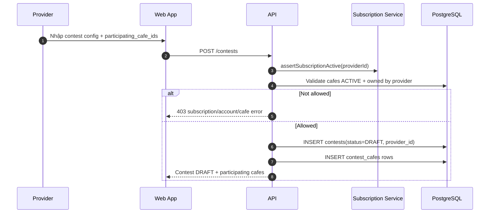
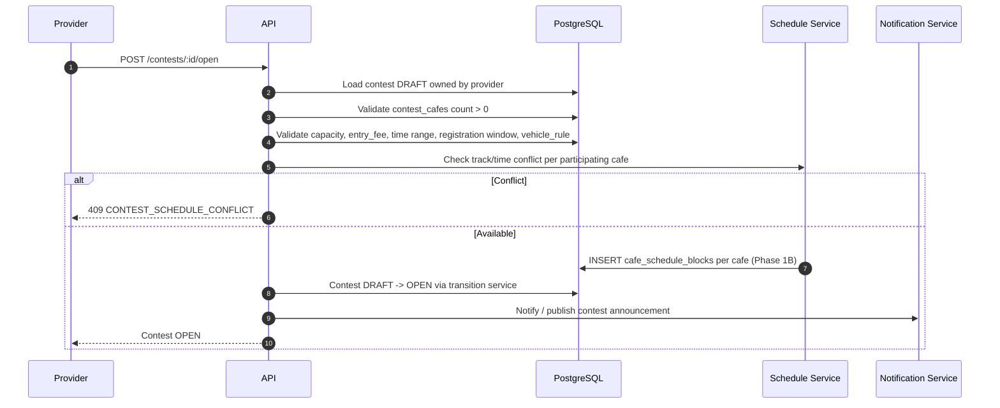
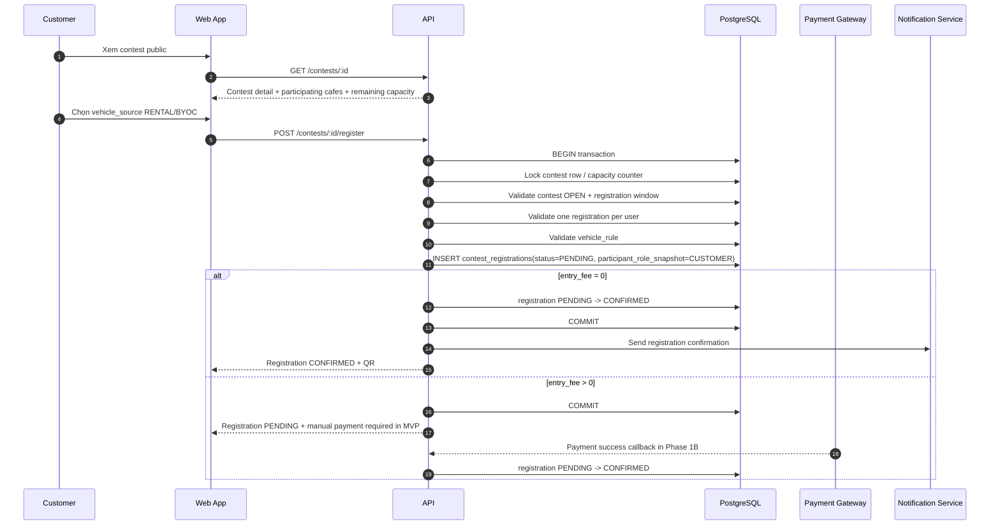
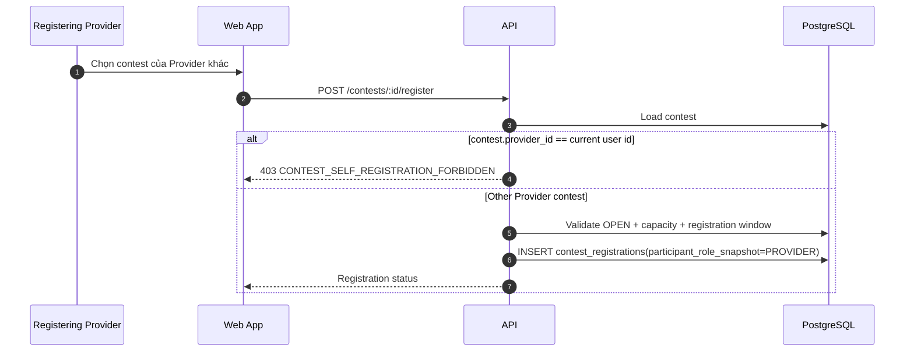
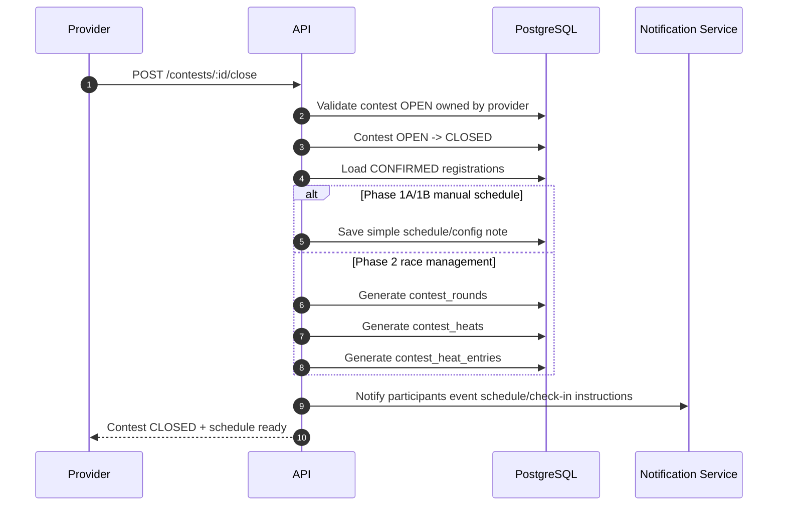
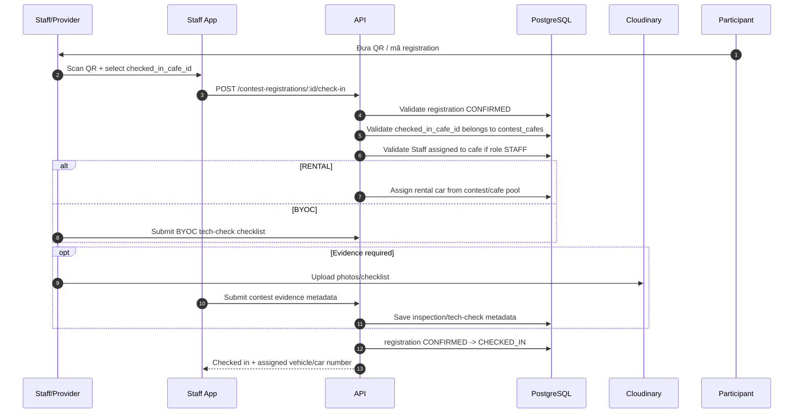
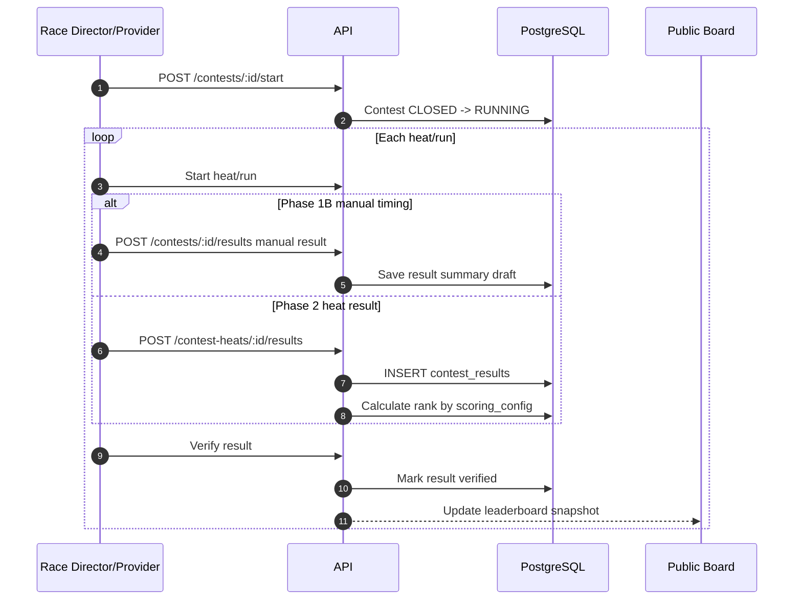
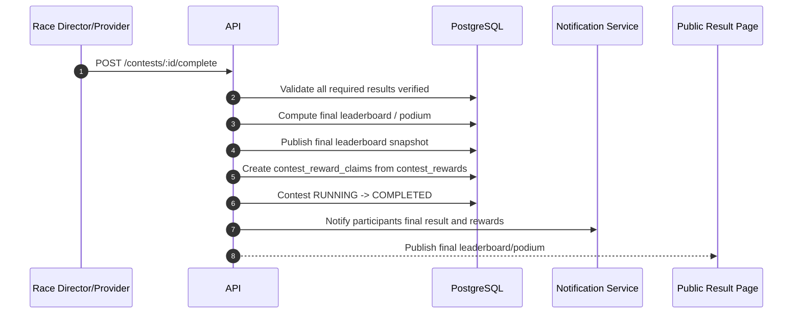
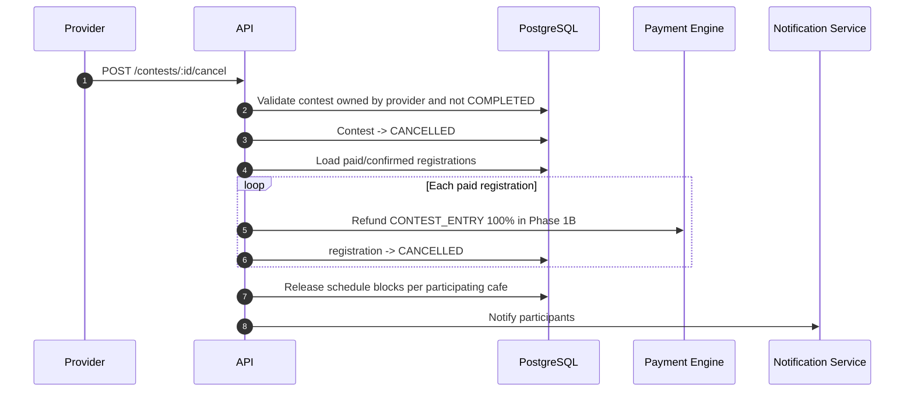
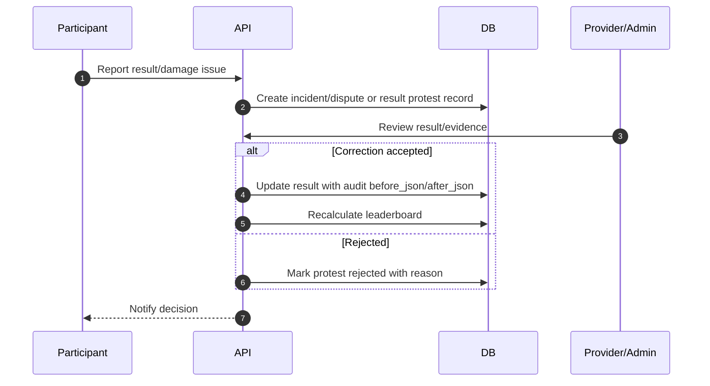

# Sequence Flow: Contest Lifecycle

**Last updated**: 2026-06-11  
**Status**: Draft for business review  
**Related rules**: `docs/spec/business-rules/BR-contest.md`  
**Architecture**: `docs/architecture/03-contest.md`

Tài liệu này mô tả luồng end-to-end của Contest theo mô hình mới: Provider tạo
contest ở cấp provider, chọn nhiều chi nhánh tham gia, customer đăng ký contest
chung, staff/provider check-in tại một chi nhánh trong `contest_cafes`, sau đó
vận hành race, nhập kết quả, publish leaderboard và hoàn tất hoặc hủy giải.

---

## 0. Identifiers

| Field | Value | Notes |
|---|---|---|
| Contest owner | `provider_id` | Provider tạo và sở hữu contest |
| Participating branches | `contest_cafes` | Một contest có nhiều cafe tham gia |
| Registration scope | Contest-level | MVP không bắt customer chọn chi nhánh khi đăng ký |
| Contest status | `DRAFT -> OPEN -> CLOSED -> RUNNING -> COMPLETED` | `CANCELLED` là terminal |
| Registration status | `PENDING -> CONFIRMED -> CHECKED_IN` | Phase 1A chưa có `WAITLIST`, `NO_SHOW`, `DISQUALIFIED` |
| Provider participant | Phase 1C | Provider được đăng ký contest của Provider khác |
| Payment component | `CONTEST_ENTRY` | Không tạo booking giả để thu entry fee |
| Schedule protection | `cafe_schedule_blocks` proposed | Phase 1B nếu contest chạy thật |
| Result mode | Manual in Phase 1B, calculated in Phase 2 | Phase 2 có round/heat/result tables |

---

## 1. Provider tạo Contest DRAFT

Rules:

- Chỉ Provider tạo contest.
- Staff không tạo contest; staff chỉ hỗ trợ vận hành/check-in theo chi nhánh được assign.
- `DRAFT` chưa hiển thị public.
- Config có thể chưa hoàn chỉnh ở `DRAFT`, nhưng phải có ít nhất một cafe tham gia trước khi `OPEN`.

---

## 2. Open registration

Notes:

- Public listing bắt đầu hiển thị khi `OPEN`.
- `/cafes/:cafeId/contests` chỉ trả contest có cafe đó trong `contest_cafes`.

---

## 3. Customer đăng ký contest chung

Important:

- Capacity check must be transactional.
- Customer không chọn chi nhánh trong MVP.
- `CONTEST_ENTRY` should link to `contest_registration_id` or a generic payment subject in Phase 1B.
- Do not create fake `bookings` for contest payment.

---

## 4. Provider participant registration — Phase 1C

---

## 5. Payment timeout / cancel registration

---

## 6. Close registration and prepare event

---

## 7. Event day check-in

Notes:

- For `RENTAL_SPEC_CUP`, assign at check-in to keep race fair.
- `checked_in_cafe_id` is the actual branch where the participant arrives.

---

## 8. Start contest and run heats/results

---

## 9. Complete contest and award prizes

---

## 10. Cancel contest and refund

---

## 11. Edge sequence: result protest / incident

Phase 1 can handle this manually through incident/dispute notes. Phase 2 should add
dedicated `contest_result_audits` and protest workflow.

---

## Reference

- `docs/architecture/03-contest.md` — module architecture
- `docs/architecture/diagrams/contest-lifecycle-flow.md` — lifecycle flowchart
- `docs/spec/business-rules/BR-contest.md` — full business rules and roadmap
- `docs/spec/03-payment-engine.md` — payment component lifecycle
- `docs/spec/06-database.md` — current contest schema
