# Sequence Flow: Contest Lifecycle

**Last updated**: 2026-06-08  
**Status**: Draft for business review  
**Related rules**: `docs/spec/business-rules/BR-contest.md`  
**Architecture**: `docs/architecture/03-contest.md`

Tài liệu này mô tả luồng end-to-end của Contest từ lúc Provider tạo giải, mở đăng
ký, customer đăng ký, staff check-in, vận hành race, nhập kết quả, publish
leaderboard và hoàn tất hoặc hủy giải.

---

## 0. Identifiers

| Field | Value | Notes |
|---|---|---|
| Contest status | `DRAFT -> OPEN -> CLOSED -> RUNNING -> COMPLETED` | `CANCELLED` là terminal |
| Registration status | `PENDING -> CONFIRMED -> CHECKED_IN` | Phase 1A chưa có `WAITLIST`, `NO_SHOW`, `DISQUALIFIED` |
| First MVP format | `RENTAL_SPEC_CUP` hoặc `TIME_ATTACK` | Tốt nhất cho demo và người mới |
| Payment component | `CONTEST_ENTRY` | Không tạo booking giả để thu entry fee |
| Schedule protection | `cafe_schedule_blocks` proposed | Phase 1B nếu contest chạy thật |
| Result mode | Manual in Phase 1B, calculated in Phase 2 | Phase 2 có round/heat/result tables |

---

## 1. Provider tạo Contest DRAFT

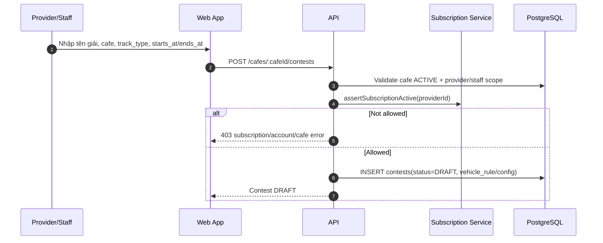

Rules:

- Staff chỉ tạo contest trong chi nhánh được assign.
- `DRAFT` chưa hiển thị public.
- Config có thể chưa hoàn chỉnh ở `DRAFT`.

---

## 2. Open registration

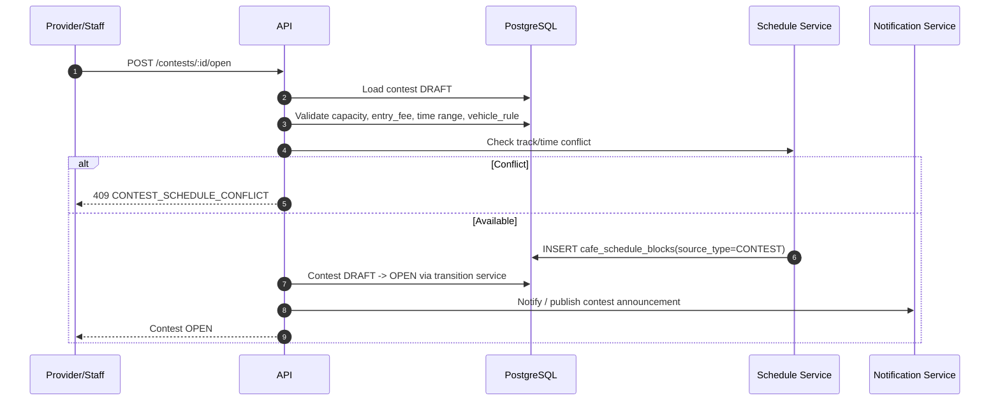

Notes:

- `cafe_schedule_blocks` là đề xuất Phase 1B. Nếu chưa có, ít nhất service phải
  check conflict với booking/cafe closure trước khi open.
- Khi `OPEN`, public listing bắt đầu hiển thị.

---

## 3. Customer đăng ký miễn phí hoặc có entry fee

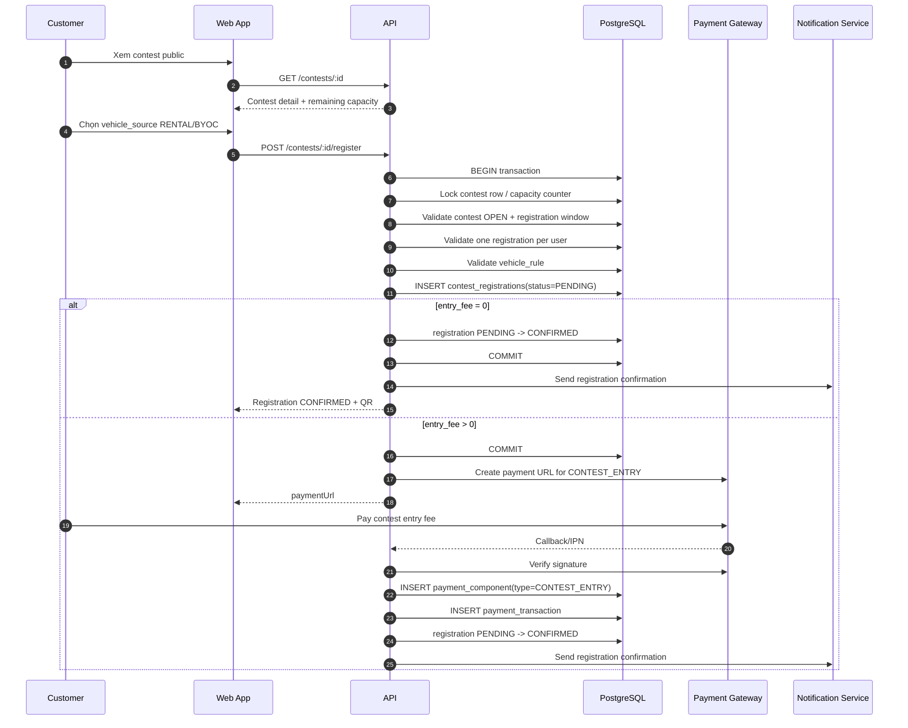

Important:

- Capacity check must be transactional.
- `CONTEST_ENTRY` should link to `contest_registration_id` or generic payment subject.
- Do not create fake `bookings` for contest payment.

---

## 4. Payment timeout / cancel registration

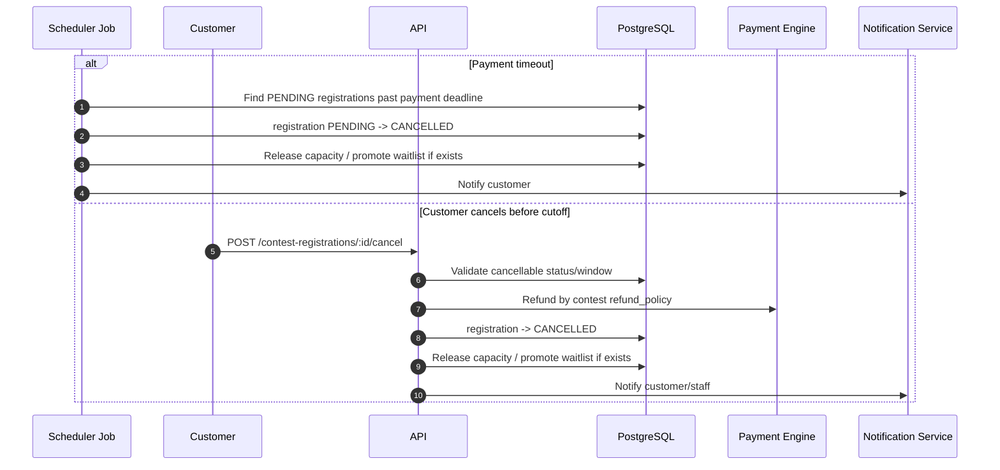

---

## 5. Close registration and prepare event

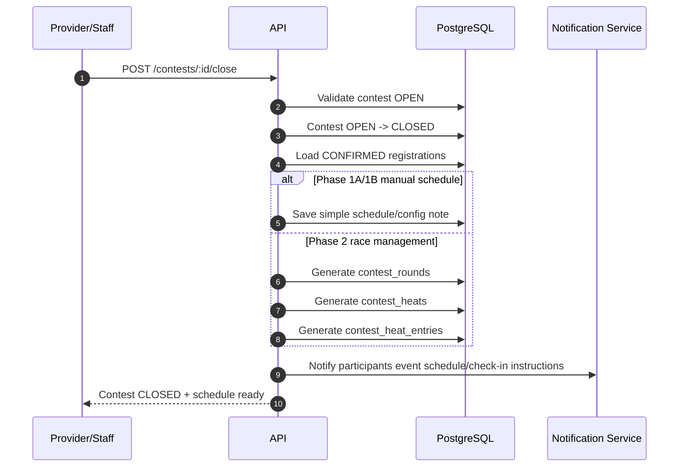

---

## 6. Event day check-in: Rental

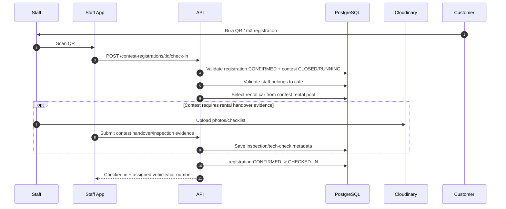

Notes:

- For `RENTAL_SPEC_CUP`, assign at check-in to keep race fair.
- If a rental car fails before event, staff can replace from rental pool with audit note.

---

## 7. Event day check-in: BYOC

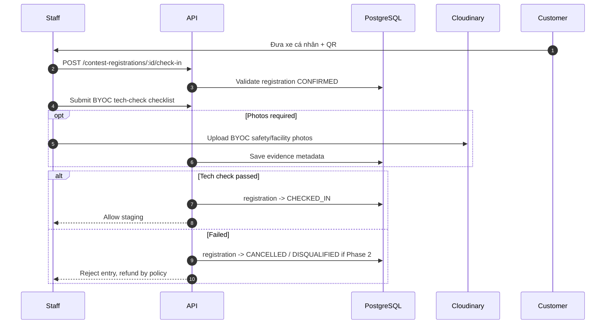

---

## 8. Start contest and run heats/results

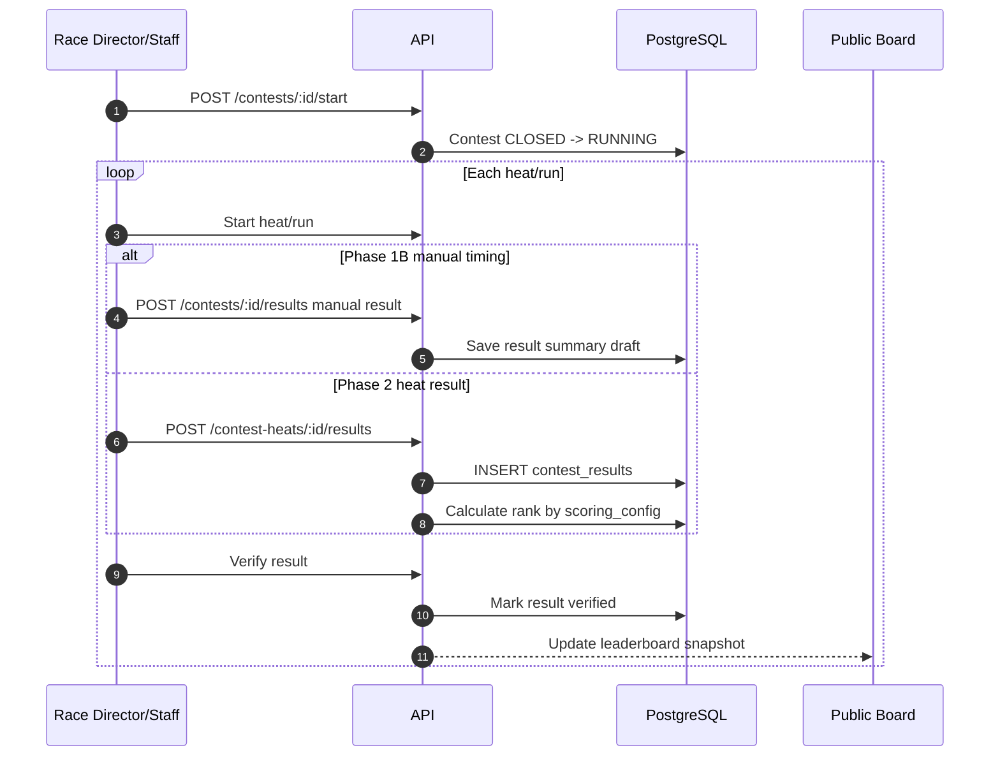

Scoring examples:

- Time attack: `best_lap_ms ASC`.
- Race final: `lap_count DESC`, then `elapsed_ms ASC`.
- Drift: `judge_score DESC`, then penalty.

---

## 9. Complete contest and award prizes

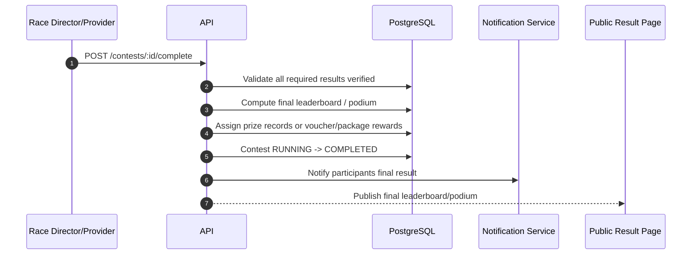

---

## 10. Cancel contest and refund

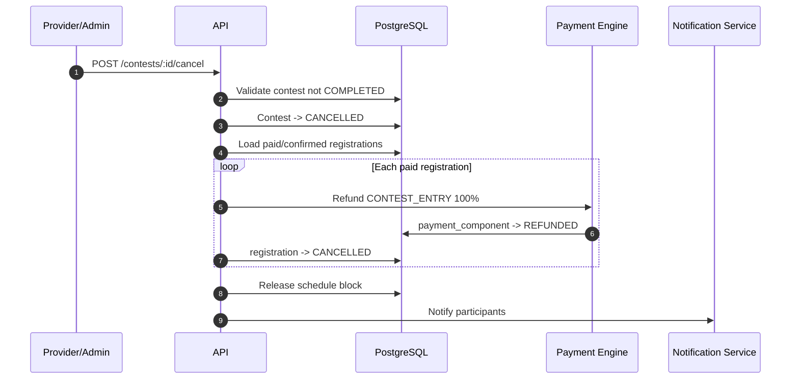

---

## 11. Edge sequence: result protest / incident

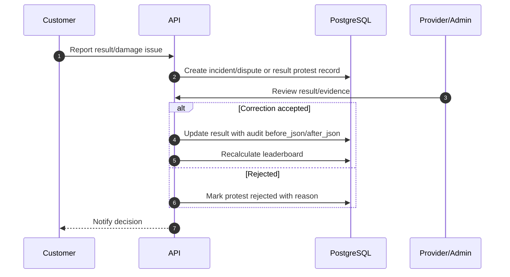

Phase 1 can handle this manually through incident/dispute notes. Phase 2 should add
dedicated `contest_result_audits` and protest workflow.

---

## Reference

- `docs/architecture/03-contest.md` — module architecture
- `docs/architecture/diagrams/contest-lifecycle-flow.md` — lifecycle flowchart
- `docs/spec/business-rules/BR-contest.md` — full business rules and roadmap
- `docs/spec/03-payment-engine.md` — payment component lifecycle
- `docs/spec/06-database.md` — current contest schema

