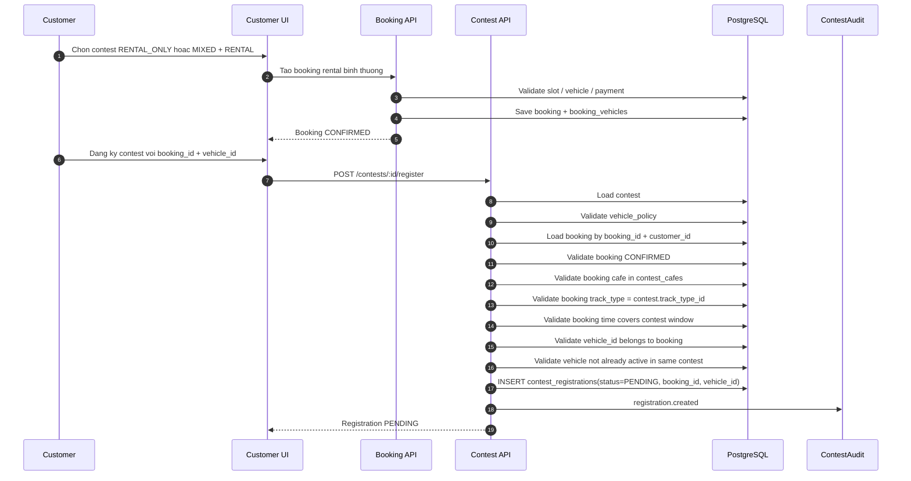
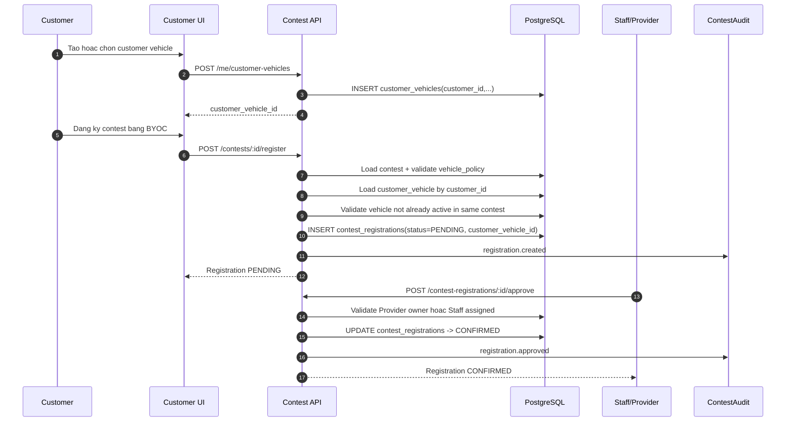
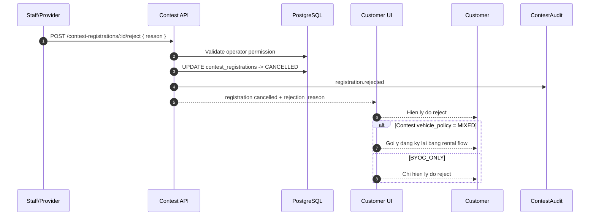
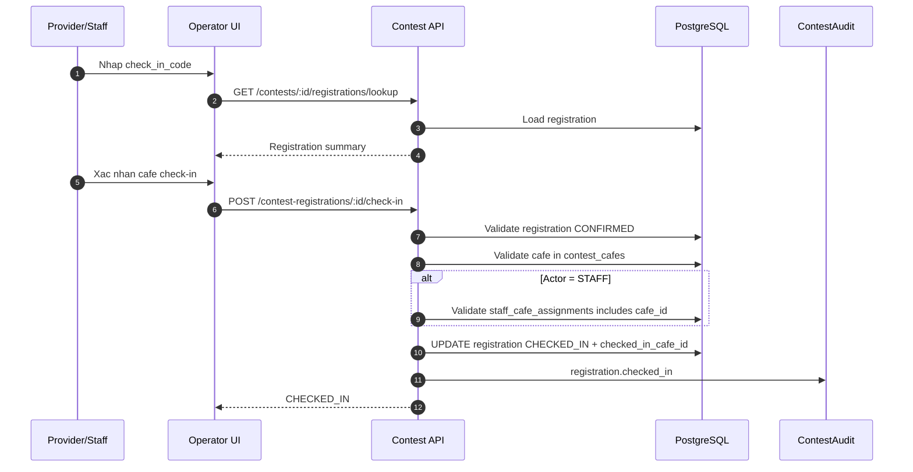
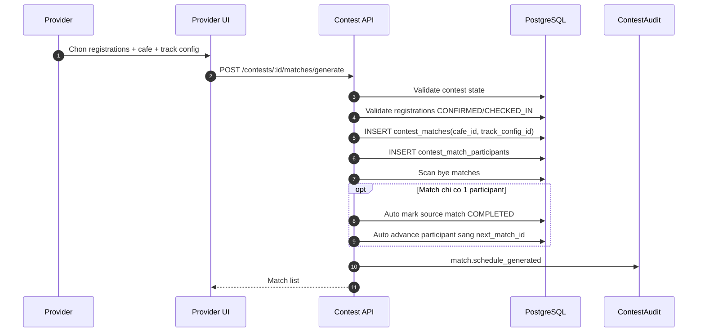
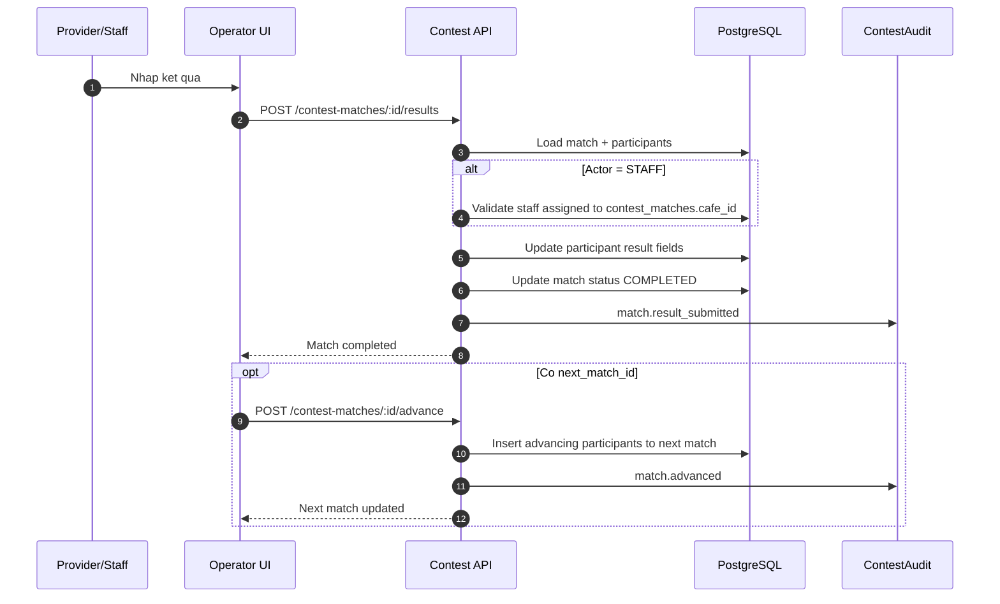
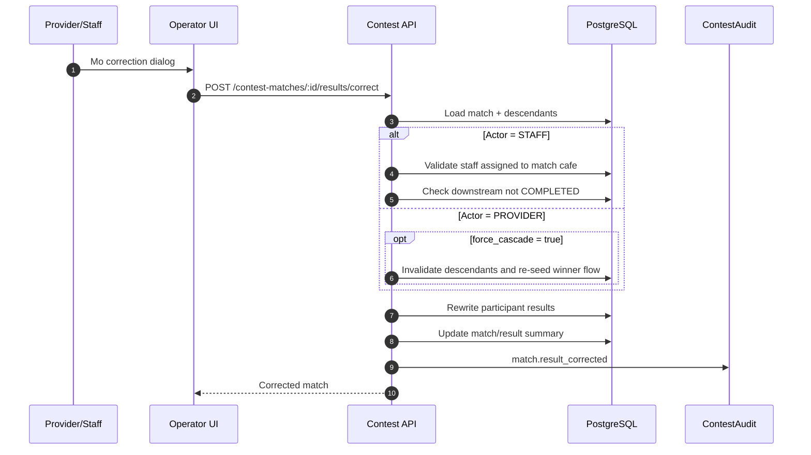
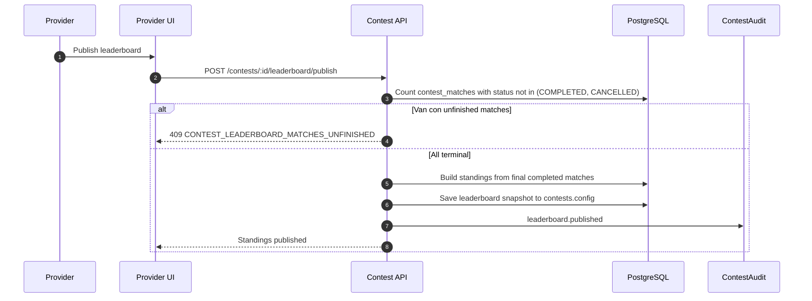

# Sequence Flow: Contest Vehicle Operations

**Last updated:** 2026-06-27  
**Status:** Active for current contest vehicle flow  
**Related docs:** `docs/spec/03-contest.md`, `docs/spec/business-rules/BR-contest.md`, `docs/spec/05-api-contracts.md`, `docs/spec/06-database.md`

Tai lieu nay bo sung sequence flow cho 2 luong chinh cua contest phase hien tai:

1. Rental contest link sang Booking/Session
2. BYOC contest registration review

No cung mo ta check-in, match operations, result correction va leaderboard guard.

---

## 1. Rental registration linked booking

---

## 2. BYOC registration review

---

## 3. BYOC rejected and redirected to rental

---

## 4. Contest check-in

---

## 5. Generate matches and bye round auto-advance

---

## 6. Submit result and advance

---

## 7. Result correction with cascade guard

---

## 8. Publish leaderboard guard

---

## 9. Operational Notes

- Rental contest khong duoc duplicate payment/inspection logic.
- BYOC approval la theo registration cua contest, khong la global car approval.
- Staff permission cho check-in va match ops phai localize theo cafe.
- Correction phai de lai audit trail day du.
- Metrics va audit logs la phan bat buoc de theo doi event day operations.
