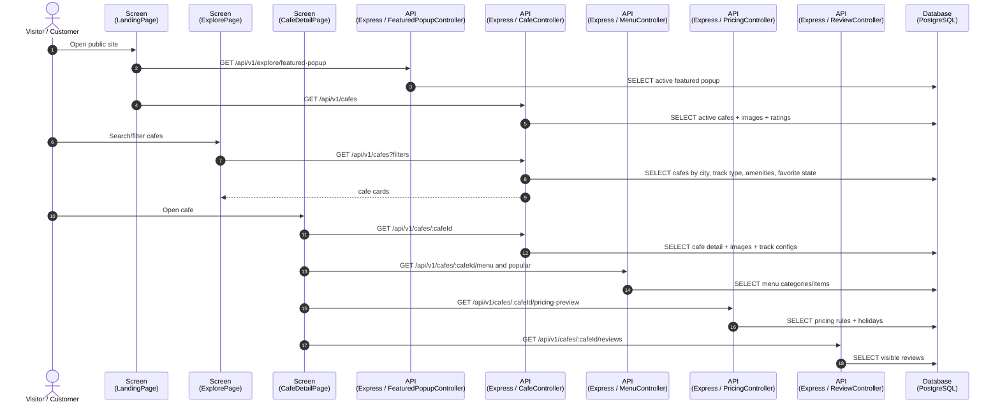
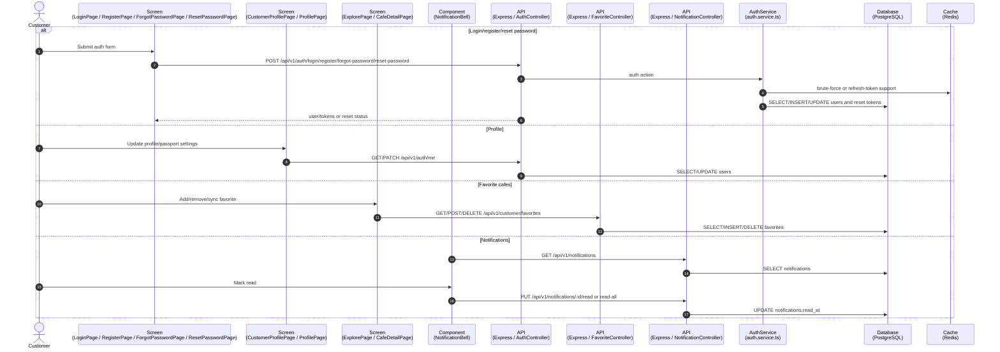
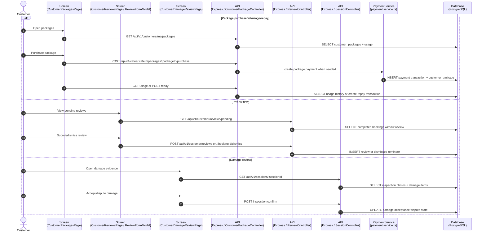
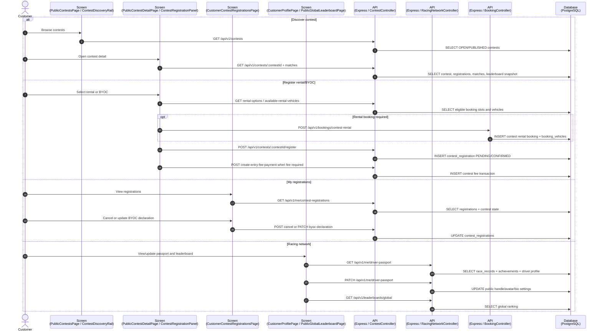
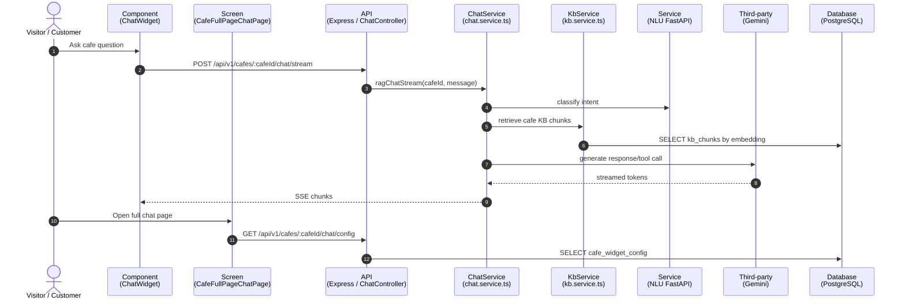

# Sequence Flow: Customer and Public Operations

**Last updated:** 2026-08-06

Coverage theo controller: `auth`, `cafe`, `featured-popup`, `favorite`, `review`, `customer-package`, `booking`, `session`, `vnpay`, `contest`, `racing-network`, `notification`, `chat`, `vehicle`.

---

## 1. Public Home, Explore, Cafe Detail and Featured Popup



---

## 2. Auth, Profile, Favorites and Notifications



---

## 3. Booking, Payment, QR and Active Session Response

```mermaid
sequenceDiagram
    autonumber
    actor C as Customer
    participant Create as Screen<br/>(CreateBookingPage)
    participant Detail as Screen<br/>(BookingDetailPage / CustomerBookingsPage)
    participant PayResult as Screen<br/>(PaymentResultPage)
    participant Session as Screen<br/>(CustomerActiveSessionPage / CustomerInspectionConfirmPage)
    participant BookingAPI as API<br/>(Express / BookingController)
    participant SessionAPI as API<br/>(Express / SessionController)
    participant VnpayAPI as API<br/>(Express / VnpayController)
    participant BookingSvc as BookingService<br/>(booking.service.ts)
    participant PaySvc as PaymentService<br/>(payment.service.ts)
    participant VNPay as Third-party<br/>(VNPay)
    participant DB as Database<br/>(PostgreSQL)

    C->>Create: Select cafe, track, slot, vehicles, F&B, promo, package
    Create->>BookingAPI: POST /api/v1/bookings
    BookingAPI->>BookingSvc: createBooking(payload)
    BookingSvc->>DB: Validate cafe/slot/vehicle/package/promotion
    BookingSvc->>DB: INSERT booking, participants, booking_vehicles, fnb_order
    BookingAPI-->>Create: booking PENDING

    C->>Create: Start checkout
    Create->>BookingAPI: POST /api/v1/bookings/:id/checkout
    BookingAPI->>PaySvc: create checkout transaction
    PaySvc->>DB: INSERT payment_transaction
    BookingAPI-->>Create: paymentUrl
    Create->>VNPay: Redirect customer
    VNPay->>VnpayAPI: GET /api/v1/payments/vnpay/ipn
    VnpayAPI->>PaySvc: confirm transaction
    PaySvc->>DB: UPDATE booking CONFIRMED + payment_transaction PAID
    VNPay-->>PayResult: GET /api/v1/payments/vnpay/return

    alt Booking detail/QR/cancel
        C->>Detail: View booking or QR
        Detail->>BookingAPI: GET /api/v1/bookings/:id and /:id/qr
        BookingAPI->>DB: SELECT booking detail + QR payload
        C->>Detail: Cancel booking
        Detail->>BookingAPI: POST /api/v1/bookings/:id/cancel
        BookingAPI->>BookingSvc: cancelBooking()
        BookingSvc->>DB: UPDATE booking CANCELLED + refund components when eligible
    else Active session response
        C->>Session: Confirm inspection or extension
        Session->>SessionAPI: POST /api/v1/sessions/:sessionId/inspection/confirm
        SessionAPI->>DB: UPDATE inspection/session state
        Session->>SessionAPI: POST /api/v1/sessions/:sessionId/extensions/respond
        SessionAPI->>DB: UPDATE extension_proposal and session planned_end_at
    end
```

---

## 4. Customer Packages, Reviews and Damage Review



---

## 5. Customer Contest, Rental/BYOC Registration and Racing Network



---

## 6. Chat Widget and Full Page Chat



---

## 7. Class Diagram: Customer and Public Operations

```mermaid
classDiagram
    class LandingPage
    class ExplorePage
    class CafeDetailPage
    class LoginPage
    class CustomerProfilePage
    class CreateBookingPage
    class BookingDetailPage
    class CustomerPackagesPage
    class CustomerReviewsPage
    class PublicContestDetailPage
    class CustomerContestRegistrationsPage
    class ChatWidget
    class CafeController
    class AuthController
    class BookingController
    class SessionController
    class CustomerPackageController
    class ReviewController
    class FavoriteController
    class ContestController
    class RacingNetworkController
    class ChatController
    class User
    class Cafe
    class Booking
    class Session
    class CustomerPackage
    class Review
    class Favorite
    class ContestRegistration
    class RaceRecord

    LandingPage --> CafeController
    ExplorePage --> CafeController
    CafeDetailPage --> CafeController
    LoginPage --> AuthController
    CustomerProfilePage --> AuthController
    CreateBookingPage --> BookingController
    BookingDetailPage --> BookingController
    CustomerPackagesPage --> CustomerPackageController
    CustomerReviewsPage --> ReviewController
    PublicContestDetailPage --> ContestController
    CustomerContestRegistrationsPage --> ContestController
    ChatWidget --> ChatController
    User "1" --> "*" Booking
    User "1" --> "*" CustomerPackage
    User "1" --> "*" Review
    User "1" --> "*" Favorite
    User "1" --> "*" ContestRegistration
    User "1" --> "*" RaceRecord
    Cafe "1" --> "*" Booking
    Booking "1" --> "*" Session
```


