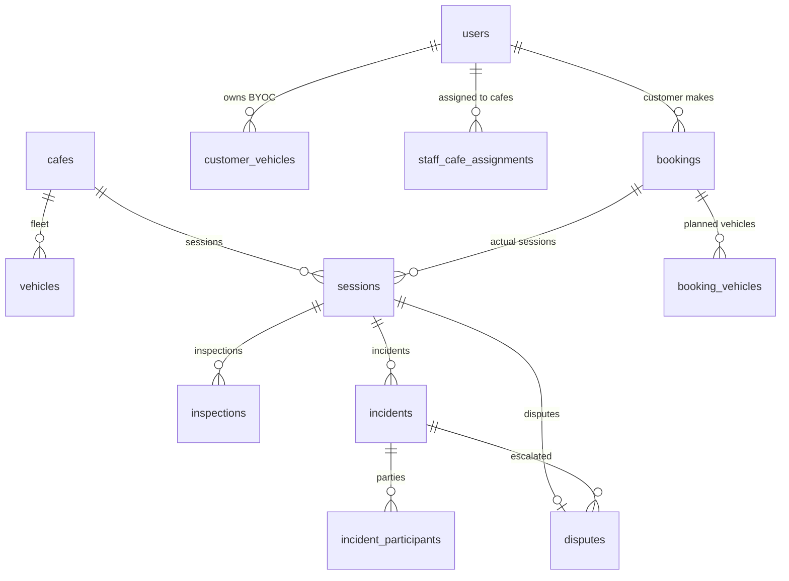

# 01 — Domain Model

**Last updated**: 2026-05-15
**Status**: Active

> ⚠️ Đây là file nguồn định nghĩa entity và enum. Khi thay đổi domain model phải update file này cùng PR.
> Xem `06-database.md` để biết chi tiết schema và indexing.

---

## 1. Tổng quan entities



> **Thay đổi chính:**
> - `bookings` giờ chỉ lưu đơn đặt lịch (dự kiến), không còn chứa inspection/dispute
> - `sessions` mới — phiên chơi thực tế, chứa inspection, extension, incident, dispute
> - `customer_vehicles` mới — BYOC registry
> - `booking_vehicles` mới — multi-vehicle booking
> - `session_vehicles` + `session_participants` mới — thực tế trong phiên chơi
> - `incidents` mới — sự cố, cầu nối giữa session và dispute
> - `inspections` thay thế `inspection_records`, tách photos/checklist riêng

---

## 2. Core Entities

### 2.1 User (base)

```
User
├── id: UUID
├── email: string (unique)
├── phone: string?
├── full_name: string
├── password_hash: string?           ← NULL nếu đăng nhập Google
├── auth_provider: AuthProvider      ← LOCAL | GOOGLE
├── role: UserRole                   ← CUSTOMER | PROVIDER | STAFF | ADMIN
├── trust_score: number              ← chỉ CUSTOMER (0–100, default 100)
├── is_active: boolean
├── created_at / updated_at / deleted_at
```

#### Relationships
```
  User (CUSTOMER) ──< Booking        (đặt lịch)
  User (CUSTOMER) ──< CustomerVehicle (BYOC)
  User (STAFF)    ──< StaffCafeAssignment
  User (PROVIDER) ──< Café           (sở hữu)
  User            ──< RefreshToken
  User            ──< NotificationLog
  User            ──< TrustScoreLog
```

---

### 2.2 Cafe

```
Cafe
├── id: UUID
├── provider_id: UUID → User
├── name: string                    ← "RCField Quận 7"
├── slug: string (unique)           ← "rcfield-quan-7"
├── description: string?
├── phone: string?
├── status: CafeStatus              ← PENDING | ACTIVE | SUSPENDED
├── cover_image_url: string?
├── address: string
├── district: string
├── city: string
├── latitude / longitude: number?
├── operating_hours: JSON           ← { mon: {open, close, is_closed}, ... }
├── track_types: TrackType[]        ← DRIFT | CIRCUIT | OFFROAD
├── slot_duration_minutes: number   ← default 60
├── slot_fee_rate: decimal          ← giá hiện tại; booking dùng snapshot
├── max_concurrent_bookings: number ← default 10
├── min_booking_notice_minutes: number
├── byoc_capacity: number           ← default 5
├── created_at / updated_at
```

#### Relationships
```
  Cafe ──< Vehicle              (fleet)
  Cafe ──< Session              (phiên chơi)
  Cafe ──< MenuItem
  Cafe ──< StaffCafeAssignment
  Cafe ──< CafeImage
  Cafe ──< CafeClosure
  Cafe ──< CafeAnnouncement
  Cafe ──< Package              (Phase 2)
  Cafe ──< Subscription         (Phase 2)
  Cafe ──< Contest              (Phase 2)
  Cafe ──< Promotion
```

---

### 2.3 Vehicle (fleet — rental)

```
Vehicle
├── id: UUID
├── cafe_id: UUID → Cafe
├── name: string                   ← "Traxxas Slash 4x4"
├── description: string?
├── tier: VehicleTier              ← STANDARD | PREMIUM | RESTRICTED
├── status: VehicleStatus          ← AVAILABLE | IN_USE | MAINTENANCE | RETIRED
├── hourly_rate: decimal
├── security_deposit: decimal
├── damage_multiplier: decimal     ← 1.0 / 1.5 / 2.0
├── compatible_track_types: text[] ← rỗng = all tracks của cafe
├── cover_image_url: string?
├── last_maintenance_at: timestamp?
├── created_at / updated_at / deleted_at
```

**Tier rules:**
| Tier | Deposit | Multiplier | Eligibility |
|------|---------|-----------|-------------|
| STANDARD | Thấp | 1.0x | Tất cả |
| PREMIUM | TB | 1.5x | Đủ điều kiện |
| RESTRICTED | Cao | 2.0x | Hạn chế |

#### Relationships
```
  Vehicle ──< BookingVehicle     (dự kiến trong booking)
  Vehicle ──< SessionVehicle     (thực tế trong session)
  Vehicle ──< VehicleImage
  Vehicle ──< VehicleMaintenanceLog
```

---

### 2.4 CustomerVehicle (BYOC)

> **NEW** — Xe cá nhân của khách.

```
CustomerVehicle
├── id: UUID
├── customer_id: UUID → User
├── brand: string?
├── model: string?
├── serial_number: string?
├── description: string?
├── notes: string?               ← ghi chú an toàn
├── is_active: boolean
├── created_at / updated_at / deleted_at
```

#### Relationships
```
  CustomerVehicle ──< SessionVehicle     (được dùng trong session)
```

---

### 2.5 Booking

> **THAY ĐỔI** — Booking là đơn đặt lịch dự kiến.
> Không chứa dữ liệu vận hành thực tế (chuyển sang `Session`).

```
Booking
├── id: UUID
├── customer_id: UUID → User     ← người đặt chính
├── cafe_id: UUID → Cafe
├── subscription_id: UUID? → Subscription  (Phase 2)
├── booking_mode: BookingMode    ← SINGLE | PACKAGE | SUBSCRIPTION
├── play_mode: PlayMode          ← RENTAL | BYOC | MIXED
├── source: BookingSource        ← APP | STAFF_MANUAL | SYSTEM_SUBSCRIPTION
├── track_type: TrackType        ← DRIFT | CIRCUIT | OFFROAD
├── status: BookingStatus        ← PENDING | CONFIRMED | CANCELLED | NO_SHOW | COMPLETED
├── slot_start: timestamp        ← dự kiến
├── slot_end: timestamp          ← dự kiến
├── slot_count: number
├── payment_expires_at: timestamp
├── snapshot: JSON               ← BookingSnapshot (bất biến)
├── promotion_id: UUID? → Promotion
├── discount_amount: decimal?
├── notes: string?
├── cancelled_by / cancelled_at / cancellation_reason
├── created_at / updated_at
```

#### BookingSnapshot (JSON, bất biến sau khi tạo)
```json
{
  "slot_fee_rate": 150000,
  "slot_count": 2,
  "platform_fee_pct": 0.15,
  "refund_rule": "R1",
  "track_type": "DRIFT",
  "cafe_name": "RCField Q7",
  "cafe_slug": "rcfield-quan-7",
  "vehicles": [
    {
      "source": "RENTAL",
      "vehicle_id": "uuid",
      "vehicle_name": "Traxxas Slash 4x4",
      "vehicle_tier": "PREMIUM",
      "rental_fee": 50000,
      "security_deposit": 500000,
      "damage_multiplier": 1.5
    }
  ],
  "calculated": {
    "subtotal": 350000,
    "discount_amount": 70000,
    "total_charge": 280000,
    "total_deposit": 500000
  }
}
```

> ⚠️ Mọi tính toán tiền phải dùng snapshot, KHÔNG dùng giá hiện tại.

#### Relationships
```
  Booking ──< BookingParticipant       (người chơi dự kiến)
  Booking ──< BookingVehicle           (xe dự kiến)
  Booking ──< Session                  (phiên thực tế — 1 booking có 0..N session)
  Booking ──< PaymentComponent         (ledger)
  Booking ──< PaymentTransaction
  Booking ──< FnbOrder
  Booking ──< Review
  Booking ──| PromotionUsage
```

---

### 2.6 BookingParticipant

> **NEW** — Người chơi dự kiến khi đặt lịch.

```
BookingParticipant
├── id: UUID
├── booking_id: UUID → Booking
├── user_id: UUID? → User           ← NULL nếu walk-in guest
├── participant_type: ParticipantType ← BOOKER | REGISTERED_USER | WALK_IN_GUEST
├── display_name: string?           ← guest name
├── phone: string?                  ← guest phone
├── is_primary_responsible: boolean  ← chịu trách nhiệm tài chính
├── created_at / updated_at
```

---

### 2.7 BookingVehicle

> **NEW** — Xe thuê dự kiến (nhiều-nhiều giữa booking và vehicle).

```
BookingVehicle
├── id: UUID
├── booking_id: UUID → Booking
├── vehicle_id: UUID → Vehicle
├── assigned_to_participant_id: UUID? → BookingParticipant
├── hourly_rate_snapshot: decimal
├── security_deposit_snapshot: decimal
├── damage_multiplier_snapshot: decimal
├── created_at
```

---

### 2.8 Session

> **NEW** — Phiên chơi thực tế. Là nơi chứa mọi dữ liệu vận hành.

```
Session
├── id: UUID
├── booking_id: UUID → Booking
├── cafe_id: UUID → Cafe             ← denormalized
├── status: SessionStatus            ← CHECKED_IN | ACTIVE | EXTENDING | CHECKING_OUT | DISPUTED | COMPLETED | CANCELLED
├── checked_in_by: UUID → User       ← Staff
├── checked_out_by: UUID? → User     ← Staff
├── actual_start_at: timestamp       ← check-in thực tế
├── actual_end_at: timestamp?        ← check-out thực tế
├── planned_end_at: timestamp        ← có thể cập nhật khi gia hạn
├── actual_total_amount: decimal     ← tổng tiền thực tế
├── notes: string?
├── created_at / updated_at
```

#### Relationships
```
  Session ──< SessionParticipant     (người thực tế)
  Session ──< SessionVehicle         (xe thực tế)
  Session ──< Inspection
  Session ──< ExtensionProposal
  Session ──< Incident
  Session ──| Dispute
```

---

### 2.9 SessionParticipant

> **NEW** — Người thực tế có mặt trong phiên chơi.

```
SessionParticipant
├── id: UUID
├── session_id: UUID → Session
├── booking_participant_id: UUID? → BookingParticipant
├── user_id: UUID? → User
├── display_name: string?
├── phone: string?
├── role: ParticipantRole            ← DRIVER | PLAYER | SPECTATOR | GUARDIAN
├── is_primary_responsible: boolean
├── checked_in_at: timestamp
├── created_at / updated_at
```

---

### 2.10 SessionVehicle

> **NEW** — Xe thực tế sử dụng trong session (RENTAL + BYOC).

```
SessionVehicle
├── id: UUID
├── session_id: UUID → Session
├── booking_vehicle_id: UUID? → BookingVehicle
├── vehicle_source: VehicleSource    ← RENTAL | BYOC
├── vehicle_id: UUID? → Vehicle      ← RENTAL
├── customer_vehicle_id: UUID? → CustomerVehicle  ← BYOC
├── assigned_to_participant_id: UUID? → SessionParticipant
├── status: SessionVehicleStatus     ← ASSIGNED | IN_USE | RETURNED | DAMAGED
├── started_at / returned_at: timestamp?
├── notes: string?
├── created_at / updated_at
```

---

### 2.11 PaymentComponent

```
PaymentComponent
├── id: UUID
├── booking_id: UUID → Booking
├── session_id: UUID? → Session      ← phát sinh trong session
├── type: PaymentComponentType       ← SLOT_FEE | RENTAL_FEE | SECURITY_DEPOSIT | EXTENSION_FEE | DAMAGE_CHARGE | FNB_PREORDER | FNB_ON_SITE | PACKAGE_PURCHASE
├── amount: decimal                  ← immutable
├── status: PaymentComponentStatus   ← PENDING | HELD | DISBURSED | REFUNDED | PARTIALLY_REFUNDED
├── disbursed_to: UUID? → User
├── disbursed_at / refunded_at: timestamp?
├── refunded_amount: decimal?
├── note: string?
├── created_at / updated_at
```

---

### 2.12 Inspection

> **THAY ĐỔI** — Inspection thay thế InspectionRecord, gắn với session và session_vehicle.

```
Inspection
├── id: UUID
├── session_id: UUID → Session
├── session_vehicle_id: UUID? → SessionVehicle  ← NULL nếu inspection cấp session
├── type: InspectionType              ← CHECK_IN | CHECK_OUT | STAFF_HANDOVER
├── subject_type: InspectionSubjectType ← RENTAL_VEHICLE | BYOC_VEHICLE | ACCESSORY
├── performed_by: UUID → User (Staff)
├── pre_existing_flag: boolean
├── damage_noted: boolean
├── damage_description: string?
├── damage_cost_estimate: decimal?
├── ai_analysis_json: JSON?           ← kết quả AI (Phase 2)
├── customer_confirmed: boolean
├── customer_confirmed_at: timestamp?
├── created_at / updated_at
```

#### Relationships
```
  Inspection ──< InspectionPhoto
  Inspection ──< InspectionChecklist
```

---

### 2.13 Incident

> **NEW** — Sự cố trong phiên chơi, cầu nối giữa session và dispute.

```
Incident
├── id: UUID
├── session_id: UUID → Session
├── reported_by: UUID → User
├── type: IncidentType               ← RENTAL_DAMAGE | BYOC_DAMAGE | COLLISION | LOST_ACCESSORY | STAFF_HANDLING | FACILITY | OTHER
├── status: IncidentStatus           ← RECORDED | UNDER_REVIEW | RESOLVED | ESCALATED
├── occurred_at: timestamp
├── description: string
├── estimated_amount: decimal?
├── created_at / updated_at
```

#### Relationships
```
  Incident ──< IncidentParticipant   (các bên liên quan + % trách nhiệm)
  Incident ──< Dispute               (nếu escalate)
```

---

### 2.14 Dispute

> **THAY ĐỔI** — Dispute giờ gắn với session (không phải booking), hỗ trợ incident.

```
Dispute
├── id: UUID
├── session_id: UUID → Session
├── incident_id: UUID? → Incident
├── opened_by: UUID → User
├── dispute_type: DisputeType        ← RENTAL_DAMAGE | BYOC_DAMAGE | COLLISION | STAFF_HANDLING | FACILITY | PAYMENT | OTHER
├── status: DisputeStatus            ← OPEN | UNDER_REVIEW | WAITING_EVIDENCE | RESOLVED | REJECTED
├── reason: string
├── responsible_party: ResponsibleParty?
├── claimed_amount / final_amount: decimal?
├── resolution: string?
├── resolved_by: UUID? → User (Admin)
├── resolved_at: timestamp?
├── created_at / updated_at
```

#### Relationships
```
  Dispute ──< DisputeEvidence
  Dispute ──< DisputeParty
```

---

### 2.15 ExtensionProposal

> **THAY ĐỔI** — Gắn với session thay vì booking.

```
ExtensionProposal
├── id: UUID
├── session_id: UUID → Session
├── proposed_by: UUID → User (Staff)
├── duration_minutes: number
├── fee_amount: decimal
├── status: ExtensionProposalStatus  ← PENDING | APPROVED | REJECTED | EXPIRED
├── responded_by: UUID? → User
├── responded_at: timestamp?
├── created_at / updated_at
```

---

### 2.16 FnbOrder

> **THAY ĐỔI** — Một booking có nhiều FNB order, phân biệt qua order_type.

```
FnbOrder
├── id: UUID
├── booking_id: UUID → Booking
├── session_id: UUID? → Session      ← NULL nếu pre-order
├── order_type: FnbOrderType         ← PRE_ORDER | ON_SITE
├── status: FnbOrderStatus           ← PENDING | CONFIRMED | PREPARING | DELIVERED | CANCELLED
├── total_amount: decimal
├── created_by: UUID → User
├── confirmed_by: UUID? → User
├── confirmed_at: timestamp?
├── notes: string?
├── created_at / updated_at
```

#### Relationships
```
  FnbOrder ──< FnbOrderItem
```

---

## 3. Enums

```typescript
// === Users & Auth ===
enum UserRole       { CUSTOMER, PROVIDER, STAFF, ADMIN }
enum AuthProvider   { LOCAL, GOOGLE }

// === Cafe ===
enum CafeStatus     { PENDING, ACTIVE, SUSPENDED }
enum TrackType      { DRIFT, CIRCUIT, OFFROAD }

// === Vehicle ===
enum VehicleTier    { STANDARD, PREMIUM, RESTRICTED }
enum VehicleStatus  { AVAILABLE, IN_USE, MAINTENANCE, RETIRED }
enum VehicleSource  { RENTAL, BYOC }
enum SessionVehicleStatus { ASSIGNED, IN_USE, RETURNED, DAMAGED }

// === Booking ===
enum BookingMode    { SINGLE, PACKAGE, SUBSCRIPTION }
enum PlayMode       { RENTAL, BYOC, MIXED }
enum BookingSource  { APP, STAFF_MANUAL, SYSTEM_SUBSCRIPTION }
enum BookingStatus  { PENDING, CONFIRMED, CANCELLED, NO_SHOW, COMPLETED }

// === Session ===
enum SessionStatus  { CHECKED_IN, ACTIVE, EXTENDING, CHECKING_OUT, DISPUTED, COMPLETED, CANCELLED }

// === Participant ===
enum ParticipantType  { BOOKER, REGISTERED_USER, WALK_IN_GUEST }
enum ParticipantRole  { DRIVER, PLAYER, SPECTATOR, GUARDIAN }

// === Payment ===
enum PaymentComponentType   { SLOT_FEE, RENTAL_FEE, SECURITY_DEPOSIT, EXTENSION_FEE, DAMAGE_CHARGE, FNB_PREORDER, FNB_ON_SITE, PACKAGE_PURCHASE }
enum PaymentComponentStatus { PENDING, HELD, DISBURSED, REFUNDED, PARTIALLY_REFUNDED, CAPTURED }
enum PaymentTransactionType { PAYMENT, REFUND, CAPTURE, VOID }

// === Inspection ===
enum InspectionType           { CHECK_IN, CHECK_OUT, STAFF_HANDOVER }
enum InspectionSubjectType    { RENTAL_VEHICLE, BYOC_VEHICLE, ACCESSORY }
enum InspectionItemStatus     { OK, SCRATCHED, BROKEN, MISSING, DIRTY, NEEDS_REVIEW }
enum PhotoAngle               { FRONT, BACK, LEFT, RIGHT, TOP, BOTTOM, DETAIL, OTHER }

// === Extension ===
enum ExtensionProposalStatus  { PENDING, APPROVED, REJECTED, EXPIRED, CANCELLED }

// === Incident ===
enum IncidentType   { RENTAL_DAMAGE, BYOC_DAMAGE, COLLISION, LOST_ACCESSORY, STAFF_HANDLING, FACILITY, OTHER }
enum IncidentStatus { RECORDED, UNDER_REVIEW, RESOLVED, ESCALATED }
enum LiabilityRole  { RESPONSIBLE, AFFECTED, WITNESS, STAFF_HANDLER }

// === Dispute ===
enum DisputeType        { RENTAL_DAMAGE, BYOC_DAMAGE, COLLISION, STAFF_HANDLING, FACILITY, PAYMENT, OTHER }
enum DisputeStatus      { OPEN, UNDER_REVIEW, WAITING_EVIDENCE, RESOLVED, REJECTED }
enum DisputePartyRole   { CLAIMANT, RESPONDENT, RELATED_PARTY }
enum ResponsibleParty   { CUSTOMER, PROVIDER, STAFF, PLATFORM, SHARED, UNKNOWN }

// === FNB ===
enum FnbOrderType   { PRE_ORDER, ON_SITE }
enum FnbOrderStatus { PENDING, CONFIRMED, PREPARING, DELIVERED, CANCELLED }

// === Phase 2 ===
enum PackageStatus             { ACTIVE, INACTIVE, ARCHIVED }
enum CustomerPackageStatus     { ACTIVE, EXPIRED, DEPLETED, CANCELLED }
enum SubscriptionStatus        { ACTIVE, PAUSED, CANCELLED, EXPIRED }
enum ContestStatus             { DRAFT, OPEN, CLOSED, RUNNING, COMPLETED, CANCELLED }
enum ContestRegistrationStatus { PENDING, CONFIRMED, CANCELLED, CHECKED_IN }

// === Common ===
enum NotificationChannel    { PUSH, SMS, EMAIL }
enum NotificationStatus     { PENDING, SENT, FAILED }
enum TrustScoreReason       { NO_SHOW, DAMAGE_CONFIRMED, DISPUTE_LOST, BOOKING_STREAK, ADMIN_ADJUSTMENT }
enum DiscountType           { PERCENT, FIXED }
enum PromoApplicableTo      { ALL, RENTAL, BYOC, MIXED }
```

---

## 4. Reference

- `docs/spec/06-database.md` — Schema chi tiết, indexes, SQL
- `docs/spec/02-state-machine.md` — Booking & Session state transitions
- `docs/spec/03-payment-engine.md` — Payment component rules
- `docs/spec/04-inspection-flow.md` — Inspection protocol

---

*Last updated: 2026-05-15*
