# 01 — Domain Model

**Last updated**: 2026-06-11  
**Status**: Active

> Đây là file nguồn định nghĩa entity và enum. Xem `06-database.md` để biết schema chi tiết và indexes.

---

## 1. Operational Core ERD

```mermaid
erDiagram
    users ||--o{ cafes : "provider owns"
    users ||--o{ bookings : "customer makes"
    users ||--o{ customer_vehicles : "owns BYOC"
    cafes ||--o{ cafe_images : "images"
    cafes ||--o{ vehicles : "fleet"
    cafes ||--o{ menu_items : "menu"
    cafes ||--o{ packages : "offers"
    cafes ||--o{ subscriptions : "supports"
    cafes ||--o{ bookings : "receives"
    cafes ||--o{ sessions : "runs"
    vehicles ||--o{ vehicle_images : "images"
    vehicles ||--o{ vehicle_maintenance_logs : "maintenance"
    vehicles ||--o{ booking_vehicles : "planned"
    vehicles ||--o{ session_vehicles : "actual use"
    customer_vehicles ||--o{ session_vehicles : "BYOC use"
    bookings ||--o{ booking_participants : "planned people"
    bookings ||--o{ booking_vehicles : "planned rental vehicles"
    bookings ||--o{ sessions : "actual sessions"
    bookings ||--o{ payment_components : "payment ledger"
    bookings ||--o{ payment_transactions : "gateway logs"
    bookings ||--o{ fnb_orders : "food orders"
    bookings ||--o{ reviews : "review"
    sessions ||--o{ session_participants : "actual people"
    sessions ||--o{ session_vehicles : "actual vehicles"
    sessions ||--o{ inspections : "inspections"
    sessions ||--o{ extension_proposals : "extensions"
    sessions ||--o{ incidents : "incidents"
    inspections ||--o{ inspection_photos : "photos"
    inspections ||--o{ inspection_checklists : "checklists"
    fnb_orders ||--o{ fnb_order_items : "items"
    menu_items ||--o{ fnb_order_items : "menu item"
    packages ||--o{ customer_packages : "purchased"
    customer_packages ||--o{ package_usages : "usage history"
    bookings ||--o{ package_usages : "uses package"
    subscriptions ||--o{ bookings : "generates"
    users ||--o{ contests : "provider creates"
    contests ||--o{ contest_cafes : "participating branches"
    cafes ||--o{ contest_cafes : "hosts event"
    contests ||--o{ contest_registrations : "registrations"
    cafes ||--o{ promotions : "promotions"
    promotions ||--o{ promotion_usages : "usage history"
    bookings ||--o| promotion_usages : "applies promo"
    users ||--o{ notification_logs : "notifications"
    users ||--o{ trust_score_logs : "trust audit"
    bookings ||--o{ trust_score_logs : "triggered by"
    users ||--o| provider_profiles : "has profile"
    users ||--o{ provider_subscriptions : "subscription"
    users ||--o{ payment_requests : "payment requests"
    users ||--o{ notifications : "in-app notifications"
    provider_subscriptions }o--|| subscription_plans : "plan"
    payment_requests }o--|| subscription_plans : "plan"
```



---

## 2. Core Entities

### User

```
User
├── id: UUID
├── email: string
├── phone: string?
├── full_name: string
├── password_hash: string?
├── auth_provider: AuthProvider
├── role: UserRole
├── trust_score: decimal
├── is_active: boolean
├── created_at / updated_at / deleted_at
```

Roles: `CUSTOMER`, `PROVIDER`, `STAFF`, `ADMIN`.

### Cafe

```
Cafe
├── id: UUID
├── provider_id: UUID -> User
├── name / slug / description / phone
├── status: CafeStatus
├── address / district / city / latitude / longitude
├── operating_hours: JSON
├── track_types: TrackType[]
├── slot_duration_minutes
├── slot_fee_rate
├── max_concurrent_bookings
├── byoc_capacity
├── created_at / updated_at
```

### Vehicle

```
Vehicle
├── id: UUID
├── cafe_id: UUID -> Cafe
├── name / description
├── tier: VehicleTier
├── status: VehicleStatus
├── hourly_rate
├── security_deposit
├── damage_multiplier
├── compatible_track_types: text[]
├── cover_image_url
├── last_maintenance_at?
├── created_at / updated_at / deleted_at
```

### CustomerVehicle

Xe cá nhân của khách trong mô hình BYOC.

```
CustomerVehicle
├── id: UUID
├── customer_id: UUID -> User
├── brand?
├── model?
├── serial_number?
├── description?
├── notes?
├── created_at / updated_at / deleted_at
```

### Booking

Booking là kế hoạch đặt lịch, không chứa xe thực tế và không chứa dữ liệu vận hành thực tế.

```
Booking
├── id: UUID
├── customer_id: UUID -> User
├── cafe_id: UUID -> Cafe
├── subscription_id?: UUID -> Subscription
├── booking_mode: BookingMode        // SINGLE | PACKAGE | SUBSCRIPTION
├── play_mode: PlayMode              // RENTAL | BYOC | MIXED
├── source: BookingSource
├── track_type: TrackType
├── status: BookingStatus
├── slot_start / slot_end
├── slot_count
├── payment_expires_at
├── snapshot: JSON
├── promotion_id?
├── discount_amount?
├── notes?
├── cancelled_by / cancelled_at / cancellation_reason
├── created_at / updated_at
```

**Rule:** Không có `vehicle_id` trực tiếp trong `bookings`. Xe thuê dự kiến nằm ở `booking_vehicles`.

### BookingParticipant

```
BookingParticipant
├── id: UUID
├── booking_id: UUID -> Booking
├── user_id?: UUID -> User
├── participant_type: ParticipantType
├── display_name?
├── phone?
├── is_primary_responsible
├── created_at / updated_at
```

### BookingVehicle

Xe thuê dự kiến trong booking. Chỉ dùng cho rental vehicle.

```
BookingVehicle
├── id: UUID
├── booking_id: UUID -> Booking
├── vehicle_id: UUID -> Vehicle
├── assigned_to_participant_id?: UUID -> BookingParticipant
├── hourly_rate_snapshot
├── security_deposit_snapshot
├── damage_multiplier_snapshot
├── created_at
```

### Session

Session là phiên chơi thực tế, tạo khi check-in. Một booking có thể có 0..N session.

```
Session
├── id: UUID
├── booking_id: UUID -> Booking
├── cafe_id: UUID -> Cafe
├── status: SessionStatus
├── checked_in_by: UUID -> User
├── checked_out_by?: UUID -> User
├── actual_start_at
├── actual_end_at?
├── planned_end_at
├── actual_total_amount
├── notes?
├── created_at / updated_at
```

### SessionParticipant

Người thực tế có mặt trong session.

```
SessionParticipant
├── id: UUID
├── session_id: UUID -> Session
├── booking_participant_id?: UUID -> BookingParticipant
├── user_id?: UUID -> User
├── display_name?
├── phone?
├── role: ParticipantRole
├── is_primary_responsible
├── checked_in_at
├── created_at / updated_at
```

### SessionVehicle

Xe thực tế dùng trong session, hỗ trợ rental và BYOC.

```
SessionVehicle
├── id: UUID
├── session_id: UUID -> Session
├── booking_vehicle_id?: UUID -> BookingVehicle
├── vehicle_source: VehicleSource
├── vehicle_id?: UUID -> Vehicle
├── customer_vehicle_id?: UUID -> CustomerVehicle
├── assigned_to_participant_id?: UUID -> SessionParticipant
├── status: SessionVehicleStatus
├── started_at?
├── returned_at?
├── notes?
├── created_at / updated_at
```

Rules:

- `vehicle_source = RENTAL` -> `vehicle_id` required.
- `vehicle_source = BYOC` -> `customer_vehicle_id` required.
- Xe thực tế có thể khác xe dự kiến.

### PaymentComponent

```
PaymentComponent
├── id: UUID
├── booking_id: UUID -> Booking
├── session_id?: UUID -> Session
├── type: PaymentComponentType
├── amount
├── status: PaymentComponentStatus
├── disbursed_to?
├── disbursed_at?
├── refunded_at?
├── refunded_amount?
├── note?
├── created_at / updated_at
```

Component amount là immutable. Adjustment tạo component mới.

### PaymentTransaction

```
PaymentTransaction
├── id: UUID
├── booking_id: UUID -> Booking
├── session_id?: UUID -> Session
├── gateway
├── gateway_transaction_id?
├── type: PaymentTransactionType
├── amount
├── status
├── raw_request?
├── raw_response?
├── created_at
```

### Inspection

Inspection gắn với session và có thể gắn với một session vehicle.

```
Inspection
├── id: UUID
├── session_id: UUID -> Session
├── session_vehicle_id?: UUID -> SessionVehicle
├── type: InspectionType
├── subject_type: InspectionSubjectType
├── performed_by: UUID -> User
├── pre_existing_flag
├── damage_noted
├── damage_description?
├── damage_cost_estimate?
├── ai_analysis_json?
├── customer_confirmed
├── customer_confirmed_at?
├── created_at / updated_at
```

### InspectionPhoto

```
InspectionPhoto
├── id: UUID
├── inspection_id: UUID -> Inspection
├── angle: PhotoAngle
├── url
├── uploaded_by: UUID -> User
├── metadata?
├── created_at
```

### InspectionChecklist

```
InspectionChecklist
├── id: UUID
├── inspection_id: UUID -> Inspection
├── item_key
├── item_label
├── status: InspectionItemStatus
├── note?
├── created_at / updated_at
```

### ExtensionProposal

```
ExtensionProposal
├── id: UUID
├── session_id: UUID -> Session
├── proposed_by: UUID -> User
├── duration_minutes
├── fee_amount
├── status: ExtensionProposalStatus
├── responded_by?
├── responded_at?
├── created_at / updated_at
```

### F&B

- `MenuItem`: menu theo cafe.
- `FnbOrder`: order F&B gắn với booking, có thể gắn thêm session nếu order tại quán.
- `FnbOrderItem`: line item, snapshot giá/tên món.

### Packages

- `Package`: định nghĩa gói chơi theo cafe.
- `CustomerPackage`: gói khách đã mua, còn bao nhiêu slot, hạn dùng.
- `PackageUsage`: audit mỗi lần booking dùng gói.

### Subscriptions

`Subscription` là lịch chơi định kỳ, không phải booking. Subscription sinh ra bookings theo `frequency_rule`.

### Contests

- `Contest`: giải đua/sự kiện do Provider tạo ở cấp provider, có thể chọn nhiều chi nhánh tham gia.
- `ContestCafe`: bảng nối giữa contest và các chi nhánh tham gia; chi nhánh phải thuộc cùng Provider và đang ACTIVE.
- `ContestRegistration`: user đăng ký contest chung bằng rental vehicle hoặc BYOC vehicle; MVP cho Customer, phase sau cho Provider đăng ký contest của Provider khác.
- `ContestClass`: hạng mục thi trong contest, ví dụ Beginner, Rental Spec, BYOC Open.
- `ContestRound`: vòng thi của một class, ví dụ Practice, Qualifying, Final.
- `ContestHeat`: lượt chạy hoặc trận trong một round.
- `ContestResult`: kết quả đã nhập cho một người trong heat.
- `ContestLeaderboardSnapshot`: bảng xếp hạng đã publish, tính từ result đã verify.
- `ContestReward`: cấu hình phần thưởng.
- `ContestRewardClaim`: phần thưởng đã assign cho người thắng hoặc người đạt điều kiện.

```
Contest
├── id: UUID
├── provider_id: UUID -> User
├── name / description
├── track_type_id: UUID -> TrackType
├── vehicle_rule: JSON
├── starts_at / ends_at
├── registration_opens_at / registration_closes_at
├── capacity
├── entry_fee
├── status: ContestStatus
├── banner_image_url?
├── config: JSON
├── created_by: UUID -> User
├── created_at / updated_at / deleted_at

ContestCafe
├── id: UUID
├── contest_id: UUID -> Contest
├── cafe_id: UUID -> Cafe
├── role
├── capacity_override?
├── check_in_enabled
├── display_order
├── created_at / updated_at

ContestRegistration
├── id: UUID
├── contest_id: UUID -> Contest
├── user_id: UUID -> User
├── participant_role_snapshot: UserRole
├── vehicle_source: VehicleSource
├── vehicle_id?: UUID -> Vehicle
├── customer_vehicle_id?: UUID -> CustomerVehicle
├── status: ContestRegistrationStatus
├── check_in_code
├── checked_in_cafe_id?: UUID -> Cafe
├── checked_in_by?: UUID -> User
├── checked_in_at?
├── cancelled_by? / cancelled_at? / cancellation_reason?
├── metadata: JSON
├── created_at / updated_at

ContestClass
├── id: UUID
├── contest_id: UUID -> Contest
├── name / code
├── track_type_id?: UUID -> TrackType
├── vehicle_policy
├── vehicle_rule: JSON
├── scoring_format
├── scoring_config: JSON
├── capacity?
├── sort_order
├── created_at / updated_at

ContestRound
├── id: UUID
├── contest_id: UUID -> Contest
├── contest_class_id: UUID -> ContestClass
├── round_type
├── round_no
├── name?
├── status
├── scheduled_at?
├── created_at / updated_at

ContestHeat
├── id: UUID
├── contest_id: UUID -> Contest
├── contest_round_id: UUID -> ContestRound
├── heat_no
├── name?
├── status
├── scheduled_at?
├── started_at? / ended_at?
├── metadata: JSON
├── created_at / updated_at

ContestResult
├── id: UUID
├── contest_id: UUID -> Contest
├── heat_id: UUID -> ContestHeat
├── registration_id: UUID -> ContestRegistration
├── lap_count? / elapsed_ms? / best_lap_ms?
├── points? / penalty_points? / judge_score?
├── rank?
├── status
├── verified_by? / verified_at?
├── raw_payload: JSON
├── created_by: UUID -> User
├── created_at / updated_at

ContestLeaderboardSnapshot
├── id: UUID
├── contest_id: UUID -> Contest
├── contest_class_id?: UUID -> ContestClass
├── scope
├── payload: JSON
├── is_public
├── published_by? / published_at?
├── created_at

ContestReward
├── id: UUID
├── contest_id: UUID -> Contest
├── contest_class_id?: UUID -> ContestClass
├── reward_scope
├── rank?
├── title
├── reward_type
├── reward_payload: JSON
├── is_published
├── created_by: UUID -> User
├── created_at / updated_at

ContestRewardClaim
├── id: UUID
├── contest_reward_id: UUID -> ContestReward
├── contest_id: UUID -> Contest
├── registration_id: UUID -> ContestRegistration
├── user_id: UUID -> User
├── source_result_id?: UUID -> ContestResult
├── status
├── issued_by? / issued_at? / claimed_at? / expires_at?
├── metadata: JSON
├── created_at / updated_at
```

Rules:

- Chỉ Provider tạo contest; Staff không tạo contest.
- Public cafe contest listing dựa trên `contest_cafes`, không dựa trên `contests.cafe_id`.
- Registration MVP ở cấp contest chung, không bắt customer chọn chi nhánh.
- `checked_in_cafe_id` phải là một cafe trong `contest_cafes`.
- Provider registration phase chỉ cho Provider tham gia contest của Provider khác, không tự đăng ký contest do mình tạo.
- Leaderboard public phải được tính từ `ContestResult` đã verify và lưu thành snapshot.
- Reward claim chỉ được tạo sau khi contest có final leaderboard hoặc result nguồn đã verify.

### Incident Policy Resolution & Disputes

- `Incident`: sự cố vận hành trong session, có `status`, `resolution_note`, `resolved_by`, `resolved_at`, `final_amount`.
- `Dispute`: tranh chấp chính thức khi customer không đồng ý — 1 booking tối đa 1 dispute, do Admin xét xử dựa trên digital evidence từ inspection.
- Evidence dùng `inspections`, `inspection_photos`, `inspection_checklists`.
- Multi-party arbitration workflow nâng cao tách sang Phase 2.

### Promotion & PromotionUsage

Promotion là mã giảm giá cơ bản cho booking. Một booking tối đa một promotion usage.

### Review, NotificationLog, TrustScoreLog, FeatureFlag

- `reviews`: đánh giá sau booking.
- `notification_logs`: audit notification đã gửi.
- `trust_score_logs`: lịch sử thay đổi điểm uy tín.
- `feature_flags`: bật/tắt module và lưu `config` cho Phase 2.

### ProviderProfile

Hồ sơ đăng ký của Provider, 1:1 với `users`.

```
ProviderProfile
├── id: UUID
├── user_id: UUID -> User (UNIQUE)
├── business_name: string
├── business_description: string?
├── registration_status: ProviderStatus
├── rejection_reason: string?
├── suspended_at: timestamptz?
├── suspended_reason: string?
├── created_at / updated_at / deleted_at
```

### SubscriptionPlan

Định nghĩa gói dịch vụ — seeded, không edit qua UI. `-1` = unlimited.

```
SubscriptionPlan
├── id: UUID
├── name: PlanName           // TRIAL | STARTER | GROWTH | PRO
├── branch_limit: int        // -1 = unlimited
├── ai_quota_per_month: int  // -1 = unlimited
├── channel_limit: int       // -1 = unlimited
├── price_per_month: decimal
├── is_trial: boolean
├── created_at / updated_at
```

### ProviderSubscription

Subscription đang active của Provider. Một Provider chỉ có tối đa 1 subscription non-EXPIRED.

```
ProviderSubscription
├── id: UUID
├── provider_id: UUID -> User
├── plan_id: UUID -> SubscriptionPlan
├── status: ProviderSubscriptionStatus
├── started_at: timestamptz
├── expires_at: timestamptz
├── grace_ends_at: timestamptz?   // expires_at + 7 ngày
├── ai_messages_used: int
├── ai_quota_reset_at: timestamptz
├── created_at / updated_at / deleted_at
```

### PaymentRequest

Yêu cầu thanh toán thủ công (chuyển khoản ngân hàng) từ Provider. Tối đa 1 PENDING request mỗi Provider.

```
PaymentRequest
├── id: UUID
├── provider_id: UUID -> User
├── plan_id: UUID -> SubscriptionPlan
├── status: PaymentRequestStatus
├── transfer_reference: string
├── transfer_date: date
├── transfer_amount: decimal
├── admin_notes: string?
├── reviewed_by: UUID? -> User
├── reviewed_at: timestamptz?
├── created_at / updated_at / deleted_at
```

### Notification

In-app notification cho Provider. Gắn với các sự kiện tài khoản và subscription.

```
Notification
├── id: UUID
├── user_id: UUID -> User
├── type: NotificationType
├── title: string
├── message: text
├── read_at: timestamptz?    // NULL = chưa đọc
├── created_at / updated_at
```

---

## 3. Enums

```typescript
enum UserRole { CUSTOMER, PROVIDER, STAFF, ADMIN }
enum AuthProvider { LOCAL, GOOGLE }

enum CafeStatus { PENDING, ACTIVE, SUSPENDED }
enum TrackType { DRIFT, CIRCUIT, OFFROAD }

enum VehicleTier { STANDARD, PREMIUM, RESTRICTED }
enum VehicleStatus { AVAILABLE, IN_USE, MAINTENANCE, RETIRED }
enum VehicleSource { RENTAL, BYOC }
enum SessionVehicleStatus { ASSIGNED, IN_USE, RETURNED, DAMAGED }

enum BookingMode { SINGLE, PACKAGE, SUBSCRIPTION }
enum PlayMode { RENTAL, BYOC, MIXED }
enum BookingSource { APP, STAFF_MANUAL, SYSTEM_SUBSCRIPTION }
enum BookingStatus { PENDING, CONFIRMED, CANCELLED, NO_SHOW, COMPLETED }
enum SessionStatus { CHECKED_IN, ACTIVE, EXTENDING, CHECKING_OUT, COMPLETED, CANCELLED }

enum ParticipantType { BOOKER, REGISTERED_USER, WALK_IN_GUEST }
enum ParticipantRole { DRIVER, PLAYER, SPECTATOR, GUARDIAN }

enum PaymentComponentType {
  SLOT_FEE, RENTAL_FEE, SECURITY_DEPOSIT, EXTENSION_FEE,
  DAMAGE_CHARGE, FNB_PREORDER, FNB_ON_SITE, PACKAGE_PURCHASE, CONTEST_ENTRY
}
enum PaymentComponentStatus { PENDING, HELD, DISBURSED, REFUNDED, PARTIALLY_REFUNDED, CAPTURED }
enum PaymentTransactionType { PAYMENT, REFUND, CAPTURE, VOID }

enum InspectionType { CHECK_IN, CHECK_OUT, STAFF_HANDOVER }
enum InspectionSubjectType { RENTAL_VEHICLE, BYOC_VEHICLE }
enum InspectionItemStatus { OK, SCRATCHED, BROKEN, MISSING, DIRTY, NEEDS_REVIEW }
enum PhotoAngle { FRONT, BACK, LEFT, RIGHT, TOP, BOTTOM, DETAIL, OTHER }

enum ExtensionProposalStatus { PENDING, APPROVED, REJECTED, EXPIRED, CANCELLED }

enum IncidentType { RENTAL_DAMAGE, BYOC_DAMAGE, COLLISION, LOST_ACCESSORY, STAFF_HANDLING, FACILITY, OTHER }
enum IncidentStatus { RECORDED, REVIEWED, RESOLVED, WAIVED }
enum ResponsibleParty { CUSTOMER, PROVIDER, STAFF, SHARED, UNKNOWN }

enum FnbOrderType { PRE_ORDER, ON_SITE }
enum FnbOrderStatus { PENDING, CONFIRMED, PREPARING, DELIVERED, CANCELLED }

enum PackageStatus { ACTIVE, INACTIVE, ARCHIVED }
enum CustomerPackageStatus { ACTIVE, EXPIRED, DEPLETED, CANCELLED }
enum SubscriptionStatus { ACTIVE, PAUSED, CANCELLED, EXPIRED }
enum ContestStatus { DRAFT, OPEN, CLOSED, RUNNING, COMPLETED, CANCELLED }
enum ContestRegistrationStatus { PENDING, CONFIRMED, CANCELLED, CHECKED_IN }

enum NotificationChannel { PUSH, SMS, EMAIL }
enum NotificationStatus { PENDING, SENT, FAILED }
enum TrustScoreReason { NO_SHOW, DAMAGE_CONFIRMED, BOOKING_STREAK, ADMIN_ADJUSTMENT }
enum DiscountType { PERCENT, FIXED }
enum PromoApplicableTo { ALL, RENTAL, BYOC, MIXED }

enum ProviderStatus { PENDING, ACTIVE, REJECTED, SUSPENDED }
enum ProviderSubscriptionStatus { TRIAL, ACTIVE, GRACE_PERIOD, EXPIRED }
enum PlanName { TRIAL, STARTER, GROWTH, PRO }
enum PaymentRequestStatus { PENDING, CONFIRMED, REJECTED }
enum NotificationType {
  ACCOUNT_APPROVED, ACCOUNT_REJECTED, ACCOUNT_SUSPENDED, ACCOUNT_UNSUSPENDED,
  TRIAL_EXPIRING_SOON, GRACE_PERIOD_STARTED, SUBSCRIPTION_EXPIRED,
  SUBSCRIPTION_ACTIVATED, PAYMENT_REQUEST_CONFIRMED, PAYMENT_REQUEST_REJECTED
}
```

---

## 4. Phase 2 Entities

Các entity sau không thuộc Phase 1:

- Multi-party dispute workflow nâng cao: `dispute_evidences`, `dispute_parties`, `incident_participants`
- AI: `ai_analysis_jobs`, `ai_damage_detections`, `ai_recommendations`

---

## 5. Reference

- `docs/spec/06-database.md` — Schema chi tiết, indexes, SQL
- `docs/spec/02-state-machine.md` — Booking & Session state transitions
- `docs/spec/03-payment-engine.md` — Payment component rules
- `docs/spec/04-inspection-flow.md` — Inspection protocol
