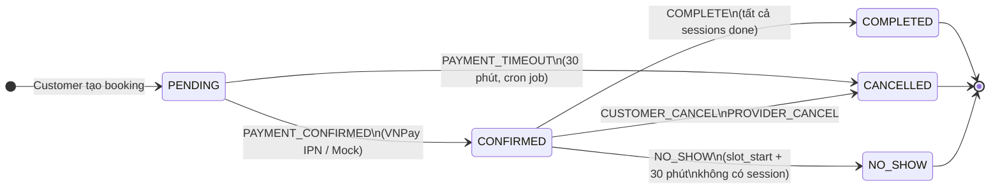
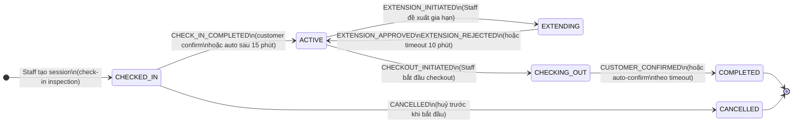

# 02 — Booking & Session State Machine

**Last updated**: 2026-06-20  
**Status**: Active

> Do tách `bookings` và `sessions`, Phase 1 có 2 state machine riêng.  
> Mọi transition phải qua service layer, không update status trực tiếp.

---

## 1. Booking State Machine

Booking quản lý đơn đặt lịch dự kiến, không chứa dữ liệu vận hành thực tế.



| Status | Ý nghĩa |
|--------|---------|
| `PENDING` | Đã tạo, chờ thanh toán — vehicle lock được giữ |
| `CONFIRMED` | Đã thanh toán, chờ check-in — payment components created |
| `CANCELLED` | Bị huỷ — vehicle lock released, refund triggered |
| `NO_SHOW` | Quá hạn check-in, không có session — deposit không hoàn |
| `COMPLETED` | Tất cả sessions đã hoàn tất và settled |

**Rules:**

- Booking chỉ có thể tạo session khi `status = CONFIRMED`.
- Khi session đầu tiên được check-in, booking vẫn `CONFIRMED`.
- Khi tất cả sessions đã `COMPLETED`, booking chuyển `COMPLETED`.
- Nếu quá hạn check-in mà không có session, booking chuyển `NO_SHOW`.

---

## 2. Session State Machine

Session quản lý phiên chơi thực tế.



| Status | Ý nghĩa |
|--------|---------|
| `CHECKED_IN` | Staff đã tạo session, đang hoàn tất kiểm tra đầu vào |
| `ACTIVE` | Phiên đang chơi |
| `EXTENDING` | Đang chờ khách phản hồi đề xuất gia hạn |
| `CHECKING_OUT` | Staff đang kiểm tra trả xe / kết thúc phiên |
| `COMPLETED` | Phiên đã hoàn tất và settlement chạy xong |
| `CANCELLED` | Phiên bị hủy trước khi bắt đầu |

---

## 3. Timeout Rules

### Booking

| State | Timeout | Action |
|-------|---------|--------|
| `PENDING` | 30 phút | Auto-cancel, release slot locks |
| `CONFIRMED` không có session | `slot_start + 30 phút` | Mark `NO_SHOW` |

### Session

| State | Timeout | Action |
|-------|---------|--------|
| `CHECKED_IN` | 15 phút customer không confirm inspection | Auto-confirm check-in |
| `EXTENDING` | 10 phút customer không phản hồi | Auto-reject extension, quay lại `ACTIVE` |
| `CHECKING_OUT` no damage | 2 giờ | Auto-confirm checkout |
| `CHECKING_OUT` damage flagged | 24 giờ | Auto-confirm damage charge |

---

## 4. Events

```typescript
enum BookingEvent {
  PAYMENT_CONFIRMED = 'PAYMENT_CONFIRMED',
  PAYMENT_TIMEOUT   = 'PAYMENT_TIMEOUT',
  CUSTOMER_CANCEL   = 'CUSTOMER_CANCEL',
  PROVIDER_CANCEL   = 'PROVIDER_CANCEL',
  NO_SHOW           = 'NO_SHOW',
  COMPLETE          = 'COMPLETE',
}

enum SessionEvent {
  CHECK_IN_COMPLETED   = 'CHECK_IN_COMPLETED',
  SESSION_STARTED      = 'SESSION_STARTED',
  EXTENSION_INITIATED  = 'EXTENSION_INITIATED',
  EXTENSION_APPROVED   = 'EXTENSION_APPROVED',
  EXTENSION_REJECTED   = 'EXTENSION_REJECTED',
  CHECKOUT_INITIATED   = 'CHECKOUT_INITIATED',
  CUSTOMER_CONFIRMED   = 'CUSTOMER_CONFIRMED',
  TIMEOUT              = 'TIMEOUT',
  CANCELLED            = 'CANCELLED',
}
```

---

## 5. Implementation Note

Route và controller **không được** update status trực tiếp. Mọi thay đổi trạng thái phải gọi qua:

```typescript
// rcfeild-be/src/services/booking.service.ts
export async function transition(bookingId: string, event: string): Promise<Booking>

// rcfeild-be/src/services/session.service.ts (tương tự)
export async function transition(sessionId: string, event: string): Promise<Session>
```

Transition table được enforce tại runtime:

```typescript
const VALID_TRANSITIONS: Record<BookingStatus, string[]> = {
  [BookingStatus.PENDING]:    ['PAYMENT_CONFIRMED', 'PAYMENT_TIMEOUT'],
  [BookingStatus.CONFIRMED]:  ['CUSTOMER_CANCEL', 'PROVIDER_CANCEL', 'NO_SHOW', 'COMPLETE'],
  [BookingStatus.CANCELLED]:  [],
  [BookingStatus.NO_SHOW]:    [],
  [BookingStatus.COMPLETED]:  [],
}
```

---

## Reference

- `docs/spec/01-domain-model.md` — Entity definitions
- `docs/spec/03-payment-engine.md` — Settlement khi COMPLETED
- `docs/spec/04-inspection-flow.md` — Check-in / Check-out protocol
- `docs/spec/business-rules/BR-booking.md` — Booking business rules
