# 06 — Database Specification

**Last updated**: 2026-06-23

> Đọc `01-domain-model.md` để hiểu entity relationships trước khi đọc file này.  
> File này là nguồn sự thật cho schema Phase 1 Operational Core.

---

## 1. Conventions

| Convention | Quy tắc |
|-----------|---------|
| Tên bảng | `snake_case`, số nhiều (`users`, `bookings`) |
| Primary key | `id uuid DEFAULT gen_random_uuid()` |
| Foreign key | `{entity}_id uuid` |
| Timestamps | Bảng nghiệp vụ có `created_at`, `updated_at`; audit/log có thể chỉ có `created_at` |
| Tiền tệ | `numeric(15,2)`, không dùng `float` |
| JSON | `jsonb` cho snapshot/config/payload linh hoạt |
| Timezone | `timestamptz`, lưu UTC |
| Soft delete | `deleted_at timestamptz`, NULL = active |

---

## 2. ERD Tổng Quan — Operational Core

```mermaid
erDiagram
    users ||--o{ cafes : "provider owns"
    users ||--o{ bookings : "customer makes"
    users ||--o{ customer_vehicles : "owns BYOC"
    cafes ||--o{ cafe_images : "images"
    cafes ||--o{ vehicles : "fleet"
    cafes ||--o{ menu_items : "menu"
    cafes ||--o{ packages : "offers"
    cafes ||--o{ subscriptions : "supports"
    cafes ||--o{ bookings : "receives"
    cafes ||--o{ sessions : "runs"

    vehicles ||--o{ vehicle_images : "images"
    vehicles ||--o{ vehicle_maintenance_logs : "maintenance"
    vehicles ||--o{ booking_vehicles : "planned"
    vehicles ||--o{ session_vehicles : "actual use"
    customer_vehicles ||--o{ session_vehicles : "BYOC use"

    bookings ||--o{ booking_participants : "planned people"
    bookings ||--o{ booking_vehicles : "planned rental vehicles"
    bookings ||--o{ sessions : "actual sessions"
    bookings ||--o{ payment_components : "payment ledger"
    bookings ||--o{ payment_transactions : "gateway logs"
    bookings ||--o{ fnb_orders : "food orders"
    bookings ||--o{ package_usages : "package usage"
    bookings ||--o{ reviews : "review"

    sessions ||--o{ session_participants : "actual people"
    sessions ||--o{ session_vehicles : "actual vehicles"
    sessions ||--o{ inspections : "inspections"
    sessions ||--o{ extension_proposals : "extensions"
    sessions ||--o{ incidents : "incidents"

    inspections ||--o{ inspection_photos : "photos"
    inspections ||--o{ inspection_checklists : "checklists"
    fnb_orders ||--o{ fnb_order_items : "items"
    menu_items ||--o{ fnb_order_items : "menu item"
    packages ||--o{ customer_packages : "purchased"
    customer_packages ||--o{ package_usages : "usage history"
    subscriptions ||--o{ bookings : "generates"
    users ||--o{ contests : "provider creates"
    contests ||--o{ contest_cafes : "participating branches"
    cafes ||--o{ contest_cafes : "hosts event"
    contests ||--o{ contest_registrations : "registrations"

    cafes ||--o{ promotions : "promotions"
    promotions ||--o{ promotion_usages : "usage history"
    bookings ||--o| promotion_usages : "applies promo"

    users ||--o{ refresh_tokens : "sessions"
    users ||--o{ password_reset_tokens : "resets"
    users ||--o{ notification_logs : "notifications"
    users ||--o{ trust_score_logs : "trust audit"
    bookings ||--o{ trust_score_logs : "triggered by"
    sessions ||--o{ trust_score_logs : "triggered by"

    users ||--o| provider_profiles : "has profile"
    users ||--o{ provider_subscriptions : "subscription"
    users ||--o{ payment_requests : "payment requests"
    users ||--o{ notifications : "notifications"
    provider_subscriptions ||--o{ subscription_plans : "plan"
    payment_requests ||--o{ subscription_plans : "plan"
```



---

## 3. Phase 1 Schema Scope — 50 Tables

Phase 1 chỉ tạo schema/migration cho **50 bảng vận hành cốt lõi** dưới đây. Contest phase hiện tại giữ 5 bảng chính và 1 bảng audit log: `contests`, `contest_cafes`, `contest_registrations`, `contest_matches`, `contest_match_participants`, `contest_audit_logs`.

> Không cộng thêm bảng Phase 2 vào scope này. Chỉ các bảng multi-party dispute workflow nâng cao
> (`dispute_evidences`, `dispute_parties`), AI và analytics nâng cao **không được tạo trong Phase 1**.

| # | Bảng | Mô tả |
|---|------|-------|
| 1 | `users` | Tài khoản và role |
| 2 | `refresh_tokens` | Refresh token sessions |
| 3 | `password_reset_tokens` | Reset password tokens |
| 4 | `cafes` | Chi nhánh/sân RC |
| 5 | `cafe_images` | Gallery ảnh chi nhánh |
| 6 | `vehicles` | Xe thuê của quán |
| 7 | `vehicle_images` | Ảnh xe thuê |
| 8 | `vehicle_maintenance_logs` | Lịch sử bảo trì/sửa chữa xe |
| 9 | `customer_vehicles` | Xe BYOC của khách |
| 10 | `bookings` | Đơn đặt lịch dự kiến |
| 11 | `booking_participants` | Người chơi dự kiến |
| 12 | `booking_vehicles` | Xe thuê dự kiến |
| 13 | `sessions` | Phiên chơi thực tế |
| 14 | `session_participants` | Người chơi thực tế |
| 15 | `session_vehicles` | Xe thực tế dùng trong session |
| 16 | `payment_components` | Ledger thanh toán |
| 17 | `payment_transactions` | Log gateway |
| 18 | `inspections` | Biên bản kiểm tra |
| 19 | `inspection_photos` | Ảnh inspection |
| 20 | `inspection_checklists` | Checklist inspection |
| 21 | `extension_proposals` | Đề xuất gia hạn |
| 22 | `incidents` | Sự cố + log xử lý theo policy |
| 23 | `menu_items` | Menu F&B |
| 24 | `fnb_orders` | Đơn F&B |
| 25 | `fnb_order_items` | Line items F&B |
| 26 | `packages` | Định nghĩa gói chơi |
| 27 | `customer_packages` | Gói khách đã mua |
| 28 | `package_usages` | Audit sử dụng gói |
| 29 | `subscriptions` | Lịch chơi định kỳ |
| 30 | `contests` | Giải đua/sự kiện do Provider tạo |
| 31 | `contest_cafes` | Chi nhánh tham gia contest |
| 32 | `contest_registrations` | Đăng ký giải đua |
| 33 | `contest_matches` | Match/heat/lượt chạy/final linh hoạt của contest |
| 34 | `contest_match_participants` | Người tham gia trong từng match |
| 35 | `contest_audit_logs` | Business audit log của contest |
| 36 | `promotions` | Mã khuyến mãi |
| 37 | `promotion_usages` | Audit dùng mã |
| 38 | `reviews` | Đánh giá |
| 39 | `notification_logs` | Log thông báo |
| 40 | `trust_score_logs` | Audit trust score |
| 41 | `feature_flags` | Bật/tắt module, config Phase 2 |
| 42 | `staff_cafe_assignments` | Staff assign vào chi nhánh |
| 43 | `disputes` | Tranh chấp booking |
| 44 | `cafe_closures` | Ngày đóng cửa đặc biệt |
| 45 | `cafe_announcements` | Thông báo/banner chi nhánh |
| 46 | `provider_profiles` | Hồ sơ đăng ký Provider, trạng thái duyệt |
| 47 | `subscription_plans` | Định nghĩa các gói: Trial, Starter, Growth, Pro |
| 48 | `provider_subscriptions` | Subscription đang active của từng Provider, quota AI |
| 49 | `payment_requests` | Yêu cầu thanh toán thủ công (chuyển khoản) |
| 50 | `notifications` | In-app notifications cho Provider |

Các nghiệp vụ bị loại khỏi schema Phase 1:

- AI job/detail tables.
- Analytics nâng cao, dynamic pricing, loyalty và native mobile app.

---

## 4. Enum Chuẩn

```typescript
enum UserRole { CUSTOMER, PROVIDER, STAFF, ADMIN }
enum AuthProvider { LOCAL, GOOGLE }

enum CafeStatus { PENDING, ACTIVE, SUSPENDED }
enum TrackType { DRIFT, CIRCUIT, OFFROAD }

enum VehicleTier { STANDARD, PREMIUM, RESTRICTED }
enum VehicleStatus { AVAILABLE, IN_USE, MAINTENANCE, RETIRED }
enum VehicleSource { RENTAL, BYOC }
enum SessionVehicleStatus { ASSIGNED, IN_USE, RETURNED, DAMAGED }

enum BookingMode { SINGLE, PACKAGE, SUBSCRIPTION }
enum PlayMode { RENTAL, BYOC, MIXED }
enum BookingSource { APP, STAFF_MANUAL, SYSTEM_SUBSCRIPTION }
enum BookingStatus { PENDING, CONFIRMED, CANCELLED, NO_SHOW, COMPLETED }
enum SessionStatus { CHECKED_IN, ACTIVE, EXTENDING, CHECKING_OUT, COMPLETED, CANCELLED }

enum ParticipantType { BOOKER, REGISTERED_USER, WALK_IN_GUEST }
enum ParticipantRole { DRIVER, PLAYER, SPECTATOR, GUARDIAN }

enum PaymentComponentType {
  SLOT_FEE, RENTAL_FEE, SECURITY_DEPOSIT, EXTENSION_FEE,
  DAMAGE_CHARGE, FNB_PREORDER, FNB_ON_SITE, PACKAGE_PURCHASE, CONTEST_ENTRY
}
enum PaymentComponentStatus { PENDING, HELD, DISBURSED, REFUNDED, PARTIALLY_REFUNDED, CAPTURED }
enum PaymentTransactionType { PAYMENT, REFUND, CAPTURE, VOID }

enum InspectionType { CHECK_IN, CHECK_OUT, STAFF_HANDOVER }
enum InspectionSubjectType { RENTAL_VEHICLE, BYOC_VEHICLE }
enum InspectionItemStatus { OK, SCRATCHED, BROKEN, MISSING, DIRTY, NEEDS_REVIEW }
enum PhotoAngle { FRONT, BACK, LEFT, RIGHT, TOP, BOTTOM, DETAIL, OTHER }

enum ExtensionProposalStatus { PENDING, APPROVED, REJECTED, EXPIRED, CANCELLED }
enum IncidentType { RENTAL_DAMAGE, BYOC_DAMAGE, COLLISION, LOST_ACCESSORY, STAFF_HANDLING, FACILITY, OTHER }
enum IncidentStatus { RECORDED, REVIEWED, RESOLVED, WAIVED }
enum ResponsibleParty { CUSTOMER, PROVIDER, STAFF, SHARED, UNKNOWN }
enum FnbOrderType { PRE_ORDER, ON_SITE }
enum FnbOrderStatus { PENDING, CONFIRMED, PREPARING, DELIVERED, CANCELLED }
enum PackageStatus { ACTIVE, INACTIVE, ARCHIVED }
enum CustomerPackageStatus { ACTIVE, EXPIRED, DEPLETED, CANCELLED }
enum SubscriptionStatus { ACTIVE, PAUSED, CANCELLED, EXPIRED }
enum ContestStatus { DRAFT, OPEN, CLOSED, RUNNING, COMPLETED, CANCELLED }
enum ContestRegistrationStatus { PENDING, CONFIRMED, CANCELLED, CHECKED_IN }
enum ContestMatchType { HEAD_TO_HEAD, MULTI_DRIVER, TIME_ATTACK, FINAL }
enum ContestMatchStatus { DRAFT, READY, RUNNING, COMPLETED, CANCELLED }
enum ContestMatchParticipantStatus { READY, STARTED, FINISHED, DNS, DNF, DQ }
enum DiscountType { PERCENT, FIXED }
enum PromoApplicableTo { ALL, RENTAL, BYOC, MIXED }
enum NotificationChannel { PUSH, SMS, EMAIL }
enum NotificationStatus { PENDING, SENT, FAILED }
enum TrustScoreReason { NO_SHOW, DAMAGE_CONFIRMED, BOOKING_STREAK, ADMIN_ADJUSTMENT }

enum ProviderStatus { PENDING, ACTIVE, REJECTED, SUSPENDED }
enum ProviderSubscriptionStatus { TRIAL, ACTIVE, GRACE_PERIOD, EXPIRED }
enum PlanName { TRIAL, STARTER, GROWTH, PRO }
enum PaymentRequestStatus { PENDING, CONFIRMED, REJECTED }
enum NotificationType {
  ACCOUNT_APPROVED, ACCOUNT_REJECTED, ACCOUNT_SUSPENDED, ACCOUNT_UNSUSPENDED,
  TRIAL_EXPIRING_SOON, GRACE_PERIOD_STARTED, SUBSCRIPTION_EXPIRED,
  SUBSCRIPTION_ACTIVATED, PAYMENT_REQUEST_CONFIRMED, PAYMENT_REQUEST_REJECTED
}
```

---

## 5. Bảng Chi Tiết

### 5.1 Identity

#### `users`

| Column | Type | Constraints | Ghi chú |
|--------|------|-------------|---------|
| `id` | `uuid` | PK | |
| `email` | `varchar(255)` | NOT NULL, UNIQUE | |
| `phone` | `varchar(20)` | NULL | |
| `full_name` | `varchar(255)` | NOT NULL | |
| `password_hash` | `text` | NULL | NULL nếu OAuth |
| `auth_provider` | `AuthProvider` | NOT NULL, DEFAULT `LOCAL` | |
| `role` | `UserRole` | NOT NULL | |
| `trust_score` | `numeric(5,2)` | NOT NULL, DEFAULT `100.00` | CUSTOMER |
| `is_active` | `boolean` | NOT NULL, DEFAULT `true` | |
| `created_at`, `updated_at`, `deleted_at` | `timestamptz` | | |

```sql
CREATE UNIQUE INDEX idx_users_email ON users(email) WHERE deleted_at IS NULL;
CREATE INDEX idx_users_role ON users(role);
```

#### `refresh_tokens`

| Column | Type | Constraints |
|--------|------|-------------|
| `id` | `uuid` | PK |
| `user_id` | `uuid` | NOT NULL, FK -> users(id) ON DELETE CASCADE |
| `token` | `text` | NOT NULL, UNIQUE |
| `expires_at` | `timestamptz` | NOT NULL |
| `created_at` | `timestamptz` | NOT NULL |

#### `password_reset_tokens`

| Column | Type | Constraints |
|--------|------|-------------|
| `id` | `uuid` | PK |
| `user_id` | `uuid` | NOT NULL, FK -> users(id) ON DELETE CASCADE |
| `token` | `text` | NOT NULL, UNIQUE |
| `expires_at` | `timestamptz` | NOT NULL |
| `used_at` | `timestamptz` | NULL |
| `created_at` | `timestamptz` | NOT NULL |

---

### 5.2 Cafe

#### `cafes`

| Column | Type | Constraints | Ghi chú |
|--------|------|-------------|---------|
| `id` | `uuid` | PK | |
| `provider_id` | `uuid` | NOT NULL, FK -> users(id) | PROVIDER |
| `name` | `varchar(255)` | NOT NULL | |
| `slug` | `varchar(100)` | NOT NULL, UNIQUE | |
| `description` | `text` | NULL | |
| `phone` | `varchar(20)` | NULL | |
| `status` | `CafeStatus` | NOT NULL, DEFAULT `PENDING` | |
| `cover_image_url` | `text` | NULL | |
| `address` | `text` | NOT NULL | |
| `district` | `varchar(100)` | NOT NULL | |
| `city` | `varchar(100)` | NOT NULL | |
| `latitude`, `longitude` | `numeric(10,7)` | NULL | |
| `operating_hours` | `jsonb` | NOT NULL | |
| `track_types` | `text[]` | NOT NULL, DEFAULT `{}` | |
| `slot_duration_minutes` | `integer` | NOT NULL, DEFAULT `60` | |
| `slot_fee_rate` | `numeric(15,2)` | NOT NULL | Booking dùng snapshot |
| `max_concurrent_bookings` | `integer` | NOT NULL, DEFAULT `10` | |
| `byoc_capacity` | `integer` | NOT NULL, DEFAULT `5` | |
| `created_at`, `updated_at` | `timestamptz` | | |

#### `cafe_images`

| Column | Type | Constraints |
|--------|------|-------------|
| `id` | `uuid` | PK |
| `cafe_id` | `uuid` | NOT NULL, FK -> cafes(id) ON DELETE CASCADE |
| `url` | `text` | NOT NULL |
| `sort_order` | `integer` | NOT NULL, DEFAULT `0` |
| `created_at` | `timestamptz` | NOT NULL |

---

### 5.3 Fleet & BYOC

#### `vehicles`

| Column | Type | Constraints | Ghi chú |
|--------|------|-------------|---------|
| `id` | `uuid` | PK | |
| `cafe_id` | `uuid` | NOT NULL, FK -> cafes(id) | |
| `name` | `varchar(255)` | NOT NULL | |
| `description` | `text` | NULL | |
| `tier` | `VehicleTier` | NOT NULL | |
| `status` | `VehicleStatus` | NOT NULL, DEFAULT `AVAILABLE` | |
| `hourly_rate` | `numeric(15,2)` | NOT NULL | |
| `security_deposit` | `numeric(15,2)` | NOT NULL | |
| `damage_multiplier` | `numeric(4,2)` | NOT NULL, DEFAULT `1.00` | |
| `compatible_track_types` | `text[]` | NOT NULL, DEFAULT `{}` | |
| `cover_image_url` | `text` | NULL | |
| `last_maintenance_at` | `timestamptz` | NULL | |
| `created_at`, `updated_at`, `deleted_at` | `timestamptz` | | |

#### `vehicle_images`

| Column | Type | Constraints |
|--------|------|-------------|
| `id` | `uuid` | PK |
| `vehicle_id` | `uuid` | NOT NULL, FK -> vehicles(id) ON DELETE CASCADE |
| `url` | `text` | NOT NULL |
| `sort_order` | `integer` | NOT NULL, DEFAULT `0` |
| `created_at` | `timestamptz` | NOT NULL |

#### `customer_vehicles`

| Column | Type | Constraints | Ghi chú |
|--------|------|-------------|---------|
| `id` | `uuid` | PK | |
| `customer_id` | `uuid` | NOT NULL, FK -> users(id) | |
| `brand` | `varchar(100)` | NULL | |
| `model` | `varchar(100)` | NULL | |
| `serial_number` | `varchar(100)` | NULL | |
| `description` | `text` | NULL | |
| `notes` | `text` | NULL | |
| `created_at`, `updated_at`, `deleted_at` | `timestamptz` | | |

#### `vehicle_maintenance_logs`

| Column | Type | Constraints | Ghi chú |
|--------|------|-------------|---------|
| `id` | `uuid` | PK | |
| `vehicle_id` | `uuid` | NOT NULL, FK -> vehicles(id) | |
| `type` | `varchar(50)` | NOT NULL | `SCHEDULED`, `REPAIR`, `INSPECTION` |
| `description` | `text` | NOT NULL | |
| `cost` | `numeric(15,2)` | NULL | |
| `performed_by` | `uuid` | NULL, FK -> users(id) | Staff hoặc NULL nếu gửi ngoài |
| `performed_at` | `timestamptz` | NOT NULL | |
| `next_scheduled_at` | `timestamptz` | NULL | |
| `related_session_id` | `uuid` | NULL, FK -> sessions(id) | Nếu phát sinh từ session |
| `created_at` | `timestamptz` | NOT NULL | |

---

### 5.4 Booking Layer

#### `bookings`

> Không lưu `vehicle_id` trực tiếp trong `bookings`.

| Column | Type | Constraints | Ghi chú |
|--------|------|-------------|---------|
| `id` | `uuid` | PK | |
| `customer_id` | `uuid` | NOT NULL, FK -> users(id) | |
| `cafe_id` | `uuid` | NOT NULL, FK -> cafes(id) | |
| `subscription_id` | `uuid` | NULL, FK -> subscriptions(id) | Nếu sinh từ lịch định kỳ |
| `booking_mode` | `BookingMode` | NOT NULL, DEFAULT `SINGLE` | |
| `play_mode` | `PlayMode` | NOT NULL | RENTAL/BYOC/MIXED |
| `source` | `BookingSource` | NOT NULL, DEFAULT `APP` | |
| `track_type` | `varchar(50)` | NOT NULL | |
| `status` | `BookingStatus` | NOT NULL, DEFAULT `PENDING` | |
| `slot_start`, `slot_end` | `timestamptz` | NOT NULL | Dự kiến |
| `slot_count` | `integer` | NOT NULL, DEFAULT `1` | |
| `payment_expires_at` | `timestamptz` | NOT NULL | |
| `snapshot` | `jsonb` | NOT NULL | Giá/policy bất biến |
| `promotion_id` | `uuid` | NULL, FK -> promotions(id) | |
| `discount_amount` | `numeric(15,2)` | NULL | |
| `notes` | `text` | NULL | |
| `cancelled_by` | `uuid` | NULL, FK -> users(id) | |
| `cancelled_at` | `timestamptz` | NULL | |
| `cancellation_reason` | `text` | NULL | |
| `created_at`, `updated_at` | `timestamptz` | | |

```sql
CREATE INDEX idx_bookings_customer_id ON bookings(customer_id);
CREATE INDEX idx_bookings_cafe_slot ON bookings(cafe_id, track_type, slot_start, slot_end);
CREATE INDEX idx_bookings_status ON bookings(status);
CREATE INDEX idx_bookings_payment_expires ON bookings(payment_expires_at)
  WHERE status = 'PENDING';
```

#### `booking_participants`

| Column | Type | Constraints |
|--------|------|-------------|
| `id` | `uuid` | PK |
| `booking_id` | `uuid` | NOT NULL, FK -> bookings(id) ON DELETE CASCADE |
| `user_id` | `uuid` | NULL, FK -> users(id) |
| `participant_type` | `ParticipantType` | NOT NULL |
| `display_name` | `varchar(255)` | NULL |
| `phone` | `varchar(20)` | NULL |
| `is_primary_responsible` | `boolean` | NOT NULL, DEFAULT `false` |
| `created_at`, `updated_at` | `timestamptz` | |

#### `booking_vehicles`

| Column | Type | Constraints | Ghi chú |
|--------|------|-------------|---------|
| `id` | `uuid` | PK | |
| `booking_id` | `uuid` | NOT NULL, FK -> bookings(id) ON DELETE CASCADE | |
| `vehicle_id` | `uuid` | NOT NULL, FK -> vehicles(id) | |
| `assigned_to_participant_id` | `uuid` | NULL, FK -> booking_participants(id) | |
| `hourly_rate_snapshot` | `numeric(15,2)` | NOT NULL | |
| `security_deposit_snapshot` | `numeric(15,2)` | NOT NULL | |
| `damage_multiplier_snapshot` | `numeric(4,2)` | NOT NULL | |
| `created_at` | `timestamptz` | NOT NULL | |

```sql
CREATE UNIQUE INDEX idx_booking_vehicles_unique ON booking_vehicles(booking_id, vehicle_id);
```

---

### 5.5 Session Layer

#### `sessions`

| Column | Type | Constraints | Ghi chú |
|--------|------|-------------|---------|
| `id` | `uuid` | PK | |
| `booking_id` | `uuid` | NOT NULL, FK -> bookings(id) | |
| `cafe_id` | `uuid` | NOT NULL, FK -> cafes(id) | |
| `status` | `SessionStatus` | NOT NULL, DEFAULT `CHECKED_IN` | |
| `checked_in_by` | `uuid` | NOT NULL, FK -> users(id) | Staff |
| `checked_out_by` | `uuid` | NULL, FK -> users(id) | Staff |
| `actual_start_at` | `timestamptz` | NOT NULL | |
| `actual_end_at` | `timestamptz` | NULL | |
| `planned_end_at` | `timestamptz` | NOT NULL | |
| `actual_total_amount` | `numeric(15,2)` | NOT NULL, DEFAULT `0` | |
| `notes` | `text` | NULL | |
| `created_at`, `updated_at` | `timestamptz` | | |

#### `session_participants`

| Column | Type | Constraints |
|--------|------|-------------|
| `id` | `uuid` | PK |
| `session_id` | `uuid` | NOT NULL, FK -> sessions(id) ON DELETE CASCADE |
| `booking_participant_id` | `uuid` | NULL, FK -> booking_participants(id) |
| `user_id` | `uuid` | NULL, FK -> users(id) |
| `display_name` | `varchar(255)` | NULL |
| `phone` | `varchar(20)` | NULL |
| `role` | `ParticipantRole` | NOT NULL |
| `is_primary_responsible` | `boolean` | NOT NULL, DEFAULT `false` |
| `checked_in_at` | `timestamptz` | NOT NULL |
| `created_at`, `updated_at` | `timestamptz` | |

#### `session_vehicles`

| Column | Type | Constraints | Ghi chú |
|--------|------|-------------|---------|
| `id` | `uuid` | PK | |
| `session_id` | `uuid` | NOT NULL, FK -> sessions(id) ON DELETE CASCADE | |
| `booking_vehicle_id` | `uuid` | NULL, FK -> booking_vehicles(id) | |
| `vehicle_source` | `VehicleSource` | NOT NULL | RENTAL/BYOC |
| `vehicle_id` | `uuid` | NULL, FK -> vehicles(id) | Required khi RENTAL |
| `customer_vehicle_id` | `uuid` | NULL, FK -> customer_vehicles(id) | Required khi BYOC |
| `assigned_to_participant_id` | `uuid` | NULL, FK -> session_participants(id) | |
| `status` | `SessionVehicleStatus` | NOT NULL, DEFAULT `ASSIGNED` | |
| `started_at`, `returned_at` | `timestamptz` | NULL | |
| `notes` | `text` | NULL | |
| `created_at`, `updated_at` | `timestamptz` | | |

---

### 5.6 Payment

#### `payment_components`

| Column | Type | Constraints | Ghi chú |
|--------|------|-------------|---------|
| `id` | `uuid` | PK | |
| `booking_id` | `uuid` | NOT NULL, FK -> bookings(id) | |
| `session_id` | `uuid` | NULL, FK -> sessions(id) | |
| `type` | `PaymentComponentType` | NOT NULL | |
| `amount` | `numeric(15,2)` | NOT NULL | Immutable |
| `status` | `PaymentComponentStatus` | NOT NULL, DEFAULT `PENDING` | |
| `disbursed_to` | `uuid` | NULL, FK -> users(id) | |
| `disbursed_at`, `refunded_at` | `timestamptz` | NULL | |
| `refunded_amount` | `numeric(15,2)` | NULL | |
| `note` | `text` | NULL | |
| `created_at`, `updated_at` | `timestamptz` | | |

#### `payment_transactions`

| Column | Type | Constraints |
|--------|------|-------------|
| `id` | `uuid` | PK |
| `booking_id` | `uuid` | NOT NULL, FK -> bookings(id) |
| `session_id` | `uuid` | NULL, FK -> sessions(id) |
| `gateway` | `varchar(50)` | NOT NULL |
| `gateway_transaction_id` | `varchar(255)` | NULL |
| `type` | `PaymentTransactionType` | NOT NULL |
| `amount` | `numeric(15,2)` | NOT NULL |
| `status` | `varchar(50)` | NOT NULL |
| `raw_request`, `raw_response` | `jsonb` | NULL |
| `created_at` | `timestamptz` | NOT NULL |

---

### 5.7 Inspection

#### `inspections`

| Column | Type | Constraints | Ghi chú |
|--------|------|-------------|---------|
| `id` | `uuid` | PK | |
| `session_id` | `uuid` | NOT NULL, FK -> sessions(id) | |
| `session_vehicle_id` | `uuid` | NULL, FK -> session_vehicles(id) | |
| `type` | `InspectionType` | NOT NULL | |
| `subject_type` | `InspectionSubjectType` | NOT NULL | |
| `performed_by` | `uuid` | NOT NULL, FK -> users(id) | Staff |
| `pre_existing_flag` | `boolean` | NOT NULL, DEFAULT `false` | |
| `damage_noted` | `boolean` | NOT NULL, DEFAULT `false` | |
| `damage_description` | `text` | NULL | |
| `damage_cost_estimate` | `numeric(15,2)` | NULL | |
| `ai_analysis_json` | `jsonb` | NULL | Phase 2 hook |
| `customer_confirmed` | `boolean` | NOT NULL, DEFAULT `false` | |
| `customer_confirmed_at` | `timestamptz` | NULL | |
| `created_at`, `updated_at` | `timestamptz` | | |

#### `inspection_photos`

| Column | Type | Constraints |
|--------|------|-------------|
| `id` | `uuid` | PK |
| `inspection_id` | `uuid` | NOT NULL, FK -> inspections(id) ON DELETE CASCADE |
| `angle` | `PhotoAngle` | NOT NULL |
| `url` | `text` | NOT NULL |
| `uploaded_by` | `uuid` | NOT NULL, FK -> users(id) |
| `metadata` | `jsonb` | NULL |
| `created_at` | `timestamptz` | NOT NULL |

#### `inspection_checklists`

| Column | Type | Constraints |
|--------|------|-------------|
| `id` | `uuid` | PK |
| `inspection_id` | `uuid` | NOT NULL, FK -> inspections(id) ON DELETE CASCADE |
| `item_key` | `varchar(100)` | NOT NULL |
| `item_label` | `varchar(255)` | NOT NULL |
| `status` | `InspectionItemStatus` | NOT NULL |
| `note` | `text` | NULL |
| `created_at`, `updated_at` | `timestamptz` | |

---

### 5.8 Extension, Promotion, Audit

#### `extension_proposals`

| Column | Type | Constraints |
|--------|------|-------------|
| `id` | `uuid` | PK |
| `session_id` | `uuid` | NOT NULL, FK -> sessions(id) |
| `proposed_by` | `uuid` | NOT NULL, FK -> users(id) |
| `duration_minutes` | `integer` | NOT NULL |
| `fee_amount` | `numeric(15,2)` | NOT NULL |
| `status` | `ExtensionProposalStatus` | NOT NULL, DEFAULT `PENDING` |
| `responded_by` | `uuid` | NULL, FK -> users(id) |
| `responded_at` | `timestamptz` | NULL |
| `created_at`, `updated_at` | `timestamptz` | |

#### `promotions`

| Column | Type | Constraints |
|--------|------|-------------|
| `id` | `uuid` | PK |
| `cafe_id` | `uuid` | NULL, FK -> cafes(id) |
| `code` | `varchar(50)` | NOT NULL, UNIQUE |
| `discount_type` | `DiscountType` | NOT NULL |
| `discount_value` | `numeric(15,2)` | NOT NULL |
| `max_discount_amount` | `numeric(15,2)` | NULL |
| `min_order_amount` | `numeric(15,2)` | NULL |
| `max_uses` | `integer` | NULL |
| `max_uses_per_user` | `integer` | NOT NULL, DEFAULT `1` |
| `uses_count` | `integer` | NOT NULL, DEFAULT `0` |
| `applicable_to` | `PromoApplicableTo` | NOT NULL, DEFAULT `ALL` |
| `starts_at` | `timestamptz` | NOT NULL |
| `expires_at` | `timestamptz` | NULL |
| `is_active` | `boolean` | NOT NULL, DEFAULT `true` |
| `created_by` | `uuid` | NOT NULL, FK -> users(id) |
| `created_at`, `updated_at` | `timestamptz` | |

#### `promotion_usages`

| Column | Type | Constraints |
|--------|------|-------------|
| `id` | `uuid` | PK |
| `promotion_id` | `uuid` | NOT NULL, FK -> promotions(id) |
| `booking_id` | `uuid` | NOT NULL, UNIQUE, FK -> bookings(id) |
| `user_id` | `uuid` | NOT NULL, FK -> users(id) |
| `discount_amount` | `numeric(15,2)` | NOT NULL |
| `created_at` | `timestamptz` | NOT NULL |

#### `reviews`

| Column | Type | Constraints |
|--------|------|-------------|
| `id` | `uuid` | PK |
| `booking_id` | `uuid` | NOT NULL, UNIQUE, FK -> bookings(id) |
| `cafe_id` | `uuid` | NOT NULL, FK -> cafes(id) |
| `customer_id` | `uuid` | NOT NULL, FK -> users(id) |
| `rating` | `integer` | NOT NULL |
| `comment` | `text` | NULL |
| `is_visible` | `boolean` | NOT NULL, DEFAULT `true` |
| `created_at` | `timestamptz` | NOT NULL |

#### `notification_logs`

| Column | Type | Constraints |
|--------|------|-------------|
| `id` | `uuid` | PK |
| `user_id` | `uuid` | NOT NULL, FK -> users(id) |
| `booking_id` | `uuid` | NULL, FK -> bookings(id) |
| `session_id` | `uuid` | NULL, FK -> sessions(id) |
| `type` | `varchar(100)` | NOT NULL |
| `channel` | `NotificationChannel` | NOT NULL |
| `title` | `varchar(255)` | NOT NULL |
| `body` | `text` | NOT NULL |
| `status` | `NotificationStatus` | NOT NULL, DEFAULT `PENDING` |
| `error` | `text` | NULL |
| `sent_at` | `timestamptz` | NULL |
| `created_at` | `timestamptz` | NOT NULL |

#### `trust_score_logs`

| Column | Type | Constraints |
|--------|------|-------------|
| `id` | `uuid` | PK |
| `user_id` | `uuid` | NOT NULL, FK -> users(id) |
| `booking_id` | `uuid` | NULL, FK -> bookings(id) |
| `session_id` | `uuid` | NULL, FK -> sessions(id) |
| `delta` | `numeric(5,2)` | NOT NULL |
| `score_before` | `numeric(5,2)` | NOT NULL |
| `score_after` | `numeric(5,2)` | NOT NULL |
| `reason` | `TrustScoreReason` | NOT NULL |
| `note` | `text` | NULL |
| `created_by` | `uuid` | NULL, FK -> users(id) |
| `created_at` | `timestamptz` | NOT NULL |

#### `feature_flags`

| Column | Type | Constraints | Ghi chú |
|--------|------|-------------|---------|
| `id` | `uuid` | PK | |
| `key` | `varchar(100)` | NOT NULL, UNIQUE | |
| `description` | `text` | NULL | |
| `is_enabled` | `boolean` | NOT NULL, DEFAULT `false` | |
| `config` | `jsonb` | NOT NULL, DEFAULT `{}` | Phase 2/SaaS-ready |
| `created_at`, `updated_at` | `timestamptz` | | |

---

### 5.9 F&B

| Bảng | Cột chính | Ghi chú |
|------|----------|---------|
| `menu_items` | `cafe_id`, `name`, `description`, `price`, `category`, `image_url`, `is_available`, `deleted_at` | Menu theo chi nhánh |
| `fnb_orders` | `booking_id`, `session_id`, `order_type`, `status`, `total_amount`, `created_by`, `confirmed_by`, `confirmed_at`, `notes` | `PRE_ORDER` hoặc `ON_SITE` |
| `fnb_order_items` | `order_id`, `menu_item_id`, `quantity`, `unit_price`, `item_name_snapshot`, `created_at` | Snapshot giá/tên món |

Rules:

- `PRE_ORDER` gắn với booking và có thể `session_id = NULL`.
- `ON_SITE` nên gắn với session.
- Một booking chỉ có tối đa một pre-order chưa cancel.

### 5.10 Packages, Subscriptions & Contests

| Bảng | Cột chính | Ghi chú |
|------|----------|---------|
| `packages` | `cafe_id`, `name`, `description`, `slot_count`, `price`, `valid_days`, `applicable_play_modes`, `status`, `deleted_at` | Định nghĩa gói chơi |
| `customer_packages` | `package_id`, `customer_id`, `remaining_slots`, `purchased_at`, `expires_at`, `status` | Gói khách đã mua |
| `package_usages` | `customer_package_id`, `booking_id`, `used_slots`, `created_at` | Audit trừ slot |
| `subscriptions` | `cafe_id`, `customer_id`, `play_mode`, `track_type`, `frequency_rule`, `slot_count`, `starts_at`, `ends_at`, `status` | Lịch định kỳ sinh booking |
| `contests` | `provider_id`, `name`, `track_type_id`, `starts_at`, `ends_at`, `registration_*`, `capacity`, `entry_fee`, `status`, `config` | Event chính, rule/prize/leaderboard nằm trong JSON config |
| `contest_cafes` | `contest_id`, `cafe_id`, `role`, `capacity_override`, `check_in_enabled`, `display_order` | Danh sách chi nhánh tham gia contest |
| `contest_registrations` | `contest_id`, `user_id`, `participant_role_snapshot`, `vehicle_source`, `status`, `check_in_code`, `checked_in_*` | Một user đăng ký một lần cho contest chung |
| `contest_matches` | `contest_id`, `round_no`, `match_no`, `match_type`, `status`, `next_match_id`, `advancement_rule`, `result_summary` | Match/heat/lượt chạy/final linh hoạt |
| `contest_match_participants` | `match_id`, `registration_id`, `slot_no`, `lane`, `grid_position`, `score`, `finish_position`, `is_winner` | Người tham gia và result thủ công trong match |
| `contest_audit_logs` | `contest_id`, `registration_id`, `match_id`, `actor_id`, `event_type`, `before_json`, `after_json`, `reason` | Business monitoring bền vững |

Rules:

- `Booking.booking_mode = PACKAGE` phải có `package_usages`.
- `Booking.booking_mode = SUBSCRIPTION` phải có `subscription_id`.
- Contest chỉ do `PROVIDER` tạo; `STAFF` không tạo contest.
- Contest có thể gắn nhiều chi nhánh qua `contest_cafes`; mọi chi nhánh phải thuộc cùng `provider_id` và đang `ACTIVE`.
- Customer đăng ký ở cấp contest chung, không chọn chi nhánh trong MVP. Capacity mặc định tính theo `contests.capacity`.
- Check-in ghi `checked_in_cafe_id`; cafe đó bắt buộc nằm trong `contest_cafes`.
- Staff chỉ check-in/update match/result nếu được assign vào một cafe tham gia contest.
- Không nhận registration mới sau `OPEN -> CLOSED`.
- Schedule generation chỉ dùng registration `CONFIRMED` hoặc `CHECKED_IN`; registration `CANCELLED` bị reject.
- Leaderboard phase này lưu trong `contests.config.leaderboard`, không có bảng snapshot riêng.
- Prize phase này lưu trong `contests.config.prizes`, không phát voucher/reward claim tự động.
- Mọi mutation nghiệp vụ contest phải ghi `contest_audit_logs`.

#### `contests`

| Column | Type | Constraints | Ghi chú |
|--------|------|-------------|---------|
| `id` | `uuid` | PK | |
| `provider_id` | `uuid` | NOT NULL, FK -> users(id) | Provider sở hữu contest |
| `name` | `varchar(255)` | NOT NULL | |
| `description` | `text` | NULL | |
| `track_type_id` | `uuid` | NOT NULL, FK -> track_types(id) | Track chính của contest MVP |
| `vehicle_rule` | `jsonb` | NOT NULL, DEFAULT `{}` | Rule rental/BYOC/spec |
| `starts_at` | `timestamptz` | NOT NULL | Thời điểm bắt đầu event |
| `ends_at` | `timestamptz` | NOT NULL | Thời điểm kết thúc event |
| `registration_opens_at` | `timestamptz` | NOT NULL | Public registration mở từ thời điểm này |
| `registration_closes_at` | `timestamptz` | NOT NULL | Sau thời điểm này không nhận đăng ký mới |
| `capacity` | `integer` | NOT NULL | Capacity tổng của contest MVP |
| `entry_fee` | `numeric(15,2)` | NOT NULL, DEFAULT `0` | Không tạo booking giả để thu phí |
| `status` | `ContestStatus` | NOT NULL, DEFAULT `DRAFT` | |
| `banner_image_url` | `text` | NULL | Ảnh/banner public |
| `config` | `jsonb` | NOT NULL, DEFAULT `{}` | Format/rules/prizes/leaderboard |
| `created_by` | `uuid` | NOT NULL, FK -> users(id) | Bằng `provider_id` trong MVP |
| `created_at`, `updated_at`, `deleted_at` | `timestamptz` | | |

Config shape khuyến nghị:

```json
{
  "format": "KNOCKOUT | MULTI_DRIVER_HEAT | TIME_ATTACK",
  "drivers_per_match": 2,
  "seeding_mode": "MANUAL | CHECK_IN_ORDER",
  "rules_text": "The le giai...",
  "prizes": [
    { "rank": 1, "title": "Champion", "description": "Voucher 500k" }
  ],
  "leaderboard": []
}
```

**Indexes:**
```sql
CREATE INDEX idx_contests_provider_status ON contests(provider_id, status);
CREATE INDEX idx_contests_status_starts ON contests(status, starts_at);
CREATE INDEX idx_contests_registration_window ON contests(registration_opens_at, registration_closes_at);
```

#### `contest_cafes`

| Column | Type | Constraints | Ghi chú |
|--------|------|-------------|---------|
| `id` | `uuid` | PK | |
| `contest_id` | `uuid` | NOT NULL, FK -> contests(id) ON DELETE CASCADE | |
| `cafe_id` | `uuid` | NOT NULL, FK -> cafes(id) | Chi nhánh tham gia |
| `role` | `varchar(30)` | NOT NULL, DEFAULT `HOST` | `HOST`, `PARTICIPATING` |
| `capacity_override` | `integer` | NULL | Future: capacity theo cafe |
| `check_in_enabled` | `boolean` | NOT NULL, DEFAULT `true` | Cafe được phép check-in contest |
| `display_order` | `integer` | NOT NULL, DEFAULT `0` | Thứ tự hiển thị public |
| `created_at`, `updated_at` | `timestamptz` | | |

**Indexes:**
```sql
CREATE UNIQUE INDEX idx_contest_cafes_unique ON contest_cafes(contest_id, cafe_id);
CREATE INDEX idx_contest_cafes_cafe_id ON contest_cafes(cafe_id);
```

#### `contest_registrations`

| Column | Type | Constraints | Ghi chú |
|--------|------|-------------|---------|
| `id` | `uuid` | PK | |
| `contest_id` | `uuid` | NOT NULL, FK -> contests(id) ON DELETE CASCADE | |
| `user_id` | `uuid` | NOT NULL, FK -> users(id) | Customer; Provider participant là future policy |
| `participant_role_snapshot` | `UserRole` | NOT NULL | Snapshot role lúc đăng ký |
| `vehicle_source` | `VehicleSource` | NOT NULL | `RENTAL` hoặc `BYOC` |
| `vehicle_id` | `uuid` | NULL, FK -> vehicles(id) | Optional rental assignment |
| `customer_vehicle_id` | `uuid` | NULL, FK -> customer_vehicles(id) | Optional BYOC |
| `status` | `ContestRegistrationStatus` | NOT NULL, DEFAULT `PENDING` | |
| `check_in_code` | `varchar(64)` | NOT NULL, UNIQUE | QR/check-in code |
| `checked_in_cafe_id` | `uuid` | NULL, FK -> cafes(id) | Cafe check-in thực tế |
| `checked_in_by` | `uuid` | NULL, FK -> users(id) | Provider/Staff thực hiện |
| `checked_in_at` | `timestamptz` | NULL | |
| `cancelled_by` | `uuid` | NULL, FK -> users(id) | |
| `cancelled_at` | `timestamptz` | NULL | |
| `cancellation_reason` | `text` | NULL | |
| `metadata` | `jsonb` | NOT NULL, DEFAULT `{}` | Tech-check/manual payment note |
| `created_at`, `updated_at` | `timestamptz` | | |

**Indexes:**
```sql
CREATE UNIQUE INDEX idx_contest_registrations_unique ON contest_registrations(contest_id, user_id);
CREATE INDEX idx_contest_registrations_contest_status ON contest_registrations(contest_id, status);
CREATE INDEX idx_contest_registrations_user_id ON contest_registrations(user_id);
CREATE UNIQUE INDEX idx_contest_registrations_check_in_code ON contest_registrations(check_in_code);
```

#### `contest_matches`

Một dòng là một trận, heat, lượt chạy hoặc final. Không cố định A/B để hỗ trợ 1v1, 4 xe một heat, time attack từng người, hoặc final nhiều người.

| Column | Type | Constraints | Ghi chú |
|--------|------|-------------|---------|
| `id` | `uuid` | PK | |
| `contest_id` | `uuid` | NOT NULL, FK -> contests(id) ON DELETE CASCADE | |
| `round_no` | `integer` | NOT NULL | Vòng số mấy |
| `match_no` | `integer` | NOT NULL | Thứ tự trong vòng |
| `name` | `varchar(120)` | NULL | VD: Semi-final 1, Heat A |
| `match_type` | `varchar(30)` | NOT NULL | `HEAD_TO_HEAD`, `MULTI_DRIVER`, `TIME_ATTACK`, `FINAL` |
| `status` | `varchar(30)` | NOT NULL, DEFAULT `DRAFT` | `DRAFT`, `READY`, `RUNNING`, `COMPLETED`, `CANCELLED` |
| `scheduled_at`, `started_at`, `ended_at` | `timestamptz` | NULL | |
| `next_match_id` | `uuid` | NULL, FK -> contest_matches(id) | Dùng cho knockout/advance |
| `advancement_rule` | `jsonb` | NOT NULL, DEFAULT `{}` | VD: top 1, top 2 |
| `result_summary` | `jsonb` | NOT NULL, DEFAULT `{}` | Snapshot kết quả match |
| `metadata` | `jsonb` | NOT NULL, DEFAULT `{}` | Lane layout, note |
| `created_by` | `uuid` | NULL, FK -> users(id) | |
| `decided_by` | `uuid` | NULL, FK -> users(id) | Người chốt kết quả |
| `decided_at` | `timestamptz` | NULL | |
| `created_at`, `updated_at` | `timestamptz` | | |

**Indexes:**
```sql
CREATE UNIQUE INDEX idx_contest_matches_unique ON contest_matches(contest_id, round_no, match_no);
CREATE INDEX idx_contest_matches_contest_status ON contest_matches(contest_id, status);
CREATE INDEX idx_contest_matches_next_match ON contest_matches(next_match_id);
```

#### `contest_match_participants`

| Column | Type | Constraints | Ghi chú |
|--------|------|-------------|---------|
| `id` | `uuid` | PK | |
| `match_id` | `uuid` | NOT NULL, FK -> contest_matches(id) ON DELETE CASCADE | |
| `registration_id` | `uuid` | NOT NULL, FK -> contest_registrations(id) | |
| `slot_no` | `integer` | NOT NULL | Vị trí trong match |
| `lane` | `varchar(20)` | NULL | Lane A/B/1/2... |
| `grid_position` | `integer` | NULL | Vị trí xuất phát |
| `seed_no` | `integer` | NULL | Seed |
| `status` | `varchar(30)` | NOT NULL, DEFAULT `READY` | `READY`, `STARTED`, `FINISHED`, `DNS`, `DNF`, `DQ` |
| `score` | `numeric(10,2)` | NULL | Điểm nếu format dùng score |
| `finish_position` | `integer` | NULL | Hạng trong match |
| `best_lap_ms` | `integer` | NULL | Best lap thủ công |
| `total_time_ms` | `integer` | NULL | Tổng thời gian |
| `is_winner` | `boolean` | NOT NULL, DEFAULT `false` | Winner/qualified marker |
| `result_note` | `text` | NULL | |
| `metadata` | `jsonb` | NOT NULL, DEFAULT `{}` | |
| `created_at`, `updated_at` | `timestamptz` | | |

**Indexes:**
```sql
CREATE UNIQUE INDEX idx_match_participants_registration ON contest_match_participants(match_id, registration_id);
CREATE UNIQUE INDEX idx_match_participants_slot ON contest_match_participants(match_id, slot_no);
CREATE INDEX idx_match_participants_registration_id ON contest_match_participants(registration_id);
```

#### `contest_audit_logs`

| Column | Type | Constraints | Ghi chú |
|--------|------|-------------|---------|
| `id` | `uuid` | PK | |
| `contest_id` | `uuid` | NOT NULL, FK -> contests(id) ON DELETE CASCADE | |
| `registration_id` | `uuid` | NULL, FK -> contest_registrations(id) | |
| `match_id` | `uuid` | NULL, FK -> contest_matches(id) | |
| `actor_id` | `uuid` | NULL, FK -> users(id) | NULL nếu system job |
| `actor_role` | `varchar(30)` | NULL | Snapshot role |
| `event_type` | `varchar(80)` | NOT NULL | Business event |
| `before_json` | `jsonb` | NULL | Snapshot nhỏ trước thay đổi |
| `after_json` | `jsonb` | NULL | Snapshot nhỏ sau thay đổi |
| `reason` | `text` | NULL | Lý do sửa/hủy |
| `metadata` | `jsonb` | NOT NULL, DEFAULT `{}` | Request ids, cafe id, note |
| `created_at` | `timestamptz` | NOT NULL, DEFAULT now() | |

Event types bắt buộc:

```text
contest.created
contest.updated
contest.opened
contest.closed
contest.cancelled
registration.created
registration.cancelled
registration.checked_in
match.schedule_generated
match.participants_updated
match.result_submitted
match.advanced
leaderboard.published
```

**Indexes:**
```sql
CREATE INDEX idx_contest_audit_logs_contest_created ON contest_audit_logs(contest_id, created_at DESC);
CREATE INDEX idx_contest_audit_logs_event_type ON contest_audit_logs(event_type);
CREATE INDEX idx_contest_audit_logs_registration ON contest_audit_logs(registration_id);
CREATE INDEX idx_contest_audit_logs_match ON contest_audit_logs(match_id);
```

### 5.11 Incidents & Policy Resolution

| Bảng | Cột chính | Ghi chú |
|------|----------|---------|
| `incidents` | `session_id`, `reported_by`, `type`, `status`, `occurred_at`, `description`, `estimated_amount`, `responsible_party`, `final_amount`, `resolution_note`, `resolved_by`, `resolved_at` | Sự cố + log kết quả xử lý theo policy |

Rules:

- Incident là log sự cố và kết quả xử lý theo policy.
- Phase 1 không tách dispute thành nhiều bảng. Nếu khách phản đối, staff/admin cập nhật `incidents.status`, `resolution_note`, `responsible_party`, `final_amount`.
- Evidence dùng lại `inspections`, `inspection_photos`, `inspection_checklists`. Upload evidence riêng và dispute nhiều bên là Phase 2.

---

### 5.13 Provider Subscription

#### `provider_profiles`

| Column | Type | Constraints | Ghi chú |
|--------|------|-------------|---------|
| `id` | `uuid` | PK | |
| `user_id` | `uuid` | NOT NULL, UNIQUE, FK -> users(id) ON DELETE CASCADE | 1:1 với users |
| `business_name` | `varchar(255)` | NOT NULL | |
| `business_description` | `text` | NULL | |
| `registration_status` | `ProviderStatus` | NOT NULL, DEFAULT `PENDING` | |
| `rejection_reason` | `text` | NULL | |
| `suspended_at` | `timestamptz` | NULL | |
| `suspended_reason` | `text` | NULL | |
| `created_at`, `updated_at`, `deleted_at` | `timestamptz` | | |

#### `subscription_plans`

Seeded, read-only. `-1` = unlimited.

| Column | Type | Constraints | Ghi chú |
|--------|------|-------------|---------|
| `id` | `uuid` | PK | |
| `name` | `PlanName` | NOT NULL, UNIQUE | |
| `branch_limit` | `int` | NOT NULL | -1 = unlimited |
| `ai_quota_per_month` | `int` | NOT NULL | -1 = unlimited |
| `channel_limit` | `int` | NOT NULL | -1 = unlimited |
| `price_per_month` | `decimal(12,2)` | NOT NULL | 0.00 cho TRIAL |
| `is_trial` | `boolean` | NOT NULL, DEFAULT `false` | |
| `created_at`, `updated_at` | `timestamptz` | | |

**Seed data:**

| name | branch_limit | ai_quota_per_month | channel_limit | price_per_month |
|------|--------------|--------------------|---------------|-----------------|
| TRIAL | 1 | 500 | 1 | 0 |
| STARTER | 1 | 1000 | 1 | 299,000 |
| GROWTH | 3 | 5000 | 3 | 699,000 |
| PRO | -1 | -1 | -1 | 1,499,000 |

#### `provider_subscriptions`

| Column | Type | Constraints | Ghi chú |
|--------|------|-------------|---------|
| `id` | `uuid` | PK | |
| `provider_id` | `uuid` | NOT NULL, FK -> users(id) ON DELETE CASCADE | |
| `plan_id` | `uuid` | NOT NULL, FK -> subscription_plans(id) | |
| `status` | `ProviderSubscriptionStatus` | NOT NULL | |
| `started_at` | `timestamptz` | NOT NULL | |
| `expires_at` | `timestamptz` | NOT NULL | |
| `grace_ends_at` | `timestamptz` | NULL | expires_at + 7 ngày |
| `ai_messages_used` | `int` | NOT NULL, DEFAULT `0` | Reset hàng tháng |
| `ai_quota_reset_at` | `timestamptz` | NOT NULL | Ngày đầu tháng sau |
| `created_at`, `updated_at`, `deleted_at` | `timestamptz` | | |

```sql
CREATE INDEX idx_provider_subscriptions_provider_status ON provider_subscriptions (provider_id, status);
CREATE INDEX idx_provider_subscriptions_expires_status ON provider_subscriptions (expires_at, status);
```

#### `payment_requests`

| Column | Type | Constraints | Ghi chú |
|--------|------|-------------|---------|
| `id` | `uuid` | PK | |
| `provider_id` | `uuid` | NOT NULL, FK -> users(id) ON DELETE CASCADE | |
| `plan_id` | `uuid` | NOT NULL, FK -> subscription_plans(id) | |
| `status` | `PaymentRequestStatus` | NOT NULL, DEFAULT `PENDING` | |
| `transfer_reference` | `varchar(255)` | NOT NULL | Nội dung CK |
| `transfer_date` | `date` | NOT NULL | Ngày CK |
| `transfer_amount` | `decimal(12,2)` | NOT NULL | Số tiền VNĐ |
| `admin_notes` | `text` | NULL | Ghi chú Admin |
| `reviewed_by` | `uuid` | NULL, FK -> users(id) | Admin duyệt |
| `reviewed_at` | `timestamptz` | NULL | |
| `created_at`, `updated_at`, `deleted_at` | `timestamptz` | | |

#### `notifications`

| Column | Type | Constraints | Ghi chú |
|--------|------|-------------|---------|
| `id` | `uuid` | PK | |
| `user_id` | `uuid` | NOT NULL, FK -> users(id) ON DELETE CASCADE | |
| `type` | `NotificationType` | NOT NULL | |
| `title` | `varchar(255)` | NOT NULL | |
| `message` | `text` | NOT NULL | |
| `read_at` | `timestamptz` | NULL | NULL = chưa đọc |
| `created_at`, `updated_at` | `timestamptz` | | |

```sql
CREATE INDEX idx_notifications_user_read_at ON notifications (user_id, read_at);
```

---

## 6. Redis — Slot Locking

Redis chỉ giữ slot tạm trong checkout. DB là nguồn sự thật sau khi booking được tạo.

### RENTAL / MIXED

Mỗi xe thuê trong `booking_vehicles` cần một lock riêng:

```text
Key:   slot:rental:{cafeId}:{vehicleId}:{date}:{slotStart}
Value: {userId}:{checkoutSessionId}
TTL:   1800s
Cmd:   SET NX EX
```

Nếu thuê nhiều xe, phải acquire đủ lock. Nếu một lock fail, rollback các lock đã acquire.

### BYOC / MIXED

```text
Key:   slot:byoc:{cafeId}:{trackType}:{date}:{slotStart}
Value: counter
TTL:   1800s
Cmd:   INCR -> check <= byoc_capacity, nếu vượt thì DECR + từ chối
```

### DB conflict query

Kiểm tra xe thuê qua `booking_vehicles`, không qua cột xe trực tiếp trên `bookings`:

```sql
SELECT 1
FROM booking_vehicles bv
JOIN bookings b ON b.id = bv.booking_id
WHERE bv.vehicle_id = :vehicle_id
  AND b.status IN ('PENDING', 'CONFIRMED')
  AND tstzrange(b.slot_start, b.slot_end, '[)') && tstzrange(:slot_start, :slot_end, '[)');
```

---

## 7. Contest Backlog — Không Tạo Bảng Trong Phase Hiện Tại

Phase hiện tại đã gộp competition flow vào `contest_matches` và `contest_match_participants`. Các bảng advanced cũ dưới đây **không tạo entity/migration/runtime API** trong phase này để tránh phình scope:

| Bảng cũ | Lý do không dùng phase này | Thay thế hiện tại |
|---|---|---|
| `contest_classes` | Multi-class làm một contest có nhiều hạng mục, chưa cần cho đồ án hiện tại | Một contest = một hạng mục; rule nằm trong `contests.config` |
| `contest_rounds` | Round riêng làm tăng bảng và join | `contest_matches.round_no` |
| `contest_heats`, `contest_heat_entries` | Heat là một dạng match | `contest_matches`, `contest_match_participants` |
| `contest_results` | Result riêng quá nặng cho manual flow | Result nằm trên `contest_match_participants` + `contest_matches.result_summary` |
| `contest_result_audits` | Audit result riêng chưa cần | `contest_audit_logs` với event `match.result_submitted` |
| `contest_leaderboard_snapshots` | Snapshot table riêng chưa cần | `contests.config.leaderboard` |
| `contest_rewards`, `contest_reward_claims` | Reward lifecycle/voucher issue quá lớn | `contests.config.prizes` hiển thị manual prize |
| `contest_bracket_matches` | Bracket A/B cứng, không hỗ trợ multi-driver tốt | `contest_matches.next_match_id` + participants linh hoạt |

Backlog chỉ quay lại khi thật sự cần:

| Nhu cầu | Có thể thêm sau |
|---|---|
| Multi-class trong một contest | `contest_classes`, `contest_entries` |
| Live timing/lap-by-lap | `contest_laps`, transponder import |
| Protest/result correction formal | `contest_protests`, result audit chuyên biệt |
| Reward claim lifecycle | `contest_rewards`, `contest_reward_claims` hoặc voucher integration |
| Series/championship | `contest_series`, season points |
| Official roles nâng cao | `contest_officials` |

## 8. General Phase 2 Backlog — Not Part Of Phase 1 Schema

Các bảng dưới đây chỉ là backlog thiết kế cho Phase 2. Không tạo migration, entity hoặc API bắt buộc cho các bảng này trong Phase 1.

| Nhóm | Bảng |
|------|------|
| Advanced dispute | `incident_participants`, `dispute_evidences`, `dispute_parties` |
| AI | `ai_analysis_jobs`, `ai_damage_detections`, `ai_recommendations` |
| Advanced analytics | analytics aggregate/cache tables nếu cần |
| Loyalty/dynamic pricing | loyalty points, price rules, campaign optimization |

---

### 5.12 Staff, Disputes & Cafe Operations

#### `staff_cafe_assignments`

> 1 Staff chỉ thuộc đúng 1 chi nhánh tại một thời điểm.

| Column | Type | Constraints | Ghi chú |
|--------|------|-------------|---------|
| `id` | `uuid` | PK | |
| `staff_id` | `uuid` | NOT NULL, UNIQUE, FK -> users(id) | UNIQUE enforce 1 staff → 1 cafe |
| `cafe_id` | `uuid` | NOT NULL, FK -> cafes(id) | |
| `assigned_at` | `timestamptz` | NOT NULL, DEFAULT now() | |
| `assigned_by` | `uuid` | NOT NULL, FK -> users(id) | PROVIDER hoặc ADMIN |

**Indexes:**
```sql
CREATE UNIQUE INDEX idx_staff_cafe_staff_id ON staff_cafe_assignments(staff_id);
CREATE INDEX idx_staff_cafe_cafe_id ON staff_cafe_assignments(cafe_id);
```

---

#### `disputes`

| Column | Type | Constraints | Ghi chú |
|--------|------|-------------|---------|
| `id` | `uuid` | PK | |
| `booking_id` | `uuid` | NOT NULL, UNIQUE, FK -> bookings(id) | Mỗi booking max 1 dispute |
| `opened_by` | `uuid` | NOT NULL, FK -> users(id) | Customer hoặc Staff |
| `reason` | `text` | NOT NULL | |
| `evidence_photos` | `text[]` | NOT NULL, DEFAULT '{}' | Cloudinary URLs |
| `status` | `DisputeStatus` | NOT NULL, DEFAULT `OPEN` | |
| `resolution` | `text` | NULL | Admin ghi quyết định |
| `resolution_favor` | `varchar(20)` | NULL | `CUSTOMER` hoặc `PROVIDER` |
| `resolved_by` | `uuid` | NULL, FK -> users(id) | Admin |
| `resolved_at` | `timestamptz` | NULL | |
| `created_at`, `updated_at` | `timestamptz` | NOT NULL | |

**Indexes:**
```sql
CREATE UNIQUE INDEX idx_disputes_booking_id ON disputes(booking_id);
CREATE INDEX idx_disputes_status ON disputes(status);
```

---

#### `cafe_closures`

> Ngày đóng cửa đặc biệt — block booking cho ngày đó.

| Column | Type | Constraints | Ghi chú |
|--------|------|-------------|---------|
| `id` | `uuid` | PK | |
| `cafe_id` | `uuid` | NOT NULL, FK -> cafes(id) | |
| `closed_date` | `date` | NOT NULL | Chỉ ngày, không có giờ |
| `reason` | `varchar(255)` | NULL | VD: "Nghỉ Tết", "Bảo trì sân" |
| `created_by` | `uuid` | NOT NULL, FK -> users(id) | PROVIDER hoặc ADMIN |
| `created_at` | `timestamptz` | NOT NULL, DEFAULT now() | |

**Indexes:**
```sql
CREATE UNIQUE INDEX idx_cafe_closures_date ON cafe_closures(cafe_id, closed_date);
CREATE INDEX idx_cafe_closures_cafe_id ON cafe_closures(cafe_id);
```

---

#### `cafe_announcements`

> Thông báo/banner hiển thị trên web của chi nhánh.

| Column | Type | Constraints | Ghi chú |
|--------|------|-------------|---------|
| `id` | `uuid` | PK | |
| `cafe_id` | `uuid` | NOT NULL, FK -> cafes(id) | |
| `title` | `varchar(255)` | NOT NULL | |
| `content` | `text` | NULL | |
| `image_url` | `text` | NULL | Cloudinary URL |
| `starts_at` | `timestamptz` | NOT NULL, DEFAULT now() | |
| `ends_at` | `timestamptz` | NULL | NULL = hiển thị mãi |
| `is_active` | `boolean` | NOT NULL, DEFAULT true | |
| `created_by` | `uuid` | NOT NULL, FK -> users(id) | PROVIDER hoặc STAFF |
| `created_at`, `updated_at` | `timestamptz` | NOT NULL | |

**Indexes:**
```sql
CREATE INDEX idx_cafe_announcements_cafe_id ON cafe_announcements(cafe_id, is_active, starts_at DESC);
```

---

## Reference

- `docs/spec/00-overview.md` — Scope và roadmap
- `docs/spec/01-domain-model.md` — Entity definitions, enums
- `docs/spec/02-state-machine.md` — Booking/session status transitions
- `docs/spec/03-payment-engine.md` — Payment component rules
- `docs/spec/04-inspection-flow.md` — Inspection protocol

---

*Last updated: 2026-06-23 · 50 tables (contest compact tournament flow included)*
