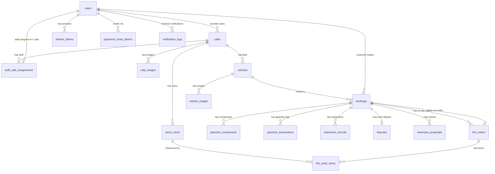

# 06 — Database Specification

**Last updated**: 2026-05-13  
**Status**: Active  
**Database**: PostgreSQL · ORM: TypeORM · Migration-first

> Đọc `01-domain-model.md` để hiểu entity relationships trước khi đọc file này.  
> File này là nguồn sự thật cho schema — khi thay đổi schema phải update file này cùng PR.

---

## 1. Conventions

| Convention | Quy tắc |
|-----------|---------|
| Tên bảng | `snake_case`, số nhiều (`users`, `bookings`) |
| Primary key | `id uuid DEFAULT gen_random_uuid()` |
| Foreign key | `{entity}_id uuid` |
| Timestamps | Mọi bảng có `created_at`, `updated_at`. Soft delete dùng `deleted_at`. |
| Tiền tệ | `numeric(15,2)` — không dùng `float` |
| Enum | Khai báo PostgreSQL ENUM type, dùng trong TypeORM `@Column({ type: 'enum' })` |
| JSON | `jsonb` — hỗ trợ index và query |
| Timezone | `timestamptz` — lưu UTC, hiển thị theo timezone client |
| Soft delete | `deleted_at timestamptz` — NULL = active, NOT NULL = deleted |

---

## 2. ERD Tổng quan



---

## 3. Bảng chi tiết

---

### 3.1 `users`

| Column | Type | Constraints | Ghi chú |
|--------|------|-------------|---------|
| `id` | `uuid` | PK, DEFAULT gen_random_uuid() | |
| `email` | `varchar(255)` | NOT NULL, UNIQUE | |
| `phone` | `varchar(20)` | NULL | |
| `full_name` | `varchar(255)` | NOT NULL | |
| `password_hash` | `text` | NULL | NULL nếu đăng nhập Google |
| `auth_provider` | `enum('LOCAL','GOOGLE')` | NOT NULL, DEFAULT 'LOCAL' | |
| `role` | `enum('CUSTOMER','PROVIDER','STAFF','ADMIN')` | NOT NULL | |
| `trust_score` | `numeric(5,2)` | NOT NULL, DEFAULT 100.00 | Chỉ có nghĩa với CUSTOMER (0–100) |
| `is_active` | `boolean` | NOT NULL, DEFAULT true | |
| `created_at` | `timestamptz` | NOT NULL, DEFAULT now() | |
| `updated_at` | `timestamptz` | NOT NULL, DEFAULT now() | |
| `deleted_at` | `timestamptz` | NULL | Soft delete |

**Indexes:**
```sql
CREATE UNIQUE INDEX idx_users_email ON users(email) WHERE deleted_at IS NULL;
CREATE INDEX idx_users_role ON users(role);
```

---

### 3.2 `refresh_tokens`

| Column | Type | Constraints | Ghi chú |
|--------|------|-------------|---------|
| `id` | `uuid` | PK | |
| `user_id` | `uuid` | NOT NULL, FK → users(id) ON DELETE CASCADE | |
| `token` | `text` | NOT NULL, UNIQUE | Hashed token |
| `expires_at` | `timestamptz` | NOT NULL | 7 ngày |
| `created_at` | `timestamptz` | NOT NULL, DEFAULT now() | |

**Indexes:**
```sql
CREATE INDEX idx_refresh_tokens_user_id ON refresh_tokens(user_id);
CREATE UNIQUE INDEX idx_refresh_tokens_token ON refresh_tokens(token);
```

---

### 3.3 `password_reset_tokens`

| Column | Type | Constraints | Ghi chú |
|--------|------|-------------|---------|
| `id` | `uuid` | PK | |
| `user_id` | `uuid` | NOT NULL, FK → users(id) ON DELETE CASCADE | |
| `token` | `text` | NOT NULL, UNIQUE | UUID random |
| `expires_at` | `timestamptz` | NOT NULL | 15 phút |
| `used_at` | `timestamptz` | NULL | NULL = chưa dùng, NOT NULL = đã dùng |
| `created_at` | `timestamptz` | NOT NULL, DEFAULT now() | |

---

### 3.4 `cafes`

> Mỗi row = 1 chi nhánh = 1 bộ config độc lập.  
> Fleet (`vehicles`) và menu (`menu_items`) tự động per-branch qua `cafe_id`.

**Thông tin cơ bản:**

| Column | Type | Constraints | Ghi chú |
|--------|------|-------------|---------|
| `id` | `uuid` | PK | |
| `provider_id` | `uuid` | NOT NULL, FK → users(id) | PROVIDER role |
| `name` | `varchar(255)` | NOT NULL | Tên chi nhánh VD: "RCField Quận 7" |
| `slug` | `varchar(100)` | NOT NULL, UNIQUE | URL path VD: `rcfield-quan-7` → `rcfield.com/rcfield-quan-7/` |
| `description` | `text` | NULL | Mô tả chi nhánh |
| `phone` | `varchar(20)` | NULL | SĐT liên hệ |
| `status` | `enum('PENDING','ACTIVE','SUSPENDED')` | NOT NULL, DEFAULT 'PENDING' | |
| `cover_image_url` | `text` | NULL | Ảnh đại diện (lấy từ cafe_images) |

**Địa chỉ & vị trí:**

| Column | Type | Constraints | Ghi chú |
|--------|------|-------------|---------|
| `address` | `text` | NOT NULL | Địa chỉ đầy đủ |
| `district` | `varchar(100)` | NOT NULL | Quận/Huyện |
| `city` | `varchar(100)` | NOT NULL | Thành phố |
| `latitude` | `numeric(10,7)` | NULL | Toạ độ — tính khoảng cách "gần nhất" |
| `longitude` | `numeric(10,7)` | NULL | |

**Config vận hành (per-branch):**

| Column | Type | Constraints | Ghi chú |
|--------|------|-------------|---------|
| `operating_hours` | `jsonb` | NOT NULL | `{ mon: {open:"09:00", close:"22:00"}, ... }` |
| `track_types` | `text[]` | NOT NULL, DEFAULT '{}' | `DRIFT`, `OBSTACLE`, `HILL_CLIMB` |
| `slot_duration_minutes` | `integer` | NOT NULL, DEFAULT 60 | Đơn vị slot (phút) |
| `slot_fee_rate` | `numeric(15,2)` | NOT NULL | Giá mỗi slot (VNĐ) — hiển thị, tính tiền dùng snapshot |
| `max_concurrent_bookings` | `integer` | NOT NULL, DEFAULT 10 | Số lượng booking đồng thời tối đa |
| `min_booking_notice_minutes` | `integer` | NOT NULL, DEFAULT 60 | Phải đặt trước tối thiểu bao nhiêu phút |

**Timestamps:**

| Column | Type | Constraints |
|--------|------|-------------|
| `created_at` | `timestamptz` | NOT NULL, DEFAULT now() |
| `updated_at` | `timestamptz` | NOT NULL, DEFAULT now() |

**Indexes:**
```sql
CREATE UNIQUE INDEX idx_cafes_slug ON cafes(slug);
CREATE INDEX idx_cafes_provider_id ON cafes(provider_id);
CREATE INDEX idx_cafes_status ON cafes(status);
CREATE INDEX idx_cafes_city_district ON cafes(city, district);
CREATE INDEX idx_cafes_location ON cafes(latitude, longitude);
```

**`operating_hours` JSON structure:**
```jsonc
{
  "mon": { "open": "09:00", "close": "22:00", "is_closed": false },
  "tue": { "open": "09:00", "close": "22:00", "is_closed": false },
  "wed": { "open": "09:00", "close": "22:00", "is_closed": false },
  "thu": { "open": "09:00", "close": "22:00", "is_closed": false },
  "fri": { "open": "09:00", "close": "23:00", "is_closed": false },
  "sat": { "open": "08:00", "close": "23:00", "is_closed": false },
  "sun": { "open": "08:00", "close": "22:00", "is_closed": false }
}
```

---

### 3.5 `staff_cafe_assignments`

> 1 Staff chỉ thuộc đúng 1 chi nhánh tại một thời điểm.

| Column | Type | Constraints | Ghi chú |
|--------|------|-------------|---------|
| `id` | `uuid` | PK | |
| `staff_id` | `uuid` | NOT NULL, UNIQUE, FK → users(id) | STAFF role — UNIQUE enforce 1 staff → 1 cafe |
| `cafe_id` | `uuid` | NOT NULL, FK → cafes(id) | |
| `assigned_at` | `timestamptz` | NOT NULL, DEFAULT now() | |
| `assigned_by` | `uuid` | NOT NULL, FK → users(id) | PROVIDER hoặc ADMIN |

**Indexes:**
```sql
CREATE UNIQUE INDEX idx_staff_cafe_staff_id ON staff_cafe_assignments(staff_id);
CREATE INDEX idx_staff_cafe_cafe_id ON staff_cafe_assignments(cafe_id);
```

---

### 3.6 `vehicles`

| Column | Type | Constraints | Ghi chú |
|--------|------|-------------|---------|
| `id` | `uuid` | PK | |
| `cafe_id` | `uuid` | NOT NULL, FK → cafes(id) | Thuộc chi nhánh nào |
| `name` | `varchar(255)` | NOT NULL | VD: "Traxxas Slash 4x4" |
| `description` | `text` | NULL | |
| `tier` | `enum('STANDARD','PREMIUM','RESTRICTED')` | NOT NULL | |
| `status` | `enum('AVAILABLE','IN_USE','MAINTENANCE','RETIRED')` | NOT NULL, DEFAULT 'AVAILABLE' | |
| `hourly_rate` | `numeric(15,2)` | NOT NULL | Giá thuê / giờ |
| `security_deposit` | `numeric(15,2)` | NOT NULL | Tiền đặt cọc |
| `damage_multiplier` | `numeric(4,2)` | NOT NULL, DEFAULT 1.00 | 1.0 / 1.5 / 2.0 |
| `cover_image_url` | `text` | NULL | Ảnh đại diện (lấy từ vehicle_images) |
| `last_maintenance_at` | `timestamptz` | NULL | |
| `created_at` | `timestamptz` | NOT NULL, DEFAULT now() | |
| `updated_at` | `timestamptz` | NOT NULL, DEFAULT now() | |
| `deleted_at` | `timestamptz` | NULL | Soft delete |

**Indexes:**
```sql
CREATE INDEX idx_vehicles_cafe_id ON vehicles(cafe_id);
CREATE INDEX idx_vehicles_status ON vehicles(status);
CREATE INDEX idx_vehicles_tier ON vehicles(tier);
```

---

### 3.7 `bookings`

| Column | Type | Constraints | Ghi chú |
|--------|------|-------------|---------|
| `id` | `uuid` | PK | |
| `customer_id` | `uuid` | NOT NULL, FK → users(id) | |
| `cafe_id` | `uuid` | NOT NULL, FK → cafes(id) | |
| `vehicle_id` | `uuid` | NULL, FK → vehicles(id) | NULL nếu BYOC |
| `mode` | `enum('RENTAL','BYOC')` | NOT NULL | |
| `status` | `enum('PENDING','CONFIRMED','ACTIVE','EXTENDING','CHECKING_OUT','DISPUTED','COMPLETED','CANCELLED')` | NOT NULL, DEFAULT 'PENDING' | |
| `slot_start` | `timestamptz` | NOT NULL | |
| `slot_end` | `timestamptz` | NOT NULL | Cập nhật khi gia hạn |
| `snapshot` | `jsonb` | NOT NULL | BookingSnapshot — bất biến sau khi tạo |
| `notes` | `text` | NULL | Ghi chú của customer |
| `cancelled_by` | `uuid` | NULL, FK → users(id) | Ai huỷ |
| `cancelled_at` | `timestamptz` | NULL | |
| `cancellation_reason` | `text` | NULL | |
| `created_at` | `timestamptz` | NOT NULL, DEFAULT now() | |
| `updated_at` | `timestamptz` | NOT NULL, DEFAULT now() | |

**Indexes:**
```sql
CREATE INDEX idx_bookings_customer_id ON bookings(customer_id);
CREATE INDEX idx_bookings_cafe_id ON bookings(cafe_id);
CREATE INDEX idx_bookings_vehicle_id ON bookings(vehicle_id);
CREATE INDEX idx_bookings_status ON bookings(status);
CREATE INDEX idx_bookings_slot_start ON bookings(slot_start);
-- Tránh double-booking
CREATE INDEX idx_bookings_vehicle_slot ON bookings(vehicle_id, slot_start, slot_end)
  WHERE status NOT IN ('CANCELLED');
```

**`snapshot` JSON structure:**
```jsonc
{
  "slot_fee_rate": 150000,      // VNĐ/slot
  "rental_fee": 50000,          // VNĐ (0 nếu BYOC)
  "security_deposit": 500000,   // VNĐ (0 nếu BYOC)
  "damage_multiplier": 1.5,
  "platform_fee_pct": 0.15,
  "refund_rule": "R1",
  "slot_duration_minutes": 60,
  "vehicle_name": "Traxxas Slash 4x4",  // snapshot tên xe
  "cafe_name": "RCField Q7"             // snapshot tên chi nhánh
}
```

---

### 3.8 `payment_components`

| Column | Type | Constraints | Ghi chú |
|--------|------|-------------|---------|
| `id` | `uuid` | PK | |
| `booking_id` | `uuid` | NOT NULL, FK → bookings(id) | |
| `type` | `enum('SLOT_FEE','RENTAL_FEE','SECURITY_DEPOSIT','EXTENSION_FEE','DAMAGE_CHARGE','FB_PREORDER')` | NOT NULL | |
| `amount` | `numeric(15,2)` | NOT NULL | Bất biến sau khi tạo |
| `status` | `enum('PENDING','HELD','DISBURSED','REFUNDED','PARTIALLY_REFUNDED')` | NOT NULL, DEFAULT 'PENDING' | |
| `disbursed_to` | `uuid` | NULL, FK → users(id) | provider_id khi disburse |
| `disbursed_at` | `timestamptz` | NULL | |
| `refunded_at` | `timestamptz` | NULL | |
| `refunded_amount` | `numeric(15,2)` | NULL | Dùng khi PARTIALLY_REFUNDED |
| `note` | `text` | NULL | Lý do adjustment |
| `created_at` | `timestamptz` | NOT NULL, DEFAULT now() | |
| `updated_at` | `timestamptz` | NOT NULL, DEFAULT now() | |

**Indexes:**
```sql
CREATE INDEX idx_payment_components_booking_id ON payment_components(booking_id);
CREATE INDEX idx_payment_components_status ON payment_components(status);
```

---

### 3.9 `inspection_records`

| Column | Type | Constraints | Ghi chú |
|--------|------|-------------|---------|
| `id` | `uuid` | PK | |
| `booking_id` | `uuid` | NOT NULL, FK → bookings(id) | |
| `type` | `enum('CHECK_IN','CHECK_OUT')` | NOT NULL | |
| `performed_by` | `uuid` | NOT NULL, FK → users(id) | Staff |
| `photos` | `jsonb` | NOT NULL | `{ front, back, left, right }` — 4 S3 URLs |
| `checklist` | `jsonb` | NOT NULL | `{ scratches, cracks, missing_parts, notes }` |
| `pre_existing_flag` | `boolean` | NOT NULL, DEFAULT false | Hư hỏng có sẵn (check-in) |
| `damage_noted` | `boolean` | NOT NULL, DEFAULT false | Damage mới (check-out) |
| `damage_description` | `text` | NULL | Mô tả damage (check-out) |
| `damage_cost_estimate` | `numeric(15,2)` | NULL | Staff ước tính |
| `customer_confirmed` | `boolean` | NOT NULL, DEFAULT false | |
| `customer_confirmed_at` | `timestamptz` | NULL | |
| `created_at` | `timestamptz` | NOT NULL, DEFAULT now() | |

**Indexes:**
```sql
CREATE INDEX idx_inspection_records_booking_id ON inspection_records(booking_id);
-- Đảm bảo mỗi booking chỉ có 1 check-in và 1 check-out
CREATE UNIQUE INDEX idx_inspection_booking_type ON inspection_records(booking_id, type);
```

---

### 3.10 `extension_proposals`

| Column | Type | Constraints | Ghi chú |
|--------|------|-------------|---------|
| `id` | `uuid` | PK | |
| `booking_id` | `uuid` | NOT NULL, FK → bookings(id) | |
| `proposed_by` | `uuid` | NOT NULL, FK → users(id) | Staff |
| `duration_minutes` | `integer` | NOT NULL | Số phút gia hạn |
| `fee_amount` | `numeric(15,2)` | NOT NULL | Phí gia hạn |
| `status` | `enum('PENDING','APPROVED','REJECTED','EXPIRED')` | NOT NULL, DEFAULT 'PENDING' | |
| `responded_by` | `uuid` | NULL, FK → users(id) | Customer |
| `responded_at` | `timestamptz` | NULL | |
| `created_at` | `timestamptz` | NOT NULL, DEFAULT now() | |

**Indexes:**
```sql
CREATE INDEX idx_extension_proposals_booking_id ON extension_proposals(booking_id);
```

---

### 3.11 `disputes`

| Column | Type | Constraints | Ghi chú |
|--------|------|-------------|---------|
| `id` | `uuid` | PK | |
| `booking_id` | `uuid` | NOT NULL, UNIQUE, FK → bookings(id) | Mỗi booking max 1 dispute |
| `opened_by` | `uuid` | NOT NULL, FK → users(id) | Customer hoặc Staff |
| `reason` | `text` | NOT NULL | |
| `evidence_photos` | `text[]` | NOT NULL, DEFAULT '{}' | S3 URLs thêm từ customer |
| `status` | `enum('OPEN','UNDER_REVIEW','RESOLVED')` | NOT NULL, DEFAULT 'OPEN' | |
| `resolution` | `text` | NULL | Admin ghi quyết định |
| `resolution_favor` | `enum('CUSTOMER','PROVIDER')` | NULL | Admin phán quyết |
| `resolved_by` | `uuid` | NULL, FK → users(id) | Admin |
| `resolved_at` | `timestamptz` | NULL | |
| `created_at` | `timestamptz` | NOT NULL, DEFAULT now() | |
| `updated_at` | `timestamptz` | NOT NULL, DEFAULT now() | |

**Indexes:**
```sql
CREATE UNIQUE INDEX idx_disputes_booking_id ON disputes(booking_id);
CREATE INDEX idx_disputes_status ON disputes(status);
```

---

### 3.12 `menu_items`

| Column | Type | Constraints | Ghi chú |
|--------|------|-------------|---------|
| `id` | `uuid` | PK | |
| `cafe_id` | `uuid` | NOT NULL, FK → cafes(id) | |
| `name` | `varchar(255)` | NOT NULL | |
| `description` | `text` | NULL | |
| `price` | `numeric(15,2)` | NOT NULL | |
| `category` | `varchar(100)` | NULL | VD: "Nước uống", "Đồ ăn" |
| `image_url` | `text` | NULL | |
| `is_available` | `boolean` | NOT NULL, DEFAULT true | Tạm ẩn khi hết hàng |
| `created_at` | `timestamptz` | NOT NULL, DEFAULT now() | |
| `updated_at` | `timestamptz` | NOT NULL, DEFAULT now() | |
| `deleted_at` | `timestamptz` | NULL | Soft delete |

**Indexes:**
```sql
CREATE INDEX idx_menu_items_cafe_id ON menu_items(cafe_id);
CREATE INDEX idx_menu_items_available ON menu_items(cafe_id, is_available) WHERE deleted_at IS NULL;
```

---

### 3.13 `fnb_orders`

> PRE_ORDER: 1 booking chỉ có đúng 1 đơn pre-order (tạo khi đặt lịch, Staff có thể chỉnh khi check-in).  
> ON_SITE: Có thể có nhiều đơn on-site trong 1 booking (gọi thêm nhiều lần).

| Column | Type | Constraints | Ghi chú |
|--------|------|-------------|---------|
| `id` | `uuid` | PK | |
| `booking_id` | `uuid` | NOT NULL, FK → bookings(id) | |
| `type` | `enum('PRE_ORDER','ON_SITE')` | NOT NULL | |
| `status` | `enum('PENDING','CONFIRMED','DELIVERED','CANCELLED')` | NOT NULL, DEFAULT 'PENDING' | |
| `total_amount` | `numeric(15,2)` | NOT NULL, DEFAULT 0 | |
| `created_by` | `uuid` | NOT NULL, FK → users(id) | Customer (pre-order) hoặc Staff (on-site) |
| `confirmed_by` | `uuid` | NULL, FK → users(id) | Staff confirm |
| `confirmed_at` | `timestamptz` | NULL | |
| `notes` | `text` | NULL | |
| `created_at` | `timestamptz` | NOT NULL, DEFAULT now() | |
| `updated_at` | `timestamptz` | NOT NULL, DEFAULT now() | |

**Indexes:**
```sql
CREATE INDEX idx_fnb_orders_booking_id ON fnb_orders(booking_id);
-- Enforce 1 PRE_ORDER per booking
CREATE UNIQUE INDEX idx_fnb_orders_preorder ON fnb_orders(booking_id)
  WHERE type = 'PRE_ORDER' AND status != 'CANCELLED';
```

---

### 3.14 `fnb_order_items`

| Column | Type | Constraints | Ghi chú |
|--------|------|-------------|---------|
| `id` | `uuid` | PK | |
| `order_id` | `uuid` | NOT NULL, FK → fnb_orders(id) | |
| `menu_item_id` | `uuid` | NOT NULL, FK → menu_items(id) | |
| `quantity` | `integer` | NOT NULL, CHECK quantity > 0 | |
| `unit_price` | `numeric(15,2)` | NOT NULL | Snapshot giá tại thời điểm order |
| `item_name_snapshot` | `varchar(255)` | NOT NULL | Snapshot tên item |
| `created_at` | `timestamptz` | NOT NULL, DEFAULT now() | |

**Indexes:**
```sql
CREATE INDEX idx_fnb_order_items_order_id ON fnb_order_items(order_id);
```

---

---

### 3.15 `cafe_images`

| Column | Type | Constraints | Ghi chú |
|--------|------|-------------|---------|
| `id` | `uuid` | PK | |
| `cafe_id` | `uuid` | NOT NULL, FK → cafes(id) ON DELETE CASCADE | |
| `url` | `text` | NOT NULL | Cloudinary URL |
| `sort_order` | `integer` | NOT NULL, DEFAULT 0 | Thứ tự hiển thị |
| `created_at` | `timestamptz` | NOT NULL, DEFAULT now() | |

**Indexes:**
```sql
CREATE INDEX idx_cafe_images_cafe_id ON cafe_images(cafe_id);
```

---

### 3.16 `vehicle_images`

| Column | Type | Constraints | Ghi chú |
|--------|------|-------------|---------|
| `id` | `uuid` | PK | |
| `vehicle_id` | `uuid` | NOT NULL, FK → vehicles(id) ON DELETE CASCADE | |
| `url` | `text` | NOT NULL | Cloudinary URL |
| `sort_order` | `integer` | NOT NULL, DEFAULT 0 | Thứ tự hiển thị |
| `created_at` | `timestamptz` | NOT NULL, DEFAULT now() | |

**Indexes:**
```sql
CREATE INDEX idx_vehicle_images_vehicle_id ON vehicle_images(vehicle_id);
```

---

### 3.17 `payment_transactions`

> Lưu raw response từ payment gateway — dùng cho debug, reconcile, dispute với gateway.

| Column | Type | Constraints | Ghi chú |
|--------|------|-------------|---------|
| `id` | `uuid` | PK | |
| `booking_id` | `uuid` | NOT NULL, FK → bookings(id) | |
| `gateway` | `varchar(50)` | NOT NULL | VD: 'VNPAY', 'MOMO', 'VIETQR' |
| `gateway_transaction_id` | `varchar(255)` | NULL | Transaction ID từ gateway |
| `type` | `enum('PAYMENT','REFUND')` | NOT NULL | |
| `amount` | `numeric(15,2)` | NOT NULL | |
| `status` | `varchar(50)` | NOT NULL | Raw status code từ gateway |
| `raw_request` | `jsonb` | NULL | Payload gửi đi |
| `raw_response` | `jsonb` | NULL | Response nhận về |
| `created_at` | `timestamptz` | NOT NULL, DEFAULT now() | |

**Indexes:**
```sql
CREATE INDEX idx_payment_transactions_booking_id ON payment_transactions(booking_id);
CREATE INDEX idx_payment_transactions_gateway_txn ON payment_transactions(gateway_transaction_id);
```

---

### 3.18 `notification_logs`

> Lưu lịch sử notification đã gửi — dùng để debug, tránh gửi trùng, và audit.

| Column | Type | Constraints | Ghi chú |
|--------|------|-------------|---------|
| `id` | `uuid` | PK | |
| `user_id` | `uuid` | NOT NULL, FK → users(id) | Người nhận |
| `booking_id` | `uuid` | NULL, FK → bookings(id) | Booking liên quan (nếu có) |
| `type` | `varchar(100)` | NOT NULL | VD: 'BOOKING_CONFIRMED', 'EXTENSION_PROPOSED', 'CHECKOUT_REMINDER' |
| `channel` | `enum('PUSH','SMS','EMAIL')` | NOT NULL | Kênh gửi |
| `title` | `varchar(255)` | NOT NULL | |
| `body` | `text` | NOT NULL | Nội dung notification |
| `status` | `enum('SENT','FAILED','PENDING')` | NOT NULL, DEFAULT 'PENDING' | |
| `error` | `text` | NULL | Lỗi nếu gửi thất bại |
| `sent_at` | `timestamptz` | NULL | |
| `created_at` | `timestamptz` | NOT NULL, DEFAULT now() | |

**Indexes:**
```sql
CREATE INDEX idx_notification_logs_user_id ON notification_logs(user_id);
CREATE INDEX idx_notification_logs_booking_id ON notification_logs(booking_id);
```

---

### 3.19 `feature_flags`

> Bật/tắt tính năng cho toàn hệ thống — ADMIN (team RCField) quản lý.  
> Dùng cho cả tính năng thường và tính năng AI (Phase 2).  
> Hệ thống chỉ có 1 tenant nên không cần per-tenant flag.

| Column | Type | Constraints | Ghi chú |
|--------|------|-------------|---------|
| `id` | `uuid` | PK | |
| `feature_key` | `varchar(100)` | NOT NULL, UNIQUE | VD: `'AI_DAMAGE_DETECTION'`, `'AI_CHATBOT'`, `'AI_ANALYTICS'` |
| `display_name` | `varchar(255)` | NOT NULL | Tên hiển thị trên ADMIN dashboard |
| `description` | `text` | NULL | Mô tả tính năng |
| `is_enabled` | `boolean` | NOT NULL, DEFAULT false | Đang bật hay tắt |
| `is_trial` | `boolean` | NOT NULL, DEFAULT false | Đang trong giai đoạn dùng thử |
| `trial_ends_at` | `timestamptz` | NULL | Cron job tự tắt khi hết hạn thử |
| `enabled_by` | `uuid` | NULL, FK → users(id) | ADMIN thực hiện bật/tắt |
| `enabled_at` | `timestamptz` | NULL | Thời điểm bật gần nhất |
| `note` | `text` | NULL | ADMIN ghi chú (VD: "Cho dùng thử đến 30/6") |
| `created_at` | `timestamptz` | NOT NULL, DEFAULT now() | |
| `updated_at` | `timestamptz` | NOT NULL, DEFAULT now() | |

**Indexes:**
```sql
CREATE UNIQUE INDEX idx_feature_flags_key ON feature_flags(feature_key);
CREATE INDEX idx_feature_flags_enabled ON feature_flags(is_enabled);
```

**Seed data (MVP — tất cả tắt mặc định):**
```sql
INSERT INTO feature_flags (feature_key, display_name, is_enabled) VALUES
  ('FNB',                 'Quản lý F&B',                   true),
  ('DISPUTE',             'Xử lý tranh chấp',               true),
  ('EXTENSION',           'Gia hạn slot',                   true),
  ('ANALYTICS',           'Báo cáo & Analytics',            true),
  ('AI_DAMAGE_DETECTION', 'Phát hiện hư hỏng bằng AI',      false),
  ('AI_CHATBOT',          'Chatbot hỗ trợ khách hàng (AI)', false),
  ('AI_ANALYTICS',        'Phân tích dữ liệu bằng AI',      false);
```

**Cơ chế:**
- **Bình thường**: ADMIN set `is_enabled = true` sau khi Provider đóng tiền tháng
- **Dùng thử**: ADMIN set `is_trial = true` + `trial_ends_at` → cron job tự set `is_enabled = false` khi hết hạn
- **Backend check**: Mọi API liên quan đến feature phải kiểm tra flag trước khi xử lý

---

## 4. Tổng hợp bảng

| # | Bảng | Mô tả |
|---|------|-------|
| 1 | `users` | Tất cả users (4 roles) |
| 2 | `refresh_tokens` | JWT refresh token sessions |
| 3 | `password_reset_tokens` | Reset password tokens (TTL 15 phút) |
| 4 | `cafes` | Chi nhánh (branches) |
| 5 | `cafe_images` | Gallery ảnh chi nhánh (Cloudinary URLs) |
| 6 | `staff_cafe_assignments` | Staff assign vào 1 chi nhánh (UNIQUE per staff) |
| 7 | `vehicles` | Fleet xe của từng chi nhánh |
| 8 | `vehicle_images` | Gallery ảnh xe (Cloudinary URLs) |
| 9 | `bookings` | Đơn đặt lịch |
| 10 | `payment_components` | Ledger thanh toán (immutable) |
| 11 | `payment_transactions` | Raw log từ payment gateway |
| 12 | `inspection_records` | Check-in / check-out với ảnh + checklist |
| 13 | `extension_proposals` | Đề xuất gia hạn slot |
| 14 | `disputes` | Tranh chấp |
| 15 | `menu_items` | Menu F&B per chi nhánh |
| 16 | `fnb_orders` | Đơn F&B (1 pre-order + nhiều on-site per booking) |
| 17 | `fnb_order_items` | Line items của đơn F&B |
| 18 | `notification_logs` | Lịch sử notification đã gửi |
| 19 | `feature_flags` | Bật/tắt tính năng — ADMIN quản lý (kể cả AI features) |

---


## Reference

- `docs/spec/01-domain-model.md` — Entity definitions, enums
- `docs/spec/02-state-machine.md` — Booking status transitions
- `docs/spec/03-payment-engine.md` — Payment component rules
- `docs/spec/04-inspection-flow.md` — Inspection protocol
- `docs/spec/business-rules/` — Business rules per domain

---

*Last updated: 2026-05-13 · 19 tables*
