# 06 — Database Specification

**Last updated**: 2026-05-15

> Đọc `01-domain-model.md` để hiểu entity relationships trước khi đọc file này.  
> File này là nguồn sự thật cho schema. Khi thay đổi schema phải update file này cùng PR.

---

## 1. Conventions

| Convention | Quy tắc |
|-----------|---------|
| Tên bảng | `snake_case`, số nhiều (`users`, `bookings`) |
| Primary key | `id uuid DEFAULT gen_random_uuid()` |
| Foreign key | `{entity}_id uuid` |
| Timestamps | Mọi bảng nghiệp vụ có `created_at`, `updated_at`; audit/log có thể chỉ cần `created_at` |
| Tiền tệ | `numeric(15,2)`; không dùng `float` |
| Enum | Khai báo PostgreSQL ENUM type, dùng trong TypeORM `@Column({ type: 'enum' })` |
| JSON | `jsonb`; chỉ dùng khi cấu trúc cần snapshot hoặc payload linh hoạt |
| Timezone | `timestamptz`; lưu UTC, hiển thị theo timezone client |
| Soft delete | `deleted_at timestamptz`; `NULL` = active, `NOT NULL` = deleted |

---

## 2. ERD Tổng Quan

```mermaid
erDiagram
    users ||--o{ cafes : "provider owns"
    users ||--o{ bookings : "customer makes"
    users ||--o{ customer_vehicles : "owns BYOC"
    users ||--o{ staff_cafe_assignments : "assigned to cafes"
    cafes ||--o{ staff_cafe_assignments : "has staff"
    cafes ||--o{ cafe_images : "images"
    cafes ||--o{ cafe_closures : "closures"
    cafes ||--o{ vehicles : "fleet"
    cafes ||--o{ menu_items : "menu"
    cafes ||--o{ packages : "offers"
    cafes ||--o{ subscriptions : "subscriptions"
    cafes ||--o{ contests : "organizes"
    cafes ||--o{ sessions : "sessions"

    vehicles ||--o{ vehicle_images : "images"
    vehicles ||--o{ vehicle_maintenance_logs : "maintenance"
    vehicles ||--o{ booking_vehicles : "planned in"
    vehicles ||--o{ session_vehicles : "used in"

    bookings ||--o{ booking_participants : "planned participants"
    bookings ||--o{ booking_vehicles : "planned vehicles"
    bookings ||--o{ sessions : "actual sessions"
    bookings ||--o{ payment_components : "breakdown"
    bookings ||--o{ payment_transactions : "gateway logs"
    bookings ||--o| reviews : "review"
    bookings ||--o{ fnb_orders : "food/drink orders"

    sessions ||--o{ session_participants : "actual attendees"
    sessions ||--o{ session_vehicles : "actual vehicles used"
    sessions ||--o{ inspections : "inspections"
    sessions ||--o{ extension_proposals : "extensions"
    sessions ||--o{ incidents : "incidents"
    sessions ||--o| disputes : "disputes"

    inspections ||--o{ inspection_photos : "photos"
    inspections ||--o{ inspection_checklists : "checklist items"

    incidents ||--o{ incident_participants : "parties involved"
    incidents ||--o{ disputes : "escalated to dispute"

    disputes ||--o{ dispute_evidences : "evidence"
    disputes ||--o{ dispute_parties : "parties"

    packages ||--o{ customer_packages : "purchased"
    users ||--o{ customer_packages : "owns"
    customer_packages ||--o{ package_usages : "usage history"
    bookings ||--o{ package_usages : "consumes package"

    subscriptions ||--o{ bookings : "generates bookings"

    contests ||--o{ contest_registrations : "registrations"
    users ||--o{ contest_registrations : "participates"

    fnb_orders ||--o{ fnb_order_items : "items"
    menu_items ||--o{ fnb_order_items : "in order"

    users ||--o{ refresh_tokens : "sessions"
    users ||--o{ password_reset_tokens : "resets"
    users ||--o{ notification_logs : "notifications"
    users ||--o{ trust_score_logs : "score history"
    bookings ||--o{ trust_score_logs : "triggered by"
    cafes ||--o{ promotions : "promotions"
    cafes ||--o{ cafe_announcements : "announcements"
    promotions ||--o{ promotion_usages : "used in"
    bookings ||--o| promotion_usages : "applies promo"
```



---

## 3. Thay Đổi Thiết Kế So Với ERD Cũ

### 3.1 Sửa cardinality sai

| Cũ | Vấn đề | Mới |
|----|--------|-----|
| `users ||--o| staff_cafe_assignments` | Một staff có thể làm nhiều chi nhánh hoặc chuyển chi nhánh theo thời gian | `users ||--o{ staff_cafe_assignments`; bỏ `UNIQUE(staff_id)` mặc định |
| `vehicles ||--o{ bookings` | Một booking có thể thuê nhiều xe | Thêm `booking_vehicles` để lưu xe dự kiến và `session_vehicles` để lưu xe thực tế |
| `bookings ||--o| fnb_orders` và `bookings ||--o{ fnb_orders` | Hai quan hệ trái cardinality giữa cùng cặp bảng | Giữ một quan hệ `bookings ||--o{ fnb_orders`, phân biệt bằng `order_type` |

### 3.2 Tách `bookings` và `sessions`

`bookings` là đơn đặt lịch: thời gian dự kiến, trạng thái đặt chỗ, khách đặt, snapshot giá và thanh toán.  
`sessions` là phiên chơi thực tế: check-in/check-out thực, staff phụ trách, xe/người thực tế tham gia, phát sinh gia hạn/sự cố/tranh chấp.

Lý do tách:

- Booking bị hủy hoặc no-show không nên có inspection, incident, dispute vận hành.
- Có thể phân biệt thời gian dự kiến và thời gian thực tế.
- Hỗ trợ khách đến muộn, về sớm, đổi xe, thêm người, thêm xe.
- Một booking có thể sinh 0 session hoặc nhiều session trong các case gói/subscription.

### 3.3 BYOC và trách nhiệm

BYOC không mặc định làm quán chịu trách nhiệm về xe cá nhân. Tuy nhiên hệ thống phải ghi nhận được:

- Xe BYOC nào đã vào quán.
- Ai điều khiển xe trong session.
- Xe BYOC gây thiệt hại cho tài sản quán hoặc xe thuê.
- Quán/staff/cơ sở vật chất gây thiệt hại cho xe BYOC.

Các bảng `customer_vehicles`, `session_vehicles`, `incidents`, `incident_participants`, `disputes`, `dispute_parties` xử lý các tình huống này bằng dữ liệu sự kiện thay vì áp đặt trách nhiệm cứng.

---

## 4. Enum Chuẩn

```typescript
enum UserRole { CUSTOMER, PROVIDER, STAFF, ADMIN }
enum AuthProvider { LOCAL, GOOGLE }

enum CafeStatus { PENDING, ACTIVE, SUSPENDED }
enum TrackType { DRIFT, CIRCUIT, OFFROAD }

enum VehicleTier { STANDARD, PREMIUM, RESTRICTED }
enum VehicleStatus { AVAILABLE, IN_USE, MAINTENANCE, RETIRED }
enum VehicleSource { RENTAL, BYOC }
enum SessionVehicleStatus { ASSIGNED, IN_USE, RETURNED, DAMAGED }

enum BookingMode { SINGLE, PACKAGE, SUBSCRIPTION }
enum PlayMode { RENTAL, BYOC, MIXED }
enum BookingSource { APP, STAFF_MANUAL, SYSTEM_SUBSCRIPTION }
enum BookingStatus { PENDING, CONFIRMED, CANCELLED, NO_SHOW, COMPLETED }
enum SessionStatus { CHECKED_IN, ACTIVE, EXTENDING, CHECKING_OUT, DISPUTED, COMPLETED, CANCELLED }

enum ParticipantType { BOOKER, REGISTERED_USER, WALK_IN_GUEST }
enum ParticipantRole { DRIVER, PLAYER, SPECTATOR, GUARDIAN }

enum PaymentComponentType {
  SLOT_FEE, RENTAL_FEE, SECURITY_DEPOSIT, EXTENSION_FEE,
  DAMAGE_CHARGE, FNB_PREORDER, FNB_ON_SITE, PACKAGE_PURCHASE
}
enum PaymentComponentStatus { PENDING, HELD, DISBURSED, REFUNDED, PARTIALLY_REFUNDED, CAPTURED }
enum PaymentTransactionType { PAYMENT, REFUND, CAPTURE, VOID }

enum InspectionType { CHECK_IN, CHECK_OUT, STAFF_HANDOVER }
enum InspectionSubjectType { RENTAL_VEHICLE, BYOC_VEHICLE, ACCESSORY }
enum InspectionItemStatus { OK, SCRATCHED, BROKEN, MISSING, DIRTY, NEEDS_REVIEW }
enum PhotoAngle { FRONT, BACK, LEFT, RIGHT, TOP, BOTTOM, DETAIL, OTHER }

enum ExtensionProposalStatus { PENDING, APPROVED, REJECTED, EXPIRED, CANCELLED }

enum IncidentType { RENTAL_DAMAGE, BYOC_DAMAGE, COLLISION, LOST_ACCESSORY, STAFF_HANDLING, FACILITY, OTHER }
enum IncidentStatus { RECORDED, UNDER_REVIEW, RESOLVED, ESCALATED }
enum LiabilityRole { RESPONSIBLE, AFFECTED, WITNESS, STAFF_HANDLER }

enum DisputeType { RENTAL_DAMAGE, BYOC_DAMAGE, COLLISION, STAFF_HANDLING, FACILITY, PAYMENT, OTHER }
enum DisputeStatus { OPEN, UNDER_REVIEW, WAITING_EVIDENCE, RESOLVED, REJECTED }
enum DisputePartyRole { CLAIMANT, RESPONDENT, RELATED_PARTY }
enum ResponsibleParty { CUSTOMER, PROVIDER, STAFF, PLATFORM, SHARED, UNKNOWN }

enum FnbOrderType { PRE_ORDER, ON_SITE }
enum FnbOrderStatus { PENDING, CONFIRMED, PREPARING, DELIVERED, CANCELLED }

enum PackageStatus { ACTIVE, INACTIVE, ARCHIVED }
enum CustomerPackageStatus { ACTIVE, EXPIRED, DEPLETED, CANCELLED }
enum SubscriptionStatus { ACTIVE, PAUSED, CANCELLED, EXPIRED }
enum ContestStatus { DRAFT, OPEN, CLOSED, RUNNING, COMPLETED, CANCELLED }
enum ContestRegistrationStatus { PENDING, CONFIRMED, CANCELLED, CHECKED_IN }

enum NotificationChannel { PUSH, SMS, EMAIL }
enum NotificationStatus { PENDING, SENT, FAILED }
enum TrustScoreReason { NO_SHOW, DAMAGE_CONFIRMED, DISPUTE_LOST, BOOKING_STREAK, ADMIN_ADJUSTMENT }
enum DiscountType { PERCENT, FIXED }
enum PromoApplicableTo { ALL, RENTAL, BYOC, MIXED }
```

---

## 5. Bảng Chi Tiết

### 5.1 Identity & Access

#### `users`

| Column | Type | Constraints | Ghi chú |
|--------|------|-------------|---------|
| `id` | `uuid` | PK | |
| `email` | `varchar(255)` | NOT NULL, UNIQUE | |
| `phone` | `varchar(20)` | NULL | |
| `full_name` | `varchar(255)` | NOT NULL | |
| `password_hash` | `text` | NULL | NULL nếu đăng nhập Google |
| `auth_provider` | `AuthProvider` | NOT NULL, DEFAULT `LOCAL` | |
| `role` | `UserRole` | NOT NULL | |
| `trust_score` | `numeric(5,2)` | NOT NULL, DEFAULT `100.00` | Chỉ có nghĩa với CUSTOMER |
| `is_active` | `boolean` | NOT NULL, DEFAULT `true` | |
| `created_at`, `updated_at`, `deleted_at` | `timestamptz` | | |

**Indexes**

```sql
CREATE UNIQUE INDEX idx_users_email ON users(email) WHERE deleted_at IS NULL;
CREATE INDEX idx_users_role ON users(role);
```

#### `refresh_tokens`

| Column | Type | Constraints | Ghi chú |
|--------|------|-------------|---------|
| `id` | `uuid` | PK | |
| `user_id` | `uuid` | NOT NULL, FK -> users(id) ON DELETE CASCADE | |
| `token` | `text` | NOT NULL, UNIQUE | Hashed token |
| `expires_at` | `timestamptz` | NOT NULL | |
| `created_at` | `timestamptz` | NOT NULL | |

#### `password_reset_tokens`

| Column | Type | Constraints | Ghi chú |
|--------|------|-------------|---------|
| `id` | `uuid` | PK | |
| `user_id` | `uuid` | NOT NULL, FK -> users(id) ON DELETE CASCADE | |
| `token` | `text` | NOT NULL, UNIQUE | |
| `expires_at` | `timestamptz` | NOT NULL | |
| `used_at` | `timestamptz` | NULL | |
| `created_at` | `timestamptz` | NOT NULL | |

---

### 5.2 Cafe & Staff

#### `cafes`

| Column | Type | Constraints | Ghi chú |
|--------|------|-------------|---------|
| `id` | `uuid` | PK | |
| `provider_id` | `uuid` | NOT NULL, FK -> users(id) | PROVIDER role |
| `name` | `varchar(255)` | NOT NULL | |
| `slug` | `varchar(100)` | NOT NULL, UNIQUE | |
| `description` | `text` | NULL | |
| `phone` | `varchar(20)` | NULL | |
| `status` | `CafeStatus` | NOT NULL, DEFAULT `PENDING` | |
| `cover_image_url` | `text` | NULL | |
| `address` | `text` | NOT NULL | |
| `district` | `varchar(100)` | NOT NULL | |
| `city` | `varchar(100)` | NOT NULL | |
| `latitude`, `longitude` | `numeric(10,7)` | NULL | |
| `operating_hours` | `jsonb` | NOT NULL | `{ mon: { open, close, is_closed }, ... }` |
| `track_types` | `text[]` | NOT NULL, DEFAULT `{}` | `DRIFT`, `CIRCUIT`, `OFFROAD` |
| `slot_duration_minutes` | `integer` | NOT NULL, DEFAULT `60` | |
| `slot_fee_rate` | `numeric(15,2)` | NOT NULL | Giá slot hiện tại; booking dùng snapshot |
| `max_concurrent_bookings` | `integer` | NOT NULL, DEFAULT `10` | |
| `byoc_capacity` | `integer` | NOT NULL, DEFAULT `5` | |
| `created_at`, `updated_at` | `timestamptz` | | |

#### `staff_cafe_assignments`

> Một staff có thể có nhiều phân công theo chi nhánh hoặc theo ca. Nếu nghiệp vụ cần giới hạn “một staff active ở một chi nhánh tại một thời điểm”, dùng partial unique index theo `ended_at IS NULL`, không dùng `UNIQUE(staff_id)` toàn bảng.

| Column | Type | Constraints | Ghi chú |
|--------|------|-------------|---------|
| `id` | `uuid` | PK | |
| `staff_id` | `uuid` | NOT NULL, FK -> users(id) | STAFF role |
| `cafe_id` | `uuid` | NOT NULL, FK -> cafes(id) | |
| `assigned_at` | `timestamptz` | NOT NULL, DEFAULT now() | |
| `ended_at` | `timestamptz` | NULL | NULL = active |
| `assigned_by` | `uuid` | NOT NULL, FK -> users(id) | PROVIDER hoặc ADMIN |

```sql
CREATE INDEX idx_staff_cafe_staff_id ON staff_cafe_assignments(staff_id);
CREATE INDEX idx_staff_cafe_cafe_id ON staff_cafe_assignments(cafe_id);
CREATE UNIQUE INDEX idx_staff_active_per_cafe
  ON staff_cafe_assignments(staff_id, cafe_id)
  WHERE ended_at IS NULL;
```

#### `cafe_images`, `cafe_closures`, `cafe_announcements`

| Bảng | Cột chính | Ghi chú |
|------|----------|---------|
| `cafe_images` | `cafe_id`, `url`, `sort_order` | Gallery chi nhánh |
| `cafe_closures` | `cafe_id`, `closed_date`, `reason`, `created_by` | Block booking ngày đặc biệt |
| `cafe_announcements` | `cafe_id`, `title`, `content`, `image_url`, `starts_at`, `ends_at`, `is_active`, `created_by` | Banner/tin tức chi nhánh |

---

### 5.3 Fleet & BYOC

#### `vehicles`

| Column | Type | Constraints | Ghi chú |
|--------|------|-------------|---------|
| `id` | `uuid` | PK | |
| `cafe_id` | `uuid` | NOT NULL, FK -> cafes(id) | Xe thuộc chi nhánh |
| `name` | `varchar(255)` | NOT NULL | |
| `description` | `text` | NULL | |
| `tier` | `VehicleTier` | NOT NULL | |
| `status` | `VehicleStatus` | NOT NULL, DEFAULT `AVAILABLE` | |
| `hourly_rate` | `numeric(15,2)` | NOT NULL | |
| `security_deposit` | `numeric(15,2)` | NOT NULL | |
| `damage_multiplier` | `numeric(4,2)` | NOT NULL, DEFAULT `1.00` | |
| `compatible_track_types` | `text[]` | NOT NULL, DEFAULT `{}` | Rỗng = mọi track của cafe |
| `cover_image_url` | `text` | NULL | |
| `last_maintenance_at` | `timestamptz` | NULL | |
| `created_at`, `updated_at`, `deleted_at` | `timestamptz` | | |

#### `customer_vehicles`

> Xe cá nhân của khách trong mô hình BYOC.

| Column | Type | Constraints | Ghi chú |
|--------|------|-------------|---------|
| `id` | `uuid` | PK | |
| `customer_id` | `uuid` | NOT NULL, FK -> users(id) | Chủ xe |
| `brand` | `varchar(100)` | NULL | |
| `model` | `varchar(100)` | NULL | |
| `serial_number` | `varchar(100)` | NULL | Không bắt buộc vì nhiều xe hobby không có serial rõ ràng |
| `description` | `text` | NULL | |
| `notes` | `text` | NULL | Ghi chú an toàn/tình trạng |
| `created_at`, `updated_at`, `deleted_at` | `timestamptz` | | |

```sql
CREATE INDEX idx_customer_vehicles_customer_id ON customer_vehicles(customer_id);
CREATE INDEX idx_customer_vehicles_serial ON customer_vehicles(serial_number)
  WHERE serial_number IS NOT NULL AND deleted_at IS NULL;
```

#### `vehicle_images`, `vehicle_maintenance_logs`

| Bảng | Cột chính | Ghi chú |
|------|----------|---------|
| `vehicle_images` | `vehicle_id`, `url`, `sort_order` | Gallery xe thuê |
| `vehicle_maintenance_logs` | `vehicle_id`, `type`, `description`, `cost`, `performed_by`, `performed_at`, `next_scheduled_at`, `related_session_id` | Lịch sử bảo trì/sửa chữa |

---

### 5.4 Booking Layer

#### `bookings`

> Booking là đơn đặt lịch dự kiến. Không lưu `vehicle_id` trực tiếp vì một booking có thể có nhiều xe hoặc không thuê xe.

| Column | Type | Constraints | Ghi chú |
|--------|------|-------------|---------|
| `id` | `uuid` | PK | |
| `customer_id` | `uuid` | NOT NULL, FK -> users(id) | Người đặt |
| `cafe_id` | `uuid` | NOT NULL, FK -> cafes(id) | |
| `subscription_id` | `uuid` | NULL, FK -> subscriptions(id) | Nếu sinh từ lịch định kỳ |
| `booking_mode` | `BookingMode` | NOT NULL, DEFAULT `SINGLE` | `SINGLE`, `PACKAGE`, `SUBSCRIPTION` |
| `play_mode` | `PlayMode` | NOT NULL | `RENTAL`, `BYOC`, `MIXED` |
| `source` | `BookingSource` | NOT NULL, DEFAULT `APP` | |
| `track_type` | `varchar(50)` | NOT NULL | |
| `status` | `BookingStatus` | NOT NULL, DEFAULT `PENDING` | |
| `slot_start` | `timestamptz` | NOT NULL | Dự kiến |
| `slot_end` | `timestamptz` | NOT NULL | Dự kiến |
| `slot_count` | `integer` | NOT NULL, DEFAULT `1` | |
| `payment_expires_at` | `timestamptz` | NOT NULL | Auto-cancel nếu quá hạn |
| `snapshot` | `jsonb` | NOT NULL | Giá, policy, cafe/vehicle/package snapshot |
| `promotion_id` | `uuid` | NULL, FK -> promotions(id) | |
| `discount_amount` | `numeric(15,2)` | NULL | |
| `notes` | `text` | NULL | |
| `cancelled_by` | `uuid` | NULL, FK -> users(id) | |
| `cancelled_at` | `timestamptz` | NULL | |
| `cancellation_reason` | `text` | NULL | |
| `created_at`, `updated_at` | `timestamptz` | | |

```sql
CREATE INDEX idx_bookings_customer_id ON bookings(customer_id);
CREATE INDEX idx_bookings_cafe_id ON bookings(cafe_id);
CREATE INDEX idx_bookings_status ON bookings(status);
CREATE INDEX idx_bookings_slot ON bookings(cafe_id, track_type, slot_start, slot_end);
CREATE INDEX idx_bookings_payment_expires ON bookings(payment_expires_at)
  WHERE status = 'PENDING';
```

#### `booking_vehicles`

> Xe thuê dự kiến trong booking. Chỉ dùng cho `RENTAL` hoặc phần rental của `MIXED`; BYOC dự kiến nằm ở `booking_participants`/ghi chú hoặc được chốt khi check-in bằng `session_vehicles`.

| Column | Type | Constraints | Ghi chú |
|--------|------|-------------|---------|
| `id` | `uuid` | PK | |
| `booking_id` | `uuid` | NOT NULL, FK -> bookings(id) ON DELETE CASCADE | |
| `vehicle_id` | `uuid` | NOT NULL, FK -> vehicles(id) | |
| `assigned_to_participant_id` | `uuid` | NULL, FK -> booking_participants(id) | Dự kiến ai dùng |
| `hourly_rate_snapshot` | `numeric(15,2)` | NOT NULL | |
| `security_deposit_snapshot` | `numeric(15,2)` | NOT NULL | |
| `damage_multiplier_snapshot` | `numeric(4,2)` | NOT NULL | |
| `created_at` | `timestamptz` | NOT NULL | |

```sql
CREATE UNIQUE INDEX idx_booking_vehicles_unique ON booking_vehicles(booking_id, vehicle_id);
CREATE INDEX idx_booking_vehicles_vehicle_slot ON booking_vehicles(vehicle_id, booking_id);
```

#### `booking_participants`

| Column | Type | Constraints | Ghi chú |
|--------|------|-------------|---------|
| `id` | `uuid` | PK | |
| `booking_id` | `uuid` | NOT NULL, FK -> bookings(id) ON DELETE CASCADE | |
| `user_id` | `uuid` | NULL, FK -> users(id) | NULL nếu khách không có app |
| `participant_type` | `ParticipantType` | NOT NULL | `BOOKER`, `REGISTERED_USER`, `WALK_IN_GUEST` |
| `display_name` | `varchar(255)` | NULL | Cho guest |
| `phone` | `varchar(20)` | NULL | Cho guest |
| `is_primary_responsible` | `boolean` | NOT NULL, DEFAULT `false` | Người chịu trách nhiệm tài chính |
| `created_at`, `updated_at` | `timestamptz` | | |

```sql
CREATE INDEX idx_booking_participants_booking_id ON booking_participants(booking_id);
CREATE UNIQUE INDEX idx_booking_primary_responsible
  ON booking_participants(booking_id)
  WHERE is_primary_responsible = true;
```

---

### 5.5 Session Layer

#### `sessions`

| Column | Type | Constraints | Ghi chú |
|--------|------|-------------|---------|
| `id` | `uuid` | PK | |
| `booking_id` | `uuid` | NOT NULL, FK -> bookings(id) | |
| `cafe_id` | `uuid` | NOT NULL, FK -> cafes(id) | Denormalized để query nhanh |
| `status` | `SessionStatus` | NOT NULL, DEFAULT `CHECKED_IN` | |
| `checked_in_by` | `uuid` | NOT NULL, FK -> users(id) | Staff |
| `checked_out_by` | `uuid` | NULL, FK -> users(id) | Staff |
| `actual_start_at` | `timestamptz` | NOT NULL | Check-in thực tế |
| `actual_end_at` | `timestamptz` | NULL | Check-out thực tế |
| `planned_end_at` | `timestamptz` | NOT NULL | Có thể cập nhật khi gia hạn |
| `actual_total_amount` | `numeric(15,2)` | NOT NULL, DEFAULT `0` | Tổng tiền thực tế sau phát sinh |
| `notes` | `text` | NULL | |
| `created_at`, `updated_at` | `timestamptz` | | |

```sql
CREATE INDEX idx_sessions_booking_id ON sessions(booking_id);
CREATE INDEX idx_sessions_cafe_status ON sessions(cafe_id, status);
CREATE INDEX idx_sessions_actual_start ON sessions(cafe_id, actual_start_at);
```

#### `session_participants`

| Column | Type | Constraints | Ghi chú |
|--------|------|-------------|---------|
| `id` | `uuid` | PK | |
| `session_id` | `uuid` | NOT NULL, FK -> sessions(id) ON DELETE CASCADE | |
| `booking_participant_id` | `uuid` | NULL, FK -> booking_participants(id) | NULL nếu thêm tại check-in |
| `user_id` | `uuid` | NULL, FK -> users(id) | |
| `display_name` | `varchar(255)` | NULL | Guest |
| `phone` | `varchar(20)` | NULL | Guest |
| `role` | `ParticipantRole` | NOT NULL | `DRIVER`, `PLAYER`, `SPECTATOR`, `GUARDIAN` |
| `is_primary_responsible` | `boolean` | NOT NULL, DEFAULT `false` | Copy từ booking hoặc staff chỉnh |
| `checked_in_at` | `timestamptz` | NOT NULL | |
| `created_at`, `updated_at` | `timestamptz` | | |

#### `session_vehicles`

> Danh sách xe thực tế dùng trong session. Bảng này hỗ trợ `RENTAL`, `BYOC`, và `MIXED`.

| Column | Type | Constraints | Ghi chú |
|--------|------|-------------|---------|
| `id` | `uuid` | PK | |
| `session_id` | `uuid` | NOT NULL, FK -> sessions(id) ON DELETE CASCADE | |
| `booking_vehicle_id` | `uuid` | NULL, FK -> booking_vehicles(id) | Nếu xe thuê có trong kế hoạch |
| `vehicle_source` | `VehicleSource` | NOT NULL | `RENTAL` hoặc `BYOC` |
| `vehicle_id` | `uuid` | NULL, FK -> vehicles(id) | Bắt buộc khi `RENTAL` |
| `customer_vehicle_id` | `uuid` | NULL, FK -> customer_vehicles(id) | Bắt buộc khi `BYOC` |
| `assigned_to_participant_id` | `uuid` | NULL, FK -> session_participants(id) | Ai điều khiển |
| `status` | `SessionVehicleStatus` | NOT NULL, DEFAULT `ASSIGNED` | |
| `started_at` | `timestamptz` | NULL | |
| `returned_at` | `timestamptz` | NULL | |
| `notes` | `text` | NULL | |
| `created_at`, `updated_at` | `timestamptz` | | |

```sql
CREATE INDEX idx_session_vehicles_session_id ON session_vehicles(session_id);
CREATE INDEX idx_session_vehicles_vehicle_id ON session_vehicles(vehicle_id)
  WHERE vehicle_id IS NOT NULL;
CREATE INDEX idx_session_vehicles_customer_vehicle_id ON session_vehicles(customer_vehicle_id)
  WHERE customer_vehicle_id IS NOT NULL;
```

---

### 5.6 Payment

#### `payment_components`

| Column | Type | Constraints | Ghi chú |
|--------|------|-------------|---------|
| `id` | `uuid` | PK | |
| `booking_id` | `uuid` | NOT NULL, FK -> bookings(id) | Thanh toán gốc thuộc booking |
| `session_id` | `uuid` | NULL, FK -> sessions(id) | Phát sinh trong session nếu có |
| `type` | `PaymentComponentType` | NOT NULL | |
| `amount` | `numeric(15,2)` | NOT NULL | Immutable |
| `status` | `PaymentComponentStatus` | NOT NULL, DEFAULT `PENDING` | |
| `disbursed_to` | `uuid` | NULL, FK -> users(id) | Provider khi disburse |
| `disbursed_at`, `refunded_at` | `timestamptz` | NULL | |
| `refunded_amount` | `numeric(15,2)` | NULL | |
| `note` | `text` | NULL | |
| `created_at`, `updated_at` | `timestamptz` | | |

#### `payment_transactions`

| Column | Type | Constraints | Ghi chú |
|--------|------|-------------|---------|
| `id` | `uuid` | PK | |
| `booking_id` | `uuid` | NOT NULL, FK -> bookings(id) | |
| `session_id` | `uuid` | NULL, FK -> sessions(id) | |
| `gateway` | `varchar(50)` | NOT NULL | `VNPAY`, `MOMO`, `VIETQR` |
| `gateway_transaction_id` | `varchar(255)` | NULL | |
| `type` | `PaymentTransactionType` | NOT NULL | |
| `amount` | `numeric(15,2)` | NOT NULL | |
| `status` | `varchar(50)` | NOT NULL | Raw gateway status |
| `raw_request`, `raw_response` | `jsonb` | NULL | |
| `created_at` | `timestamptz` | NOT NULL | |

---

### 5.7 Inspection & Evidence

#### `inspections`

> Thay thế `inspection_records`. Inspection gắn với session và có thể gắn tới một `session_vehicle` cụ thể.

| Column | Type | Constraints | Ghi chú |
|--------|------|-------------|---------|
| `id` | `uuid` | PK | |
| `session_id` | `uuid` | NOT NULL, FK -> sessions(id) | |
| `session_vehicle_id` | `uuid` | NULL, FK -> session_vehicles(id) | NULL nếu inspection cấp session |
| `type` | `InspectionType` | NOT NULL | |
| `subject_type` | `InspectionSubjectType` | NOT NULL | |
| `performed_by` | `uuid` | NOT NULL, FK -> users(id) | Staff |
| `pre_existing_flag` | `boolean` | NOT NULL, DEFAULT `false` | |
| `damage_noted` | `boolean` | NOT NULL, DEFAULT `false` | |
| `damage_description` | `text` | NULL | |
| `damage_cost_estimate` | `numeric(15,2)` | NULL | |
| `ai_analysis_json` | `jsonb` | NULL | Kết quả AI nếu bật feature |
| `customer_confirmed` | `boolean` | NOT NULL, DEFAULT `false` | |
| `customer_confirmed_at` | `timestamptz` | NULL | |
| `created_at`, `updated_at` | `timestamptz` | | |

```sql
CREATE INDEX idx_inspections_session_id ON inspections(session_id);
CREATE INDEX idx_inspections_session_vehicle_id ON inspections(session_vehicle_id);
CREATE INDEX idx_inspections_type ON inspections(session_id, type);
```

#### `inspection_photos`

| Column | Type | Constraints | Ghi chú |
|--------|------|-------------|---------|
| `id` | `uuid` | PK | |
| `inspection_id` | `uuid` | NOT NULL, FK -> inspections(id) ON DELETE CASCADE | |
| `angle` | `PhotoAngle` | NOT NULL | |
| `url` | `text` | NOT NULL | Cloudinary/S3 URL |
| `uploaded_by` | `uuid` | NOT NULL, FK -> users(id) | |
| `metadata` | `jsonb` | NULL | EXIF, AI bounding boxes, device info |
| `created_at` | `timestamptz` | NOT NULL | |

#### `inspection_checklists`

| Column | Type | Constraints | Ghi chú |
|--------|------|-------------|---------|
| `id` | `uuid` | PK | |
| `inspection_id` | `uuid` | NOT NULL, FK -> inspections(id) ON DELETE CASCADE | |
| `item_key` | `varchar(100)` | NOT NULL | VD: `front_bumper`, `left_wheel` |
| `item_label` | `varchar(255)` | NOT NULL | Label hiển thị |
| `status` | `InspectionItemStatus` | NOT NULL | |
| `note` | `text` | NULL | |
| `created_at`, `updated_at` | `timestamptz` | | |

---

### 5.8 Extensions, Incidents & Disputes

#### `extension_proposals`

| Column | Type | Constraints | Ghi chú |
|--------|------|-------------|---------|
| `id` | `uuid` | PK | |
| `session_id` | `uuid` | NOT NULL, FK -> sessions(id) | |
| `proposed_by` | `uuid` | NOT NULL, FK -> users(id) | Staff |
| `duration_minutes` | `integer` | NOT NULL | |
| `fee_amount` | `numeric(15,2)` | NOT NULL | |
| `status` | `ExtensionProposalStatus` | NOT NULL, DEFAULT `PENDING` | |
| `responded_by` | `uuid` | NULL, FK -> users(id) | Customer |
| `responded_at` | `timestamptz` | NULL | |
| `created_at`, `updated_at` | `timestamptz` | | |

#### `incidents`

| Column | Type | Constraints | Ghi chú |
|--------|------|-------------|---------|
| `id` | `uuid` | PK | |
| `session_id` | `uuid` | NOT NULL, FK -> sessions(id) | |
| `reported_by` | `uuid` | NOT NULL, FK -> users(id) | Staff/customer |
| `type` | `IncidentType` | NOT NULL | |
| `status` | `IncidentStatus` | NOT NULL, DEFAULT `RECORDED` | |
| `occurred_at` | `timestamptz` | NOT NULL | |
| `description` | `text` | NOT NULL | |
| `estimated_amount` | `numeric(15,2)` | NULL | |
| `created_at`, `updated_at` | `timestamptz` | | |

#### `incident_participants`

| Column | Type | Constraints | Ghi chú |
|--------|------|-------------|---------|
| `id` | `uuid` | PK | |
| `incident_id` | `uuid` | NOT NULL, FK -> incidents(id) ON DELETE CASCADE | |
| `session_participant_id` | `uuid` | NULL, FK -> session_participants(id) | |
| `session_vehicle_id` | `uuid` | NULL, FK -> session_vehicles(id) | |
| `liability_role` | `LiabilityRole` | NOT NULL | |
| `liability_percent` | `numeric(5,2)` | NULL | 0-100, staff/admin xác nhận |
| `note` | `text` | NULL | |
| `created_at`, `updated_at` | `timestamptz` | | |

#### `disputes`

| Column | Type | Constraints | Ghi chú |
|--------|------|-------------|---------|
| `id` | `uuid` | PK | |
| `session_id` | `uuid` | NOT NULL, FK -> sessions(id) | |
| `incident_id` | `uuid` | NULL, FK -> incidents(id) | NULL nếu dispute không xuất phát từ incident |
| `opened_by` | `uuid` | NOT NULL, FK -> users(id) | |
| `dispute_type` | `DisputeType` | NOT NULL | |
| `status` | `DisputeStatus` | NOT NULL, DEFAULT `OPEN` | |
| `reason` | `text` | NOT NULL | |
| `responsible_party` | `ResponsibleParty` | NULL | Kết luận cuối |
| `claimed_amount` | `numeric(15,2)` | NULL | |
| `final_amount` | `numeric(15,2)` | NULL | |
| `resolution` | `text` | NULL | |
| `resolved_by` | `uuid` | NULL, FK -> users(id) | Admin |
| `resolved_at` | `timestamptz` | NULL | |
| `created_at`, `updated_at` | `timestamptz` | | |

```sql
CREATE INDEX idx_disputes_session_id ON disputes(session_id);
CREATE INDEX idx_disputes_incident_id ON disputes(incident_id);
CREATE INDEX idx_disputes_status ON disputes(status);
```

#### `dispute_evidences`

| Column | Type | Constraints | Ghi chú |
|--------|------|-------------|---------|
| `id` | `uuid` | PK | |
| `dispute_id` | `uuid` | NOT NULL, FK -> disputes(id) ON DELETE CASCADE | |
| `submitted_by` | `uuid` | NOT NULL, FK -> users(id) | |
| `evidence_type` | `varchar(50)` | NOT NULL | `PHOTO`, `VIDEO`, `INSPECTION`, `NOTE`, `PAYMENT` |
| `url` | `text` | NULL | File evidence |
| `inspection_id` | `uuid` | NULL, FK -> inspections(id) | Nếu evidence là inspection |
| `description` | `text` | NULL | |
| `metadata` | `jsonb` | NULL | |
| `created_at` | `timestamptz` | NOT NULL | |

#### `dispute_parties`

| Column | Type | Constraints | Ghi chú |
|--------|------|-------------|---------|
| `id` | `uuid` | PK | |
| `dispute_id` | `uuid` | NOT NULL, FK -> disputes(id) ON DELETE CASCADE | |
| `user_id` | `uuid` | NULL, FK -> users(id) | |
| `session_participant_id` | `uuid` | NULL, FK -> session_participants(id) | |
| `role` | `DisputePartyRole` | NOT NULL | |
| `claimed_liability_percent` | `numeric(5,2)` | NULL | |
| `final_liability_percent` | `numeric(5,2)` | NULL | |
| `note` | `text` | NULL | |
| `created_at`, `updated_at` | `timestamptz` | | |

---

### 5.9 F&B

#### `menu_items`

| Column | Type | Constraints | Ghi chú |
|--------|------|-------------|---------|
| `id` | `uuid` | PK | |
| `cafe_id` | `uuid` | NOT NULL, FK -> cafes(id) | |
| `name` | `varchar(255)` | NOT NULL | |
| `description` | `text` | NULL | |
| `price` | `numeric(15,2)` | NOT NULL | |
| `category` | `varchar(100)` | NULL | |
| `image_url` | `text` | NULL | |
| `is_available` | `boolean` | NOT NULL, DEFAULT `true` | |
| `created_at`, `updated_at`, `deleted_at` | `timestamptz` | | |

#### `fnb_orders`

> Một booking có thể có nhiều F&B order. `order_type = PRE_ORDER` dùng cho đơn đặt trước; `ON_SITE` dùng cho phát sinh tại quán.

| Column | Type | Constraints | Ghi chú |
|--------|------|-------------|---------|
| `id` | `uuid` | PK | |
| `booking_id` | `uuid` | NOT NULL, FK -> bookings(id) | |
| `session_id` | `uuid` | NULL, FK -> sessions(id) | NULL nếu pre-order trước check-in |
| `order_type` | `FnbOrderType` | NOT NULL | |
| `status` | `FnbOrderStatus` | NOT NULL, DEFAULT `PENDING` | |
| `total_amount` | `numeric(15,2)` | NOT NULL, DEFAULT `0` | |
| `created_by` | `uuid` | NOT NULL, FK -> users(id) | Customer hoặc Staff |
| `confirmed_by` | `uuid` | NULL, FK -> users(id) | |
| `confirmed_at` | `timestamptz` | NULL | |
| `notes` | `text` | NULL | |
| `created_at`, `updated_at` | `timestamptz` | | |

```sql
CREATE INDEX idx_fnb_orders_booking_id ON fnb_orders(booking_id);
CREATE INDEX idx_fnb_orders_session_id ON fnb_orders(session_id);
CREATE UNIQUE INDEX idx_fnb_orders_preorder ON fnb_orders(booking_id)
  WHERE order_type = 'PRE_ORDER' AND status != 'CANCELLED';
```

#### `fnb_order_items`

| Column | Type | Constraints | Ghi chú |
|--------|------|-------------|---------|
| `id` | `uuid` | PK | |
| `order_id` | `uuid` | NOT NULL, FK -> fnb_orders(id) ON DELETE CASCADE | |
| `menu_item_id` | `uuid` | NOT NULL, FK -> menu_items(id) | |
| `quantity` | `integer` | NOT NULL, CHECK `quantity > 0` | |
| `unit_price` | `numeric(15,2)` | NOT NULL | Snapshot |
| `item_name_snapshot` | `varchar(255)` | NOT NULL | Snapshot |
| `created_at` | `timestamptz` | NOT NULL | |

---

### 5.10 Packages, Subscriptions & Contests

#### `packages`

| Column | Type | Constraints | Ghi chú |
|--------|------|-------------|---------|
| `id` | `uuid` | PK | |
| `cafe_id` | `uuid` | NOT NULL, FK -> cafes(id) | |
| `name` | `varchar(255)` | NOT NULL | |
| `description` | `text` | NULL | |
| `slot_count` | `integer` | NOT NULL | Tổng slot/giờ trong gói |
| `price` | `numeric(15,2)` | NOT NULL | |
| `valid_days` | `integer` | NOT NULL | Hạn dùng kể từ lúc mua |
| `applicable_play_modes` | `text[]` | NOT NULL, DEFAULT `{}` | `RENTAL`, `BYOC`, `MIXED` |
| `status` | `PackageStatus` | NOT NULL, DEFAULT `ACTIVE` | |
| `created_at`, `updated_at`, `deleted_at` | `timestamptz` | | |

#### `customer_packages`

| Column | Type | Constraints | Ghi chú |
|--------|------|-------------|---------|
| `id` | `uuid` | PK | |
| `package_id` | `uuid` | NOT NULL, FK -> packages(id) | |
| `customer_id` | `uuid` | NOT NULL, FK -> users(id) | |
| `remaining_slots` | `integer` | NOT NULL | |
| `purchased_at` | `timestamptz` | NOT NULL | |
| `expires_at` | `timestamptz` | NOT NULL | |
| `status` | `CustomerPackageStatus` | NOT NULL, DEFAULT `ACTIVE` | |
| `created_at`, `updated_at` | `timestamptz` | | |

#### `package_usages`

| Column | Type | Constraints | Ghi chú |
|--------|------|-------------|---------|
| `id` | `uuid` | PK | |
| `customer_package_id` | `uuid` | NOT NULL, FK -> customer_packages(id) | |
| `booking_id` | `uuid` | NOT NULL, FK -> bookings(id) | |
| `used_slots` | `integer` | NOT NULL | |
| `created_at` | `timestamptz` | NOT NULL | |

#### `subscriptions`

| Column | Type | Constraints | Ghi chú |
|--------|------|-------------|---------|
| `id` | `uuid` | PK | |
| `cafe_id` | `uuid` | NOT NULL, FK -> cafes(id) | |
| `customer_id` | `uuid` | NOT NULL, FK -> users(id) | |
| `play_mode` | `PlayMode` | NOT NULL | |
| `track_type` | `varchar(50)` | NOT NULL | |
| `frequency_rule` | `jsonb` | NOT NULL | VD: weekly thứ 7 09:00 |
| `slot_count` | `integer` | NOT NULL | |
| `starts_at` | `timestamptz` | NOT NULL | |
| `ends_at` | `timestamptz` | NULL | |
| `status` | `SubscriptionStatus` | NOT NULL, DEFAULT `ACTIVE` | |
| `created_at`, `updated_at` | `timestamptz` | | |

#### `contests`

| Column | Type | Constraints | Ghi chú |
|--------|------|-------------|---------|
| `id` | `uuid` | PK | |
| `cafe_id` | `uuid` | NOT NULL, FK -> cafes(id) | |
| `name` | `varchar(255)` | NOT NULL | |
| `description` | `text` | NULL | |
| `track_type` | `varchar(50)` | NOT NULL | |
| `vehicle_rule` | `jsonb` | NOT NULL | Luật xe: rental/BYOC/tier/spec |
| `starts_at`, `ends_at` | `timestamptz` | NOT NULL | |
| `capacity` | `integer` | NULL | |
| `entry_fee` | `numeric(15,2)` | NOT NULL, DEFAULT `0` | |
| `status` | `ContestStatus` | NOT NULL, DEFAULT `DRAFT` | |
| `created_by` | `uuid` | NOT NULL, FK -> users(id) | Provider/Staff |
| `created_at`, `updated_at` | `timestamptz` | | |

#### `contest_registrations`

| Column | Type | Constraints | Ghi chú |
|--------|------|-------------|---------|
| `id` | `uuid` | PK | |
| `contest_id` | `uuid` | NOT NULL, FK -> contests(id) | |
| `user_id` | `uuid` | NOT NULL, FK -> users(id) | |
| `vehicle_source` | `VehicleSource` | NOT NULL | |
| `vehicle_id` | `uuid` | NULL, FK -> vehicles(id) | Rental |
| `customer_vehicle_id` | `uuid` | NULL, FK -> customer_vehicles(id) | BYOC |
| `status` | `ContestRegistrationStatus` | NOT NULL, DEFAULT `PENDING` | |
| `created_at`, `updated_at` | `timestamptz` | | |

```sql
CREATE UNIQUE INDEX idx_contest_registrations_unique
  ON contest_registrations(contest_id, user_id);
```

---

### 5.11 Promotions, Reviews, Notifications & Audit

#### `promotions` và `promotion_usages`

| Bảng | Cột chính | Ghi chú |
|------|----------|---------|
| `promotions` | `code`, `discount_type`, `discount_value`, `max_discount_amount`, `min_order_amount`, `max_uses`, `max_uses_per_user`, `uses_count`, `applicable_to`, `cafe_id`, `starts_at`, `expires_at`, `is_active`, `created_by` | `cafe_id IS NULL` = global |
| `promotion_usages` | `promotion_id`, `booking_id`, `user_id`, `discount_amount`, `created_at` | Một booking tối đa một mã |

#### `reviews`

| Column | Type | Constraints | Ghi chú |
|--------|------|-------------|---------|
| `id` | `uuid` | PK | |
| `booking_id` | `uuid` | NOT NULL, UNIQUE, FK -> bookings(id) | |
| `cafe_id` | `uuid` | NOT NULL, FK -> cafes(id) | Denormalized |
| `customer_id` | `uuid` | NOT NULL, FK -> users(id) | |
| `rating` | `integer` | NOT NULL, CHECK BETWEEN 1 AND 5 | |
| `comment` | `text` | NULL | |
| `is_visible` | `boolean` | NOT NULL, DEFAULT `true` | |
| `created_at` | `timestamptz` | NOT NULL | |

#### `notification_logs`

| Column | Type | Constraints | Ghi chú |
|--------|------|-------------|---------|
| `id` | `uuid` | PK | |
| `user_id` | `uuid` | NOT NULL, FK -> users(id) | |
| `booking_id` | `uuid` | NULL, FK -> bookings(id) | |
| `session_id` | `uuid` | NULL, FK -> sessions(id) | |
| `type` | `varchar(100)` | NOT NULL | |
| `channel` | `NotificationChannel` | NOT NULL | |
| `title` | `varchar(255)` | NOT NULL | |
| `body` | `text` | NOT NULL | |
| `status` | `NotificationStatus` | NOT NULL, DEFAULT `PENDING` | |
| `error` | `text` | NULL | |
| `sent_at` | `timestamptz` | NULL | |
| `created_at` | `timestamptz` | NOT NULL | |

#### `trust_score_logs`

| Column | Type | Constraints | Ghi chú |
|--------|------|-------------|---------|
| `id` | `uuid` | PK | |
| `user_id` | `uuid` | NOT NULL, FK -> users(id) | CUSTOMER bị ảnh hưởng |
| `booking_id` | `uuid` | NULL, FK -> bookings(id) | |
| `session_id` | `uuid` | NULL, FK -> sessions(id) | |
| `delta` | `numeric(5,2)` | NOT NULL | |
| `score_before` | `numeric(5,2)` | NOT NULL | |
| `score_after` | `numeric(5,2)` | NOT NULL | |
| `reason` | `TrustScoreReason` | NOT NULL | |
| `note` | `text` | NULL | |
| `created_by` | `uuid` | NULL, FK -> users(id) | NULL = system |
| `created_at` | `timestamptz` | NOT NULL | |

#### `feature_flags`

Giữ nguyên bảng `feature_flags` để bật/tắt F&B, dispute, extension, analytics và AI features. Các feature AI liên quan inspection nên ghi kết quả vào `inspections.ai_analysis_json` và/hoặc `inspection_photos.metadata`.

---

## 6. Bảng Phụ Trợ Tùy Chọn

Các bảng này không bắt buộc cho MVP nhưng nên chuẩn bị nếu phạm vi yêu cầu có audit trách nhiệm cao:

| Bảng | Mục đích |
|------|----------|
| `vehicle_handling_logs` | Ghi nhận mỗi lần staff cầm/chạm/xử lý xe thuê hoặc BYOC |
| `vehicle_accessories` | Danh mục phụ kiện đi kèm xe thuê: pin, remote, body kit |
| `session_vehicle_accessories` | Checklist phụ kiện giao/nhận trong session |
| `facility_incidents` | Sự cố cơ sở vật chất: track hỏng, chập điện, vật cản gây hư xe |

Nếu triển khai, các bảng này nên liên kết về `sessions`, `session_vehicles`, `incidents` để cùng pipeline `Incident -> Dispute -> Resolution`.

---

## 7. Tổng Hợp Bảng

| # | Bảng | Mô tả |
|---|------|-------|
| 1 | `users` | Tất cả users |
| 2 | `refresh_tokens` | JWT refresh sessions |
| 3 | `password_reset_tokens` | Reset password tokens |
| 4 | `cafes` | Chi nhánh |
| 5 | `cafe_images` | Gallery ảnh chi nhánh |
| 6 | `cafe_closures` | Ngày đóng cửa |
| 7 | `cafe_announcements` | Thông báo/banner chi nhánh |
| 8 | `staff_cafe_assignments` | Staff được phân công vào cafe |
| 9 | `vehicles` | Fleet xe thuê |
| 10 | `vehicle_images` | Gallery ảnh xe thuê |
| 11 | `vehicle_maintenance_logs` | Lịch sử bảo trì xe |
| 12 | `customer_vehicles` | Xe cá nhân BYOC |
| 13 | `bookings` | Đơn đặt lịch dự kiến |
| 14 | `booking_participants` | Người chơi dự kiến |
| 15 | `booking_vehicles` | Xe thuê dự kiến |
| 16 | `sessions` | Phiên chơi thực tế |
| 17 | `session_participants` | Người chơi thực tế |
| 18 | `session_vehicles` | Xe thực tế dùng trong phiên |
| 19 | `payment_components` | Ledger thanh toán |
| 20 | `payment_transactions` | Raw log gateway |
| 21 | `inspections` | Check-in/check-out/handover |
| 22 | `inspection_photos` | Ảnh evidence inspection |
| 23 | `inspection_checklists` | Checklist từng bộ phận |
| 24 | `extension_proposals` | Đề xuất gia hạn session |
| 25 | `incidents` | Sự cố trong session |
| 26 | `incident_participants` | Các bên liên quan sự cố |
| 27 | `disputes` | Tranh chấp |
| 28 | `dispute_evidences` | Bằng chứng tranh chấp |
| 29 | `dispute_parties` | Các bên tranh chấp |
| 30 | `menu_items` | Menu F&B |
| 31 | `fnb_orders` | Đơn F&B |
| 32 | `fnb_order_items` | Line items F&B |
| 33 | `packages` | Định nghĩa gói |
| 34 | `customer_packages` | Gói khách đã mua |
| 35 | `package_usages` | Lịch sử dùng gói |
| 36 | `subscriptions` | Lịch chơi định kỳ |
| 37 | `contests` | Giải đua/sự kiện |
| 38 | `contest_registrations` | Đăng ký giải đua |
| 39 | `promotions` | Mã khuyến mãi |
| 40 | `promotion_usages` | Lịch sử dùng mã |
| 41 | `reviews` | Đánh giá booking |
| 42 | `notification_logs` | Lịch sử notification |
| 43 | `trust_score_logs` | Audit trust score |
| 44 | `feature_flags` | Bật/tắt tính năng |

---

## 8. Redis — Slot Locking

Redis chỉ dùng để giữ slot tạm thời trong quá trình checkout. DB vẫn là nguồn sự thật sau khi booking được tạo.

### RENTAL / MIXED

Mỗi xe thuê trong `booking_vehicles` cần một lock riêng:

```text
Key:   slot:rental:{cafeId}:{vehicleId}:{date}:{slotStart}
Value: {userId}:{checkoutSessionId}
TTL:   1800s
Cmd:   SET NX EX
```

Nếu booking thuê 3 xe, phải acquire đủ 3 lock. Nếu một lock fail, rollback các lock đã acquire.

### BYOC / MIXED

BYOC lock theo cafe + track + slot để giới hạn capacity:

```text
Key:   slot:byoc:{cafeId}:{trackType}:{date}:{slotStart}
Value: counter
TTL:   1800s
Cmd:   INCR -> check <= byoc_capacity, nếu vượt thì DECR + từ chối
```

### Flow

```text
[Checkout]
  -> Acquire rental locks cho từng vehicle_id dự kiến
  -> Acquire BYOC capacity nếu play_mode = BYOC hoặc MIXED
  -> Tạo bookings, booking_vehicles, booking_participants, payment_components trong DB transaction
  -> Booking status = PENDING

[Thanh toán thành công]
  -> bookings.status = CONFIRMED
  -> DEL Redis locks
  -> DB booking/booking_vehicles là nguồn chống double-booking

[Không thanh toán / hết TTL]
  -> Redis tự giải phóng slot
  -> Cron 5 phút/lần auto-cancel bookings PENDING quá hạn
  -> Rollback promotion usage/package hold nếu có
```

### DB conflict query

Khi xác nhận booking hoặc tạo session, kiểm tra conflict qua `booking_vehicles` thay vì `bookings.vehicle_id`:

```sql
SELECT 1
FROM booking_vehicles bv
JOIN bookings b ON b.id = bv.booking_id
WHERE bv.vehicle_id = :vehicle_id
  AND b.status IN ('PENDING', 'CONFIRMED')
  AND tstzrange(b.slot_start, b.slot_end, '[)') && tstzrange(:slot_start, :slot_end, '[)');
```

---

## Reference

- `docs/spec/01-domain-model.md` — Entity definitions, enums
- `docs/spec/02-state-machine.md` — Booking/session status transitions
- `docs/spec/03-payment-engine.md` — Payment component rules
- `docs/spec/04-inspection-flow.md` — Inspection protocol
- `docs/spec/business-rules/` — Business rules per domain

---

*Last updated: 2026-05-15 · 44 tables*
