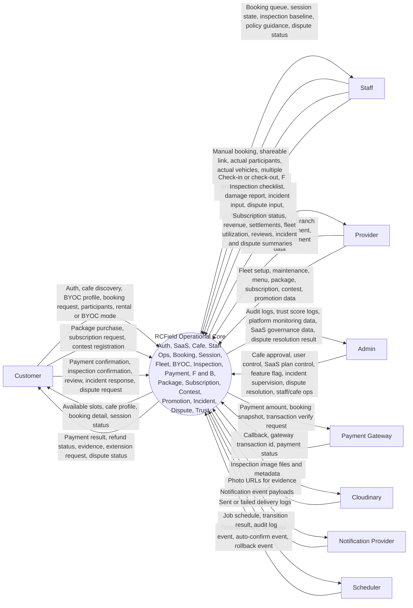

# III. Software Requirement Specification

## 1. Product Overview

RCField is a multi-tenant SaaS operations and booking platform for RC car field businesses in Vietnam. It supports multiple Providers on one shared platform, where each Provider subscribes to a SaaS plan, completes onboarding, and manages one or more cafe branches with separate operating hours, pricing, vehicle fleet, staff assignment, service capacity, menu, packages, subscriptions, contests, promotions, closures, and announcements.

Source:
- `docs/spec/00-overview.md` -> "Bối cảnh": RCField is a multi-tenant SaaS platform for multiple providers.
- `docs/spec/00-overview.md` -> "Giải pháp": multi-branch management and operational core.
- `docs/spec/00-overview.md` -> "Scope / Phase 1": SaaS billing, cafe, fleet, F&B, packages, subscriptions, contests, promotions, dispute resolution, staff assignment, cafe operations.

The platform addresses current operational pain points: bookings handled through phone/chat, missing handover evidence, manual fleet tracking, and manual payment calculation. RCField centralizes SaaS plan and provider subscription data, booking and session operations, fleet status, BYOC vehicles, inspection evidence, incident handling, basic formal disputes, payment audit trails, notification logs, reviews, trust score logs, and feature flags.

Source:
- `docs/spec/00-overview.md` -> "Pain points hiện tại".
- `docs/spec/00-overview.md` -> "Scope / Phase 1".
- `docs/spec/01-domain-model.md` and `docs/spec/06-database.md` -> ERD/schema entities: `saas_plans`, `provider_subscriptions`, `cafes`, `cafe_staff`, `bookings`, `sessions`, `customer_vehicles`, `inspections`, `incidents`, `disputes`, `payment_components`, `payment_transactions`, `notification_logs`, `trust_score_logs`.

At its core, RCField separates planned booking data from actual operational data. `Booking` stores the reservation plan, planned participants, planned rental vehicles, play mode, slot, promotion, payment snapshot, cancellation/no-show state, and links to package or subscription usage when applicable. `Session` stores the actual play session created at check-in, including actual participants, actual rental/BYOC vehicles, inspections, extension proposals, incidents, dispute evidence context, and settlement data.

Source:
- `docs/spec/00-overview.md` -> "Kiến trúc dữ liệu cốt lõi".
- `docs/spec/00-overview.md` -> "Operational Core Data Rules".
- `docs/spec/01-domain-model.md` -> `Booking`, `BookingParticipant`, `BookingVehicle`, `Session`, `SessionParticipant`, `SessionVehicle`.
- `docs/diagrams/sequence/sequence-flow-booking-lifecycle.md` -> sections "Tạo Booking" and "Check-in: Booking -> Session".

Phase 1 focuses on the operational core: authentication, SaaS plans, provider subscription/billing, provider onboarding, cafe/branch management, staff assignment, cafe closures/announcements, fleet, BYOC registry, booking/session lifecycle, inspections, slot extensions, component-based payments, F&B, packages, subscriptions, contests, promotions, incident policy resolution, basic dispute resolution, maintenance logs, reviews, notification logs, trust score logs, and feature flags. Phase 2 is reserved for multi-party dispute workflow, AI jobs, AI damage detection, AI recommendations, analytics, dynamic pricing, loyalty, and native mobile apps.

Source:
- `docs/spec/00-overview.md` -> "Scope / Phase 1 - Operational Core, bắt buộc".
- `docs/spec/00-overview.md` -> "Phase 2 - Business Expansion + AI/SaaS".
- `docs/spec/01-domain-model.md` -> "Phase 2 Entities".

## 2. Source Traceability Summary

| Content in this file | Source file | Source section |
|---|---|---|
| Product overview and business context | `docs/spec/00-overview.md` | "Bối cảnh", "Giải pháp", "Scope" |
| Actor list and target apps | `docs/spec/00-overview.md`, `docs/architecture/00-system-overview.md` | "Actors", "Actor & App Matrix" |
| System boundary and external systems | `docs/architecture/00-system-overview.md` | "System Context", "Container Diagram", "External Integrations" |
| Booking/session separation | `docs/spec/00-overview.md`, `docs/spec/01-domain-model.md` | "Kiến trúc dữ liệu cốt lõi", `Booking`, `Session` entities |
| Operational modules in diagrams | `docs/spec/00-overview.md`, `docs/spec/01-domain-model.md` | "Phase 1", ERD and core entities |
| Booking lifecycle and main flow | `docs/diagrams/sequence/sequence-flow-booking-lifecycle.md`, `docs/spec/02-state-machine.md` | Booking lifecycle sequence, booking/session state machines |
| Payment flow and settlement | `docs/spec/03-payment-engine.md`, `docs/architecture/00-system-overview.md` | Payment components, platform fee, payment gateway flow |
| Inspection and evidence flow | `docs/spec/04-inspection-flow.md` | Check-in flow, check-out flow, photo storage |
| Incident and dispute flow | `docs/spec/01-domain-model.md`, `docs/spec/business-rules/BR-dispute.md`, `docs/spec/04-inspection-flow.md` | Incident policy resolution, basic dispute, Admin resolution |
| API-level responsibilities | `docs/spec/05-api-contracts.md` | Auth, cafes, bookings, sessions, inspections, extensions, incidents, F&B, packages/subscriptions/contests |

## 3. System Context Diagram

The diagram below shows RCField as a multi-tenant SaaS platform interacting with four actor groups and the required external systems.

Source:
- Actors: `docs/spec/00-overview.md` -> "Actors"; `docs/architecture/00-system-overview.md` -> "Actor & App Matrix".
- External systems: `docs/architecture/00-system-overview.md` -> "System Context", "Container Diagram".
- SaaS scope: `docs/spec/00-overview.md` -> "Phase 1 - Operational Core" and provider subscription/billing; `docs/spec/06-database.md` -> `saas_plans`, `provider_subscriptions`.
- Staff, cafe ops, and dispute scope: `docs/spec/00-overview.md` -> "Phase 1 - Operational Core"; `docs/spec/06-database.md` -> `cafe_staff`, `cafe_closures`, `cafe_announcements`, `disputes`; `docs/spec/business-rules/BR-dispute.md`.

Note: this diagram stays at context level. It groups small API actions into business capability nouns so the system boundary remains readable. Internal jobs such as timeout, no-show, auto-confirm, slot release, and promotion rollback belong inside RCField and are not modeled as external systems here.

```mermaid
flowchart TB
    customer["Customer<br>Web mobile-first"]
    staff["Staff<br>Web mobile-first"]
    provider["Provider<br>Web desktop/tablet"]
    admin["Admin<br>Admin web portal"]

    rcfield(("RCField SaaS Platform<br>Multi-tenant RC car field<br>operations and booking system"))

    payment["Payment Gateway<br>VNPay / MoMo / VietQR"]
    storage["Cloudinary<br>Inspection photo storage"]
    notify["Push / SMS / Email<br>Notification provider"]

    customer -->|"Account authentication"| rcfield
    rcfield -->|"Authentication result"| customer
    customer -->|"Cafe, menu, package, contest discovery"| rcfield
    rcfield -->|"Discovery results"| customer
    customer -->|"BYOC vehicle profile management"| rcfield
    rcfield -->|"BYOC profile status"| customer
    customer -->|"Rental, BYOC, mixed booking request"| rcfield
    rcfield -->|"Booking creation result"| customer
    customer -->|"Package purchase, subscription request, contest registration"| rcfield
    rcfield -->|"Package, subscription, contest result"| customer
    customer -->|"Booking, rental, deposit, F&B pre-order payment"| rcfield
    rcfield -->|"Payment result"| customer
    customer -->|"Inspection confirmation and extension response"| rcfield
    rcfield -->|"Inspection and extension status"| customer
    customer -->|"Incident report and review submission"| rcfield
    rcfield -->|"Incident and review result"| customer
    customer -->|"Formal dispute request"| rcfield
    rcfield -->|"Dispute status"| customer

    staff -->|"Manual booking and shareable link request"| rcfield
    rcfield -->|"Manual booking and link result"| staff
    staff -->|"Operation-policy booking cancellation"| rcfield
    rcfield -->|"Staff cancellation result"| staff
    staff -->|"Check-in, check-out, actual session data"| rcfield
    rcfield -->|"Check-in and check-out session status"| staff
    staff -->|"Actual participant and vehicle records"| rcfield
    rcfield -->|"Participant and vehicle status"| staff
    staff -->|"Inspection photos and checklist"| rcfield
    rcfield -->|"Inspection submission result"| staff
    staff -->|"F&B on-site order and extension proposal"| rcfield
    rcfield -->|"F&B order and extension result"| staff
    staff -->|"Authorized menu, subscription, contest operations"| rcfield
    rcfield -->|"Authorized operation result"| staff
    staff -->|"Damage report and incident log"| rcfield
    rcfield -->|"Damage and incident result"| staff
    staff -->|"Operation-policy dispute request"| rcfield
    rcfield -->|"Staff dispute status"| staff


    provider -->|"SaaS plan registration and provider subscription"| rcfield
    rcfield -->|"Provider onboarding and subscription status"| provider
    provider -->|"Branch profile, operating hour, slot, pricing management"| rcfield
    rcfield -->|"Branch and pricing status"| provider
    provider -->|"Staff assignment, closure, announcement management"| rcfield
    rcfield -->|"Staff and cafe ops status"| provider
    provider -->|"Fleet, maintenance, vehicle status management"| rcfield
    rcfield -->|"Fleet and maintenance status"| provider
    provider -->|"Menu, package, contest management"| rcfield
    rcfield -->|"Commerce management status"| provider
    provider -->|"Promotion and usage audit management"| rcfield
    rcfield -->|"Promotion audit status"| provider
    provider -->|"Pre-session booking cancellation"| rcfield
    rcfield -->|"Provider cancellation result"| provider
    provider -->|"Revenue, settlement, review, incident, dispute data view"| rcfield
    rcfield -->|"Revenue, settlement, review, incident, dispute data"| provider

    admin -->|"Cafe activation and suspension"| rcfield
    rcfield -->|"Cafe moderation status"| admin
    admin -->|"User, role, feature flag management"| rcfield
    rcfield -->|"User, role, feature flag status"| admin
    admin -->|"SaaS plan, provider subscription, billing governance"| rcfield
    rcfield -->|"SaaS governance status"| admin
    admin -->|"Incident and policy resolution monitoring"| rcfield
    rcfield -->|"Incident and policy monitoring data"| admin
    admin -->|"Formal dispute resolution"| rcfield
    rcfield -->|"Dispute resolution result"| admin
    admin -->|"Platform activity and system configuration audit"| rcfield
    rcfield -->|"Audit and configuration data"| admin

    rcfield -->|"Payment amount, booking snapshot, transaction verification request"| payment
    payment -->|"Callback, gateway transaction id, payment status"| rcfield

    rcfield -->|"Inspection image files and metadata"| storage
    storage -->|"Photo URLs for evidence records"| rcfield

    rcfield -->|"Notification event payloads"| notify
    notify -->|"Delivery status"| rcfield
```

## 4. Context Data Flow Diagram

The diagram below groups the same context by data flow: business inputs from actors, operational outputs from RCField, and external system exchanges.

Source:
- Operational core modules: `docs/spec/00-overview.md` -> "Phase 1"; `docs/architecture/00-system-overview.md` -> "Domain Modules".
- Data entities: `docs/spec/01-domain-model.md` -> ERD and core entities.
- Lifecycle flow: `docs/diagrams/sequence/sequence-flow-booking-lifecycle.md`.

## 5. Actors And External Systems

| Element | Type | Main responsibility | Source |
|---|---|---|---|
| Customer | Actor | Books RC play sessions, pays online, manages BYOC profile, confirms inspections, responds to extensions/incidents, opens disputes, and submits reviews. | `docs/spec/00-overview.md` -> Actors; `docs/spec/05-api-contracts.md` -> Bookings, Inspections, Extensions; `docs/spec/business-rules/BR-dispute.md` |
| Staff | Actor | Handles manual bookings, check-in/check-out, inspections, actual participants/vehicles, F&B on-site orders, extension proposals, damage reports, incident records, dispute input, and authorized cafe announcements. | `docs/spec/00-overview.md` -> Actors; `docs/spec/04-inspection-flow.md`; `docs/spec/05-api-contracts.md`; `docs/spec/business-rules/BR-dispute.md` |
| Provider | Actor | Registers SaaS plans, manages subscriptions, branches, staff assignments, cafe closures/announcements, fleet, pricing, menu, packages, contests, promotions, revenue, reviews, incidents, disputes, and maintenance. | `docs/spec/00-overview.md` -> Actors/Scope; `docs/spec/01-domain-model.md` -> Cafe, Vehicle, Package, Subscription, Contest, Promotion; `docs/spec/06-database.md` -> SaaS/staff/cafe ops tables |
| Admin | Actor | Manages platform governance, SaaS plans, provider subscriptions, cafe approval, users, roles, feature flags, staff/cafe operations, audit logs, trust logs, notification logs, incident supervision, and formal dispute resolution. | `docs/spec/00-overview.md` -> Actors/Scope; `docs/spec/05-api-contracts.md` -> Cafes, Incidents; `docs/spec/business-rules/BR-dispute.md`; `docs/spec/06-database.md` -> `saas_plans`, `provider_subscriptions` |
| Payment Gateway | External system | Creates payment URLs, verifies callbacks, provides transaction ids/status, and supports refund/capture/settlement operations. | `docs/architecture/00-system-overview.md` -> External Integrations; `docs/spec/03-payment-engine.md` |
| Cloudinary | External system | Stores check-in/check-out inspection photos and returns URLs for evidence records. | `docs/architecture/00-system-overview.md` -> System Context; `docs/spec/04-inspection-flow.md` -> Photo Storage |
| Notification Provider | External system | Sends booking, payment, inspection, extension, timeout, and incident notifications; returns delivery logs. | `docs/architecture/00-system-overview.md` -> Container Diagram; `docs/spec/01-domain-model.md` -> `notification_logs` |
| Scheduler | Internal supporting system | Runs payment timeout, no-show, inspection auto-confirm, extension timeout, checkout timeout, slot release, and promotion rollback jobs. | `docs/spec/02-state-machine.md` -> Timeout Rules; `docs/spec/business-rules/BR-promotions.md` -> promo rollback; `docs/architecture/00-system-overview.md` -> Scheduler |

## 6. Coverage Validation

### 6.1 Phase 1 Scope Checklist

| Phase 1 item | Covered in diagram | Evidence in diagram | Source |
|---|---|---|---|
| Auth, refresh token, reset password | Yes | Customer -> RCField auth actions | `docs/spec/00-overview.md` -> Phase 1; `docs/spec/05-api-contracts.md` -> Auth |
| SaaS plans and provider subscription/billing | Yes | Provider handles SaaS registration/subscription; Admin governs SaaS plans/subscriptions | `docs/spec/00-overview.md`; `docs/spec/06-database.md` -> `saas_plans`, `provider_subscriptions` |
| Provider onboarding | Yes | Provider receives onboarding and subscription status | `docs/spec/00-overview.md` -> Provider onboarding |
| Cafe/branch management | Yes | Customer browses cafes; Provider manages branches; Admin activates/suspends cafes | `docs/spec/00-overview.md` -> Phase 1; `docs/spec/05-api-contracts.md` -> Cafes |
| Staff assignment | Yes | Provider/Admin manage staff assignments; Staff operations are tied to authorized cafe scope | `docs/spec/00-overview.md`; `docs/spec/04-inspection-flow.md`; `docs/spec/06-database.md` -> `cafe_staff`, `staff_cafe_assignments` |
| Cafe closures and announcements | Yes | Provider/Admin manage closures; Provider/Staff publish announcements | `docs/spec/00-overview.md`; `docs/spec/06-database.md` -> `cafe_closures`, `cafe_announcements` |
| Vehicle fleet management | Yes | Provider manages fleet/status; Staff records actual vehicles | `docs/spec/00-overview.md`; `docs/spec/01-domain-model.md` -> Vehicle |
| BYOC vehicle registry | Yes | Customer registers BYOC vehicle profile | `docs/spec/00-overview.md`; `docs/spec/01-domain-model.md` -> CustomerVehicle |
| Booking lifecycle for rental, BYOC, mixed | Yes | Customer creates rental/BYOC/mixed booking; Customer/Provider/Staff cancellation is represented; Scheduler handles timeout/no-show | `docs/spec/00-overview.md`; `docs/spec/02-state-machine.md`; `docs/spec/business-rules/BR-booking.md` |
| Multi-vehicle booking | Yes | Customer adds vehicles; Staff records actual vehicles | `docs/spec/01-domain-model.md` -> BookingVehicle, SessionVehicle |
| Planned and actual participants | Yes | Customer adds planned participants; Staff records actual participants | `docs/spec/00-overview.md`; `docs/spec/01-domain-model.md` |
| Multiple sessions per booking | Yes | Staff creates one or more actual sessions | `docs/spec/01-domain-model.md` -> Session; `docs/spec/02-state-machine.md` |
| Actual vehicles through session vehicles | Yes | Staff records actual vehicles | `docs/spec/01-domain-model.md` -> SessionVehicle |
| Check-in/check-out inspection with photos and checklist | Yes | Staff uploads photos/checklist; Cloudinary stores photos | `docs/spec/04-inspection-flow.md` |
| Slot extension proposal | Yes | Staff proposes extension; Customer approves/rejects | `docs/spec/02-state-machine.md`; `docs/spec/05-api-contracts.md` -> Extensions |
| Component-based payment and gateway transaction log | Yes | Payment Gateway exchanges transaction id/status | `docs/spec/03-payment-engine.md`; `docs/spec/01-domain-model.md` -> PaymentComponent, PaymentTransaction |
| F&B menu, pre-order, on-site order | Yes | Customer browses/pre-orders; Staff creates on-site order; Provider/authorized Staff manage menu | `docs/spec/00-overview.md`; `docs/spec/05-api-contracts.md` -> F&B; `docs/spec/business-rules/BR-fnb.md` |
| Packages and usage history | Yes | Customer purchases package; Provider manages packages | `docs/spec/01-domain-model.md` -> Package, CustomerPackage, PackageUsage |
| Subscriptions generating bookings | Yes | Customer or Staff creates subscription request; Provider manages subscriptions | `docs/spec/01-domain-model.md` -> Subscription; `docs/spec/05-api-contracts.md` -> POST `/subscriptions` |
| Contests and registration | Yes | Customer registers contest; Provider manages contests | `docs/spec/01-domain-model.md` -> Contest, ContestRegistration |
| Promotions and usage audit | Yes | Provider creates promotions and views usage audit | `docs/spec/01-domain-model.md` -> Promotion, PromotionUsage; `docs/spec/business-rules/BR-promotions.md` |
| Incident logging and policy resolution | Yes | Customer raises incident; Staff logs incident; Admin monitors resolution | `docs/spec/01-domain-model.md` -> Incident; `docs/spec/04-inspection-flow.md` |
| Basic formal dispute resolution | Yes | Customer/Staff can open dispute; Admin resolves dispute based on evidence | `docs/spec/01-domain-model.md` -> Dispute; `docs/spec/business-rules/BR-dispute.md`; `docs/spec/04-inspection-flow.md` |
| Vehicle maintenance logs | Yes | Provider manages maintenance and vehicle status | `docs/spec/00-overview.md`; `docs/spec/01-domain-model.md` -> vehicle maintenance logs |
| Reviews | Yes | Customer reviews; Provider views reviews | `docs/spec/00-overview.md`; `docs/spec/01-domain-model.md` -> reviews |
| Notification logs | Yes | Notification provider returns delivery logs; Admin sees notification logs | `docs/spec/01-domain-model.md` -> notification_logs |
| Trust score and trust score audit | Yes | Customer receives trust score; Admin receives trust score logs | `docs/spec/01-domain-model.md` -> User.trust_score, trust_score_logs |
| Feature flags | Yes | Admin manages feature flags | `docs/spec/00-overview.md`; `docs/spec/01-domain-model.md` -> FeatureFlag |

### 6.2 Main Flow Walkthrough

| Step | Main flow | Covered | Source |
|---|---|---|---|
| 1 | Customer browses cafes, packages, contests, and menu. | Yes | `docs/spec/05-api-contracts.md` -> Cafes, Packages, Contests, F&B |
| 2 | Customer creates booking with play mode, participants, vehicles, and optional F&B pre-order. | Yes | `docs/diagrams/sequence/sequence-flow-booking-lifecycle.md` -> "Tạo Booking"; `docs/spec/05-api-contracts.md` -> POST `/bookings` |
| 3 | RCField creates payment URL through Payment Gateway. | Yes | `docs/architecture/00-system-overview.md` -> Payment Gateway flow |
| 4 | Payment Gateway returns callback, transaction id, and payment status. | Yes | `docs/spec/03-payment-engine.md`; `docs/diagrams/sequence/sequence-flow-booking-lifecycle.md` -> "Thanh Toán" |
| 5 | Staff opens confirmed booking and creates one or more actual sessions. | Yes | `docs/spec/04-inspection-flow.md`; `docs/spec/02-state-machine.md` |
| 6 | Staff records actual participants and actual rental/BYOC vehicles. | Yes | `docs/spec/01-domain-model.md` -> SessionParticipant, SessionVehicle |
| 7 | Staff uploads check-in inspection photos and checklist to Cloudinary. | Yes | `docs/spec/04-inspection-flow.md` -> CHECK-IN Flow, Photo Storage |
| 8 | Customer confirms check-in evidence or Scheduler auto-confirms. | Yes | `docs/spec/04-inspection-flow.md`; `docs/spec/02-state-machine.md` -> Timeout Rules |
| 9 | Session becomes active; Staff can add F&B on-site order or propose extension. | Yes | `docs/spec/02-state-machine.md`; `docs/spec/05-api-contracts.md` -> F&B, Extensions |
| 10 | Customer approves/rejects extension; Notification Provider carries alerts. | Yes | `docs/spec/02-state-machine.md`; `docs/spec/05-api-contracts.md` -> Extensions |
| 11 | Staff performs check-out inspection and records damage if any. | Yes | `docs/spec/04-inspection-flow.md` -> CHECK-OUT Flow |
| 12 | Customer confirms check-out, raises incident, or opens a formal dispute. | Yes | `docs/spec/04-inspection-flow.md`; `docs/spec/05-api-contracts.md` -> Incidents; `docs/spec/business-rules/BR-dispute.md` |
| 13 | Staff/Admin resolves incident by policy; Admin resolves formal dispute when needed. | Yes | `docs/spec/01-domain-model.md` -> Incident Policy Resolution & Disputes; `docs/spec/05-api-contracts.md` -> Incidents; `docs/spec/business-rules/BR-dispute.md` |
| 14 | RCField settles payment, refund/capture, and provider payout through payment records. | Yes | `docs/spec/03-payment-engine.md`; `docs/diagrams/sequence/sequence-flow-booking-lifecycle.md` -> Completion |
| 15 | Provider views revenue, settlements, reviews, fleet utilization, and incidents. | Yes | `docs/spec/00-overview.md` -> Actors/Scope |
| 16 | Admin audits platform health, SaaS plans/subscriptions, feature flags, users, incidents, disputes, trust score logs, and notification logs. | Yes | `docs/spec/00-overview.md`; `docs/spec/01-domain-model.md` -> FeatureFlag, TrustScoreLog, NotificationLog, Dispute, SaasPlan, ProviderSubscription |

### 6.3 Actor Coverage Check

| Actor | Expected responsibility | Covered | Source |
|---|---|---|---|
| Customer | Browse cafes, create/cancel bookings, manage BYOC, pay, buy packages, create subscriptions, register contests, confirm inspections, respond to extensions/incidents, open disputes, review. | Yes | `docs/spec/00-overview.md` -> Actors/Scope; `docs/spec/05-api-contracts.md`; `docs/spec/business-rules/BR-booking.md`; `docs/spec/business-rules/BR-dispute.md` |
| Staff | Manual booking/shareable link, operation-policy cancellation, check-in/out, actual participants, actual vehicles, inspection, F&B on-site, extension proposal, damage report, incident log, dispute input, authorized menu/subscription/contest/announcement operations. | Yes | `docs/spec/00-overview.md` -> Booking channels/Actors; `docs/spec/04-inspection-flow.md`; `docs/spec/05-api-contracts.md`; `docs/spec/business-rules/BR-fnb.md`; `docs/spec/business-rules/BR-dispute.md` |
| Provider | SaaS plan registration/subscription, branch management, operating hours, pricing, staff assignments, cafe closures/announcements, fleet, maintenance, menu, packages, contests, promotions, booking cancellation, revenue, reviews, incidents/disputes. | Yes | `docs/spec/00-overview.md` -> Actors/Scope; `docs/spec/01-domain-model.md`; `docs/spec/06-database.md`; `docs/spec/business-rules/BR-booking.md` |
| Admin | Activate/suspend cafes, manage SaaS plans/subscriptions, users, roles, feature flags, staff/cafe operations, audit logs, notification logs, trust score logs, incident policy supervision, formal dispute resolution. | Yes | `docs/spec/00-overview.md` -> Actors/Scope; `docs/spec/05-api-contracts.md`; `docs/spec/06-database.md`; `docs/spec/business-rules/BR-dispute.md` |

## 7. Notes On Diagram Scope

This file is a context-level SRS artifact. It intentionally does not model internal containers such as Web App, API Server, PostgreSQL, or Redis in detail. Those belong to `docs/architecture/00-system-overview.md` and the sequence/API/domain documents.

Source:
- `docs/architecture/00-system-overview.md` -> "Container Diagram".
- `docs/spec/05-api-contracts.md` -> REST API surface.
- `docs/spec/01-domain-model.md` -> detailed entity model.
