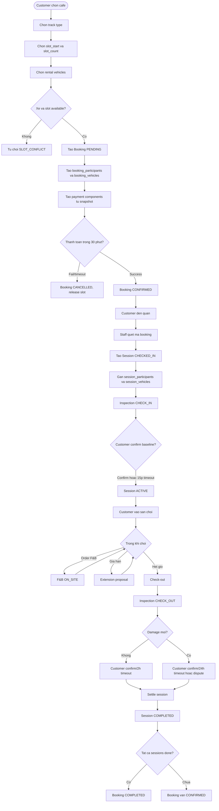
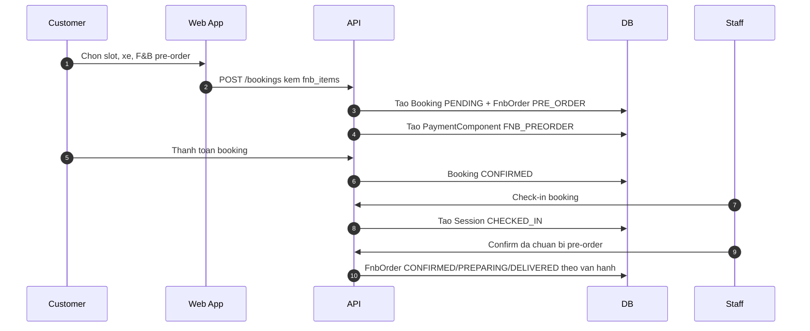
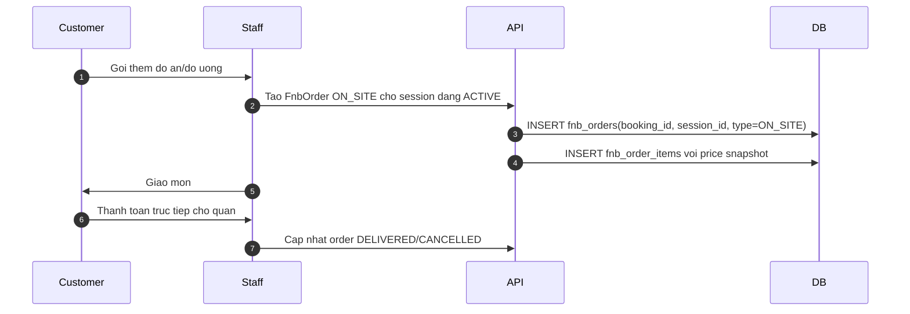
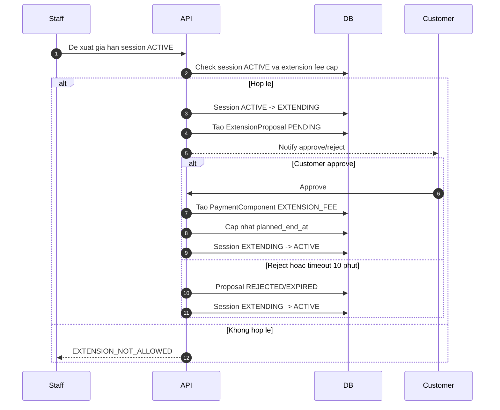
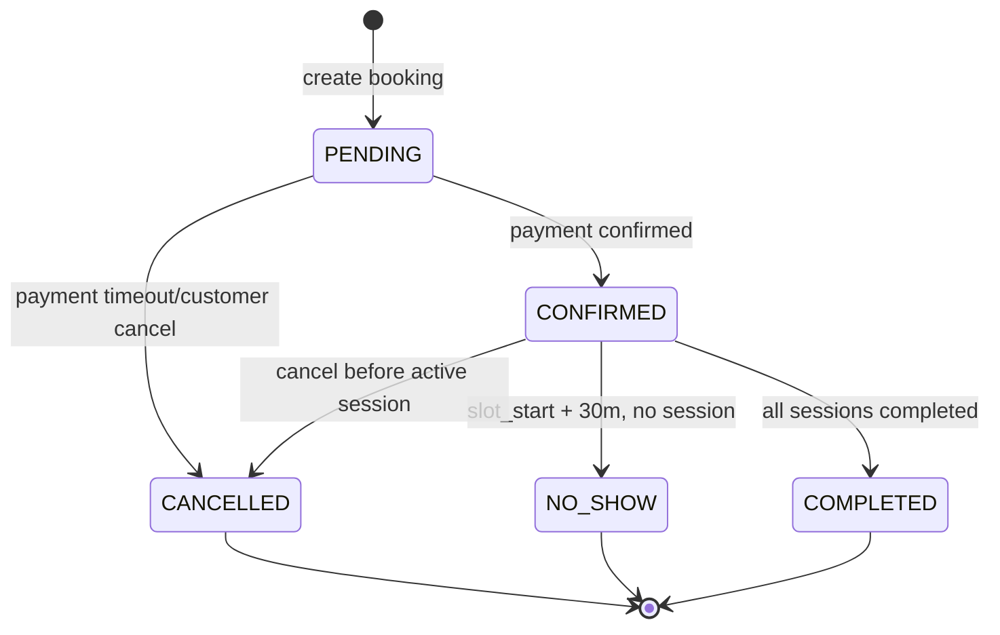
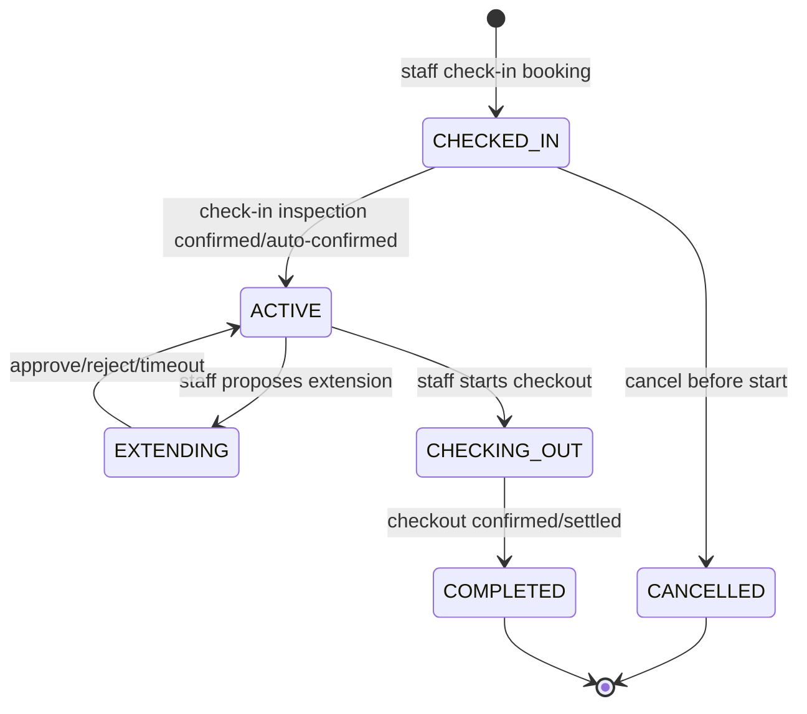

# BR-Booking Lifecycle — Luong nghiep vu booking end-to-end

**Last updated**: 2026-06-04  
**Status**: Draft for business review  
**Owner**: Product/Backend/Operations

> Tai lieu nay dong vai tro "business operating rule" cho toan bo luong booking:
> dat gio, thue xe, check-in bang ma, vao san choi, order F&B tai quan,
> gia han gio choi, check-out, damage, settlement.
>
> Tai lieu nay khong thay the cac rule domain hien co. No noi cac domain lai thanh
> mot luong van hanh lien tuc de FE/BE/QA/Operations cung doc duoc.

---

## 1. Source of truth

| Nguon | Noi dung dung de suy luan |
|---|---|
| `docs/spec/00-overview.md` | Phase 1 scope, Booking/Session separation, actors |
| `docs/spec/01-domain-model.md` | Entity, enum, quan he Booking - Session - Payment - F&B |
| `docs/spec/02-state-machine.md` | BookingStatus, SessionStatus, timeout |
| `docs/spec/03-payment-engine.md` | Component-based payment, deposit, checkout, damage |
| `docs/spec/04-inspection-flow.md` | Check-in/check-out inspection, evidence, confirm timeout |
| `docs/spec/business-rules/BR-booking.md` | Slot, availability, cancellation, no-show |
| `docs/spec/business-rules/BR-fleet.md` | Vehicle status, tier, track compatibility |
| `docs/spec/business-rules/BR-fnb.md` | F&B pre-order va on-site |
| `docs/spec/business-rules/BR-extension.md` | Gia han slot trong session |
| `docs/architecture/01-booking-session.md` | Planned vs actual architecture |

---

## 2. Nguyen tac thiet ke nghiep vu

**BR-BL-001 — Booking la ke hoach, Session la thuc te**  
IF: Customer tao don dat lich  
THEN: He thong tao `Booking` de giu ke hoach: cafe, slot, mode, participants du kien, rental vehicles du kien, gia snapshot.  
NOTE: Khong xem Booking la "dang choi". Khach chi thuc su vao san khi Staff check-in va tao `Session`.

**BR-BL-002 — Khong bao gio luu xe thuc te truc tiep tren Booking**  
IF: Booking co thue xe cua quan  
THEN: Xe du kien nam trong `booking_vehicles`.  
IF: Khach mang xe rieng  
THEN: Xe BYOC chi duoc chot khi check-in qua `session_vehicles.customer_vehicle_id`.

**BR-BL-003 — Check-in phai qua Staff**  
IF: Booking da `CONFIRMED` va customer den quan  
THEN: Staff quet ma/nhap ma booking, kiem tra booking hop le, tao `Session(status=CHECKED_IN)`, ghi nhan nguoi/xe thuc te, thuc hien inspection dau vao.  
NOTE: Customer khong tu chuyen booking sang ACTIVE.

**BR-BL-004 — Evidence la dieu kien de tinh damage**  
IF: Provider muon tinh `DAMAGE_CHARGE`  
THEN: Phai co inspection check-in va check-out hop le: anh bat buoc, checklist day du, baseline duoc customer confirm hoac auto-confirm.  
NOTE: Thieu evidence hop le thi Provider mat co so tinh damage.

**BR-BL-005 — Payment settlement theo Session**  
IF: Session hoan tat check-out  
THEN: `PaymentEngine.settle(sessionId)` xu ly component cua phien do.  
NOTE: Booking chi chuyen `COMPLETED` khi tat ca sessions cua booking da `COMPLETED`.

---

## 3. Phan tach cac luong chinh

### 3.1 Luong A — Dat gio + thue xe truoc

Day la luong can uu tien trong Phase 1 vi gom du booking, rental fleet, deposit,
inspection, session va settlement.

**BR-BL-010 — Dieu kien tao Booking rental**  
IF: Customer chon xe rental  
THEN: Moi xe phai `AVAILABLE`, khong overlap voi booking `PENDING/CONFIRMED`, va compatible voi `track_type` da chon.

**BR-BL-011 — Thanh toan truoc khi den quan**  
IF: Booking vua tao  
THEN: Booking o `PENDING`, slot bi lock toi da 30 phut, payment phai thanh cong de chuyen `CONFIRMED`.  
NOTE: Spec payment hien tai dung luong 2 buoc: giu/charge deposit khi confirm, cac fee con lai tinh vao checkout.

**BR-BL-012 — QR/code check-in**  
IF: Customer den quan  
THEN: Staff quet QR hoac nhap booking code. System chi cho check-in khi:
- Booking thuoc cafe cua Staff.
- Booking `status = CONFIRMED`.
- Thoi gian hien tai nam trong cua so check-in cho phep.
- Chua co session dang `CHECKED_IN`, `ACTIVE`, `EXTENDING`, `CHECKING_OUT` cho cung booking neu chinh sach chi cho mot session dong thoi.

**BR-BL-013 — Tao Session khi check-in**  
IF: Staff check-in thanh cong  
THEN: System tao `sessions(status=CHECKED_IN)`, copy planned participants sang actual participants neu co mat, tao `session_vehicles` tu xe rental thuc te va doi `vehicle.status -> IN_USE`.

**BR-BL-014 — Xe thuc te co the khac xe du kien**  
IF: Xe du kien hong, dang bao tri, hoac Staff doi xe cho khach  
THEN: `session_vehicles.vehicle_id` co the khac `booking_vehicles.vehicle_id`, nhung phai ghi note/audit va xe thay the phai `AVAILABLE`.

**BR-BL-015 — Vao san chi sau khi baseline duoc confirm**  
IF: Check-in inspection da du anh/checklist va customer confirm hoac qua timeout 15 phut  
THEN: Session chuyen `ACTIVE`, customer duoc vao san choi.

---

### 3.2 Luong B — Booking co F&B pre-order

**BR-BL-020 — F&B pre-order gan Booking**  
IF: Customer dat mon truoc khi den  
THEN: `FnbOrder(type=PRE_ORDER)` gan voi `booking_id`, co the tao cung Booking.  
NOTE: Pre-order la mot phan cua ke hoach dat lich.

**BR-BL-021 — Staff xac nhan pre-order tai check-in**  
IF: Booking co F&B pre-order  
THEN: Man hinh check-in cua Staff phai hien danh sach mon de xac nhan chuan bi/giao cho customer.

**BR-BL-022 — Platform fee tren F&B**  
IF: Thanh toan co F&B  
THEN: Platform fee = 0% tren F&B theo `BR-FnB`; payment engine can tach component de audit ro.

---

### 3.3 Luong C — Order F&B trong luc dang choi

**BR-BL-030 — On-site F&B chi tao trong Session hop le**  
IF: Customer order tai quan  
THEN: Session phai dang `ACTIVE` hoac theo chinh sach van hanh cho phep trong `CHECKING_OUT`.  
NOTE: Khong tao on-site order cho booking chua check-in.

**BR-BL-031 — On-site F&B khong qua payment gateway platform**  
IF: F&B la `ON_SITE`  
THEN: Customer thanh toan truc tiep cho Provider; platform chi ghi order/audit, khong thu ho va khong tinh platform fee.

---

### 3.4 Luong D — Gia han gio choi

**BR-BL-040 — Chi gia han khi Session ACTIVE**  
IF: Session khong phai `ACTIVE`  
THEN: Staff khong duoc tao extension proposal.

**BR-BL-041 — Customer quyet dinh gia han**  
IF: Staff de xuat gia han  
THEN: Customer approve/reject; neu im lang 10 phut thi auto-reject va session quay lai `ACTIVE`.

**BR-BL-042 — Extension fee cap**  
IF: Tong extension fee sau khi them lan moi > 50% tong security deposit cua session  
THEN: Tu choi gia han.

**BR-BL-043 — Extension tinh vao checkout**  
IF: Extension duoc approve  
THEN: Tao `PaymentComponent(type=EXTENSION_FEE)` va tinh vao settlement khi check-out.  
NOTE: Can chot lai voi team BE: `BR-extension.md` ghi HELD, `03-payment-engine.md` ghi PENDING. De dong bo payment engine, tai lieu nay de xuat `PENDING` cho extension fee cho den checkout.

---

### 3.5 Luong E — BYOC va MIXED

**BR-BL-050 — BYOC khong co rental fee/deposit xe quan**  
IF: Booking `play_mode = BYOC`  
THEN: Khong tao `booking_vehicles`, khong co rental fee/security deposit cho fleet vehicle.  
NOTE: Van co slot fee va co the co F&B/pre-order/package/promotion.

**BR-BL-051 — BYOC capacity check khi booking**  
IF: Customer dat BYOC  
THEN: He thong check `cafe.byoc_capacity` theo slot va track type cua cafe.

**BR-BL-052 — BYOC vehicle chot khi check-in**  
IF: Customer den quan voi xe ca nhan  
THEN: Staff chon/tao `customer_vehicle`, tao `session_vehicle(vehicle_source=BYOC)`, thuc hien inspection check-in cho xe BYOC va facility baseline neu can.

**BR-BL-053 — MIXED tach rental va BYOC**  
IF: Booking `play_mode = MIXED`  
THEN: Rental part di qua `booking_vehicles`; BYOC part chi chot o `session_vehicles` tai check-in. Settlement tinh rental/deposit cho rental vehicles, khong tinh rental/deposit cho BYOC vehicles.

---

## 4. State machine tong hop

---

## 5. Check-in bang QR/code

**BR-BL-060 — QR/code chi la dinh danh, khong phai quyen vao san**  
IF: Customer dua QR/code  
THEN: Staff scan de tim booking, nhung he thong van phai validate status, cafe, time window, payment va risk flags.

**BR-BL-061 — Time window check-in**  
IF: Current time < slot_start tru mot khoang early check-in cho phep  
THEN: Khong cho start session, hoac can manager override.  
IF: Current time > slot_start + 30 phut va chua co session  
THEN: Booking bi xu ly `NO_SHOW`.

**BR-BL-062 — Staff phai thuoc cafe**  
IF: Staff khong duoc assign vao cafe cua booking  
THEN: Khong duoc check-in/check-out booking do.

**BR-BL-063 — Planned vs actual participants**  
IF: Nguoi den thuc te khac danh sach dat truoc  
THEN: Staff cap nhat `session_participants`; khong sua nguoc `booking_participants` tru khi co luong edit booking rieng.

---

## 6. Check-out, damage va settlement

**BR-BL-070 — Check-out bat dau tu Session ACTIVE**  
IF: Customer het gio hoac muon dung som  
THEN: Staff chuyen session `ACTIVE -> CHECKING_OUT` va thuc hien inspection check-out.

**BR-BL-071 — Khong damage**  
IF: Check-out inspection khong co damage moi  
THEN: Customer confirm hoac auto-confirm sau 2 gio; settlement tinh slot/rental/extension/F&B preorder va hoan tat session.

**BR-BL-072 — Co damage**  
IF: Staff danh dau damage moi  
THEN: Staff nhap mo ta, estimate cost; he thong tinh `damage_charge = cost * damage_multiplier`; customer confirm hoac phan doi.  
NOTE: Im lang 24 gio = auto-confirm damage charge theo state machine.

**BR-BL-073 — Phan doi damage**  
IF: Customer khong dong y damage  
THEN: He thong tao incident/dispute tuy muc do; deposit/payment hold giu theo policy cho den khi resolved/waived.

**BR-BL-074 — Vehicle release**  
IF: Session completed va rental vehicle khong can maintenance  
THEN: `vehicle.status -> AVAILABLE`.  
IF: Damage can xu ly  
THEN: Staff/Provider co the dua xe sang `MAINTENANCE`.

---

## 7. Timeout va ket qua nghiep vu

| Trang thai | Dieu kien | Timeout | Ket qua |
|---|---|---:|---|
| Booking `PENDING` | Chua thanh toan | 30 phut | `CANCELLED`, release slot |
| Booking `CONFIRMED` | Khong co session | `slot_start + 30 phut` | `NO_SHOW` |
| Session `CHECKED_IN` | Customer chua confirm inspection | 15 phut | Auto-confirm, `ACTIVE` |
| Session `EXTENDING` | Customer chua phan hoi | 10 phut | Auto-reject, `ACTIVE` |
| Session `CHECKING_OUT` | Khong damage | 2 gio | Auto-confirm checkout |
| Session `CHECKING_OUT` | Co damage flagged | 24 gio | Auto-confirm damage charge |

---

## 8. API surface de FE/BE can map

| Nhom | Endpoint tham chieu | Actor | Ghi chu |
|---|---|---|---|
| Create booking | `POST /bookings` | Customer/Staff | Tao booking PENDING, lock slot |
| Confirm payment | `POST /bookings/:id/payment/confirm` | Customer/System | Booking CONFIRMED |
| Cancel booking | `POST /bookings/:id/cancel` | Customer/Provider/Staff | Chi truoc active session |
| Staff check-in | `POST /bookings/:id/sessions/check-in` | Staff | Tao Session CHECKED_IN |
| Check-in inspection | `POST /sessions/:id/inspections/check-in` | Staff | Anh + checklist |
| Extension | `POST /sessions/:id/extensions` | Staff | Tao proposal |
| Extension response | `POST /extensions/:id/respond` | Customer | Approve/reject |
| On-site F&B | `POST /sessions/:id/fnb-orders` | Staff | Pay direct to provider |
| Check-out | `POST /sessions/:id/check-out` | Staff | ACTIVE -> CHECKING_OUT |
| Check-out inspection | `POST /sessions/:id/inspections/check-out` | Staff | Anh + checklist |
| Incident | `POST /sessions/:id/incidents` | Staff/System | Damage/dispute trigger |
| Settle | Internal `PaymentEngine.settle(sessionId)` | System | Khi checkout done |

---

## 9. Data checklist per phase

| Phase | Must create/update |
|---|---|
| Booking create | `bookings`, `booking_participants`, `booking_vehicles` neu rental, `fnb_orders` neu pre-order, `payment_components`, Redis slot lock |
| Payment confirm | `payment_transactions`, `payment_components.status`, `bookings.status=CONFIRMED` |
| Check-in | `sessions`, `session_participants`, `session_vehicles`, `vehicles.status=IN_USE` voi rental |
| Check-in inspection | `inspections`, `inspection_photos`, `inspection_checklists`, customer confirmation |
| Active play | `extension_proposals`, `payment_components(EXTENSION_FEE)`, `fnb_orders(ON_SITE)` |
| Check-out | `inspections`, `inspection_photos`, `inspection_checklists`, `incidents/disputes` neu co |
| Settlement | `payment_transactions`, component statuses, vehicle release, session completed, booking completed neu all sessions done |

---

## 10. Open decisions can chot

| Decision | De xuat |
|---|---|
| Early check-in window | Cho phep scan/check-in tu `slot_start - 15 phut`; neu som hon can manager override |
| Multiple active sessions per booking | Phase 1 nen chi cho 1 session active/checking_out moi booking de giam conflict |
| Extension component status | Dung `PENDING` den checkout de dong bo `03-payment-engine.md` |
| On-site F&B trong checkout | Van ghi audit vao session, nhung khong dua vao platform settlement vi customer tra truc tiep |
| Damage dispute threshold | Damage nho xu ly `incident`; tranh chap chinh thuc hoac customer phan doi thi tao `dispute` |

---

## 11. Reference diagrams

- `docs/diagrams/sequence/sequence-flow-booking-operations.md`
- `docs/diagrams/sequence/sequence-flow-booking-lifecycle.md`
- `docs/architecture/diagrams/booking-lifecycle-flow.md`
