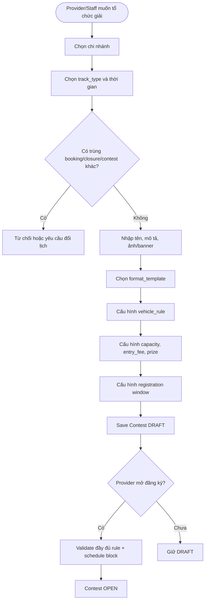
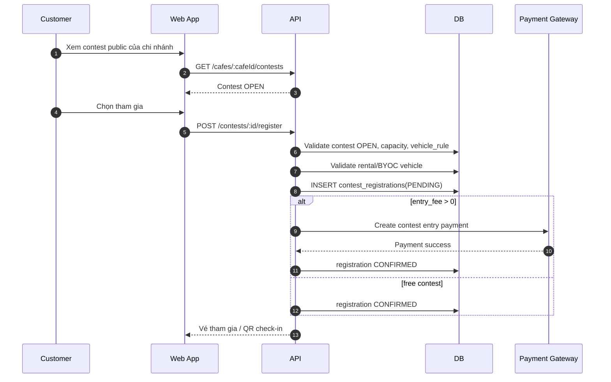
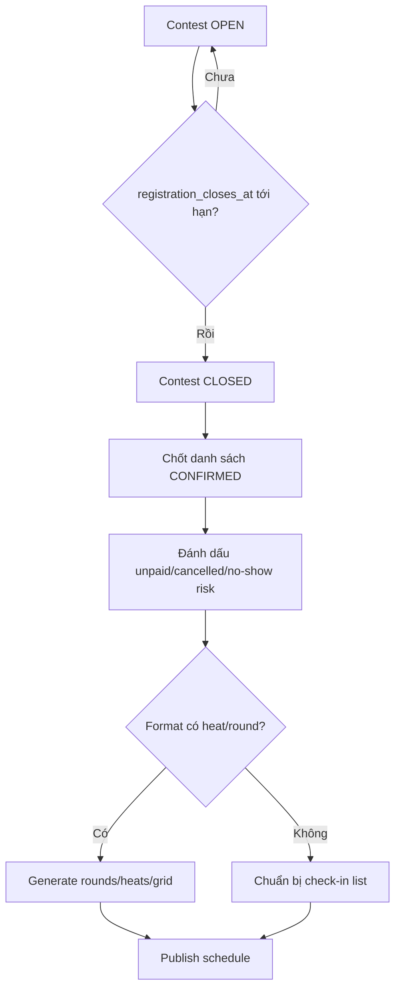
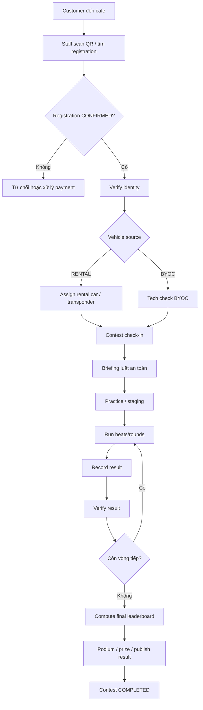
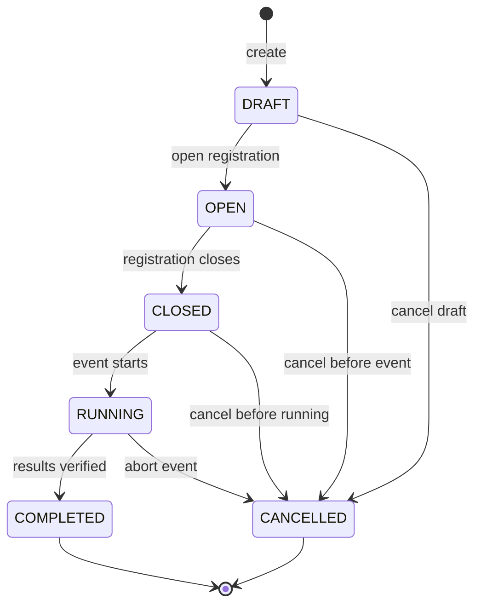
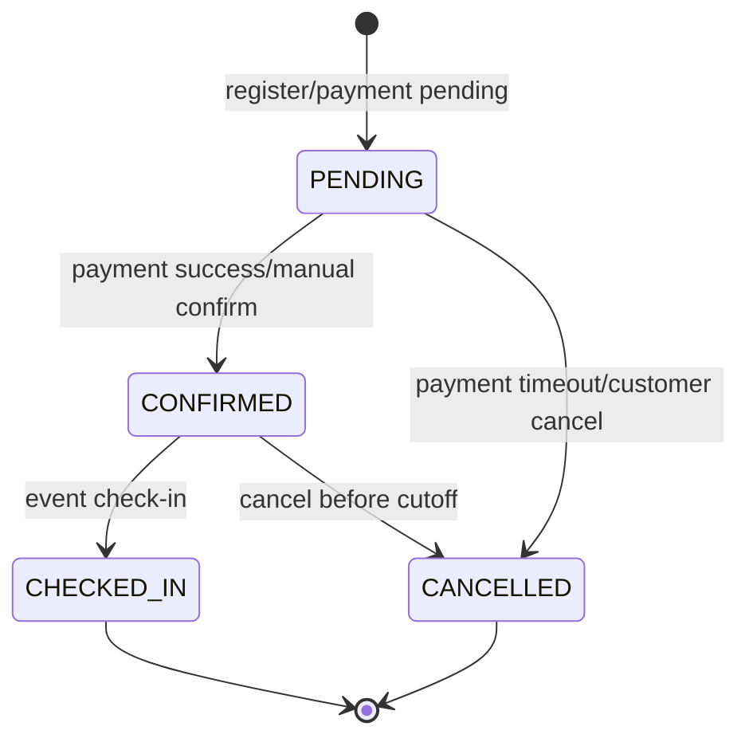

# BR-Contest — Quy tắc nghiệp vụ: Contest, tournament và race event

**Last updated**: 2026-06-08  
**Status**: Draft for business review  
**Owner**: Product / Backend / Operations

> Tài liệu này phân tích đầy đủ luồng Contest cho RCField: tạo giải, mở đăng ký,
> quản lý người đua, luật xe, chia vòng, scoring, leaderboard, giải thưởng và
> lộ trình phase. Mục tiêu không chỉ là "có contest" trong database, mà là biến
> contest thành hoạt động cộng đồng đúng với tinh thần đề tài: kết nối người chơi
> RC lại với nhau tại từng chi nhánh.

---

## 1. Source of truth

| Nguồn | Nội dung dùng để suy luận |
|---|---|
| `docs/spec/00-overview.md` | Contest nằm trong Phase 1 Operational Core; RCField là SaaS multi-branch cho cafe xe RC |
| `docs/spec/01-domain-model.md` | Entity `Contest`, `ContestRegistration`, enum status, `PaymentComponentType.CONTEST_ENTRY` |
| `docs/spec/02-state-machine.md` | Cách tổ chức state machine bắt buộc đi qua service layer |
| `docs/spec/03-payment-engine.md` | Ledger component-based, immutable amount, snapshot-first |
| `docs/spec/04-inspection-flow.md` | Digital evidence khi bàn giao rental/BYOC vehicle |
| `docs/spec/05-api-contracts.md` | API hiện có: list contests, create contest, register |
| `docs/spec/06-database.md` | Schema hiện tại của `contests`, `contest_registrations` và các giới hạn Phase 1 |
| `docs/spec/business-rules/BR-booking.md` | Slot, availability, vehicle/BYOC capacity |
| `docs/spec/business-rules/BR-fleet.md` | Fleet per-branch, vehicle status, tier, track compatibility |
| `docs/developer/provider-subscription-enforcement.md` | Provider write operation phải kiểm tra subscription |
| `docs/adr/001-tenant-ui-model.md` | Mỗi chi nhánh có config riêng; ADR ghi contest advanced/multi-branch ở Phase 2 |
| IFMAR / ROAR / MYLAPS / RC cafe references | Mô hình thực tế: qualifying heats, mains, referees, lap timing, rental/event race |

**Ghi chú về mâu thuẫn scope:**  
`00-overview.md`, `05-api-contracts.md`, `06-database.md` đưa contest vào Phase 1.
`ADR-001` lại ghi contest management single-branch và multi-branch ở Phase 2.
Cách dung hòa hợp lý:

- Phase 1: contest theo từng chi nhánh, đăng ký tham gia, check-in, vận hành giải đơn giản.
- Phase 2+: race management nâng cao: multi-class, multi-round, leaderboard, transponder, multi-branch championship.

---

## 2. Tại sao Contest phức tạp

Contest không phải một booking lớn. Contest là một event vận hành của chi nhánh,
đụng đồng thời vào discovery, capacity, fleet, BYOC, thanh toán, check-in, luật thi
đấu, lịch chạy, nhân sự, bằng chứng hư hỏng và kết quả công khai.

Nếu làm quá đơn giản, hệ thống chỉ có "form đăng ký" nhưng không tổ chức được cuộc
thi thật. Nếu làm quá lớn ngay từ đầu, team sẽ bị kéo vào live timing, bracket,
multi-branch ranking, payout giải thưởng và dispute luật thi đấu. Vì vậy phải tách
phase rõ.

**BR-CT-001 — Contest là event, không phải booking thường**  
IF: Provider tạo cuộc thi tại một chi nhánh  
THEN: System tạo `Contest` để quản lý event, rule, registration, schedule và result.  
NOTE: Không nên tạo một booking thường cho từng người đua chỉ để "giữ chỗ thi", vì
booking/session hiện tại là mô hình khách chơi theo slot, không phải race event.

**BR-CT-002 — Contest phải block capacity của chi nhánh**  
IF: Contest chạy trong khung `starts_at` -> `ends_at` trên một `track_type`  
THEN: Hệ thống phải ngăn booking thường làm trùng tài nguyên sân/xe trong khung đó.  
NOTE: Schema hiện tại chưa có bảng block lịch theo track/time. Đây là gap cần xử lý
ở phase vận hành thật.

**BR-CT-003 — Contest cần config riêng theo từng giải**  
IF: Mỗi giải có luật xe, format, vòng đấu, scoring và giải thưởng khác nhau  
THEN: Contest phải có `vehicle_rule`, `format_config`, `scoring_config`, `prize_config`
hoặc một `config` JSONB đủ rõ.  
NOTE: Schema hiện tại chỉ có `vehicle_rule JSONB`; có thể dùng tạm nhưng tên field
không phản ánh đầy đủ nghiệp vụ.

---

## 3. Gap analysis của schema/API hiện tại

Hiện tại RCField đã có:

- `contests`: `cafe_id`, `name`, `description`, `track_type`, `vehicle_rule`, `starts_at`,
  `ends_at`, `capacity`, `entry_fee`, `status`, `created_by`.
- `contest_registrations`: `contest_id`, `user_id`, `vehicle_source`, `vehicle_id`,
  `customer_vehicle_id`, `status`.
- Status: `ContestStatus { DRAFT, OPEN, CLOSED, RUNNING, COMPLETED, CANCELLED }`.
- Registration status: `PENDING, CONFIRMED, CANCELLED, CHECKED_IN`.
- API cơ bản: list contests, create contest, customer register.
- Payment enum có `CONTEST_ENTRY`.

Nhưng để tổ chức cuộc thi thật còn thiếu:

| Gap | Hệ quả | Phase xử lý |
|---|---|---|
| Không có registration window (`registration_opens_at`, `registration_closes_at`) | Không biết khi nào được đăng ký/hủy | Phase 1A |
| `contest_registrations` unique `(contest_id, user_id)` | Một user không thể đăng ký nhiều hạng mục/class trong cùng contest | Phase 2 |
| `contests` chỉ có một `track_type` | Không tổ chức được event nhiều phân khúc: drift + circuit + offroad | Phase 2 |
| Không có `contest_classes` | Không tách beginner/open/spec/rental/BYOC | Phase 2 |
| Không có waitlist | Full capacity là hết, không xử lý thay người | Phase 1B |
| Không có schedule block | Contest có thể trùng booking thường | Phase 1B |
| Không có round/heat/run/result | Không lưu được vòng loại, vòng chung kết, kết quả từng heat | Phase 2 |
| Không có leaderboard | Không công khai bảng xếp hạng đúng nghĩa | Phase 2 |
| `payment_components.booking_id` đang required | `CONTEST_ENTRY` không gắn được trực tiếp vào registration nếu không tạo booking giả | Phase 1B |
| Không có staff/official assignment | Không phân vai race director/timekeeper/tech inspector | Phase 2 |
| Không có prize table | Không quản lý cơ cấu giải và trao thưởng | Phase 2 |
| Không có audit chỉnh kết quả | Dễ tranh cãi khi staff sửa điểm/penalty | Phase 2 |

**Kết luận:** Hai bảng hiện tại đủ cho "contest listing + registration MVP", chưa đủ
cho "race management system".

---

## 4. Mô hình thực tế nên học theo

### 4.1 RC racing chuyên nghiệp

Từ IFMAR/ROAR và các CLB RC:

- Event có người điều hành: Race Director, Referee, Timekeeper, Marshal.
- Thường có practice trước khi race.
- Qualifying heats dùng để seed starting grid hoặc chia A/B/C mains.
- Kết quả race phổ biến là "most laps, least elapsed time".
- Mains/finals xác định người thắng; A-main là nhóm top, B/C-main là nhóm dưới.
- Một số giải dùng triple A-main hoặc qual-points.
- Xe có thể bị technical inspection trước/sau race.
- Timing chuyên nghiệp thường dùng transponder + detection loop để ghi lap time tự động.

### 4.2 RC cafe / event entertainment

Từ mô hình RC cafe và mobile RC event:

- Người mới cần format dễ tham gia: rental/spec car, short heat, staff hướng dẫn.
- Event có thể là birthday/private/corporate/team-building, không phải lúc nào cũng là giải chuyên nghiệp.
- Cafe thường bán trải nghiệm theo thời lượng, training, party, subscription hoặc event package.
- Điểm hấp dẫn không chỉ là thắng thua, mà là tụ tập, xem nhau chạy, bảng thành tích, podium, ảnh/video sau giải.

### 4.3 Cách áp dụng vào RCField

RCField nên bắt đầu từ "social contest" theo chi nhánh:

1. Rental-only/spec race để người mới tham gia được ngay.
2. BYOC open race cho cộng đồng đã có xe.
3. Time attack leaderboard để tổ chức thường xuyên mà ít tốn nhân sự.
4. Qualifying + mains cho giải lớn hơn.
5. Drift/crawler/endurance/team chỉ đưa vào khi đã có scoring engine.

---

## 5. Product principle

**BR-CT-010 — Contest phục vụ cộng đồng trước, competition sau**  
IF: Thiết kế feature Contest  
THEN: Ưu tiên làm rõ public event page, đăng ký dễ, check-in nhanh, bảng kết quả minh bạch,
và lịch sử thành tích để người chơi quay lại.  
NOTE: Đây là phần gắn trực tiếp với tên đề tài "kết nối mọi người lại với nhau".

**BR-CT-011 — Rental/spec race là format mở đầu tốt nhất**  
IF: Cafe muốn tổ chức contest cho nhiều người mới  
THEN: Nên dùng rental-only hoặc spec rental class: cùng loại xe, cùng track, short heats,
entry fee rõ ràng, staff điều phối.  
NOTE: BYOC open class hấp dẫn với cộng đồng RC nhưng phức tạp hơn vì luật xe, tech check
và tranh cãi cấu hình.

**BR-CT-012 — Không trộn người mới và pro nếu không có class**  
IF: Contest có cả khách mới và tay đua quen  
THEN: Tách class như `BEGINNER`, `OPEN`, `RENTAL_SPEC`, `BYOC_OPEN`.  
NOTE: Tách class giúp công bằng và tăng khả năng giữ chân người mới.

**BR-CT-013 — Mọi kết quả công khai phải trace được**  
IF: Leaderboard hoặc podium được publish  
THEN: Phải truy vết được kết quả đến heat/run, người nhập, thời điểm xác nhận và penalty.

---

## 6. Phase roadmap đề xuất

### Phase 0 — Alignment & spec cleanup

Mục tiêu: thống nhất Contest nằm ở scope nào, tránh BE/FE hiểu khác nhau.

| Hạng mục | Việc cần làm |
|---|---|
| Chốt scope | Phase 1 chỉ single-branch contest; multi-branch/season để Phase 2+ |
| Chốt payment | Không tạo booking giả cho contest entry; cần ledger support cho contest registration |
| Chốt schedule block | Contest phải block track/time trước khi mở đăng ký |
| Chốt MVP format | Rental-only social cup + BYOC simple registration |
| Chốt naming | `Contest` = event, `ContestClass` = hạng mục, `ContestEntry` = lượt đăng ký |

**Deliverable:** cập nhật spec/API/database trước khi implement lớn.

### Phase 1A — Contest Registration MVP

Mục tiêu: tạo được contest, public listing, customer đăng ký, staff xem danh sách.

Fit với schema hiện tại:

- Provider/Staff tạo contest ở chi nhánh.
- Public xem contest theo cafe.
- Customer đăng ký một lần cho một contest.
- Chọn `vehicle_source = RENTAL` hoặc `BYOC`.
- `ContestRegistration.status`: `PENDING -> CONFIRMED -> CHECKED_IN`.
- Staff check-in người tham gia thủ công.
- Result/leaderboard có thể ghi ngoài platform hoặc trong note tạm, chưa gọi là scoring engine.

Không nên hứa:

- Chưa có chia heat tự động.
- Chưa có leaderboard chính thức.
- Chưa có multi-class.
- Chưa có transponder/live timing.

### Phase 1B — Operational Contest Core

Mục tiêu: contest chạy thật tại chi nhánh mà không phá booking/fleet/payment.

Nên bổ sung:

- Registration window.
- Schedule block theo `cafe_id`, `track_type`, time range, `source_type = CONTEST`.
- Entry payment gắn với `contest_registration_id`.
- Waitlist.
- Cancellation/refund rules.
- Staff check-in screen.
- Rental vehicle pool cho contest.
- BYOC tech check checklist.
- Manual result entry đơn giản: fastest lap hoặc final rank.

### Phase 2 — Race Management Core

Mục tiêu: tổ chức giải đúng nghĩa.

Nên bổ sung:

- `contest_classes`: hạng mục trong contest.
- `contest_entries`: một customer có thể tham gia nhiều class.
- `contest_rounds`: practice, qualifying, semi-final, final.
- `contest_heats`: heat/mains trong từng round.
- `contest_heat_entries`: người đua trong heat, grid position.
- `contest_results`: lap count, elapsed time, best lap, rank, penalty, DQ.
- `contest_leaderboards`: bảng xếp hạng per class/round/final.
- Audit chỉnh kết quả.

Format nên hỗ trợ:

- Time attack.
- Qualifying + mains.
- Points-based rounds.
- Bracket head-to-head.
- Drift judged score.
- Crawler/obstacle penalty.

### Phase 3 — Community & Multi-Branch Expansion

Mục tiêu: đúng tinh thần "kết nối mọi người".

Nên bổ sung:

- Series/championship nhiều contest.
- Cross-branch leaderboard.
- Season points.
- Team entry/endurance race.
- Profile thành tích của racer.
- Public result page, shareable podium, ảnh/video recap.
- Sponsor/prize management nâng cao.

### Phase 4 — Automation & Advanced Integrations

Mục tiêu: nâng cấp vận hành chuyên nghiệp.

Nên bổ sung:

- MYLAPS/RC timing import hoặc integration.
- Live leaderboard.
- Auto heat generation theo seed/ranking.
- Auto bump-up từ B-main lên A-main.
- AI hỗ trợ phân tích lap/performance.
- Analytics về retention, event revenue, participant return rate.

---

## 7. Contest types nên hỗ trợ

| Type | Mô tả | Người phù hợp | Scoring | Độ khó |
|---|---|---|---|---|
| `RENTAL_SPEC_CUP` | Cafe cung cấp xe giống nhau, người chơi chỉ cần đăng ký | Người mới, party, community day | Laps/time hoặc fastest lap | Thấp |
| `TIME_ATTACK` | Chạy lấy best lap trong một cửa sổ thời gian | Mọi người, weekly leaderboard | Best lap thấp nhất | Thấp-vừa |
| `BYOC_OPEN_RACE` | Người chơi mang xe cá nhân | Cộng đồng RC | Laps/time qua heats/finals | Vừa |
| `QUALIFYING_MAINS` | Practice -> qualifying -> A/B/C mains | Giải nghiêm túc | Most laps, least time | Cao |
| `DRIFT_JUDGED` | Chấm line, angle, style, penalty | Drift community | Judge score | Cao |
| `CRAWLER_TRIAL` | Vượt obstacle, tính penalty/time | Offroad/crawler | Penalty thấp nhất | Vừa |
| `ENDURANCE_TEAM` | Team thay driver/xe trong thời gian dài | Nhóm bạn, community | Total laps | Cao |
| `PRIVATE_PARTY_RACE` | Event riêng cho sinh nhật/team-building | Nhóm private | Short heats + podium | Thấp |
| `MULTI_BRANCH_SERIES` | Chuỗi giải nhiều chi nhánh | Advanced community | Season points | Rất cao |

---

## 8. Luồng end-to-end

### 8.1 Provider tạo contest



**BR-CT-020 — Cafe phải ACTIVE**  
IF: Cafe không `ACTIVE`  
THEN: Không cho tạo/open contest tại cafe đó.

**BR-CT-021 — Provider subscription active**  
IF: PROVIDER/STAFF tạo hoặc mở contest  
THEN: Service phải gọi `assertSubscriptionActive(providerId)`.  
NOTE: Tạo contest là write operation tạo doanh thu/hoạt động mới, nên block khi grace/expired.

**BR-CT-022 — Staff chỉ thao tác trong chi nhánh của mình**  
IF: Staff tạo/sửa/check-in contest  
THEN: Staff phải thuộc cafe đó theo `staff_cafe_assignments` hoặc policy tương đương.

**BR-CT-023 — Contest DRAFT chưa public**  
IF: `contest.status = DRAFT`  
THEN: Chỉ Provider/Staff/Admin xem được; public listing không hiển thị.

**BR-CT-024 — OPEN chỉ khi config đủ**  
IF: Contest thiếu time range, capacity, entry_fee policy, vehicle_rule hoặc registration window  
THEN: Không cho chuyển `DRAFT -> OPEN`.

### 8.2 Customer đăng ký contest



**BR-CT-030 — Chỉ đăng ký khi Contest OPEN**  
IF: Contest không ở `OPEN`  
THEN: Customer không được đăng ký mới.

**BR-CT-031 — Một user một registration trong schema hiện tại**  
IF: Dùng bảng `contest_registrations` hiện tại  
THEN: Một `user_id` chỉ đăng ký một lần cho một `contest_id`.  
NOTE: Muốn cho user tham gia nhiều hạng mục cần Phase 2 `contest_entries`.

**BR-CT-032 — Capacity phải lock bằng transaction**  
IF: Customer đăng ký contest có giới hạn capacity  
THEN: Count confirmed/pending registrations phải chạy trong DB transaction/row lock để tránh overbook.

**BR-CT-033 — Entry fee > 0 thì registration bắt đầu PENDING**  
IF: Contest có `entry_fee > 0`  
THEN: Tạo registration `PENDING`, chỉ chuyển `CONFIRMED` khi payment thành công hoặc staff xác nhận payment manual theo policy.

**BR-CT-034 — Entry fee = 0 có thể auto-confirm**  
IF: Contest miễn phí và capacity còn chỗ  
THEN: Registration có thể chuyển ngay `CONFIRMED`.

**BR-CT-035 — Rental vehicle trong contest không giống rental booking thường**  
IF: Contest dùng xe rental của quán  
THEN: `vehicle_rule` phải nói rõ xe được assign lúc đăng ký hay lúc check-in.  
NOTE: Với rental spec cup, nên assign xe lúc check-in để cân bằng và tránh lock từng xe quá sớm.

**BR-CT-036 — BYOC phải qua tech check**  
IF: Customer đăng ký bằng BYOC  
THEN: Trước khi `CHECKED_IN`, Staff phải xác nhận xe đạt rule an toàn/class: pin, kích thước,
motor, lốp, trọng lượng hoặc rule tối thiểu mà contest đặt ra.

### 8.3 Pre-event: đóng đăng ký và chia lịch



**BR-CT-040 — CLOSED nghĩa là ngừng nhận đăng ký mới**  
IF: Contest chuyển `OPEN -> CLOSED`  
THEN: Không cho đăng ký mới, trừ staff override có audit.

**BR-CT-041 — Waitlist xử lý sau capacity**  
IF: Contest full nhưng vẫn cho customer quan tâm  
THEN: Phase 1B nên có `WAITLIST`; khi có người hủy, promote theo thứ tự đăng ký.  
NOTE: Enum hiện tại chưa có `WAITLIST`.

**BR-CT-042 — Heat generation không thuộc schema hiện tại**  
IF: Contest cần chia heat/final  
THEN: Phase 2 phải có bảng `contest_rounds`, `contest_heats`, `contest_heat_entries`.

### 8.4 Event day: check-in và vận hành race



**BR-CT-050 — CHECKED_IN là trạng thái có mặt, chưa phải đang chạy heat**  
IF: Registration chuyển `CONFIRMED -> CHECKED_IN`  
THEN: Nghĩa là customer đã có mặt và đủ điều kiện tham gia event.

**BR-CT-051 — Rental handover vẫn cần evidence nếu có rủi ro damage**  
IF: Contest giao xe rental cho customer điều khiển  
THEN: Provider phải chọn một trong hai policy:
- Contest includes normal wear: không tính damage nhỏ trong racing, chỉ charge gross negligence.
- Contest uses deposit: cần inspection/checklist tương tự booking/session.

**BR-CT-052 — BYOC damage chủ yếu là trách nhiệm customer**  
IF: BYOC bị hỏng do chính người chơi điều khiển  
THEN: Platform không tự tính damage charge cho xe BYOC.  
IF: BYOC gây hư hỏng facility hoặc xe người khác  
THEN: Ghi incident theo `BR-dispute.md` ở mức vận hành chi nhánh.

**BR-CT-053 — Result chỉ publish sau verify**  
IF: Staff nhập kết quả heat/run  
THEN: Result ở trạng thái draft/pending verify; Race Director hoặc Timekeeper xác nhận mới publish.

---

## 9. State machine đề xuất

### 9.1 ContestStatus



**BR-CT-060 — Không update status trực tiếp**  
IF: Contest đổi status  
THEN: Phải qua `ContestService.transition(contestId, event)` giống pattern booking/session.

**BR-CT-061 — RUNNING không được sửa rule chính**  
IF: Contest đã `RUNNING`  
THEN: Không cho sửa `track_type`, `vehicle_rule`, `entry_fee`, capacity, scoring rule, prize rule.  
NOTE: Nếu bắt buộc sửa vì sự cố, phải có admin/staff override audit.

**BR-CT-062 — COMPLETED là terminal**  
IF: Contest đã `COMPLETED`  
THEN: Không mở đăng ký, không đổi kết quả final nếu không có correction workflow/audit.

### 9.2 ContestRegistrationStatus



Nên bổ sung ở Phase 1B/2:

- `WAITLIST`: customer đứng chờ khi full.
- `NO_SHOW`: đã confirmed nhưng không đến.
- `DISQUALIFIED`: bị loại do rule/tech/sportsmanship.

---

## 10. Vehicle rule

`vehicle_rule` hiện là JSONB duy nhất trong `contests`. Trong Phase 1A có thể dùng
tạm để lưu rule tổng hợp.

Ví dụ:

```json
{
  "vehicle_policy": "RENTAL_ONLY",
  "assignment_policy": "AT_CHECK_IN",
  "allowed_vehicle_tiers": ["STANDARD"],
  "rental_pool_vehicle_ids": ["uuid-1", "uuid-2"],
  "requires_deposit": false,
  "damage_policy": "NORMAL_WEAR_INCLUDED_GROSS_NEGLIGENCE_CHARGED",
  "byoc_rules": null,
  "tech_check_required": true,
  "safety_briefing_required": true
}
```

Policy nên hỗ trợ:

| Policy | Ý nghĩa | Gợi ý phase |
|---|---|---|
| `RENTAL_ONLY` | Chỉ dùng xe quán | Phase 1A |
| `BYOC_ONLY` | Chỉ xe cá nhân | Phase 1A |
| `MIXED_SEPARATE_CLASSES` | Rental và BYOC tách class | Phase 2 |
| `MIXED_OPEN` | Rental/BYOC chạy chung | Phase 2, cần rule rất rõ |
| `SPEC_RENTAL` | Xe quán cùng spec để công bằng | Phase 1B |
| `SPEC_BYOC` | BYOC phải đúng spec | Phase 2 |

**BR-CT-070 — Không cho rental vehicle MAINTENANCE/RETIRED vào pool**  
IF: Provider chọn rental pool cho contest  
THEN: Chỉ xe `AVAILABLE` hoặc xe được plan reserved mới được chọn; không chọn xe `MAINTENANCE`/`RETIRED`.

**BR-CT-071 — Rental pool phải cùng track compatibility**  
IF: Contest `track_type = DRIFT`  
THEN: Xe trong rental pool phải compatible với DRIFT hoặc `compatible_track_types = []`.

**BR-CT-072 — BYOC rule không nên quá chi tiết ở MVP**  
IF: Phase 1A chưa có tech-check engine  
THEN: BYOC rule chỉ nên ở mức safety/class text + staff manual verification.  
NOTE: Đừng cố implement đầy đủ motor/battery/tire homologation ngay.

---

## 11. Format và scoring

### 11.1 Time attack

Người chơi chạy một hoặc nhiều run, lấy best lap.

Sort:

```text
best_lap_time ASC
tie_breaker: second_best_lap ASC, then earliest_recorded_at ASC
```

Phù hợp:

- Weekly leaderboard.
- Contest cafe nhỏ.
- Người mới vì không cần race đông cùng lúc.

### 11.2 Qualifying + mains

Mô hình chuẩn RC racing:

1. Practice.
2. Qualifying heats.
3. Seed drivers theo best qualifying result hoặc points.
4. Chia A-main, B-main, C-main nếu đông.
5. Run final/mains.
6. Winner theo final result.

Sort race result:

```text
lap_count DESC
elapsed_time ASC
penalty_count ASC
```

**BR-CT-080 — Result race chính là driver result**  
IF: Một heat/run hoàn tất  
THEN: Scoring nên gắn với entry/driver, không chỉ vehicle.  
NOTE: ROAR cũng xem driver là đối tượng được score; RCField vẫn cần snapshot vehicle
để quản lý rental/BYOC và tech check.

### 11.3 Points-based rounds

Mỗi round cho điểm theo rank. Có thể dùng:

- Lower-is-better: rank 1 = 1 point, rank 2 = 2 points.
- Higher-is-better: rank 1 = 100 points, rank 2 = 95 points.

RCField nên chọn một kiểu trong `scoring_config`, không mix.

### 11.4 Drift judged

Chấm theo:

- Line.
- Angle.
- Style.
- Clipping zone.
- Penalty/zero run.

Sort:

```text
total_score DESC
penalty ASC
best_single_run_score DESC
```

### 11.5 Crawler/obstacle trial

Chấm theo:

- Penalty thấp nhất.
- Thời gian thấp nhất nếu cùng penalty.
- Gate cleared / DNF.

Sort:

```text
penalty_points ASC
elapsed_time ASC
gates_completed DESC
```

---

## 12. Payment và refund

**BR-CT-090 — Contest entry fee là component riêng**  
IF: Contest có `entry_fee > 0`  
THEN: Payment ledger phải tạo component `CONTEST_ENTRY`.  
NOTE: Schema hiện tại `payment_components.booking_id NOT NULL` không phù hợp. Nên mở rộng
payment subject: `booking_id` nullable + `contest_registration_id` nullable, hoặc dùng
`subject_type`, `subject_id`.

**BR-CT-091 — Không tạo booking giả chỉ để thu entry fee**  
IF: Cần thu phí contest  
THEN: Không nên tạo booking giả vì sẽ làm sai booking lifecycle, settlement, no-show và doanh thu slot.

**BR-CT-092 — Provider hủy contest thì refund 100%**  
IF: Contest bị Provider/Staff/Admin hủy trước hoặc trong event  
THEN: Hoàn 100% `CONTEST_ENTRY` cho registrations đã paid/confirmed.

**BR-CT-093 — Customer hủy trước cutoff**  
IF: Customer hủy trước `registration_closes_at` hoặc trước cutoff config  
THEN: Refund theo `refund_policy` của contest.  
Gợi ý MVP:

| Thời điểm hủy | Refund entry fee |
|---|---:|
| Trước registration close | 100% |
| Sau registration close, trước event | 50% hoặc 0% theo config |
| Sau check-in | 0% |

**BR-CT-094 — Prize cash không thuộc Phase 1**  
IF: Contest có giải thưởng  
THEN: Phase 1 nên dùng non-cash prize: voucher, package slots, trophy, F&B coupon.  
NOTE: Cash prize/payout liên quan pháp lý, ví, thuế, fraud; nên để Phase 2+ hoặc manual outside platform.

---

## 13. Leaderboard

Leaderboard cần ba cấp:

| Cấp | Mô tả | Phase |
|---|---|---|
| Contest leaderboard | Kết quả trong một contest/class | Phase 2 |
| Branch leaderboard | Best lap/points theo chi nhánh/track theo tuần/tháng | Phase 3 |
| Series leaderboard | Điểm mùa giải nhiều contest/multi-branch | Phase 3+ |

**BR-CT-100 — Leaderboard phải có scope**  
IF: Publish leaderboard  
THEN: Phải ghi rõ scope: contest, class, track type, date range, format.

**BR-CT-101 — Leaderboard không thay thế result audit**  
IF: Leaderboard hiển thị rank  
THEN: Nó phải được tính từ result đã verify; không nhập rank tay nếu có thể tránh.

**BR-CT-102 — Tie-breaker phải công khai trước race**  
IF: Có thể có hòa điểm/lap  
THEN: `scoring_config.tie_breakers` phải được publish trước khi contest RUNNING.

---

## 14. Prize config

Ví dụ Phase 1/2:

```json
{
  "prize_type": "NON_CASH",
  "awards": [
    { "rank": 1, "title": "Champion", "reward": "5 free slots + trophy" },
    { "rank": 2, "title": "Runner-up", "reward": "3 free slots" },
    { "rank": 3, "title": "Third place", "reward": "1 free slot" },
    { "special": "BEST_LAP", "reward": "F&B coupon 100k" }
  ],
  "publish_prize": true
}
```

**BR-CT-110 — Prize không được vượt quá rule đã publish**  
IF: Contest đã OPEN  
THEN: Provider không được giảm prize đã công bố, trừ khi cancel contest hoặc có admin override audit.

**BR-CT-111 — Award cần gắn với final standing**  
IF: Contest COMPLETED  
THEN: Award được tính từ final leaderboard đã verify.

---

## 15. Data model đề xuất theo phase

### Phase 1A dùng schema hiện tại

```text
contests
contest_registrations
```

Nên thêm field nhẹ nếu có thể:

```text
contests.registration_opens_at
contests.registration_closes_at
contests.config jsonb
contest_registrations.checked_in_at
contest_registrations.cancelled_at
contest_registrations.payment_status
```

### Phase 1B operational

```text
cafe_schedule_blocks
  id, cafe_id, track_type, starts_at, ends_at, source_type, source_id, created_by

contest_payments hoặc payment_components mở rộng subject
  contest_registration_id nullable

contest_waitlist
  contest_id, user_id, requested_vehicle_source, status, promoted_at
```

### Phase 2 race management

```text
contest_classes
  id, contest_id, name, track_type, vehicle_policy, capacity, scoring_config

contest_entries
  id, contest_id, contest_class_id, user_id, vehicle_source,
  vehicle_id, customer_vehicle_id, status, seed, car_number, transponder_id

contest_rounds
  id, contest_id, contest_class_id, type, round_no, status, starts_at

contest_heats
  id, contest_round_id, heat_no, name, status, scheduled_at

contest_heat_entries
  id, heat_id, entry_id, grid_position, lane, status

contest_results
  id, heat_id, entry_id, lap_count, elapsed_ms, best_lap_ms,
  points, penalty_points, judge_score, rank, status, verified_by

contest_laps optional
  id, result_id, lap_no, lap_time_ms, recorded_at, source

contest_leaderboard_snapshots
  id, contest_id, contest_class_id, scope, payload, published_at

contest_prizes
  id, contest_id, contest_class_id, rank, title, reward_type, reward_payload, awarded_to_entry_id

contest_result_audits
  id, result_id, changed_by, reason, before_json, after_json, created_at
```

---

## 16. API surface đề xuất

### Phase 1A

| Method | Endpoint | Actor | Mô tả |
|---|---|---|---|
| GET | `/cafes/:cafeId/contests` | Public | List contest OPEN/CLOSED/RUNNING/COMPLETED |
| GET | `/contests/:id` | Public/Auth | Contest detail + registration summary |
| POST | `/cafes/:cafeId/contests` | PROVIDER/STAFF | Tạo contest DRAFT |
| PATCH | `/contests/:id` | PROVIDER/STAFF | Sửa DRAFT/OPEN fields được phép |
| POST | `/contests/:id/open` | PROVIDER/STAFF | DRAFT -> OPEN |
| POST | `/contests/:id/register` | CUSTOMER | Đăng ký contest |
| GET | `/contests/:id/registrations` | PROVIDER/STAFF | Danh sách người đăng ký |
| POST | `/contest-registrations/:id/check-in` | STAFF | CONFIRMED -> CHECKED_IN |
| POST | `/contest-registrations/:id/cancel` | CUSTOMER/STAFF | Hủy registration |

### Phase 2

| Method | Endpoint | Actor | Mô tả |
|---|---|---|---|
| POST | `/contests/:id/classes` | PROVIDER/STAFF | Tạo class |
| POST | `/contests/:id/generate-heats` | PROVIDER/STAFF | Chia heat/round |
| GET | `/contests/:id/schedule` | Public/Auth | Lịch heat/final |
| POST | `/contest-heats/:id/start` | STAFF | Start heat |
| POST | `/contest-heats/:id/results` | STAFF | Nhập/import result |
| POST | `/contest-results/:id/verify` | STAFF/PROVIDER | Verify result |
| GET | `/contests/:id/leaderboard` | Public | Public leaderboard |
| POST | `/contests/:id/complete` | PROVIDER/STAFF | RUNNING -> COMPLETED |

---

## 17. Edge cases bắt buộc nghĩ tới

| Case | Cách xử lý đề xuất |
|---|---|
| Customer thanh toán fail | Registration vẫn `PENDING`; timeout thì `CANCELLED`; release capacity |
| Capacity full | Từ chối hoặc đưa vào waitlist |
| Customer no-show | Mark `NO_SHOW` ở Phase 1B/2; entry fee theo refund policy |
| Provider hủy contest | Refund 100%, notify participants |
| Mưa/mất điện/sự cố sân | Contest `CANCELLED` hoặc reschedule với audit |
| Rental car hỏng trước event | Staff đổi xe trong rental pool; nếu không đủ xe thì giảm capacity/notify |
| BYOC fail tech check | Không cho check-in; refund theo policy |
| Người chơi tranh cãi kết quả | Result audit + Race Director decision; Phase 2 có protest workflow |
| Transponder lỗi | Timekeeper nhập manual result với reason |
| Hai người bằng điểm | Áp tie-breaker đã publish |
| Người chơi nhỏ tuổi | Cần guardian/waiver policy ở registration |
| Damage trong race | Dùng contest damage policy + incident/dispute nếu cần |

---

## 18. Implementation checklist

### Phase 1A checklist

- [ ] Contest CRUD DRAFT/OPEN.
- [ ] Public contest listing theo cafe.
- [ ] Register contest với transaction capacity lock.
- [ ] Registration QR/check-in.
- [ ] Validate vehicle_source RENTAL/BYOC.
- [ ] Basic notification/log.
- [ ] Manual cancel/refund policy documented.

### Phase 1B checklist

- [ ] Schedule block để contest không trùng booking.
- [ ] Contest entry payment không dùng booking giả.
- [ ] Registration window.
- [ ] Waitlist.
- [ ] Staff event-day check-in dashboard.
- [ ] BYOC tech-check checklist.
- [ ] Rental pool assignment.
- [ ] Manual result entry đơn giản.

### Phase 2 checklist

- [ ] Contest classes.
- [ ] Entries thay registrations nếu cần multi-class.
- [ ] Rounds/heats/grid generation.
- [ ] Results + verification.
- [ ] Leaderboard.
- [ ] Prize assignment.
- [ ] Result audit.

---

## 19. Đề xuất MVP hợp lý nhất cho RCField

Nếu cần chọn một luồng đầu tiên để demo tốt với mentor, nên làm:

**"RCField Rental Spec Cup"**

- Một chi nhánh.
- Một track type: `CIRCUIT` hoặc `DRIFT`.
- Cafe chuẩn bị 4-8 xe rental STANDARD giống nhau.
- Capacity 8-16 người.
- Entry fee cố định.
- Registration online.
- Staff check-in bằng QR.
- Chạy 2 qualifying heats + 1 final hoặc time attack nếu chưa có heat engine.
- Staff nhập kết quả thủ công.
- Public leaderboard/podium.
- Prize là voucher/package slots.

Lý do:

- Người mới tham gia được ngay, không cần BYOC.
- Dễ gắn với cafe/F&B/social event.
- Ít tranh cãi cấu hình xe hơn.
- Thể hiện rõ "kết nối cộng đồng" thay vì chỉ booking cá nhân.
- Có thể mở rộng tự nhiên lên BYOC open, class, heat, leaderboard, series.

---

## 20. Open decisions cần chốt

| Decision | Đề xuất |
|---|---|
| Contest có nằm trong Phase 1 demo không? | Có, nhưng chỉ registration + event-day MVP |
| Multi-branch contest | Phase 3, không làm ngay |
| Payment contest entry | Mở rộng payment subject, không tạo booking giả |
| Contest có tạo session không? | Không dùng booking/session thường; tạo contest-specific operation tables ở Phase 2 |
| Schedule block | Cần Phase 1B nếu contest chạy thật |
| Refund policy | Config theo contest, default: provider cancel 100%, customer cancel trước close 100% |
| Prize cash | Không làm Phase 1; dùng voucher/package/trophy |
| BYOC tech rules | Phase 1 manual checklist, Phase 2 structured class rules |
| Leaderboard | Phase 1B manual simple result, Phase 2 calculated leaderboard |
| Transponder | Phase 4 integration/import, không phụ thuộc MVP |

---

## 21. External references

- [IFMAR rules page](https://www.ifmar.org/ifmar-rules/) — danh sách rulebook theo hạng mục RC world championship.
- [IFMAR General WC Rules 2021 PDF](https://www.ifmar.org/wp-content/uploads/2021/08/2021%20IFMAR_WC_General_Rules%20V1.pdf) — vai trò referee, controlled practice, qualifying heats, finals.
- [ROAR Rule Book PDF](https://www.roarracing.com/downloads/ROAR_Rule_Book.pdf) — qualifying, mains, scoring theo laps/time, starting procedure.
- [MYLAPS RC & Drone Timing System](https://mylaps.com/motorsports/timing/rc-drone-system/?noredirect=en-US) — transponder, detection loop, lap timing.
- [Remote Racers RC cafe model](https://www.remoteracers.in/) — mô hình indoor RC racing track, cafe, training, party, subscriptions.
- [Lakeshore Micro RC event model](https://www.lakeshoremicrorc.com/) — mô hình mobile Mini-Z/RC event có setup, cars, timing và hướng dẫn.
- [Velox Motorsports event model](https://www.veloxracingevents.com/) — mô hình hosted RC racing event với heats, final, scoreboard và awards.

